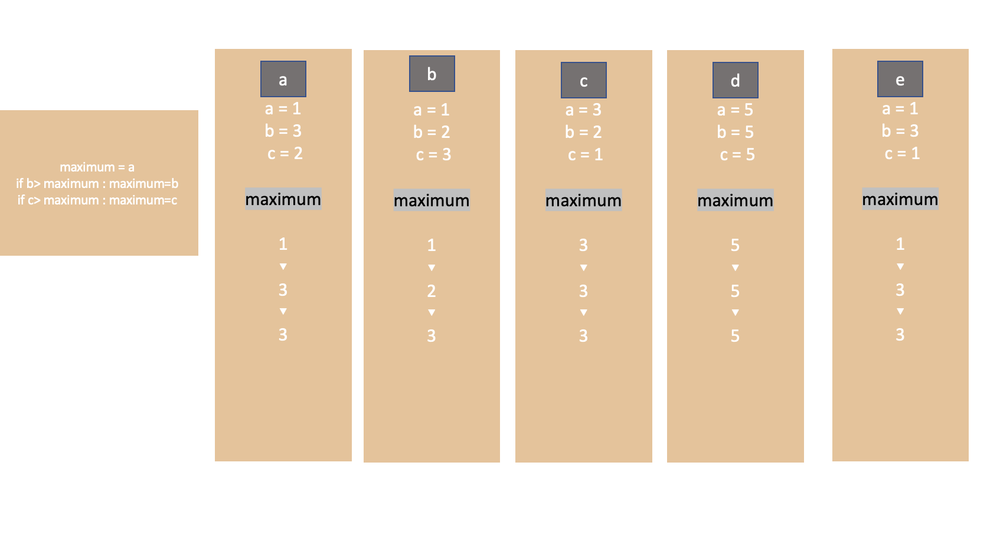

<br />
<br />
<br />
<br />

# 🐣 세 정수의 최댓값 구하기

<br />

```python
# 세 정수를 입력받아 최댓값 구하기

print('세 정수의 최댓값을 구합니다.')
a = int(input('정수 a의 값을 입력하세요.: '))
b = int(input('정수 b의 값을 입력하세요.: '))
c = int(input('정수 c의 값을 입력하세요.: '))

maximum = a
if b> maximum : maximum = b
if c> maximum : maximum = c

print(f'최댓값은 {maximum}입니다.')
```

<br /><br />

## 결과

<br/>

<br />


<br />

<br />

a,b,c 의 최댓값을 maximum으로 구하는 과정은 다음과 같다 

```python
maximum = a
if b> maximum : maximum = b
if c> maximum : maximum = c 
```

<br /><br />

이 행들은 순차적으로 실행된다. 이렇게 한 문장씩 순서대로 처리되는 구조를 순차 구조라고 한다. 

maximum  = a 의 경우 단순한 대입문이지만, 밑의 행들은 if 문으로 복합문이다. 또한 If와 콜론(:) 사이에 있는 식을 **조건식**이라고 한다. 조건식으로 평가한 결과에 따라 프로그램이 실행 흐름이 변경되는데 이러한 구조를 **선택 구조**라고 한다. 

# 알고리즘 순서도

<br />


중간에 텍스트 저 글자는 모른척 해주십쇼 ㅠㅠ 

위의 그림은 알고리즘의 흐름을 보여준다. 이 알고리즘의 흐름은 위에서 아래 방향이며 직사각형 안 작성한 작업이 실행되거나, 마름모 안에 작성한 조건식의 평가 결과에 따라 '예'나 '아니요' 중 하나를 따라간다. 그림에서의 핑크색 선은 b > maximum 조건식은 만족하고, c>maximum 조건식은 만족하지 않는 흐름을 보여준다. 이렇듯 알고리즘(프로그램) 이 흐르는 방향은 **조건식**이 결정한다. 이 때 마름모 안 작성한 조건식에 따라 알고리즘 흐름이 두 갈래로 나뉘는 것을 **양갈래 선택**이라 한다.

`직사각형 안의 화살표는 값의 대입을 뜻한다. 예를 들어 maxium-<a 는 maximum에 a를 대입한다는 뜻이다 ! `

# 세 정수의 최댓값을 구하는 과정에서 maximum 값의 변화



a,b,c 의 값이 6,10,7 또는 -10,100,10인 경우를 가정하고 순서도로 나타낸다면 두 경우 모두 b>c>a이므로 위에서 설명한 순서도에서 핑크색으로 표시한 선을 따라간다. 
