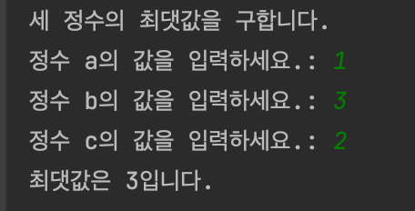
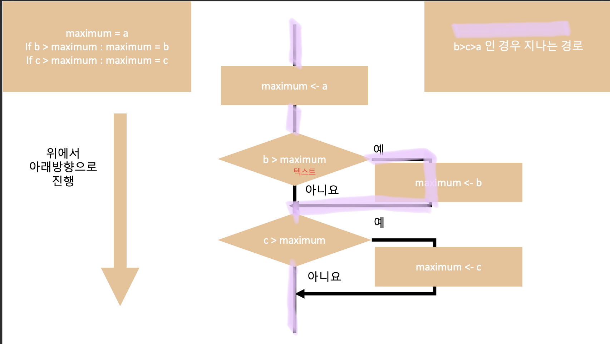
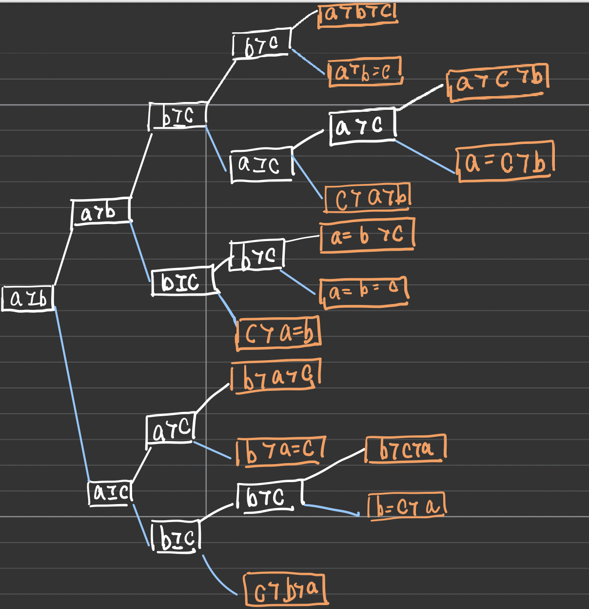

<br />
<br />
<br />
<br />

# 🐣 세 정수의 최댓값 구하기

<br />

```python
# 세 정수를 입력받아 최댓값 구하기
print('세 정수의 최댓값을 구합니다.')
a = int(input('정수 a의 값을 입력하세요.: '))
b = int(input('정수 b의 값을 입력하세요.: '))
c = int(input('정수 c의 값을 입력하세요.: '))
maximum = a
if b> maximum : maximum = b
if c> maximum : maximum = c
print(f'최댓값은 {maximum}입니다.')
```

<br /><br />

## 결과

<br/>

<br />



<br />

<br />

a,b,c 의 최댓값을 maximum으로 구하는 과정은 다음과 같다 

```python
maximum = a
if b> maximum : maximum = b
if c> maximum : maximum = c 
```

<br /><br />

이 행들은 순차적으로 실행된다. 이렇게 한 문장씩 순서대로 처리되는 구조를 순차 구조라고 한다. 

maximum  = a 의 경우 단순한 대입문이지만, 밑의 행들은 if 문으로 복합문이다. 또한 If와 콜론(:) 사이에 있는 식을 **조건식**이라고 한다. 조건식으로 평가한 결과에 따라 프로그램이 실행 흐름이 변경되는데 이러한 구조를 **선택 구조**라고 한다. 
<br/>

- - -

<br/>

# 알고리즘 순서도

<br />


<br/>

중간에 텍스트 저 글자는 모른척 해주십쇼 ㅠㅠ 

위의 그림은 알고리즘의 흐름을 보여준다. 이 알고리즘의 흐름은 위에서 아래 방향이며 직사각형 안 작성한 작업이 실행되거나, 마름모 안에 작성한 조건식의 평가 결과에 따라 '예'나 '아니요' 중 하나를 따라간다. 그림에서의 핑크색 선은 b > maximum 조건식은 만족하고, c>maximum 조건식은 만족하지 않는 흐름을 보여준다. 이렇듯 알고리즘(프로그램) 이 흐르는 방향은 **조건식**이 결정한다. 이 때 마름모 안 작성한 조건식에 따라 알고리즘 흐름이 두 갈래로 나뉘는 것을 **양갈래 선택**이라 한다.

`직사각형 안의 화살표는 값의 대입을 뜻한다. 예를 들어 maxium-<a 는 maximum에 a를 대입한다는 뜻이다 ! `
<br/>
<br/>

- - -

<br/>
# 세 정수의 최댓값을 구하는 과정에서 maximum 값의 변화
<br/>


<br/>

a,b,c 의 값이 6,10,7 또는 -10,100,10인 경우를 가정하고 순서도로 나타낸다면 두 경우 모두 b>c>a이므로 위에서 설명한 순서도에서 핑크색으로 표시한 선을 따라간다. 
<br/>

- - -

<br/>
# 👌🏻 (참고)복합문의 구조
<br/>

복합문은 다른 문장들(의 그룹들)을 포함한다. 어떤 방법으로 그 다른 문장들의 실행에 영향을 주거나 제어한다. 간단하게 표현할 때, 전체 복합문을 한 줄로 쓸 수 있기는 하지만, 일반적으로 복합문은 여러 줄에 걸친다. if,while,for은 전통적 제어 흐름구조를 구현한다. 

복합문은 하나, 혹은 그 이상의 절로 이루어져있다. **절은 헤더와 스위트(suite)로 이루어진다.**

if식 : 스위트

헤더 : 스위트 

콜론 뒤에 스위트가 온다라고 생각하면 된다. 

**if** 문인 경우 if는 반드시 1개 필요하고 여러개 쓸 수도 있다. 없으면 안된다 

**elif** 문인 경우 없거나, 여러개 써도된다 

**else** 도 마찬가지로 없어도 되지만, 여러개는 안되고 오직 한개만 쓸 수 있다.
<br/>

- - -

<br/>
# 🍒 (참고)복합문 작성 시 지켜야하는 규칙
<br/>

스위트는 반드시 들여쓰기를 해야한다.PEP8 의 경우 공백4개를 추천한다 
<br/>

```python
a=1
b=1 
if a==b:
    print(a)
    print(b)
```

<br/>

스위트를 보면 안쪽으로 들어간 것을 보인다. 저게 공백4칸! 내가 쓰는 파이참에서는 자동으로 들여쓰기를 해주더라..(ㅎ) 근데 들여쓰기 막 뒤죽박죽으로 하면 나중에 에러난다
<br/>

```python
a=1
b=1
if a==b: print(a)
if a==b: print(a); print(b)
if a==b: print(a); print(b);
```

<br/>

 간단한 단순문 스위트면 이렇게 한 줄로도 가능하다. 단순문이 2개 라면 세미콜론(;)으로 구분하면 됨.

세미콜론은 마지막 단순문 뒤에 찍어도 되고 안찍어도 된다. 선택이시다! 
<br/>

```python
if a<b : if c<d: x =u 
```

<br/>

한 줄에 위에 처럼 저렇게 복합문 놔두면 실행 안된다 오류발생 ! 
<br/>

- - -

<br/>

# 🎱 (참고)PEP 8

<br/>

여기서 PEP8을 자세히 보진 않을 거라서 나중에 포스팅 하는 걸로 하고 
<br/>

- PEP8 : 파이썬 개선 제안서, 파이썬 코드를 어떻게 구상할 지 알려주는 스타일 가이드

- [PEP8 전체 가이드](https://www.python.org/dev/peps/pep-0008/)

- 다른 사람과 원활하게 협업하려면 공통된 스타일 공유가 필요

- 일관성 있는 스타일은 나중에 수정하기도 쉽다
  
  <br/>

이 정도만 알면 될 것 같다 ! 

또 중요한 내용은 클래스명은 CamelCase, 함수명은 snake_case로 위에서 본 공백 4개도 PEP8에 있는 내용이다 ! 
<br/>

- - -

<br/>
# 😎 함수형으로 바꿔보기
<br/>

```python
# 세 정수의 최댓값을 구해주는 함수
print('세 정수의 최댓값을 구합니다.')
def max3(a,b,c) :
    """a,b,c의 최댓값을 구하여 반환"""
    maximum = a
    if b> maximum : maximum = b
    if c> maximum : maximum = c
    return maximum
print(f'3,2,1 중에 최댓값은 {max3(3,2,1)}입니다.' )
print(f'3,2,1 중에 최댓값은 {max3(3,2,2)}입니다.' )
print(f'3,2,1 중에 최댓값은 {max3(3,1,2)}입니다.' )
print(f'3,2,1 중에 최댓값은 {max3(3,2,3)}입니다.' )
print(f'3,2,1 중에 최댓값은 {max3(2,1,3)}입니다.' )
print(f'3,2,1 중에 최댓값은 {max3(3,3,2)}입니다.' )
print(f'3,2,1 중에 최댓값은 {max3(3,3,3)}입니다.' )
print(f'3,2,1 중에 최댓값은 {max3(2,2,3)}입니다.' )
print(f'3,2,1 중에 최댓값은 {max3(2,3,1)}입니다.' )
print(f'3,2,1 중에 최댓값은 {max3(2,3,2)}입니다.' )
print(f'3,2,1 중에 최댓값은 {max3(1,3,2)}입니다.' )
print(f'3,2,1 중에 최댓값은 {max3(2,3,3)}입니다.' )
print(f'3,2,1 중에 최댓값은 {max3(1,2,3)}입니다.' )
```

<br/>

""" """은 파이썬의 주석이다 여러줄 주석일때도 이렇게 쓰면 된다.

이 프로그램은 max3(a,b,c)함수가 총 13번 수행된다. 함수 안은 매개변수 a,b,c가 들어간다 

<br/>
# 😁 (참고)함수의 반환값과 함수 호출식 평가
<br/>

  위와 같이 함수 안에서 return을 사용하면 값을 함수 바깥으로 반환합니다(return에 값을 지정하지 않으면 None을 반환). max3()함수는 return 문에서 maximum을 반환한다. 함수가 반환하는 값을 받으려면 함수를 호출해야한다(당연한 소리) max3(3,2,1)은 세 값을 평가하여 3이라는 반환값을 얻는 것이다.

max3(3,2,1)        -----(함수 반환값 get!)------>   ✌🏻  int 3   ✌🏻  뾰로롱 

이렇게 이런 절차들을 알고리즘이라고 한다.

알고리즘이란 따라서 ! **어떠한 문제를 해결하기 위해 정해 놓은 일련의 절차**

올바른 알고리즘이란 어떠한 경우에도 실행 결과가 똑같이 나와야한다. max3()함수를 13번 수행한 것도 이 이유이다. 

<br/>
- - -
<br/>
# 🚨 세 정수의 대소 관계 결정트리
<br/>

a,b,c의 대소 관계 조합 13가지를 나열해보자. 조합을 나열한 모습이 나무처럼 생겨서 **결정트리** 라고도 한다.   **결정 트리**decision tree는 분류와 회귀 문제에 널리 사용하는 모델이다. 기본적으로 결정 트리는 결정에 다다르기 위해 예/아니오 질문을 이어 나가면서 학습한다.

<br/>



<br/>

오른쪽 끝의 주황색 박스는 정수 a,b,c의 대소 관계를 나타낸다. 조합은 총 13가지이다.

<br/>

---

<br/>

# 😜 정리

오늘 포스팅 한 것 중에선 파이썬 기초가 많다! 특히 결정트리를 손으로 직접 그려보는게 더 도움이 많이 되더라 ^-^!!