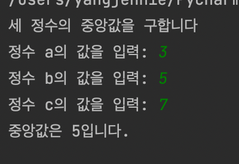

<br/>

중앙값을 구하는 절차는 최댓값, 최솟값을 구할 때 보다 더 복잡하다. 그래서 다양한 알고리즘들이 있다.

(평균값(mean)과는 다른 뜻이다. 중앙값(median)은 크기 순서대로 정렬했을 때 가장 중간에 위치하는 값을 뜻한다.)

<br/>

---

<br/>

# 세 정수를 입력받아 중앙값 구하기 1

```python
def med3(a,b,c):  
    """a,b,c의 중앙값을 구하여 반환"""  
    if a>=b :  
        if b>=c :  
            return b  
        elif a<=c :  
            return a  
        else:  
            return c  
    elif a>c :  
        return a  
    elif b>c :  
        return c  
    else :  
        return b  

print('세 정수의 중앙값을 구합니다')  
a = int(input('정수 a의 값을 입력: '))  
b = int(input('정수 b의 값을 입력: '))  
c = int(input('정수 c의 값을 입력: '))  

print(f'중앙값은 {med3(a,b,c)}입니다.')
```

<br/>

---

<br/>

# 결과

<br/>


<br/>

---

# <br/>

# 세 정수를 입력받아 중앙값 구하기2

<br/>

```python
def med3(a,b,c) :  
    """ 세 정수를 입력받아 중앙값 구하기 """  
    if(b>=a and c<=a) or (b<=a and c>=a) :  
        return a  
    elif(a>b and c<b) or (a<b and c>b) :  
        return b  
    else :  
        return c  
print('세 정수의 중앙값을 구합니다')  
a = int(input('정수 a의 값을 입력: '))  
b = int(input('정수 b의 값을 입력: '))  
c = int(input('정수 c의 값을 입력: '))  

print(f'중앙값은 {med3(a,b,c)}입니다.')
```

<br/>

위는 1번 코드보다는 효율이 좋지 않다. 하지만 결과는 같다. 

이유는 

```python
 if(b>=a and c<=a) or (b<=a and c>=a) :  
        return a  
 elif(a>b and c<b) or (a<b and c>b) :  
        return b  
```

if(<u>**b>=a**</u> and c<=a) or (<u>**b<=a**</u> and c>=a)

이유는 바로 여기에 있다. 여기서 b>=a와 b<=a가 이루어진다. 근데  밑의 elif 문에서 

```python
 elif(a>b and c<b) or (a<b and c>b)
```

b>=a와 b<=a를 뒤집어 높은 a>b를 수행한다.

if 문의 조건식이 성립하지 않으면 굳이 elif문은 이 판단을 수행할 필요가 없다.

위에서 a와 b의 비교가 끝났는데 elif문에서 한번 더 비교를 하는 격이다. 
