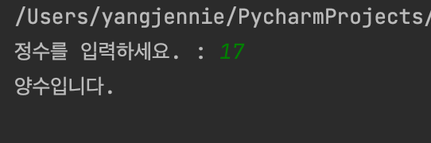
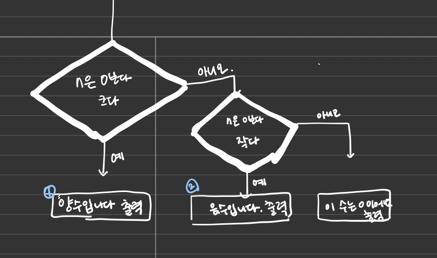
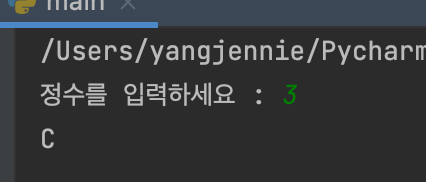
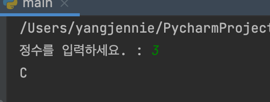
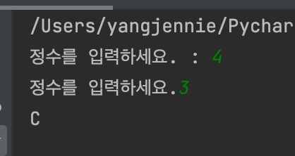

<br>

<br>

# 1. 입력받은 정수의 부호(양수,음수,0) 출력하기

<br>

<br>

```python
#Do it 실습 1-3
#입력받은 정수의 부호(양수, 음수, 0) 출력하기

n = int(input('정수를 입력하세요. : '))

if n>0 :
    print('양수입니다.')
elif n<0 :
    print('음수입니다.')
else :
    print('이 수는 0이에요')
```

<br>

<br>



<br>

<br>

## 순서도

n이 양수면 1번이 음수면 2번, 0이면 3번이 실행된다. 곧, 실행되는 부분은 1,2,3, 중 단 하나이며 2개가 동시에 실행되거나 하나도 실행되지 않는 경우는 없다. 

이 프로그램의 흐름은 3개로 분기하기 때문이다.

<br>

<br>



<br>

<br>

# 2. 3개로 분기하는 조건문

<br>

<br>

```python
# 3개로 분기하는 조건문
n = int(input('정수를 입력하세요 : '))
if n == 1 :
    print('A')
elif n == 2 :
    print('B')
else :
    print('C')
```

<br>

<br>

아래의 4개로 분기하는 조건문과 코드 분량은 같다. 그래서 '두 프로그램의 흐름 역시 3개로 분기 할 것'이라고 추측할 수 있지만 사실은 그렇지 않다.  두 프로그램은 모두 n이 1이면 A, 2이면 B, 3이면 C를 출력하지만 그 외의 값일 시 결과는 달라진다.

<br>

<br>



<br>

<br>

# 3. 4개로 분기하는 조건문

<br>

<br>

```python
n = int(input('정수를 입력하세요. : '))
if n==1:
    print('A')
elif n==2:
    print('B')
elif n == 3:
    print('C')
```

<br>

<br>



<br>

<br>

실습 3은 n이 1,2,3이 아니면 아무것도 출력하지 않는다. 코드를 얼핏 보면 프로그램의 흐름이 3개로 분기할 것 같지만 사실은 그렇지 않다. 조금 더 분명하게 보이도록 실습4에서 코드를 고쳐보았다. 실습3에 포함되지 않은 else 문이 있다. 즉, 이 프로그램의 분기는 확실히 4개이다.

<br>

<br>

# 4. 실습 3의 원래 모습

<br>

<br>

```python
# 실습 1-5의 원래 모습

n = int(input('정수를 입력하세요.'))

if n== 1:
    print('A')
elif n== 2 :
    print('B')
elif n== 3 :
    print('C')
else :
    pass
```

<br>

<br>



<br>

<br>

4를 입력하니 입력을 한번 더 받는 모습을 알 수 있다. 

pass는 '아무것도 수행하지 말고 그냥 지나치세요' 를 뜻하는 것이다.


출처 : 자료구조와 함께 배우는 알고리즘 입문 파이썬편
