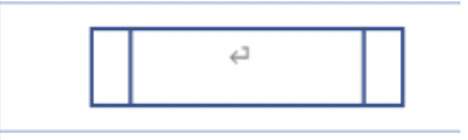
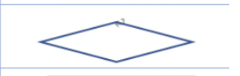
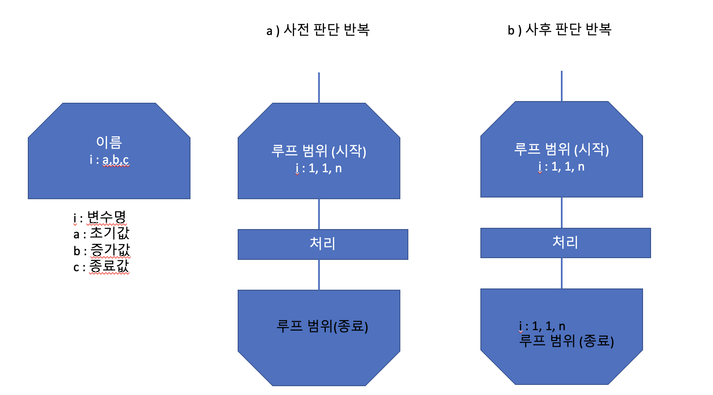
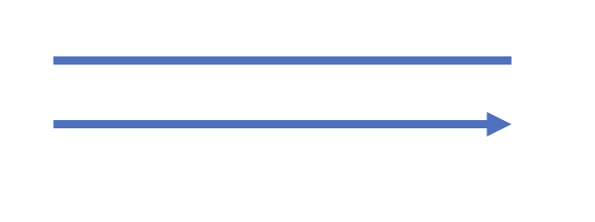

 

 

---

 

순서도(Flowchart)는 문제를 정의, 분석하고 해결하는 방법을 그림으로 표현한다. 

프로그램 순서도에는 다음과 같은 기호가 있다

- 실제로 실행할 연산을 나타내는 기호

- 제어 흐름을 나타내는 선 기호

- 프로그램 순서도를 이해하거나 작성하는 데 편리한 특수 기호

 

---

 

 

# 데이터(입출력)

 

 

 

 

데이터는 기억 장치를 지정하지 않은 데이터 자체를 나타낸다 

혹은 일반적인 입출력을 나타내는 기호이다. 

ex) 냄비에 물을 채운다 ( 물을 입력 ) , 라면 완성 ! (라면 출력) 

 

 

# 처리

 

 

 

 

처리는 여러 종류의 처리 기능을 나타낸다. 정보의 값, 형, 위치를 바꾸도록 정의한 연산이나 연산 집합의 실행, 또는 연속하는 몇 가지 흐름 가운데 하나의 방향을 결정하는 연산 혹은 연산 집합의 실행을 나타낸다.

ex)<라면을 먹을까말까>의 처리  <strong>배부르게 불태운다</strong> !! or  <strong>굶주리며 울먹인다!! </strong>

 

 

# 미리 정의한 처리(서브루틴)

 

 

 

 

미리 정의한 처리는 서브루틴이나 모듈 등 다른 곳에서 이미 정의한 하나 이상의 연산 또는 명령으로 이루어진 처리를 나타낸다.

 

 

# 판단

 

 

 

 

판단은 하나의 입구와 하나 이상을 선택하는 출구가 있고, 판단 기호 안에 정의한 조건을 평가하여 하나의 출구를 선택하는 판단 기능(스위치형 기능)을 나타낸다. 주로 예상되는 평과 결과는 경로를 나타낸선 가까이에 표기한다.

 

 

# 루프 범위

 

 

 

 

루프 범위는 두 부분으로 구성되어 루프의 시작과 종료를 나타낸다.

2개의 루프 범위 기호 안에는 같은 이름(내용) 을 표기한다. 루프의 시작 기호 또는 종료 기호 안에 초깃값(1), 중간값(1), 종료값(n, 또는 종료 조건을 표기한다)

위의 그림 a와 b는 i를 1부터 n까지 1씩 증가시키면서 처리를 n번 반복하도록 하는 순서도다. '1,1,n' 대신 '1,2,...n'을 사용하기도 한다.

 

 

# 선

 

 

 

 

선은 제어의 흐름을 의미한다. 흐름의 방향을 분명히 나타낼 때는 화살표를 사용한다.

보통 순서도에서 선은 위에서 아래로 내려가는 것을 원칙으로 한다.

 

 

# 단말

 

 

 

 

단말은 외부 환경으로 나가거나 외부 환경에서 들어오는 것을 나타낸다. 주로 프로그램 흐름의 시작과 종료를 나타낸다.

---

