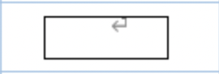

 

 

---

 

순서도(Flowchart)는 문제를 정의, 분석하고 해결하는 방법을 그림으로 표현한다. 

프로그램 순서도에는 다음과 같은 기호가 있다

- 실제로 실행할 연산을 나타내는 기호

- 제어 흐름을 나타내는 선 기호

- 프로그램 순서도를 이해하거나 작성하는 데 편리한 특수 기호

 

---

 

 

# 데이터(입출력)

 

 

 

 

데이터는 기억 장치를 지정하지 않은 데이터 자체를 나타낸다 

혹은 일반적인 입출력을 나타내는 기호이다. 

ex) 냄비에 물을 채운다 ( 물을 입력 ) , 라면 완성 ! (라면 출력) 

 

 

# 처리

 

 

 

 

처리는 여러 종류의 처리 기능을 나타낸다. 정보의 값, 형, 위치를 바꾸도록 정의한 연산이나 연산 집합의 실행, 또는 연속하는 몇 가지 흐름 가운데 하나의 방향을 결정하는 연산 혹은 연산 집합의 실행을 나타낸다.

ex)<라면을 먹을까말까>의 처리  <strong>배부르게 불태운다</strong> !! or  <strong>굶주리며 울먹인다!! </strong>

