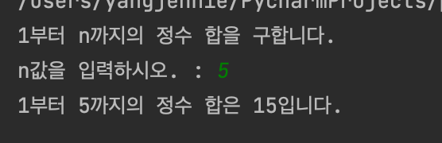
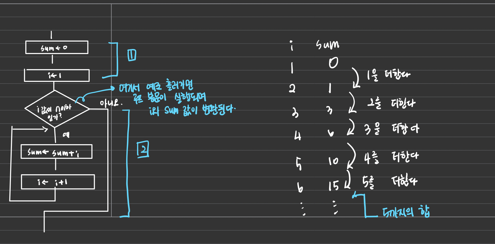
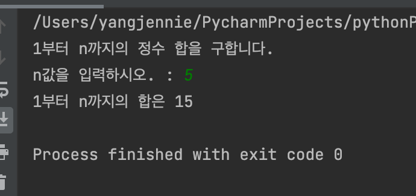
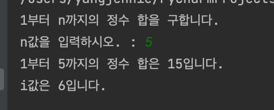
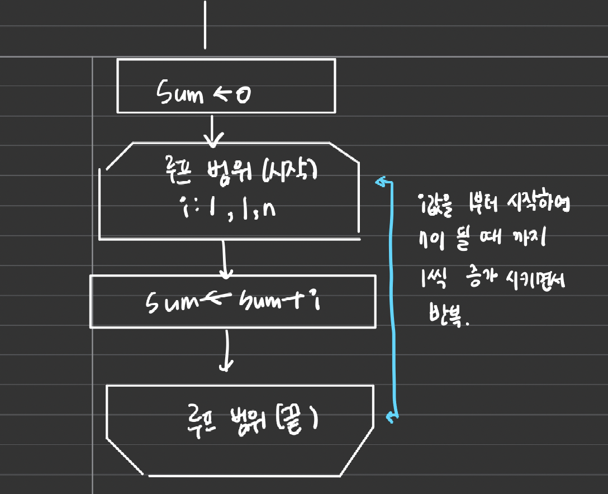

<br>

<br>

# 1부터 n까지의 정수 합 구하기

이 포스팅에서는 프로그램의 흐름을 반복하는 간단한 알고리즘인, 1부터 n까지 정수의 합을 구하는 알고리즘을 살펴본다.

n값이 2이면 1+2, n값이 3이면 1+2+3이다. 즉, 1+2+...n값을 하면 된다. 

<br>

<br>

```python
# 1부터 n까지 정수의 합 구하기
print('1부터 n까지의 정수 합을 구합니다.')
n = int(input('n값을 입력하시오. : '))

sum = 0
i=1

while i <=n : #i가 n보다 작거나 같을 동안만 반복
    sum += i #sum에다가 i를 더함
    i +=1 #i에 1을 더함

print(f'1부터 {n}까지의 정수 합은 {sum}입니다.')
```

<br>

<br>



<br>

<br>

# while문 반복 알아보기

<br>

<br>

어떤 조건이 성립하는 동안 반복해서 처리(프로그램 명령문 또는 명령어의 집합)하는 것을 **반복구조**(repetition structure)라고 하고 일반적으로 **루프**(loop)라고 한다. 이때, while 문은 실행하기전에 반복을 계속할 것인지를 판단하는데 이러한 구조를 **사전 판단 반복 구조**라고 한다. 다음은 while 문의 형식으로 조건식의 평가 결과가 참인 동안 프로그램의 명령문이 반복된다

<mark>while 조건식 : 명령문 </mark>

위 구문에서 반복 대상이 되는 **명령문**을 **루프 본문**이라고 한다. 1부터 n까지의 정수 더하기 프로그램을 순서도로 나타내보자. 순서도는 1,2로 구분하여 해석한다.

1은 합을 구하는 준비 단계이다. 합을 저장하는 sum값을 0으로, 반복을 제어하는 i 값을 1로 초기화한다.

2는 루프 본문이다. 우선 i값이 n 이하이면 1값을 1만큼 증가시키며 루프 본문을 실행한다. 이 과정을 n번 반복 실행한다.

<br>

<br>



<br>

<br>

위의 그림 오른쪽 표는 i값과 sum값의 변화를 보여준다. 이 표값을 참고하여 프로그램을 설명하겠다.

조건을 처음 지날 때의 i값, sum값은 1에서 설정한 1과 0이며, 루프 본문을 실행할 때마다 i값이 1씩 증가되어 sum값에 더해진다. 예를 들어 n값이 5인 경우 i값은 1~5까지 증가하므로 sum의 값은 1~5까지 합인 15가 된다. 이 때 반복문을 마친 뒤 i의 값은 5가 아닌 6이다. i 값이 n을 초과해야 while 문의 반복을 마칠 수 있기 때문이다. 이를 확인하려면 프로그램 맨 끝에 다음 코드를 추가해보자.

```python
print(f'i값은 {i}입니다.')
```

<br>

<br>



<br>

<br>

---

<br>

<br>

# for문 반복 알아보기

<br>

<br>

변수가 하나 있을 때는 while 문 보다, for문을 사용하는 것을 추천한다. 아래 프로그램은 1~n까지 정수합을 for문으로 구하는 것이다.

<br>

<br>

```python
# 1부터 n까지 정수의 합 구하기
print('1부터 n까지의 정수 합을 구합니다.')
n = int(input('n값을 입력하시오. : '))

sum = 0
for i in range(1,n+1) :
    sum+=i

print(f'1부터 n까지의 합은 {sum}')
```

<br>

<br>



<br>

<br>

아래 그림은 위의 실습을 순서도로 나타낸 것이다. 루프 범위는 이름(내용)이 같은 시작 지점 부터 종료 지점 까지를 가리키며, 두 지점 사이를 반복하여 실행한다. 그러므로 i값은 1부터 n까지 1씩 증가하며, 루프 본문에 있는 누적 대입문 sum+=i를 실행하여 1부터 n까지 정수의 합을 구한다.

<br>

<br>



<br>

<br>

---

<br>

<br>

# 가우스 덧셈으로 1부터 n까지 정수 합 구하기

<br>

<br>

```python
# 1부터 n까지 정수의 합 구하기
print('1부터 n까지의 정수 합을 구합니다.')
n = int(input('n값을 입력하시오. : '))

sum = n*(n+1)//2

print(f'1부터 n까지의 합은 {sum}')
```

<br>

<br>

---

<br>

<br>

# range()함수로 이터러블 객체 생성하기

for문에서 사용한 range()함수는 이터러블 객체를 생성한다. range()함수로 이터러블 객체를 생성하는 방법을 정리해보자.

<br>

<br>

| 함수              | 정의                            |
| --------------- | ----------------------------- |
| range()         | 0이상 n미만인 수를 차례로 나열하는 수열       |
| range(a,b)      | a이상 b미만인 수를 차례로 나열하는 수열       |
| range(a,b,step) | a이상 b미만인 수를 step 간격으로 나열하는 수열 |

<br>

<br>

이터러블 객체는 **반복할 수 있는 객체**를 말하며, for i in range(1,5)와 같이 for~in문에 사용할 수 있다. 또한 파이썬에서 사용하는 대표적인 이터러블 자료형은 list,str,tuple이 있다.

<br>

<br>

---

<br>

<br>

<sub>출처 : 자료구조와 함께 배우는 알고리즘 입문 파이썬편</sub>
