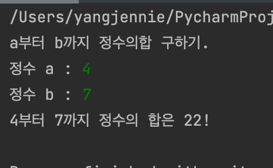
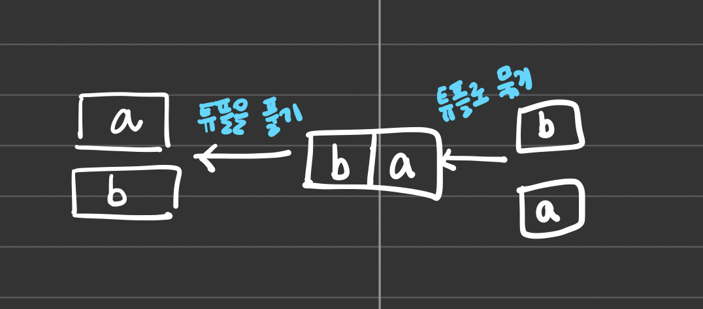

<br>

<br>

# 연속하는 정수의 합을 구하기 위해 값 정렬

<br>

<br>

연속하는 정수의 합을 구할 때 시작하는 값이 1이 아닌 정수를 입력받았다면 range()함수에 전달할 시작값과 끝값을 오름차순으로 정렬해야한다.

<br>

<br>

```python
# a부터 b까지 정수의 합 구하기 (for 문)

print('a부터 b까지 정수의합 구하기.')
a = int(input('정수 a : '))
b = int(input('정수 b : '))

if a>b :
    a,b = b,a

sum = 0
for i in range(a,b+1) :
    sum+=i

print(f'{a}부터 {b}까지 정수의 합은 {sum}!')
```

<br>

<br>



<br>

<br>

위의 코드는 a가 b보다 크면 둘을 교환하여 a와 b를 오름차순으로 정렬한다. 그러므로 두번 째 실행결과에서는 a와 b를 교환하지 않고, 실행 결과 1에서는 a과 b를 교환하여 출력한다. a와 b를 교환할 때는 다음과 같은 단일 대입문을 사용한다.

**a,b=b,a**

연속하는 수의 합을 구하는 알고리즘 설명은 이 포스팅에서 자세히 설명하였다.

[[파이썬] 01-7 1부터 n까지의 정수 구하기 | 제니노트](https://yangjenniee.github.io/do%20it%20algorithm/do7/)

이 실습에서는 range(1,n+1)이 아닌 range(a,b+1)로 변경된 점만 주의하면 된다.

<br>

<br>

---

<br>

<br>

# 두 값 교환하기 1

a와 b를 교환할 때 사용한 단일 대입문 a,b=b,a는 아래와 같은 과정으로 수행된다.

1. 우변의 b,a에 의해 두 값을 압축한 튜플(b,a)가 생성된다.

2. 대입할 때 튜플(b,a)를 다시 풀어 b,a로 만든 다음 각각 a와 b에 대입한다.

<br>

<br>



<br>

<br>
<sub>튜플은 파이썬의 리스트와 비슷하다. 여기서는 a,b를 튜플로 묶어서 두 값을 교환하는 과정을 설명하고 있다. 튜플은 후에 나중에 포스팅하겠다.</sub>

<br>

<br>

---

<br>

<br> 

# 반복 과정에서 조건 판단하기 1
