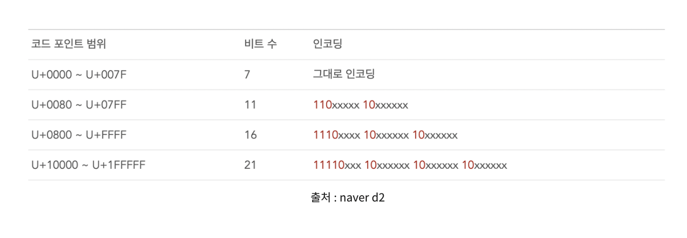

원리를 알면 바위도 깰 수 있다 ..! 

---

# 1. 자바 인코딩

 
인코딩 환경과 디코딩 환경이 다를 때 웹사이트에서도 한글이 깨지거나, 터미널에서 한글이 깨지는 그런 상황을 종종 경험해 봤을 것이다.
 
## 인코딩이란?

사람의 문자를 컴퓨터가 이해하기 쉽게 변환하는 과정 

## 캐릭터 셋 이름

| 캐릭터 셋 이름   | 설명                                                                                            |
| ---------- | --------------------------------------------------------------------------------------------- |
| US-ASCII   | 7비트 아스키                                                                                       |
| ISO-8859-1 | ISO 라틴 알파벳                                                                                    |
| UTF-8      | 8비트 UCS 변환 포맷. 글자의 길이가 가변적인 인코딩 방식, 1byte는 아스키코드 3byte는 한글, 웹서버, db, Linux,Mac 시스템의 기본 인코딩 방식 |
| UTF-16BE   | 16비트 UCS 변환 포맷. big-endian 바이트 순서를 가진다.                                                       |
| UTF-16LE   | 16비트 UCS 변환 포맷. little-endian 바이트 순서를 가진다.                                                    |
| UTF-16     | 16비트 UCS 변환 포맷. 바이트의 순서는 byte-order mark라는 것에 의해서 정해진다. 글자의 길이가 고정적인 인코딩 방식                   |
| EUC-KR     | 8비트 문자 인코딩으로, EUC의 일종이며 대표적인 "한글 완성형" 인코딩                                                     |
| MS949      | Microsoft에서 만든 "한글 확장 완성형" 인코딩, 비표준, ASCII 코드가 포함                                             |

1. 자바는 내부적으로 (메모리 상에서) 문자열이 UTF-16 BE 로 인코딩 되어 처리됨

2. 문자열 송/수신을 위해 직렬화를 할땐 변형된 UTF-8 사용

3. 문자열을 입출력 할 때에는 운영체제 기본 인코딩값, 또는 사용자가 지정한 인코딩 값으로 문자열을 인코딩 한다. (1번처럼 내부 메모리 상에서 처리되는 것과는 다름)

4. 1~127까지는 ASCII 값과 유니코드(UTF-8, UTF-16 ... ), MS계열(MS949)와 값이 다 같다. (MS와 유니코드는 해당범위에서 92번만 다르다. 이는 역슬래시로 윈도우에서는 ₩으로 표현, 맥북,리눅스 계열에서는 역슬래시로 표현된다)

UTF-8과 UTF-16의 차이점은 문자 하나를 표현하기 위한 필요 bit의 크기로 나뉜다.

UTF-8과 UTF-16 이 처럼 뒤의 숫자는 몇 **bit**를 사용하여 Index를 표현할 것인가를 뜻한다. 

UTF-8 은 **8Bit** 가 1개의 Index 

UTF-16은 **16bit가** 1개의 Index

또, 문자 하나를 표현하기 위한 byte 범위의 차이로도 나뉜다. 

UTF-8의 경우 한 문자를 나타내기 위해 **1byte-4byte**를 사용한다.  사실은 6byte까지 사용하지만 일반적인 문자는 3byte내로 처리되며, 4byte 영역은 이모티콘 같은 문자가 존재한다. 사실상 1byte 이상의 문자를 사용하는 경우가 없다보니 1~4byte를 사용한다고 말한다.

영문 byte 수 : 1byte

한글 byte 수 : 3byte 

UTF-16의 경우 **2byte~4byte**를 사용한다.  대부분 2byte, 4byte경우는 거의 쓰지 않는다.

영문 byte 수 : 2byte

한글 byte 수 : 2byte

인코딩 처리 방식을 보면, 

 

[출처 : 네이버 블로그 chocolleto]

x로 표시된 부부분은 원래 비트 값을 순서대로 적으면 되는 거고, 

어떤 문자가 800에 대응 되면 1110xxxx 10xxxxxx 10xxxxxx으로 변환되는 것이다. 

---

1) 직렬화란 객체를 기록할 수 있는 포맷으로 변환하여 파일로 저장하거나, 다른 시스템과 송수긴을 가능하게 하는 기법 즉, 객체 또는 객체의 상태를 쉽게 옮길 수 있는 형태로 변환하는 과정이다. 
