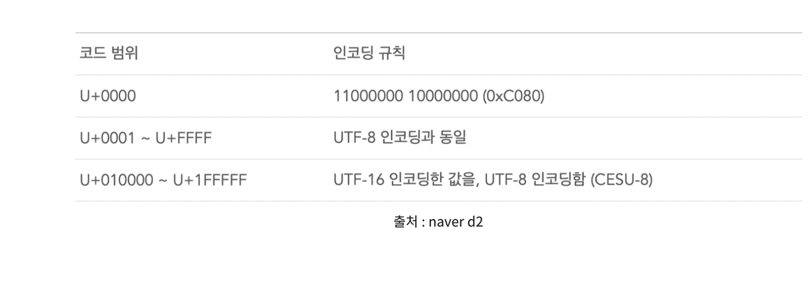
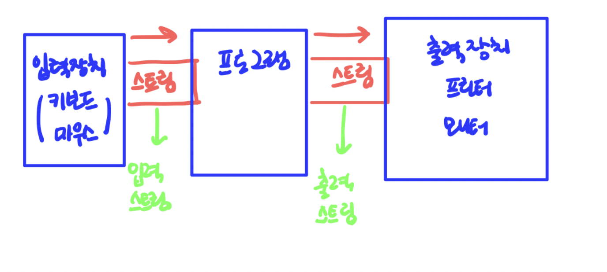
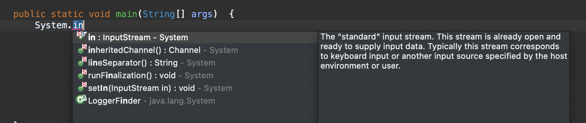
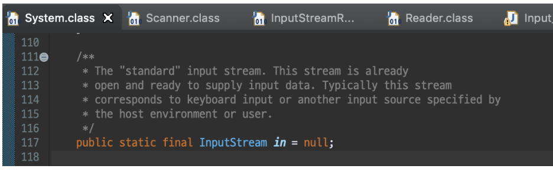
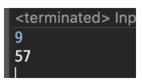
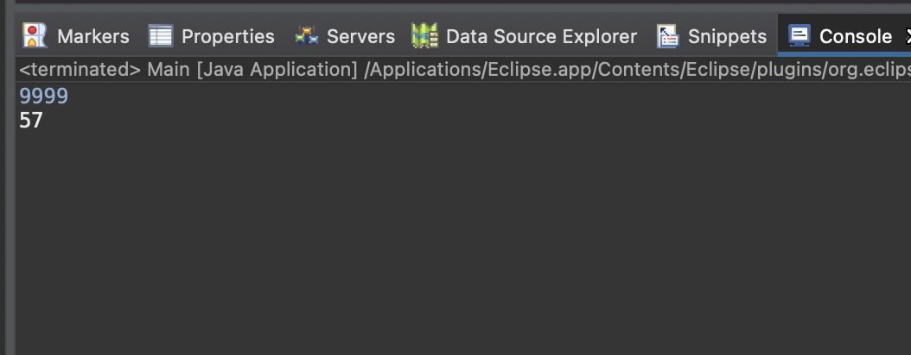
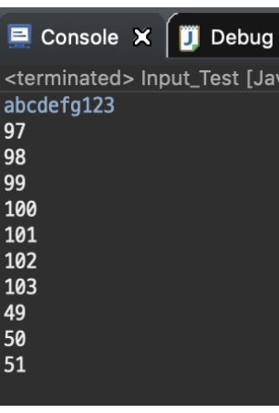
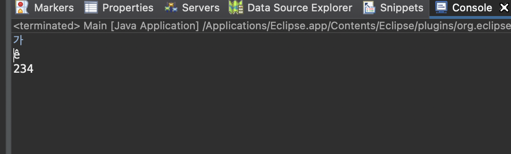
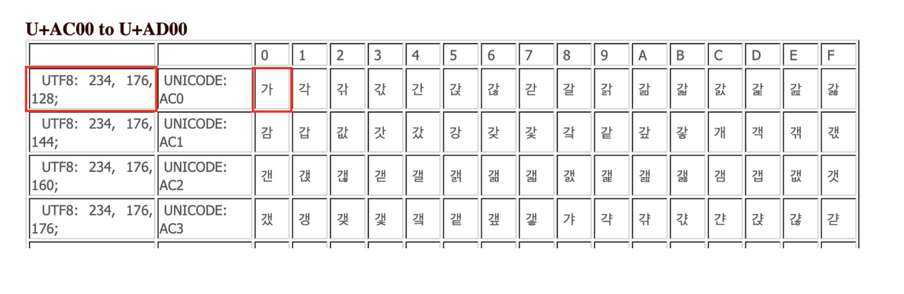
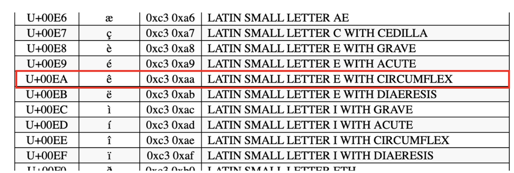

<br>

<br>

원리를 알면 바위도 깰 수 있다 ..! 

<br>

<br>

---

<br>

<br>

# 1. 자바 인코딩

<br>

<br>

<br />
인코딩 환경과 디코딩 환경이 다를 때 웹사이트에서도 한글이 깨지거나, 터미널에서 한글이 깨지는 그런 상황을 종종 경험해 봤을 것이다.
<br />

## 인코딩이란?

사람의 문자를 컴퓨터가 이해하기 쉽게 변환하는 과정 

## 캐릭터 셋 이름

<br>

<br>

| 캐릭터 셋 이름   | 설명                                                                                            |
| ---------- | --------------------------------------------------------------------------------------------- |
| US-ASCII   | 7비트 아스키                                                                                       |
| ISO-8859-1 | ISO 라틴 알파벳                                                                                    |
| UTF-8      | 8비트 UCS 변환 포맷. 글자의 길이가 가변적인 인코딩 방식, 1byte는 아스키코드 3byte는 한글, 웹서버, db, Linux,Mac 시스템의 기본 인코딩 방식 |
| UTF-16BE   | 16비트 UCS 변환 포맷. big-endian 바이트 순서를 가진다.                                                       |
| UTF-16LE   | 16비트 UCS 변환 포맷. little-endian 바이트 순서를 가진다.                                                    |
| UTF-16     | 16비트 UCS 변환 포맷. 바이트의 순서는 byte-order mark라는 것에 의해서 정해진다. 글자의 길이가 고정적인 인코딩 방식                   |
| EUC-KR     | 8비트 문자 인코딩으로, EUC의 일종이며 대표적인 "한글 완성형" 인코딩                                                     |
| MS949      | Microsoft에서 만든 "한글 확장 완성형" 인코딩, 비표준, ASCII 코드가 포함                                             |

1. 자바는 내부적으로 (메모리 상에서) 문자열이 UTF-16 BE 로 인코딩 되어 처리됨

2. 문자열 송/수신을 위해 직렬화를 할땐 변형된 UTF-8 사용

3. 문자열을 입출력 할 때에는 운영체제 기본 인코딩값, 또는 사용자가 지정한 인코딩 값으로 문자열을 인코딩 한다. (1번처럼 내부 메모리 상에서 처리되는 것과는 다름)

4. 1~127까지는 ASCII 값과 유니코드(UTF-8, UTF-16 ... ), MS계열(MS949)와 값이 다 같다. (MS와 유니코드는 해당범위에서 92번만 다르다. 이는 역슬래시로 윈도우에서는 ₩으로 표현, 맥북,리눅스 계열에서는 역슬래시로 표현된다)

<br>

<br>

UTF-8과 UTF-16의 차이점은 문자 하나를 표현하기 위한 필요 bit의 크기로 나뉜다.

UTF-8과 UTF-16 이 처럼 뒤의 숫자는 몇 **bit**를 사용하여 Index를 표현할 것인가를 뜻한다. 

UTF-8 은 **8Bit** 가 1개의 Index 

UTF-16은 **16bit가** 1개의 Index

또, 문자 하나를 표현하기 위한 byte 범위의 차이로도 나뉜다. 

UTF-8의 경우 한 문자를 나타내기 위해 **1byte-4byte**를 사용한다.  사실은 6byte까지 사용하지만 일반적인 문자는 3byte내로 처리되며, 4byte 영역은 이모티콘 같은 문자가 존재한다. 사실상 1byte 이상의 문자를 사용하는 경우가 없다보니 1~4byte를 사용한다고 말한다.

영문 byte 수 : 1byte

한글 byte 수 : 3byte 

UTF-16의 경우 **2byte~4byte**를 사용한다.  대부분 2byte이고 4byte경우는 거의 쓰지 않는다.

영문 byte 수 : 2byte

한글 byte 수 : 2byte

인코딩 처리 방식을 보면, 

<br>

<br>


<br>

<br>

x로 표시된 부부분은 원래 비트 값을 순서대로 적으면 되는 거고, 

어떤 문자가 800에 대응 되면 1110xxxx 10xxxxxx 10xxxxxx으로 변환되는 것이다. 

자바는 내부에서 UTF-16을 쓴다고 했다. 그 이유는 인코딩 할 때 널(NULL) 문자가 나타나지 않기 위해서다.

그래서 U+0000을 2Byte로 구성한다.

<br>

<br>



<br>

<br>

즉, 자바 메모리에 올라갈 때 과정을 설명하면 

ex) 이클립스 File encoding이 UTF-8이라면 , 

입력(UTF-8) -> 송수신(modified UTF-8) -> 자바 메모리(UTF-16) -> 송수신(modified UTF-8) -> 출력(UTF-8)

<br>

<br>

---

<br>

<br>

1) 직렬화란 객체를 기록할 수 있는 포맷으로 변환하여 파일로 저장하거나, 다른 시스템과 송수긴을 가능하게 하는 기법 즉, 객체 또는 객체의 상태를 쉽게 옮길 수 있는 형태로 변환하는 과정이다. 
2. 대부분의 인코딩 형식들은 해당 값과 아스키 코드 값이 10진수로, 1~127번까지 대응하는 문자가 같다. 
   
   코딩할 때 char 문자에 저장하여 int값을 반환할 때, 나온 숫자가 아스키 코드 값 이라고 대부분 알고 있다. 그것은 어디까지나 127번째 문자 까지이고, 정확히는 파일 인코딩 형식의 10진수 값이 나온다고 생각해야한다.

<br>

<br>

---

<br>

<br>

# InputStream 과 System.in

<br>

<br>

먼저 스트림을 이해하고 가야한다.

#### 스트림(stream)

자바에서는 파일이나 콘솔의 입출력을 직접 다루지 않고, 스트림(stream)이라는 흐름을 통해 다룹니다.

스트림(stream)이란 실제의 입력이나 출력이 표현된 데이터의 이상화된 흐름을 의미합니다.

즉, 스트림은 운영체제에 의해 생성되는 가상의 연결 고리를 의미하며, 중간 매개자 역할을 합니다.

스트림은 출발지와 도착지를 이어주는 **빨대**라고 생각하면 좋다.

<br>

<br>



<br>

<br>

위 처럼 한 곳에서 다른 한 곳으로의 **데이터 흐름**을 스트림이라고 한다.

그리고 스트림은 **단방향** 이라서, 입력과 출력이 동시에 발생할 수 없다. 그렇기 때문에 용도에 따라 입력스트림, 출력스트림이 나뉜다. 

고속도로에서 자동차가 역주행 할 수 없듯이, 스트림은 단방향으로만 흐르며 

중앙분리대 혹은 도로 자체가 분리되어 상향행 하향행이 존재하듯, 입력스트림과 출력스트림 또한 분리되어 있다.

자바에서 제일 기본이 되는 입력 스트림은 **InputStream** 이다 .(이름 그대로..!  들어오는 스트림)

반대로는 출력 스트림(OutputStream)

스트림은 대충 이해가 가지만 ... 

근데 왜 InputStream과 System.in을 엮어서 쓰는 걸까?

이에 대답은 밑에 사진을 보자

<br>
<br>

<br>

**System.in이 InputStream 타입의 필드라는 거다 !**

더 정확히 보면, System 클래스의 in이라는 필드는 InputStream 의 정적 필드라는 것이다.

<br>

<br>



<br>

<br>

(System 클래스의 in 변수는 '표준 입력 스트림'이며, 일반적으로 콘솔, 명령줄 인수 등을 통해 입력 받을 수 있다. 걍 내가 키보드로 치거나 터미널 등에서 입력 넣어주는 거 자체가 System.in을 통해 연결된단 것 !)

<br>

정리하자면, in이라는 변수는 InputStream의 변수이고, 결국 InputStream 타입의 새 변수를 선언하고 그 변수에 System.in을 할당시킬 수도 있다는 거다. 

이렇게 때문에 System.in과 InputStream을 같이 묶어서 설명하게 되는 것.

그럼 in이 inputstream의 변수를 새로 선언하는 거니까 저것만으로도 입력이 가능할까?

<br>

<br>

```java
package bak;

import java.io.BufferedReader;
import java.io.IOException;
import java.io.InputStream;
import java.io.InputStreamReader;
import java.util.Scanner;
import java.util.StringTokenizer;

public class Main {

    public static void main(String[] args) throws IOException {

        InputStream in = System.in;
        int a = in.read();
        System.out.println(a);    

    }

}
```

<br>

<br>

**주의할점**

기본적으로 입출력 클래스는 java.io 패키지에 있다. 그리고 반드시 예외처리가 필수다.

try-catch 혹은 throw IOException으로 처리해주자.

Scanner/System.out.print 메소드는 해당 메소드 안에서 자체적으로 예외처리 하기 때문에 예외처리 해줄 필요가 없지만, 기본적으로 io 패키지는 IOException이라는 예외를 던진다. 

<br>

실행 시켜보면 

<br>

<br>



<br>

<br>

결과가 이렇게 나온다. 

다른 수를 넣어도

<br>

<br>



<br>

<br>

InputSream.read() 는 특징이 두가지가 있다.

1. 입력받은 데이터는 int형으로 저장되는데 이는 해당 문자의 시스템 또는 OS의 인코딩 형식의 10진수로 변수에 저장한다.

2. 1byte만 읽는다.

<br>

컴퓨터의 모든 데이터는 Byte 단위로 되어 있다.

즉, 데이터를 저장하던,전달하던 컴퓨터는 바이트 단위로 데이터를 저장한다.

<br>

InputStream은 바이트 단위로 데이터를 보내며 이 InputStream의 입력 메소드인 read()는 **1byte 단위** 로 읽어 들인다.

또한 바이트 단위로 읽어 들이면 입력 받은 문자가 2byte 이상으로 구성되어 있는 인코딩을 사용할 경우 1byte 값만 읽어들이고 나머지는 읽지 않고 스트림에만 남아있기 때문에 출력할 때는 해당 데이터의 1byte에 대한 인코딩 값을 10진수로 변환한 값이 출력되는 것이다.

<br>

<br>

<details>
<summary><u>추가 설명(클릭!)</u></summary>
<div markdown="1">
10000001 00001111의 값을 갖고 있는 2Byte 문자가 있다.
로 나뉘어 스트림을 통해 10000001 / 00001111로 데이터가 흐르게 된다  즉, 스트림에서는 1Byte 데이터가 2개가 있다.

하지만 프로그램에서 read()를 한번만 쓰면, 먼저 입력된 10000001은 읽지만 뒤에 00001111은 스트림에 잔존한다. 만약에 나머지도 읽고 싶으면 한번 더 read() 를 써야한다.

</div>
</details>

이렇게 바이트 단위로 주고받는 스트림을 바이트 스트림이라고 한다.

그럼 10개 문자를 입력받으려면 10개 변수를 선언할까? 이럴 땐, 그래도 되지만 바이트 타입 배열을 선언하고 read()에 넣어서 입력받는 방법도 있다.

<br>

<br>

```java
package bak;

import java.io.BufferedReader;
import java.io.IOException;
import java.io.InputStream;
import java.io.InputStreamReader;
import java.util.Scanner;
import java.util.StringTokenizer;

public class Main {

    public static void main(String[] args) throws IOException {

        InputStream in = System.in;
        byte[] a = new byte[10];
        in.read(a);

        for(byte v : a) {
            System.out.println(v);
        }

    }

}
```

<br>

<br>

byte 배열을 선언한 뒤 read() 메소드에 배열을 넣으면 입력하면서 바이트 값으로 a 배열에 들어간다.

애초에 byte[]배열 말고는 다른 타입은 read 메소드에 넣을 수 없다(int,char) 

<br>

출력하면 해당 문자가 아닌 운영체제 인코딩 방식의 10진수 값이 나온다.

<br>

<br>



<br>

<br>

이를 문자로 치환하고 싶으면 char로 캐스팅 해주면 된다. 

**<u>그리고 한글을 제대로 인식하지 못한다는 단점이 있다.</u>**

<br>

아스키코드를 보면 255개의 문자가 있는데 한글이 없다. 1Byte의 범위는 -128~127이며, 마지막 1bit 가 남아있는 것을 활용하여 확장한 것이 128-255 범위의 문자 들이다. 

그래서 한글을 입력하게 되면 아무리 캐스팅을 해주어도 엉뚱한 문자가 나온다.

<br>

<br>

```java
package bak;

import java.io.BufferedReader;
import java.io.IOException;
import java.io.InputStream;
import java.io.InputStreamReader;
import java.util.Scanner;
import java.util.StringTokenizer;

public class Main {

    public static void main(String[] args) throws IOException {

        InputStream in = System.in;
        int b = in.read();
        System.out.println((char)b);
        System.out.println(b);


    }

}
```

<br>

<br>



<br>

<br>

'가'이라는 문자를 입력하니, e위에체크, 10진수로는 234가 나왔다.

<br>

나는 이클립스 file encoding을 UTF-8 인코딩을 쓰고 있다. UTF-8의 경우 한글은 3byte를 사용한다.

<br>

<br>



<br>

<br>

3byte로 구성되어 있고 '가'라는 문자는각 **1Byte씩, 234, 176, 128의 구성이 합쳐져 '가'** 라고 표현된다. 

즉, InputStream.read()는 1Byte씩 밖에 못읽기 때문에 234까지만 읽고, 나머지는 바이트 스트림에 남아있게 되는거다. 

(옆의 UNICODE는 유니코드에서 코드 포인트라고 하는 값이다. 즉 '가'라는 문자가 유니코드에서는 16진수로 AC0이다. )

<br>

그리고 자바의 경우 UTF-16을 쓰는데, 234를 16진수로 변환하면 EA, 자바의 인코딩 방식에 따라 0xc3 0xaa로 변환되어 이에 대응되는 유니코드 테이블의 문자는 이와 같다.

(자바 내부 메모리 상에서는 유니코드 인코딩 규칙에 의해 2byte길이의 이진법으로 인코딩 되므로 11000011 10101010 이 저장된다. )

<br>

<br>



U+XXXX는 유니코드 코드 포인트, 0xXX 0xXX는 java에서 저장되는 이진수 값의 16진수

<br>

<br>

그래서 출력하면 11000011 10101010에 대응되는 즉 0xc3 0xaa 에 대응 되는 문자인 ê 가 출력되는 것이다.

<br>

<요약> <br>

1. UTF-8로 입력을 받는다.<br>

2. read() 메소드는 1byte만 읽기 때문에 나머지 byte는 스트림에 잔존하게 된다.<br>

3. 읽어드린 byte값은 UTF-16에 대응되는 문자의 인코딩방식으로 2진수 값이 저장된다.<br>

4. 출력시 메모리에 저장되어 있던 2진수에 대응되는 문자가 UTF-8로 변환되어 출력된다.<br>
