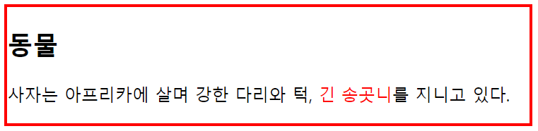
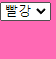
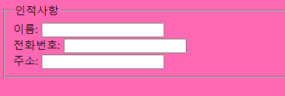

# 1. p, br, pre

```html
<!DOCTYPE html>
<html>
  <body>
  <p>첫 번째 문단에 들어갈 내용입니다.</p>
  <p>두 번째 문단에 들어갈 내용입니다.<br>여기서는 br태그로 줄을 바꾸었습니다.</p>
  
  원래는 띄어쓰기나 줄바꿈을 
  여러 번 해도 
  한 번만 한 것으로 간주되지만,
  
  <pre>
  pre 태그를 사용하면
  개발자가 입력한 그대로의 포맷을
  
  화면에 띄워준다.
  
  따라서 pre 태그를 사용하면 br태그나 p태그 없이도 줄바꿈이 가능하다!
  </pre>
  </body>
</html>
```


# 2. 텍스트 서식

```html
<!-- 예제 코드 -->
<b>이것은 볼드체이다.</b> <br> 
<i>이것은 이탤릭체이다.</i> <br>
<strong>텍스트를 강하게 표시</strong> <br>
<em>텍스트 강조</em> <br>
바로 밑에 나오는 한 줄은 코드이다. <br>
<code>printf("Hello, World!\n");</code> <br>
위 첨자를 표시할 때는 e<sup>x</sup>와 같이 쓸 수 있다. <br>
아래 첨자를 표시할 때는 a<sub>i</sub>와 같이 쓸 수 있다.
```

- 덧붙여 gooogle font 로 들어가서 폰트 link 하면 됨

```html
<!-- 나눔 명조 -->
<!-- title 위에 -->
<link rel="preconnect" href="https://fonts.googleapis.com">
<link rel="preconnect" href="https://fonts.gstatic.com" crossorigin>
<link href="https://fonts.googleapis.com/css2?family=Nanum+Myeongjo&display=swap" rel="stylesheet">

...

```

```css
* {
    font-family: 'Nanum Myeongjo', serif;
}
```


# 3. 수평선

```
<!-- 예제 코드 -->
밑에 수평선을 그리고 싶다. <br>
<hr/>
수평선이 그려졌다. <br>
```


# 4. 특수문자

```html
& nbsp;	non-breaking space. 공백문자 한 개
& lt;	<
& gt;	>
& quot;	"
& amp;	&
```


# 5. 리스트 (ol / ul / li)

```
// ul : unordered list - 번호없는 리스트
// ol : oredered list - 번호 리스트
// li : 리스트 항목

<!-- 예제 코드 -->
이것은 번호 없는 리스트이다. 각 리스트 항목 앞에 bullet이 붙는다.
<ul>	
	<li> 첫 번째 리스트 항목</li>
    <li> 두 번째 리스트 항목</li>
</ul>

이것은 번호 있는 리스트이다. 각 리스트 항목 앞에 번호가 붙는다.
<ol>
	<li> 첫 번째 리스트 항목</li>
    <li> 두 번째 리스트 항목</li>
</ol>
```


# 6. 링크 (a 태그)

1. herf 링크 이동 경로

```html
// 절대 경로
<a herf = "http://www.naver.com">네이버</a>
// 상대 경로 : 웹 사이트 내 다른 페이지
<a herf = "./login.html">로그인 페이지</a>
// 내부 파일
<a href="#notice">공지사항으로 이동</a>
```

2. target : 이동할 페이지가 어디에 열리는지

```html
<!-- 예제 코드 -->
<a href="https://www.naver.com" target="_blank">네이버 절대경로(target)</a>
<a href="https://www.google.com" target="_self">구글 절대경로(self)</a>
```

- `target="_blank"` 를 사용하면 새로운 윈도우에서 새로운 페이지
- `target="_self"` 는 현재 윈도우에 새로운 페이지 적재(default값)

3. 다운로드 링크와 기본 디렉토리 지정

```html
<!-- 다운로드 예제 코드 -->
<a href="https://www.cecilia.com/file.txt">파일 다운로드</a>

<!-- 기본 디렉토리 예제 코드 -->
<head>
	<base href="https://www.cecilia.com/" />
</head>
<body>
	<a href="notice.html" target="_blank">공지사항</a>
</body>
```

- 다운로드는 herf 뒤에 /file.txt 넣기
- 기본 디렉토리는 a tag 대신 base  tag를 넣음

4. title 속성

- 마우스를 올려놓았을 때 링크의 정보가 보임

```html
<a href="url" title="전설적인 프로그래머">(도널드 커누스)</a>
```


# 7. 이미지 (img)

HTML 요소에는 block 요소와 inline 요소가 있다.

- block 요소: 화면에 표시한 후 항상 줄 바꿈이 일어남 (한 줄을 다 차지)
- inline 요소: 요소를 화면에 표시한 후에도 줄바꿈이 일어나지 않음 (한 줄에 차례대로 표시)

img 태그는 inline 요소이다. 

```html
<!-- 예제 코드 -->

```

- `` 이후 width와 height, alt는 선택
- alt는 어떠한 이유로 이미지 표시를 못할 경우 대체 이미지 


# 8. 테이블 (table)

- table 태그: 표(테이블)를 정의한다.
- caption 태그: 테이블의 제목을 삽입한다.
- tr 태그: (table row) 테이블의 하나의 행을 표현한다.
- th 태그: (table header) 열 제목을 표현한다. 모든 브라우저에서는 th 태그의 요소를 볼드체, 중앙정렬로 표시한다.
- td 태그: (table data)행 안의 데이터 요소를 표현한다.

```html
<!-- 예제코드 -->
<table border="1">
	<caption>
    	출석부
    </caption>
	<tr>
    	<th>이름</th>
        <th>나이</th>
    </tr>
	<tr>
    	<td>영희</td>
        <td>10살</td>
    </tr>
    <tr>
    	<td>철수</td>
        <td>9살</td>
    </tr>
</table>
```


## 테이블 열 병합 / 행 병합

- rowspan: 위 아래 병합(행 병합)
- colspan: 옆으로 병합(열 병합)

```html
<!-- 예제코드 -->
<table border="1">
	<tr>
    	<th>1열</th>
        <th>2열</th>
        <th>3열</th>
    </tr>
	<tr>
    	<td rowspan="2">1행 1열</td>
        <td>1행 2열</td>
        <td>1행 3열</td>
    </tr>
    <tr>
    	<td>2행 2열</td>
        <td>2행 3열</td>
    </tr>
    <tr>
    	<td colspan="3">3행</td>
    </tr>
</table>
```


# 9. 오디오 / 비디오

| 속성          | 설명                                                         |
| ------------- | ------------------------------------------------------------ |
| autoplay      | 오디오/비디오를 자동 재생                                    |
| controls      | 브라우저에 오디오/비디오 재생 제어기 표시                    |
| loop          | 현재 오디오/비디오를 반복 재생                               |
| preload       | 사용자가 사용할 생각이 없더라도 오디오/비디오를 미리 다운로드 |
| src           | 재생할 오디오/비디오가 존재하는 url 지정                     |
| volume        | 오디오/비디오  재생 볼륨 설정: 0.0~1.0                       |
| poster        | 비디오 다운로드 중일 때 표시하는 이미지                      |
| muted         | 비디오의 오디오 출력을 중지                                  |
| width, height | 비디오 재생기의 너비와 높이 지정                             |

```html
<audio src="music.mp3" autoplay controls loop>
```

#### 오디오의 호환성을 높이는 방법

어떤 브라우저에서는 실행되고, 어떤 브라우저에서는 실행되지 않는 확장자가 있을 수 있다. 이러한 경우, 브라우저마다의 호환성을 높이기 위해 source 태그를 활용할 수 있다.

```html
<audio controls autoplay loop>
	<source src="music.ogg" type="audio/ogg">
    <source src="music.mp3" type="audio/mp3">
    <source src="music.wav" type="audio/wav">
    This browser does not support the audio element.
</audio>
```

이렇게 써두면 위에서부터 파일형식을 차례로 검사한다. 브라우저에서 재생 가능한 파일 형식을 찾으면 그 아래는 더이상 검사하지 않는다.


# 10. iframe

웹 페이지 안에 다른 웹 페이지를 표시하고자 할 때 사용한다.
보통 광고를 삽입하거나 하나의 페이지를 여러 프레임으로 나누고싶을 때 사용한다.

```html
<iframe src="inner.html" width="50%" height="100%"></iframe>
```

- `seamless`를 추가하면 경계선 없이 표시

```html
<iframe src="inner.html" width="50%" height="100%" seamless></iframe>
```


# 11. div 와 span

- div: (divide) block 요소. 페이지를 논리적인 섹션으로 분리할 때 사용하는 태그이다.
- span: inline 요소. 텍스트를 위한 컨테이너로 사용할 수 있다.

```html
<div style="border: 3px solid red;">
	<h2>동물</h2>
	<p> 
    	사자는 아프리카에 살며 강한 다리와 턱,
    	<span style="color: red;">긴 송곳니</span>를
        지니고 있다.
    </p>
</div>
```




# 12. form

### form 태그와 속성

- action 속성: 사용자 입력 데이터를 받아서 처리하는 스크립트의 주소
- method 속성: 데이터 전송 방식(GET, POST 등)

```html
<form action="login.jsp" method="post">
    아이디: <input type="text" name="id"><br>
    비밀번호: <input type="password" name="pw"><br>
    <input type="submit" value="login">
</form>
```

### input 태그

- type 속성: 입력 요소의 유형
- value 속성: 입력 요소의 초기값. 사용자가 변경 가능
- name 속성: 입력 요소의 이름. 서버로 변수의 이름처럼 전달
- autocomplete 속성: 자동입력완성
- autofocus 속성: 페이지 로드 시 자동으로 입력 포커스
- placeholder 속성: 입력 힌트를 희미하게 보여줌
- readonly 속성: 읽기 전용 필드
- required 속성: 반드시 채워져 있어야 함
- pattern 속성: 허용하는 입력 형태를 정규식으로 지정

| type     | 설명                                                 |
| -------- | ---------------------------------------------------- |
| text     | 텍스트 입력이 가능한 한 줄짜리 필드 생성             |
| password | 비밀번호 입력이 가능한 한 줄짜리 필드 생성           |
| radio    | 라디오 버튼 생성                                     |
| checkbox | 체크박스 생성                                        |
| file     | 파일 이름을 입력하는 필드 생성                       |
| reset    | 초기화 버튼 생성. 버튼을 누르면 모든 입력버튼 초기화 |
| image    | 이미지 전송 버튼으로 생성                            |
| hidden   | 사용자에게는 보이지 않지만 서버로는 전송             |
| submit   | 제출버튼 생성                                        |

#### text & password

```html
<form>
    <!-- 아이디, 비번의 최대 길이는 20으로 지정 -->
    아이디: <input type="text" name="id" size="20"><br>
    암호: <input type="password" name="pw" size="20">
</form>
```


#### radio 버튼

```html
<form>
    성별:
    <input type="radio" name="gender" value="male">남
    <input type="radio" name="gender" value="female">여
</form>
```


#### checkbox 박스

```html
<form>
    과일 선택:
    <input type="checkbox" name="fruits" value="apple" checked> 사과
    <input type="checkbox" name="fruits" value="grape"> 포도
    <input type="checkbox" name="fruits" value="orange"> 오렌지
</form>
```

- `checked` 속성을 통해 미리 체크 가능

#### submit버튼 / reset 버튼 / input 버튼 / button 버튼

```html
<form>
    이름: <input type="text" name="name"><br>
    <input type="submit" value="제출">
    <input type="reset" value="초기화">
    <input type="button" value="버튼1" onclick="alert('input 버튼입니다.')">
    <button type="button" onclick="alert('button 버튼입니다.')">버튼2</button>
</form>
```


- onclick 속성을 넣으면 클릭했을 떄 값을 팝업 표시 가능
- `onclick="alert('text')"` 로 하면 text값을 팝업 표시

#### image 버튼

```html
<form>
    이름: <input type="text" name="name"><br>
    <input type="image" src="image.jpg" alt="제출버튼">   
</form>
```

#### 그 외 기타 type

```html
<form action="input.jsp" method="post">
    email: <input type="email" name="email"><br>
    URL: <input type="url" name="url"><br>
    telephone: <input type="tel" name="tel" pattern="[0-9]{3}-[0-9}{4}-[0-9]{4}" title="###-####-####"><br>
    color: <input type="color" name="color"><br>
    month: <input type="month" name="month"><br>
    date: <input type="date" name="date"><br>
    datetime: <input type="datetime" name="datetime"><br>
    week: <input type="week" name="week"><br>
    time: <input type="time" name="time"><br>
    datetme-local: <input type="datetime-local" name="localdatetime"><br>
    number: <input type="number" name="number" min="1" max="10" step="1"><br>
    range: <input type="range" name="range" min="1" max="10" step="2"><br>
    <input type="hidden" name="secret" value="1">
    <input type="submit" value="제출">
</form>
```

### textarea 태그

여러 줄의 텍스트를 입력받을 때 사용하는 태그이다.
영역의 크기는 rows와 cols로 설정하며, 사용자가 설정한 초기 영역보다 많은 텍스트를 입력하면 자동으로 스크롤바가 생성된다.

```html
<form>
	내용: <textarea name="content" rows="5" cols="50"></textarea>
</form>
```

### select 태그

옵션을 표시하고, 사용자가 선택할 수 있게 한다. 항상 option 태그와 함께 사용되며, option 태그에는 반드시 value 속성을 넣어주어야 한다.

```html
<form>
<select name="colors">
	<option value="red">빨강</option>
    <option value="blue">파랑</option>
    <option value="black">검정</option>
    <option value="white" selected">하양</option>
</select>
</form>
```



### fieldset 태그

입력요소를 그룹핑하는데 사용된다. legend 태그를 사용하면 그룹에 제목을 붙일 수 있다.

```null
<form>
<fieldset>
    <legend>인적사항</legend>
    이름:    <input type="text"><br>
    전화번호: <input type="tel"><br>
    주소:    <input type="text"><br>
</fieldseet>
</form>
```



### label 태그

input 요소를 위한 label을 정의한다. label 태그의 for 속성을 이용하면 label과 input 요소를 서로 연결할 수 있다.

```null
<form>
    <label for="male">남</label>
    <input type="radio" name="gender" id="male" value="male"><br>
    <label for="female">여</label>
    <input type="radio" name="gender" id="female" value="female"><br>
    <input type="submit" value="제출">
</form>
```


예를 들어, 위와 같이 작성한 경우, 마우스로 라디오 버튼을 클릭하지 않고 "남"이라는 글자를 클릭하더라도 "남"의 라디오 버튼이 체크된다.

### 파일 업로드

```null
<form enctype="multipart/form-data">
    <input type="file" accept="image/jpg, image/gif">
</form>
```