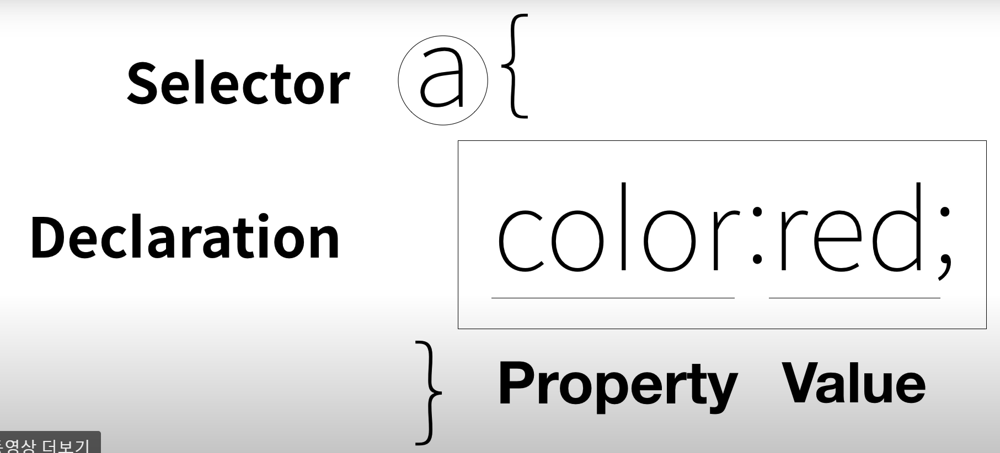

# 1. css 삽입 방법

1. head 태그에 스타일 태그 삽입
2. html 태그에 style 속성 넣기

```html
...
//style 태그
<style>
    a {
      color:black;
    }
</style>
</head>
<body>
    //태그에 직접 style 넣기
<li><a href="2.html" style="color:red;text-decoration:underline">CSS</a></li>
    ...
```

- css 속성

  - color : 색 - text 색 넣기
  - text_decoration : none - 택스트 장식이 없어짐

  - text_decoration : underline - 택스트 밑줄

- css 구성 요소




# 2. 박스모델  

- 태그는 화면전체를 쓰는 태그와 자신의 영역만 쓰는 태그가 있음
- 전자가 block level element, 후자가 inline element라고 함
- style에 display : block(inline) 을 넣으면 두 형태를 변경할 수 있음

```html
<style>
	h1{
        border-width: 5px;
        border-color: red;
        border-style: solid;
        display : inline;
        }

    a{
        border-width: 5px;
        border-color: red;
        border-style: solid;
    }

</style>
```

### 선택자 내 중복제거

- 선택자에서 콤마(,)를 넣으면 중복제거
- border- 는 border로 통일가능

```html
//h1, a 태그를 통합
h1, a{
        border-width: 5px;
        border-color: red;
        border-style: solid;
        }
        
//border 로 통합

h1, a{
        border-width: 5px red solid;
        }
```


### 박스 간격

- padding : 테두리 내 크기를 늘림
- margin : 테두리 간의 간격 
- width : 박스 넓이
- text-align : 내용 정렬
- font-size : 폰트 사이즈

```html
<style>
        h1{
            border : 5px solid red;
            padding : 20px;
            margin : 20px;
            display : block;
            width : 100px;
        }
            
    </style>
```

- **css box model** 로 검색하여 모르는 것 찾기!!


# 3. 그리드

- 디자인을 위한 무색무취의 태그 : div 과 span
- div는 block, span은 inline

### grid 속성

- display를 grid로 하고,

- grid-template-columns : 열 내 div의 크기 비율 설정

  - ex) `grid-template-columns : 150px 1fr;`
  - 왼쪽은 150px 넓이의 columns, 오른쪽은 나머지

- ```html
      <style>
          #grid{
              border : 5px solid pink;
              display : grid;
              grid-template-columns : 150px 1fr;
          }
          div{
              border : 5px solid gray;
          }
      </style>
  </head>
  <body>
      <div id="grid">
          <div>NAVIGATION</div>
          <div>ARTICLE</div>
      </div>
  ```

- 상위 속성과 하위속성을 같이 쓸 때
  - #grid ol, #grid #article 처럼 이어쓰면 된다.


# 4. 반응형 디자인

- 화면의 크기에 따라 웹페이지 디자인이 반응하여 달라짐

### 미디어 쿼리

- 예제) 화면 크기가 800px을 기준으로 변경

- ```html
  <style>
          div{
              border : 5px solid green;
              font-size : 60px;
          } 
          @media(max-width : 800px){
              div{
                  display : none;
              }
          }
  </style>
  ```

  - 800 이하면 div 스타일, 이상이면 media query 내 div 스타일 사용


# 5. css코드의 재사용

- css 파일 만들고, (style.css)
- head 태그에 `<link rel="stylesheet" href="style.css">` 적용