# 1. 선택자

### 가상 클래스 선택자

- 클래스 선택자처럼 동작하지만 클래스 선택자는 아니고, 여러가지 특수한 선택들을 하게 하는 그러한 선택자

##### 가상 클래스 선택자 예시

- element 특성에 따라 선택하게 만드는 선택자
- active : 눌렀을 때
- hover : 마우스를 올려놨을 때
- visited : 방문했을 때(보안 측면에서 제한된 기능 가능)

-  link : 방문 안했을 때

- focus : tab 등으로 클릭되었을 때(여러 이유로 맨 마지막에 적음)

```html
<style>

		a:link{
            color: black
        }

        a:visited{
            color: red;
        }
        a:active{
            color: green;
        }

        a:hover{
            color: yellow;
        }

       a:focus{
            color: white;
        }
</style>
```


### 다양한 선택자

##### 선택자 공부 : https://flukeout.github.io/

- A+B : A 다음에 나오는 B선택자
  - plate + apple : plate 선택자 다음에 나오는 apple 선택자 1개

- A ~ B : A 다음에 나오는 모든 B 선택자
  - bento ~ pickle : bento 선택자 다음에 나오는 pickle 선택자 모두
- A > B : A 바로 밑에 있는 모든 B 선택자
  - plate > apple : plate 바로 밑에 있는 apple 만 선택(only direct children)

------------여기서부터는 크게 쓰이지 않는다고 함------

- A:first-child : 첫번째로 등장하는 모든 A선택자
  - orange:first-child
- A:only-child : 어떤 element가 sibling이 없이 혼자 자식일 때
- A:last-child : 가장 뒤에 있는 element를 선택

- A:nth-child(N) : N번째에 있는 child 

- A:nth-last-child(N) : 뒤에서 N번째에 있는 child 

- A:first-of-type : 제일 처음 등장하는 A 선택자

- A:nth-of-type(odd, even) : 홀수번째나 짝수번째에 등장하는 A 선택자
- A:nth-of-type(수열) : 수열에 따른 A 선택자 선택
  - plate:nth-of-type(2n+3) : 3, 5, 7... 번째 plate 선택(n은 0부터 시작함) 
- A B:only-of-type : 단 하나의 B 선택자만 있는 A선택자 안의 B 선택자
  - plate apple:only-of-type : apple 타입이 1개만 있는 plate의 apple 선택

- A:last-of-type : A 중에 마지막 태그
- A:empty : 자식 타입이 아무것도 없는 A 타입

- A:not(X) : X가 아닌 모든 A 타입
  - apple:not(.small) : small class가 아닌 모든 apple


# 2. 타이포그래피

### 글자크기 : 'px' vs 'rem'

- px : 어떠한 경우에도 크기가 같음, 모니터 상의 화소 하나의 크기에 대응되는 단위
- rem : 사용자가 설정한 크기에 따라 가변적으로 크기가 바뀜, html 태그에 적용된 font-size의 영향을 받음
- 일반적인 경우 rem으로 사용하는게 낫다
- 2rem : font-size * 2


### 색 표현 : 'name' vs 'rgb' vs 'hex'

- `color: sth;` 으로 표현

- name : 색의 영어 이름으로 표현
  - red, tomato, blue ...
- rgb : rgb 값으로 색 표현
- hex : 16진수 6자리로 rgb표현 `#000000`


### 택스트 정렬

- text-align: sth;
- justify : 균등하게 정렬


### 폰트 설정

- font-family: sth;
- font를 나열했을 때, 앞의 font가 컴퓨터에 없으면 그 다음 font 사용
  - font-family: sth1, sth2, sth3;
  - sth1이 없으면 sth2 사용 
- 폰트 이름이 2단어 이상이면 " " 안에 넣어줘야 함
  - ex) font-family: "sth font";

- sans-serif, serif

  - sans-serif : 장식이 없는 폰트

  - serif : 장식이 있는 폰트


- 고정폭 vs 가변폭

  - 고정폭 : 고정폭이 필요하면 뒤에 monospace를 적어서 컴퓨터에 저장된 font 중에 고정폭 font를 적음

- font-weight

  - 폰트 두께를 나타냄

  - font-weight: bold; - 굵게

- line-height

  - 폰트 자간을 나타냄

  - line-height: 1.2; 1.2가 기본값

- font

  - font 내용을 한번에 적어주기(border랑 비슷한 듯)

  - 순서가 있으므로 순서대로 해야 함

  - font: font-style font-variant font-weight **font-size**/line-height **font-family**|caption|icon|menu|message-box|small-caption|status-bar|initial|inherit; 

  - 이 중에서 font-size와 font-size와 font-family는 필수로 포함되어야 하는 정보

  - ```html
    #type2{
            font:bold 5rem/2 arial, verdana, "Helvetica Neue", serif;
          }
    ```

   

### web font

- 한글은 web font크기가 크기떄문에 이를 고려해야 함
- google web font 사용

##### font 생성

- 폰트 다운로드 후, (네이버 등)
- http://www.web-font-generator.com 에서 폰트 생성
- css 파일에서 폰트 확인 후 사용


# 3. 조화

### 상속

- 부모 엘리먼트의 속성을 자식 엘리먼트가 물려받는 것

- 상속되지 않는 속성도 있음
  - border 등
  - https://www.w3.org/TR/CSS21/propidx.html 에서 확인 가능


### stylish

- chrome 확장 프로그램에 google stylish
- install 하면 적용됨
- stylish를 통해 직접 edit 가능


### 캐스케이딩(cascading, 폭포)

- 하나의 element에 대해서 다양한 효과가 영향력을 행사하려고 할 때 우선순위 설정

- 규칙1 : 웹브라우저 < 사용자 < 저자

```html
    <style>
        li{color: red;}
        #idsel{color: blue;}
        .classsel{color:green;}
    </style>
</head>
<body>
    <ul>
        <li>html</li>
        <li id="idsel" class="classsel" style="color:powderblue">css</li>
        <li>javascript</li>
    </ul>
</body>
```

- 규칙2 : style 속성 > id 선택자 > class 선택자 > 태그(li 등) 선택자 순
  - 구체적이고 명시적인 규칙이 우선
  - 포괄적인 규칙이 나중
- 규칙3 : 뒤에 `!important`를 붙이면 우선 적용
  - ex) li{color: red !important;}
  - 하지만 좋은 방법은 아니며, 우선 순위를 잘 따져서 적용하는게 좋음


# 4. 레이아웃

### box model

- border : 테두리
- padding : 태그 안의 간격
- margin : 태그의 밖의 간격

- 화면 전체를 사용하고 싶지 않다면 width와 height를 사용
  - inline 방식에서는 width와 height 값이 무시됨 

### box-sizing

- width 와 height 값에는 border값이 포함되지 않음
- 따라서 `box-sizing: border-box` 속성을 추가하면 border값이 포함 됨 

```html
<style>
div{
    margin: 10px;
    width: 150px;
    box-sizing: border-box;
    }
</style>
```

- 편하게 `*{box-sizing: border-box;}`를 선언해서 모든 태그에 적용


### 마진 겹침

- margin 값이 겹치는 현상
- 두 형제 태그 중 더 큰 margin 값이 간격이 됨
- **부모태그가 시각적으로 아무것도 없을 때 부모태그와 자식태그에서도 마진겹침이 일어남**


### 포지션

- element 가 어디에 위치할 것인가?

- offset

  - `position: relative;` 속성 필요

    - static : 정적 위치(default값) / 위치에 대한 값을 설정하지 않은 상태

  - left, top 속성 : n px 만큼 이동(left, top 우선)

  - ```html
    #me{
        position:relative;
        left:100px;
        top: 100px;
        }
    ```

- absolute(절대 위치)

  - `position: absolute;` 속성 추가로 절대적 위치 설정

  - left, top 을 통해 절대적 위치

  - **absolute를 쓰면 더 이상 부모태그에 속해있는 것이 아닌 것처럼 움직임**

  - absolute의 default 위치는 부모 속성 아래의 원래 위치

  - width와 height 도 다시 설정해줘야 함

  - 부모 태그 중 static이 아닌 position이 있으면 그부모태그를 기준으로 absolute 위치를 정함

    - ```html
      <div id="grand">
          grand
          <div id="parent">
              parent
              <div id="me">
                  me
              </div>
          </div>
      </div>
      ```

    - 여기서 grand의 position은 relative, parent는 static, me는 absolute라고 할 때, me의 left, top 값은 grand 기준으로 됨
    - 

- fixed(고정된)
  - 특정한 element를 화면에 고정시켜서 스크롤로부터 완전히 독립시킴
  - 스크롤을 내려도 고정되어 있음
  - 나머지는 absolute와 똑같음


### flex

- display 속성에 flex 값을 넣어서 사용

- ```html
      <style>
          .container{
              background-color: powderblue;
              display: flex;
              flex-direction: row;
          }
  
          .item{
              background-color: tomato;
              color: white;
              border: 1px solid white;
          }
      </style>
  
  </head>
  <body>
      <div class="container">
          <div class="item">1</div>
          <div class="item">2</div>
          <div class="item">3</div>
          <div class="item">4</div>
          <div class="item">5</div>
      </div>
  </body>
  ```

  

- 기본값은 flex-direction: row;

- flex-direction: row-reverse; 

  - 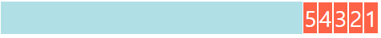

- flex-direction: column;
  - 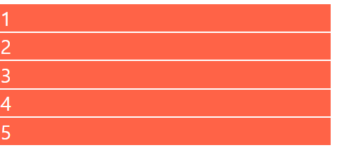

##### grow & shrink

- flex-basis: n px; :flex-direction 방향으로 npx 만큼 커짐

- grow : 여백 전체를 해당 태그가 나누어가짐

  - ```html
    .item{
        background-color: tomato;
        color: white;
        border: 1px solid white;
        flex-grow: 1;
            }
    ```

  - 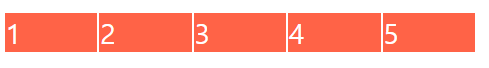

  - 비율을 다르게 하고 싶다면 특정 태그에 flex-grow를 변경하면 됨

- shrink : container의 크기가 줄어들 때 줄어드는 비율

  - flex-basis 값을 가지고 있을 때 적용됨
  - flex-shrink: 0; 으로 하면 해당 태그는 줄어들지 않음
  - 1번은 1, 2번은 2를 줄 때 숫자 크기가 클수록 더 많이 줄어듦(1:2 비율)

##### Holy Grail Layout

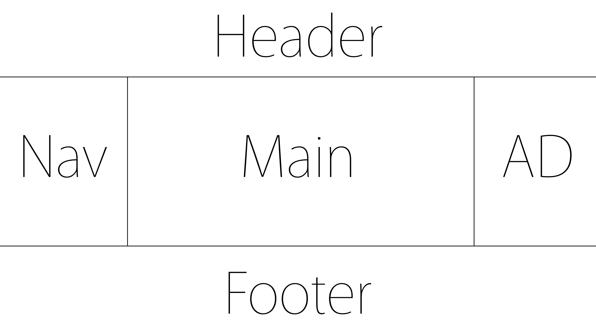

- 태그 형식

  - div(header+section(nav, main, AD)+footer)

  -   div>(header>h1)+(section>(nav>ul>li*3)+main+aside)+footer

  - ```html
    <body>
        <div class="container">
            <header>
                <h1>생활코딩</h1>
            </header>
            <section class="content">
                <nav>
                    <ul>
                        <li>html</li>
                        <li>css</li>                   <li>javascript</li>
                    </ul>
                </nav>
                <main>
                    생활코딩
                </main>
                <aside>
                    AD
                </aside>
            </section>
            <footer>
                <a href="https://opentutorials.org/course/1">홈페이지</a>
            </footer>
        </div>
    </body>
    ```

- style 태그

  - ```html
    <style>
            .container{
                display: flex;
                flex-direction: column;
            }
    
            header{
                border-bottom: 1px solid gray;
                padding-left: 20px;
            }
    
            footer{
                border-top: 1px solid gray;
                padding: 20px;
                text-align: center;
            }
    
            .content{
                display: flex;
            }
    
            .content nav{
                border-right: 1px solid gray;
            }
    
            .content aside{
                border-left: 1px solid gray;
            }
    
            nav, aside{
                flex-basis: 150px;
                flex-shrink: 0;
            }
    
            main{
                padding: 10px;
                text-align: justify;
            }
        </style>
    ```

  - flex 값과 flex-direction 적절히 사용


##### flex의 여러 속성들

- flex-wrap: ;
  - nowrap(default)
  - wrap : 화면이 작아지면 줄이 바뀜
  - 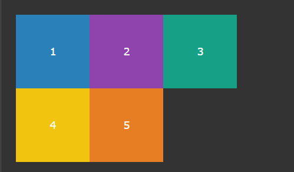
  - wrap-reverse : 거꾸로 출력

- align-items : ; 아이템들이 자신의 크기만큼 공간 차지, 정렬 방향의 수직 방향의 정렬 상태

  - flex-start
    - 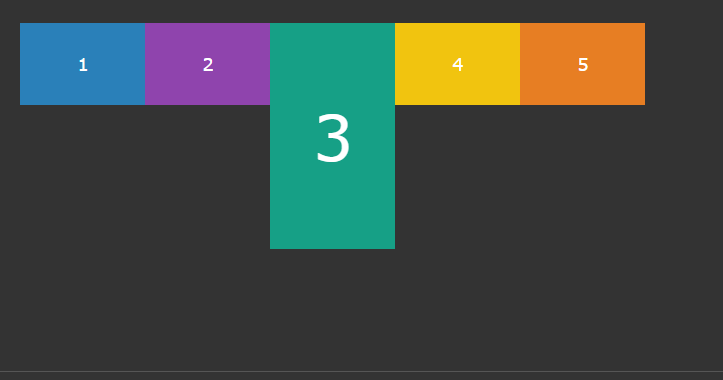

  - flex-end
    - 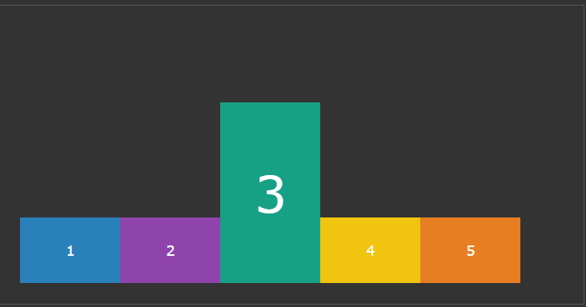

  - center, baseline, stretch 가 있음
  - stretch 가 default 값

- justify-content : ; 정렬 방향의 수평방향의 정렬 상태

  - flex-start : 왼쪽 정렬
    - 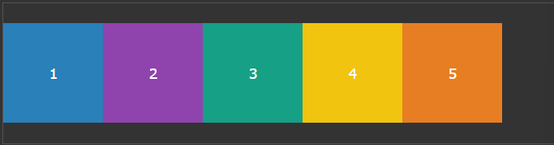

  - flex-ent : 오른쪽 정렬
  - space-between 
    - 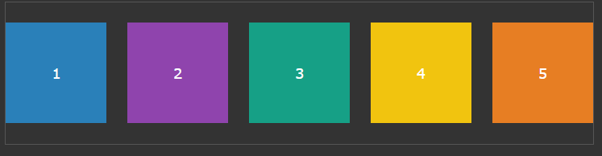
  - center : 중앙 정렬
  - space-around(between과 차이는 제일 끝에 여백이 있다.)
    - 

- align-content: ;

  - align-items와 비슷하지만 열(행) 별 정렬을 나타냄

- 기타 : align-self, order 등이 있음

- https://opentutorials.org/course/2418/13526 참고


### media query

- 반응형 디자인의 심장같은 역할

- 형식은 @media(조건){ }

- ```html
  <style>
      @media (max-width:600px){
          body{
              background-color: green;
          }
      }
  
      @media (max-width:500px){
          body{
              background-color: red;
          }
      }
  
      @media (min-width: 601px){
          body{
              background-color: blue;
          }
      }
  </style>
  ```

  - ~500 / 500 ~ 600 / 601 ~ 로 나눈 media query


### float

- 글의 본문안에서 이미지를 자연스럽게 삽입할 때 사용 

- 속성에 float: ; 를 넣음 (right, left ...)

- ```html
  <style>
  	img{
          width: 300px;
          float:left;
          margin-right: 20px;
          margin-bottom: 20px;
          }
  </style>
  ```

  

- 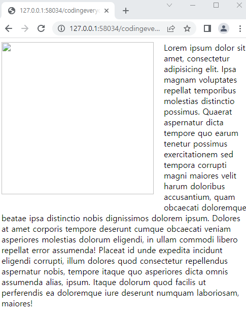

- 특정 태그만 float 속성을 없애기 위해서는 태그에 직접 `style="clear:both"`을 넣어주면 됨

  - 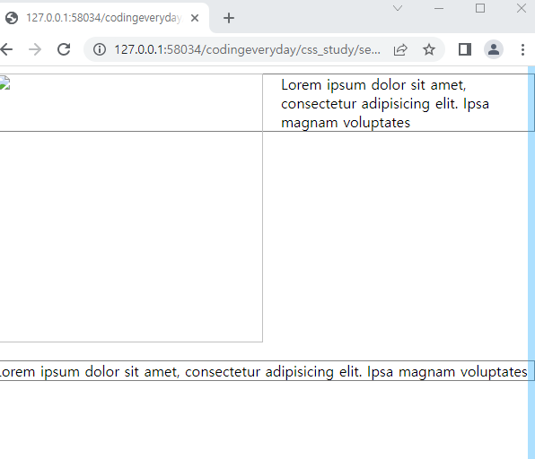

  - clear: both는 right와 left 포함 / right는 float: right만 없애고, left는 float: left만 없앰

- float를 통한 holy_grail_layout 코드

- ```html
  <html>
  <head>
      <style>
          *{
              box-sizing: border-box;
          }
          .container{
              width: 540px;
              border: 1px solid gray;
              margin: auto;
          }
          
          header{
              border-bottom: 1px solid gray;
          }
                  
          nav{
              float: left;
              width: 120px;
              border-right: 1px solid gray;
          }
          
          article{
              float: left;
              width: 300px;
              border-left: 1px solid gray;
              margin-left: -1px;
              border-right: 1px solid gray;
              margin-right: -1px;
          }
          
          aside{
              float: left;
              width: 120px;
              border-left: 1px solid gray;
              
          }
          
          footer{
              clear: both;
              border-top: 1px solid gray;
              text-align: center;
              padding: 20px;
          }
      </style>
  </head>
  <body>
     <div class="container">
          <header>
             <h1>
              CSS
              </h1>
          </header>
          <nav>
              <ul>
                  <li>position</li>
                  <li>float</li>
                  <li>flex</li>
              </ul>    
          </nav>
          <article>   
              <h2>float</h2>
              Lorem ipsum dolor sit amet, consectetur adipisicing elit. A necessitatibus voluptatem optio delectus natus quaerat quod totam illo quae, consectetur sunt labore, architecto id tenetur voluptate molestias minima veritatis quam. Ipsa libero nobis, adipisci nostrum! Nam ullam, vel placeat repudiandae dolorum dignissimos beatae earum, dolores perspiciatis dolor velit sint eligendi esse obcaecati. Quasi, harum ipsa illo? Ipsa, impedit sint commodi officiis numquam nobis quisquam. Dolore, pariatur rerum, dicta deserunt magnam ullam enim voluptas, voluptatum fugit ad quia. Atque molestias quam ratione iusto consectetur optio, deleniti similique sapiente numquam perspiciatis ut animi voluptatem omnis excepturi architecto, distinctio. Dolorem ab, ullam quam!
          </article>
          <aside>ad</aside>
          <footer>copyright</footer>
      </div>
  </body>
  </html>
  ```

  - nav, article, aside 에 float 값을 주고, width값을 주어 평행하게 배치
  - footer는 clear 값을 주어서 아래에 오도록 배치
  - container를 통해 모든 태그를 묶어주고 width 값을 주어서 크기 고정
    - 이 때 width 값을 더하기 전 모든 태그에 대해 box-sizing : border-box를 주어서 박스의 크기에 테두리 값을 포함시킴


### multi column

- 신문에서 사용하는 레이아웃 배치 방법

- column-count: 2; 을 통해 전체 글을 2단으로 나눔

- column-width: 200px; 을 통해 200px로 단을 나눔

  - count와 width를 통시에 쓰면 width를 적용받지만 count의 개수를 넘지 않음

- column-gap: 10px; 을 통해 column 사이 간격을 둠

- column-rule

  - column-rule-style : solid, dotted, dashed : column 사이 줄

  - column-rule-color : 사이 줄 색

  - column-rule-width : 사이 줄 크기
  - 위에 3개를 함께 사용할 수 있다
    - column-rule : 1px solid gray;

- column-span: all; 을 통해 column에 구애받지 않고 표현 가능

  - 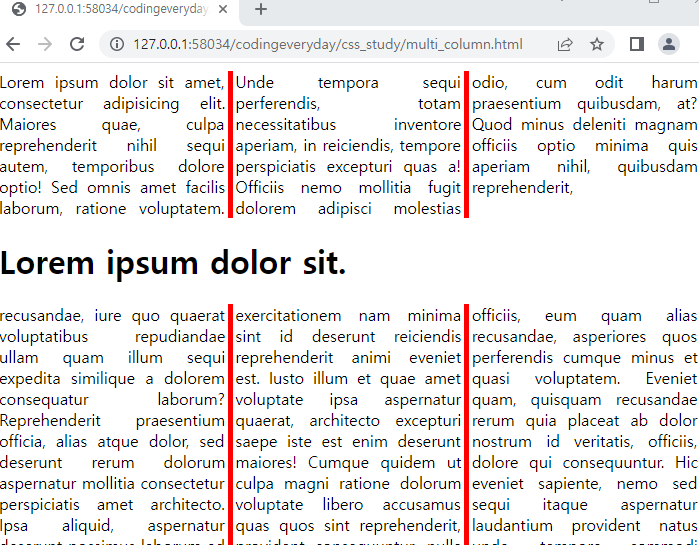


# 5. 그래픽

### 배경(background)

- background-color : 배경 색

- background-image: url("주소 넣기") - transparent 값이 있으면 배경 색과 함께 사용가능

  - image는 기본적으로 반복됨
  - background-repeat: no-repeat; 값을 통해서 반복해제 가능
    - 다른 value 값 : repeat-x(x축만 반복), repeat-y(y축만 반복), repeat(기본값) 

  - background-attachment: fixed; 을 통해서 스크롤 간 img는 움직이지 않음(기본값은 scroll)
  - background-size: 500px 100px; 을 통해 사이즈 지정가능(폭, 높이)
  - cover와 contain 속성이 있음
  - 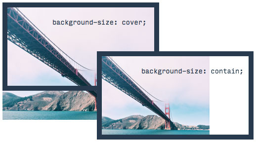

  - background-position: right top; 을 통해 img파일을 오른쪽 위로 보낼 수 있음
    - (left center right), (top center bottom) 값이 있고 2가지를 조합하면 됨
    - 기본은 left top;
  - **위 속성 모두 함께 사용 가능**
    - background: tomato url('run.png') no-repeat fixed center;
    - 순서는 상관없는 듯 하다


### filter

- http://bennettfeely.com/filters/ 

  - CSS filter playground

- 이미지에 필터주는 방법

  - ```html
    <style>
    	img{
        filter: grayscale(100%);
            }
    </style>
    ```

- 텍스트에도 줄 수 있음

  - ```html
    h1{
    	filter: blur(3px);
        }
    ```

- img:hover와 transition 속성을 통해서 점진적으로 변화하는 모습 표현 가능

  - ```html
    <style>
    	img{
    		transition: all 1s;
    	}
    
    	img:hover{
    		filter: grayscale(100%) blur(3px);
    	}
    </style>
    ```

  - hover하면 점진적으로 회색, 블러 처리


### blend

##### background-blend-mode

- background-blend-mode 속성을 정의하고 value를 주면 됨

  - ex) background-blend-mode: darken;

- hover, transition과 함께 사용하면 편함

  - ```html
    <style>
        .blend{
            height:500px;
            border: 5px solid;
            background-color: rgb(125,0,0,0.5);
            background-size: cover;
            background-image: url("..\\sample_mt.jpg");
            background-blend-mode: darken;
            transition: background-color 5s;
        }
    
    	.blend:hover{
    		background-color: rgb(125,0,0,1);
    		transition: background-color 5s;
    	}
    </style>
    ```

  - hover되면 5초에 걸쳐 transition, 마우스가 벗어나면 다시 5초에 걸쳐 transition

##### mix-blend-mode

- 텍스트와 배경 이미지 사이의 속성

- <style>
  	body{
      	background-image: url("..\\sample_mt.jpg");
          }
  	.blend{
      font-size: 2rem;
      font-weight: bold;
      color: red;
      mix-blend-mode: screen;
          }
  </style>

  - 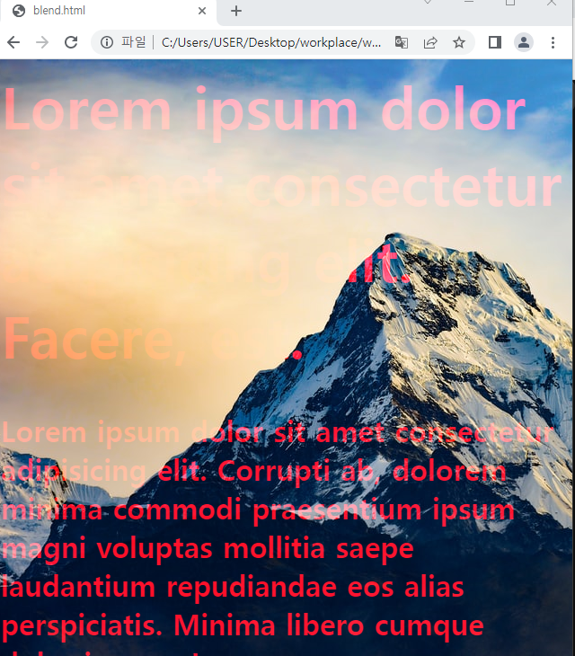

- **codepen 사이트에서 blend 를 검색해서 사용 가능**


### transform

- transform 속성

  - ```html
    /* Keyword values */
    transform: none;
     
    /* Function values */
    transform: matrix(1.0, 2.0, 3.0, 4.0, 5.0, 6.0);
    transform: translate(12px, 50%);
    transform: translateX(2em);
    transform: translateY(3in);
    transform: scale(2, 0.5);
    transform: scaleX(2);
    transform: scaleY(0.5);
    transform: rotate(0.5turn);
    transform: skew(30deg, 20deg);
    transform: skewX(30deg);
    transform: skewY(1.07rad);
    transform: matrix3d(1.0, 2.0, 3.0, 4.0, 5.0, 6.0, 7.0, 8.0, 9.0, 10.0, 11.0, 12.0, 13.0, 14.0, 15.0, 16.0);
    transform: translate3d(12px, 50%, 3em);
    transform: translateZ(2px);
    transform: scale3d(2.5, 1.2, 0.3);
    transform: scaleZ(0.3);
    transform: rotate3d(1, 2.0, 3.0, 10deg);
    transform: rotateX(10deg);
    transform: rotateY(10deg);
    transform: rotateZ(10deg);
    transform: perspective(17px);
     
    /* Multiple function values */
    transform: translateX(10px) rotate(10deg) translateY(5px);
     
    /* Global values */
    transform: inherit;
    transform: initial;
    transform: unset;
    ```

- 함께쓰고 싶으면 같이 사용

  - ex) transform: scaleX(0.5) scaleY(0.5)

- https://codepen.io/vineethtrv/pen/XKKEgM 이 사이트에서 transform 효과를 시각적으로 확인 가능

##### transform-origin

- 모양이 변경되는 기준
  - transform-origin: left top;
  - transform-orgin: 100% 0; 등으로 사용가능
- shake 효과 : http://elrumordelaluz.github.io/csshake/#1
- magic animation : http://www.minimamente.com/example/magic_animations/


### SVG

- https://thenounproject.com/ 를 통해 svg파일 다운로드 가능


# 6. 전환(transition)

- transition-property: ; - 어떤 속성에 transition효과를 줄 것인가
  - 복수의 효과를 적용하기 위해선 transition-property: transform font-size; 와 같이 띄어쓰기로 구분
- transition-duration: ; - 얼마동안 시간을 줄 것인가

- transition: ; 을 통해 property와 duration을 함께 사용 가능
  - transition: font-size 1s, transform 0.1s; 를 통해 각 속성의 duration 지정 가능
- transition-delay: 1s; 시간을 1s동안 지연시킨 후 transition 실행
- transition-timing-function: ; 움직일 때 움직이는 속도를 조정
  - default값은 ease
  - transition-timing-function: ease
  - 각종 timing-function은 https://matthewlein.com/tools/ceaser 를 통해 확인
- codepen에서 확인~


# 7. 유지보수

### link와 import

- `<link rel="stylesheet" href="style.css">` 를 통해  css 파일 연결

- 웹브라우저는 캐시메모리를 통해 css파일을 저장해놓으므로 경제적임

- import는 style태그 안에서 다른 css 연결

  - ```html
    <style>
    	@import url("style.css")
    </style>
    ```


### 코드 경량화(minify)

- clean-css 사이트 : http://adamburgess.github.io/clean-css-online/
- JS & CSS Minifier 를 통해 minify
- jsnode에서 cleancss를 통해 경량화가능


# 8. CSS 뛰어넘기

- preprocessor : CSS에 편리한 기능을 더한 새로운 언어를 만들고 이 언어에 따라서 작성한 코드를 어떤 프로그램으로 실행시키면 결과적으로 CSS를 만들어주는 도구

### stylus

- stylus 변환기 : http://stylus-lang.com/ 

- vs나 bracket에서 stylus 확장 파일을 설치하고 compile 해서 사용

- nodejs를 통해 npm을 사용하여 stylus 설치

  - `npm install stylus -g`
    - 에러 시 sudo를 붙이고 실행

  - `stylus pp.styl -o pp.css`를 통해 compile

  - `stylus -w pp.styl -o pp.css`를 통해 계속 감시(watch)하고, styl 내용이 바뀌면 즉시 변경됨

##### stylus의 기능들

-  http://stylus-lang.com 에서 학습
