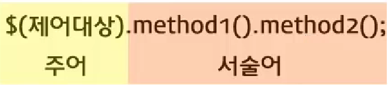

# 1. jQuery란?

1. elements를 선택하는 강력한 방법
2. 선택된 elements를 효율적으로 제어할 수 있는 다양한 수단을 제공
3. 자바스크립트 라이브러리

- ```js
  $('.welcome').html('hello world!').css('background-color', 'yellow');
  
  ```

  - $('.welcome') : welcome이라는 class 명을 가진 element 선택

  - .html('hello world') : html 메소드에 hello world 값 삽입
  - .css('background-color', 'yellow') : css 메소드에 배경색 노랑

- https://api.jquery.com/ 에서 jQuery api를 찾자~!

### jQuery의 문법




# 2. 레퍼(wrapper)

- $ 와 jQuery는 같은 의미지만 $를 사용하는 다른 라이브러리들과의 충돌 발생 가능

  - $ 대신 jQuery를 사용하는 방법

  - 함수를 선언하여 사용하는 방법

    - ```js
      <script type="text/javascript">
          
      //$를 함수의 지역변수로 선언해서 외부에 있을지 모르는 타 라이브러리의 $와의 충돌을 예방 
      (function($){
          $('body').html('hello world');
      })(jQuery)
      // 함수를 선언함과 동시에 호출하는 방법
      // (function($){})(jQuery)
      </script>
      ```

### 제어 대상을 지정하는 방법

- jQuery( selector, [context] ) 와  jQuery( element ) 2가지 방법

- jQuery( selector, [context] ) 예제

  - ```html
    <html>
        <body>
            <ul>
                <li>test2</li>
            </ul>
            <ul class="foo">
                <li>test</li>
            </ul>
            <script type="text/javascript" src="https://ajax.googleapis.com/ajax/libs/jquery/1.6.2/jquery.min.js"></script>
            <script type="text/javascript">
                (function($){            
                    $('ul.foo').click( function() {
                        $('li', this).css('background-color','red');
                    });
                })(jQuery)
            </script>
        </body>
    </html>
    ```

    - $('li', this) : this(ul.foo)는 context로서, context안에 있는 모든 'li' 태그를 선택
    - 즉, test 만 return 함

-  jQuery( element ) 예제

  - ```html
    <html>
        <body>
            <script type="text/javascript" src="https://ajax.googleapis.com/ajax/libs/jquery/1.6.2/jquery.min.js"></script>
            <script type="text/javascript">
                jQuery(document.body).css( "background-color", "black" );
            </script>
        </body>
    </html>
    ```

    

# 3. 선택자

- 기본 선택자

  - id 선택자 : #id

  - class 선택자 : .class

  - element 선택자 : li

  - 다중 선택자 : #jquery, #MYSQL

- filter
  - \#list li:eq(2) : 인자와 인덱스가 동일한 엘리먼트를 찾아내는 선택자
  - \#list li:gt(1) : 인자 보다 인덱스가 큰 엘리먼트를 찾아내는 선택자
  - \#list li:lt(2) : 인자 보다 인덱스가 작은 엘리먼트를 찾아내는 선택자
  - #list li:even : 첫번째, 세번째... 홀 수의 인덱스 값을 가진 엘리먼트에 대한 선택자
  - #list li:odd : 두번째, 네번째.... 짝 수의 인덱스 값을 가진 엘리먼트에 대한 선택자
  - #list li:first : 첫번재 인덱스 엘리먼트에 대한 선택자
  - \#list li:last : 마지막 인덱스 엘리먼트에 대한 선택자
- 속성
  - [target*=&quot;BC&quot;] : 속성의 값에 주어진 문자열이 포함되는 엘리먼트를 찾아내는 선택자
  - [target=&quot;DEFG&quot;] : 속성의 값과 주어진 문자열이 일치하는 엘리먼트를 찾아내는 선택자
  - [target!=&quot;DEFG&quot;] : 속성의 값과 주어진 문자열이 일치하지 않는 엘리먼트를 찾아내는 선택자
  - [target^=&quot;B&quot;] : 속성의 값으로 주어진 문자열이 처음 등장하는 엘리먼트를 찾아내는 선택자
  - [target$=&quot;H&quot;] : 속성의 값으로 주어진 문자열이 마지막으로 등장하는 엘리먼트를 찾아내는 선택자
  - [target] : 속성이 존재하는 엘리먼트를 찾아내는 선택자(target 속성이 있는 엘리먼트)
  - [target]\[id]  : 속성들이 존재하는 엘리먼트를 찾아내는 선택자(target과 id 속성이 있는 엘리먼트)


# 4. chain

### chain 이란? 

- jQuery의 메소드들은 반환값으로 자기 자신을 반환해야 한다는 규칙을 가지고 있음
- 이를 이용하면 한번 선택한 대상에 대해서 연속적인 제어를 할 수 있다.

- 예제 1) jQuery를 이용해서 코딩하는 경우

  - ```html
    <html>
        <body>
            <a id="tutorial" href="http://jquery.com" target="_self">jQuery</a>
            <script type="text/javascript" src="https://ajax.googleapis.com/ajax/libs/jquery/1.6.2/jquery.min.js"></script>
            <script type="text/javascript">
                jQuery('#tutorial').attr('href', 'http://jquery.org').attr('target', '_blank').css('color', 'red');
            </script>
        </body>
    </html>
    ```

    - attr 메소드를 통해서 속성값 변경 가능(href, target 속성 변경)
    - css 메소드로 color를 red로 바꿈

- 예제 2) javascript의 DOM을 이용해서 코딩하는 경우

  - ```html
    <html>
         <body>
             <a id="tutorial" href="http://jquery.com" target="_self">jQuery</a>
             <script type="text/javascript">
                 var tutorial = document.getElementById('tutorial');
                 tutorial.setAttribute('href', 'http://jquery.org');
                 tutorial.setAttribute('target', '_blank');
                 tutorial.style.color = 'red';
             </script>
         </body>
     </html>
    ```

- chain의 장점

  - 코드가 간결
  - 인간의 언어와 유사해서 사고의 자연스러운 과정과 일치

### 탐색(traversing)

- ```html
  <html>
      <body>
          <ul class="first">
              <li class="foo"> list item 1 </li>
              <li> list item 2 </li>
              <li class="bar"> list item 3 </li>
          </ul>
          <ul class="second">
              <li class="foo"> list item 1 </li>
              <li> list item 2 </li>
              <li class="bar"> list item 3 </li>
          </ul>
          <script type="text/javascript" src="https://ajax.googleapis.com/ajax/libs/jquery/1.6.2/jquery.min.js"></script>
          <script type="text/javascript">$('ul.first').find('.foo').css('background-color', 'red').end().find('.bar').css('background-color', 'green');</script>
      </body>
  </html>
  ```

  - `$('ul.first').find('.foo').css('background-color', 'red')` : ul.first에서 .foo를 find하고 css 메소드 실행(find를 통해 chain context가 .foo로 변경)
  - `.end()` : 마지막으로 사용한 traverse 취소(find 메소드 취소, 전의 context(ul.first)로 돌아감)
  - .find('.bar').css('background-color', 'green') : ul.first에서 .bar를 find하고 css 메소드 실행

- http://api.jquery.com/category/traversing/ 에 traversing 예제 있음


# 5. 이벤트(event)

### bind, unbind, trigger를 이용한 이벤트의 설치, 제거, 호출

- ```html
  <html>
      <head>
          <script type="text/javascript" src="https://ajax.googleapis.com/ajax/libs/jquery/1.6.2/jquery.min.js"></script>
          <script type="text/javascript">
              function clickHandler(e){
                  alert('thank you');
              }
              $(document).bind('ready', function(){
                   $('#click_me').bind('click', clickHandler);
                   $('#remove_event').bind('click', function(e){
                       $('#click_me').unbind('click', clickHandler);
                   });
                   $('#trigger_event').bind('click', function(e){
                       $('#click_me').trigger('click');
                   });
               })
          </script>
      </head>
      <body>
          <input id="click_me" type="button" value="click me" />
          <input id="remove_event" type="button" value="unbind" />
          <input id="trigger_event" type="button" value="trigger" />
      </body>
  </html>
  ```

  - bind는 이벤트를 설치하는 메소드

    - $('#click_me').bind('click', clickHandler);
    - 'ready'는 버튼들이 온전히 렌더링되면 시작(안전하게 이벤트를 설치하기 위함)
    - 'click'은 클릭 이벤트 의미

  - unbind의 역할은 click me에 있는 이벤트를 삭제하는 메소드

    - $('#click_me').unbind('click', clickHandler);
    - function(e){} 에서 e는 익명함수 의미 (재활용하지 않는 함수에서 보통 사용)

  - trigger의 역할은 click me에 있는 이벤트를 호출해주는 메소드

    - $('#click_me').trigger('click');

    

### 이벤트 헬퍼

- ```html
  <html>
      <head>
          <script type="text/javascript" src="https://ajax.googleapis.com/ajax/libs/jquery/1.6.2/jquery.min.js"></script>
          <script type="text/javascript">
              function clickHandler(e){
                  alert('thank you');
              }
              $(document).ready(function(){
                   $('#click_me').click(clickHandler);
                   $('#remove_event').click(function(e){
                       $('#click_me').unbind('click', clickHandler);
                   });
                   $('#trigger_event').click(function(e){
                       $('#click_me').trigger('click');
                   });
               })
          </script>
      </head>
      <body>
          <input id="click_me" type="button" value="click me" />
          <input id="remove_event" type="button" value="unbind" />
          <input id="trigger_event" type="button" value="trigger" />
      </body>
  </html>
  ```

  - ready와 click 메소드 사용
    - $(document).ready(function(){ ~ })
    - $('#click_me').click(clickHandler);
  - 더 간결하게 사용할 수 있음!

### live 이용

- live를 이용하면 존재하지 않는 엘리먼트에 대해서 이벤트를 설치할 수 있음

- ```html
  <html>
      <head>
          <script type="text/javascript" src="https://ajax.googleapis.com/ajax/libs/jquery/1.6.2/jquery.min.js"></script>
          <script type="text/javascript">
              function clickHandler(e) {
                  alert('thank you');
              }
              $('#click_me').live('click', clickHandler);
              $('#remove_event').live('click', function(e) {
                  $('#click_me').die('click', clickHandler);
              });
              $('#trigger_event').live('click', function(e) {
                  $('#click_me').trigger('click');
              });
          </script>
      </head>
      <body>
          <input id="click_me" type="button" value="click me" />
      <input id="remove_event" type="button" value="unbind" />
      <input id="trigger_event" type="button" value="trigger" />
      </body>
  </html>
  ```

  - 하지만 성능 상의 문제나, 잠재적인 문제가 있기 때문에 필요한 경우가 아니면 사용x
  - live 문법은 bind와 동일
  - die는 unbind와 동일


# 6. 엘리먼트 제어

### 자식으로 삽입

- .append(), .appendTo(), .html(), .prepend(), .prependTo(), .text()

- ```HTML
  <!DOCTYPE html>
  <html>
      <head>
          <style>
              p {
                  background:yellow;
              }
          </style>
          <script src="http://code.jquery.com/jquery-latest.js"></script>
      </head>
      <body>
          <p>
              I would like to say:
          </p>
          <script>$("p").append("<strong>Hello</strong>");</script>
      </body>
  </html>
  ```

  

### 형제로 삽입

- .after(), .before(), .insertAfter(), .insertBefore()

- ```HTML
  <!DOCTYPE html>
  <html>
      <head>
          <style>
              p {
                  background:yellow;
              }
          </style>
          <script src="http://code.jquery.com/jquery-latest.js"></script>
      </head>
      <body>
          <p>
              I would like to say:
          </p>
          <script>$("p").after("<b>Hello</b>");</script>
      </body>
  </html>
  ```

  - p 태그와 b 태그는 형제 태그로 삽입됨


### 부모로 감싸기

- .unwrap(), .wrap(), .wrapAll(), .wrapInner()

- ```html
  <!DOCTYPE html>
  <html>
      <head>
          <style>
              div {
                  border:2px blue solid;
                  margin:2px;
                  padding:2px;
              }
              p {
                  background:yellow;
                  margin:2px;
                  padding:2px;
              }
              strong {
                  color:red;
              }
          </style>
          <script src="http://code.jquery.com/jquery-latest.js"></script>
      </head>
      <body>
          <span>Span Text</span>
          <strong>What about me?</strong>
          <span>Another One</span>
          <script>$("span").wrap("<div><div><p><em><b></b></em></p></div></div>");</script>
      </body>
  </html>
  ```

  - span의 부모태그가 div>div>p>em>b 태그가 됨


### 삭제

- .detach(), .empty(), .remove(), .unwrap()

- ```html
  <!DOCTYPE html>
  <html>
      <head>
          <style>
              p {
                  background:yellow;
                  margin:6px 0;
              }
          </style>
          <script src="http://code.jquery.com/jquery-latest.js"></script>
      </head>
      <body>
          <p>
              Hello
          </p>
          how are
          <p>
              you?
          </p>
          <button>
              Call remove() on paragraphs
          </button>
          <script>
              $("button").click( function () {
                  $("p").remove();
              });
          </script>
      </body>
  </html>
  ```

  - p 태그와 그 내용 삭제


### 치환

- .replaceAll(), .replaceWith()

- ```html
  <!DOCTYPE html>
  <html>
      <head>
          <script src="http://code.jquery.com/jquery-latest.js"></script>
      </head>
      <body>
          <p> Hello </p>
          <p> cruel </p>
          <p> World </p>
          <script>$("<b>Paragraph. </b>").replaceAll("p"); // check replaceWith() examples        </script>
      </body>
  </html>
  ```

  - p 태그와 내용이 `<b>Paragraph.</b>` 으로 변경됨


### 클래스

- .addClass(), .hasClass(), .removeClass(), .toggleClass()

- ```html
  <!DOCTYPE html>
  <html>
      <head>
          <style>p {
                  margin: 4px;
                  font-size:16px;
                  font-weight:bolder;
                  cursor:pointer;
              }
              .blue {
                  color:blue;
              }
              .highlight {
                  background:yellow;
              }
          </style>
          <script src="http://code.jquery.com/jquery-latest.js"></script>
      </head>
      <body>
          <p class="blue"> Click to toggle </p>
          <p class="blue highlight"> highlight </p>
          <p class="blue"> on these </p>
          <p class="blue"> paragraphs </p>
          <script>
               $("p").click( function () {
                   $(this).toggleClass("highlight");
               });
           </script>
      </body>
  </html>
  ```

  - toggleClass : 해당 클래스가 있으면 없애고 없으면 추가

  

### 속성제어

-  .attr(), .prop(), .removeAttr(), .removeProp(), .val()

- ```HTML
  <!DOCTYPE html>
  <html>
      <head>
          <style>p {
                  color:blue;
                  margin:8px;
              }
          </style>
          <script src="http://code.jquery.com/jquery-latest.js"></script>
      </head>
      <body>
          <input type="text" value="some text"/>
          <p>
          </p>
          <script>$("input").keyup( function () {
                  var value = $(this).val();
                  $("p").text(value);
              }).keyup();</script>
      </body>
  </html>
  ```

  - input 값의 value를 val()을 통해 받아서 var value에 저장
  - p 태그에 text(value)를 통해 전달 


# 7. 폼(form)

- 서버로 데이터를 전송하기 위한 수단
- Query는 폼을 제어하는데 필요한 이벤트와 메소드를 제공

### 예제 1) .focus(), .blur(), .change(), .select()

- ```html
  <!DOCTYPE html>
  <html>
      <head>
          <style>
              span {
              }
          </style>
          <script src="http://code.jquery.com/jquery-latest.js"></script>
      </head>
      <body>
          <p>
              <input type="text" />
              <span></span>
          </p>
          <script>
              $("input").focus( function () {
                  $(this).next("span").html('focus');
              }).blur( function() {
                  $(this).next("span").html('blur');
              }).change(function(e){
                  alert('change!! '+$(e.target).val());
              }).select(function(){
                  $(this).next('span').html('select');
              });
          </script>
      </body>
  </html>
  ```

  - focus() : 클릭을 하면 focus 메소드가 실행됨
  - blur() : focus와 반대로 벗어나면 blur 메소드 실행
  - change() :  input 값이 변경되고 blur가 되면 메소드 실행
  - select() : input 내 값이 선택되면(드래그되면) 메소드 실행


### 예제 2) .submit(), .val()

- ```html
  <!DOCTYPE html>
  <html>
      <head>
          <style>
              p {
                  margin:0;
                  color:blue;
              }
              div, p {
                  margin-left:10px;
              }
              span {
                  color:red;
              }
          </style>
          <script src="http://code.jquery.com/jquery-latest.js"></script>
      </head>
      
      <body>
          <p>
              Type 'correct' to validate.
          </p>
          <form action="javascript:alert('success!');">
              <div>
                  <input type="text" />
   
                  <input type="submit" />
              </div>
          </form>
          <span></span>
          
          <script>
              $("form").submit( function() {
                  if ($("input:first").val() == "correct") {
                      $("span").text("Validated...").show();
                      return true;
                  }
                  $("span").text("Not valid!").show().fadeOut(1000);
                  return false;
              });
          </script>
      </body>
  </html>
  ```

  - submit 버튼이 눌리면 form.submit()이 실행됨
  - return 값이 true면 form의 action 실행, false면 실행안됨
  - return값과 상관없이 $("span").text("Validated...").show()와 $("span").text("Not valid!").show().fadeOut(1000)은 if조건문에 따라 표현됨
  - show()는 숨어있는 text()를 보여줌
  - fadeOut(1000)은 show()이후 글자가 1000ms에 걸쳐 fadeout 


# 8 . 탐색

- 체인 context를 유지하면서 그 안에서 제어의 대상이 되는 element를 변경하는 기법
  - **.add(selector)** : 엘리먼트를 추가
  - .andSelf() : 현재 엘리먼트 셋에 이전 엘리먼트 셋을 더 한다
  - .children([selector]) : 자식 엘리먼트를 선택
  - .closest(selector) : 가장 가까운 selector 조상 엘리먼트를 탐색
  - .each(function(index,Element)) : 현재 엘리먼트 셋에 반복 작업을 실행
  - **.end()** : 이전 체인 컨텍스트로 돌아간다
  - .eq(index) : 현재 엘리먼트 셋에서 index에 해당하는 엘리먼트를 선택
  - .filter(selector) : 현재 엘리먼트 셋에서 selector에 해당하는 엘리먼트를 선택
  - **.find(selector)** : 현재 엘리먼트 셋에서 selector에 해당하는 자손 엘리먼트를 선택
  - .first() : 현재 엘리먼트 셋 중 첫번째 엘리먼트를 선택
  - .last() : 현재 엘리먼트 셋 중 마지막 엘리먼트를 선택
  - .next() : 각각의 엘리먼트에 대한 다음 형재 엘리먼트를 선택
  - .nextAll() : 각각의 엘리먼트에 대한 다음 형재 엘리먼트 전부를 선택
  - **.prev()** : 각각의 엘리먼트에 대한 이전 형재 엘리먼트를 선택
  - .prevAll() : 각각의 엘리먼트에 대한 이전 형재 엘리먼트 전부를 선택
  - .siblings() : 각각의 엘리먼트에 대한 형재 엘리먼트 전부를 선택
  - .slice(start, [end]) : 현제의 엘리먼트 셋 중 start에서 end까지의 엘리먼트를 선택


# 9. 애니메이션

- 예제 1

  - ```html
    <!DOCTYPE html>
    <html>
        <head>
            <style>        span {
                    color:red;
                    cursor:pointer;
                }
                div {
                    margin:3px;
                    width:80px;
                    height:80px;
                }
                div {
                    background:#f00;
                }
    </style>
            <script src="http://code.jquery.com/jquery-latest.js"></script>
        </head>
        <body>
            <input type="button" id="fadeout" value="fade out" />
            <input type="button" id="fadein" value="fade in" />
            <input type="button" id="hide" value="hide" />
            <input type="button" id="show" value="show" />
            <input type="button" id="slidedown" value="slide down" />
            <input type="button" id="slideup" value="slide up" />
            <input type="button" id="mix" value="mix" />
            <div id="target">
                target
            </div>
            <script>$('input[type="button"]').click( function(e) {
                    var $this = $(e.target);
                    switch($this.attr('id')) {
                        case 'fadeout':
                            $('#target').fadeOut('slow');
                            break;
                        case 'fadein':
                            $('#target').fadeIn('slow');
                            break;
                        case 'hide':
                            $('#target').hide();
                            break;
                        case 'show':
                            $('#target').show();
                            break;
                        case 'slidedown':
                            $('#target').hide().slideDown('slow');
                            break;
                        case 'slideup':
                            $('#target').slideUp('slow');
                            break;
                        case 'mix':
                            $('#target').fadeOut('slow').fadeIn('slow').delay(1000).slideUp().slideDown('slow', function(){alert('end')});
                            break;
                    }
                }) 
            </script>
        </body>
    </html>
    ```

    - fadeOut('slow' / 'fast' / 숫자 등, 없어도 됨)
    - fadeIn(fadeOut과 비슷)
    - slideUp, slideDown : 슬라이드 업, 다운
    - delay(n) : 1000ms 동안 delay
    - show(), hide() : 보이기, 숨기기
    - 메소드 인자로 function을 주면 메소드 실행 이후 function 실행됨
      - .slideDown('slow', function(){alert('end')}) 은 slideDown이후 function() 실행

- 예제 2

  - ```html
     <!DOCTYPE html>
    <html>
        <head>
            <style>        
                div {
                    background-color:#bca;
                    width:100px;
                    border:1px solid green;
                }
    </style>
            <script src="http://code.jquery.com/jquery-latest.js"></script>
        </head>
        <body>
            <button id="go">
                &raquo; Run
            </button>
     
            <div id="block">
                Hello!
            </div>
            <script>/* Using multiple unit types within one animation. */
     
                $("#go").click( function() {
                    $("#block").animate({
                        width: "300px",
                        opacity: 0.4,
                        marginLeft: "50px",
                        fontSize: "30px",
                        borderWidth: "10px"
                    }, 3000);
                });</script>
        </body>
    </html>
    ```

    - .animate() 메소드를 통해 object를 전달

      - animate가 최종적으로 어떤 모습을 하고 있는가를 정의

      - 최초와 최종 단계 사이의 중간 단계는 animation효과로 보여줌
      - 뒤에 숫자 3000은 3000ms동안 실행함을 알림


# 10. ajax

- **A**synchronous **J**avaScript **a**nd **X**ML 의 약자
- 자바스크립트를 이용해서 비동기식으로 서버와 통신하는 방식. 이 때 XML을 이용한다.
- 비동기식이란 여러가지 일이 동시적으로 발생한다는 뜻으로, 서버와 통신하는 동안 다른 작업을 할 수 있다는 의미

### **$.ajax(settings)**

- jQuery를 이용한 ajax통신의 가장 기본적인 API
- 주요속성
  - data : 서버에 전송할 데이터, key/value 형식의 객체
  - dataType : 서버가 리턴하는 데이터 타입 (xml, json, script, html)
  - type : 서버로 전송하는 데이터의 타입 (POST, GET)
  - url : 데이터를 전송할 URL
  - success : ajax통신에 성공했을 때 호출될 이벤트 핸들러

- ```html
  <!DOCTYPE html>
  <html>
      <head>
          <script src="http://code.jquery.com/jquery-latest.js"></script>
      </head>
      <body>
          <div id="result"></div>
          <input type="text" id="msg" />
          <input type="button" value="get result" id="getResult" />
          <script>
              $('#getResult').click( function() {
                  $('#result').html('');
                  $.ajax({
                      url:'http://opentutorials.org/example/jquery/example.jquery.ajax.php',
                      dataType:'json',
                      type:'POST',
                      data:{'msg':$('#msg').val()},
                      success:function(result){
                          if(result['result']==true){
                            $('#result').html(result['msg']);
                          }
                      }
                  });
              })
          </script>
      </body>
  </html>
  ```

  - result는 서버가 return 해준 배열 값임
