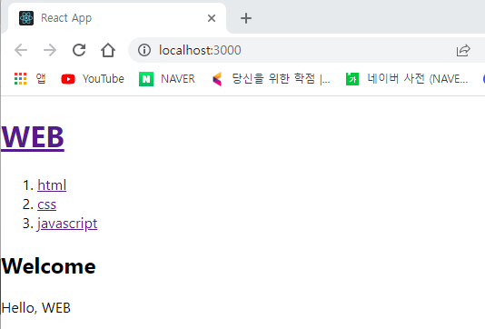
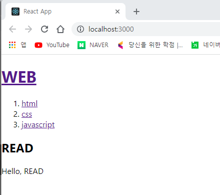

# 1. 컴포넌트 만들기

- react에서 사용자정의 태그를 만들 때는 function으로 만들면 되고,
- 반드시 대문자로 시작해야 함 (ex. function Header(){})

- ```js
  function Header(){
    return <header>
    <h1><a href="/">React</a></h1>
  </header>
  }
  
  // 이후
  <Header></Header>
  //로 선언하면 컴포넌트 호출
  ```

  

# 2. prop

- prop은 react 의 속성임

- 예시 1) header에 title 추가하기

  - ```js
    <Header title="REACT"></Header>
    ```

  - function Header에 인자로 props 설정(인자 아무거나 넣으면 되지만 props를 일반적으로 사용

    - props에 title 객체가 생성됨

  - 그리고 {props.title}을 넣어줌

  - ```js
    function Header(props){
      return <header>
      <h1><a href="/">{props.title}</a></h1>
    </header>
    }
    ```

- 예시 2) 본문 리스트 파일 추가하기

  - App() 에 const topics으로 배열 추가

    - ```js
      const topics = [
          {id:1, title:'html', body:'html is ...'},
          {id:2, title:'css', body:'css is ...'},
          {id:3, title:'javascript', body:'javascript is ...'}
      ]
      ```

  - Nav 태그에 topics={topics}를 추가하여 배열을 받음

    - ```js
      <Nav topics={topics}></Nav>
      ```

  - function Nav에 인자값으로 props를 추가하고,

  - const lis = [] 를 추가

  - for 문으로 lis 에 넣을 값을 추가 (title을 표시한다고 가정)

    - ```html
      function Nav(props){
        const lis = []
        for(let i=0;i<props.topics.length;i++){
          let t = props.topics[i];
          lis.push(<li key={t.id}><a href={'/read/'+t.id}>{t.title}</a></li>)
        }
        return <nav>
        <ol>
          {lis}
        </ol>
      </nav>
      }
      ```

      - li는 고유 key값을 가지고 있어야 함(react가 추적하기 위해)
      - return 값에 {lis}가 있으면 모든 배열값을 표시함


# 3. 이벤트

- 예시 1) header를 눌렀을 때 reload가 되지 않게 만들기

  - ```html
    function Header(props){
      return <header>
      <h1><a href="/" onClick={function(event){
        event.preventDefault();
      }}>{props.title}</a></h1>
    </header>
    }
    ```

    - a 태그에 onClick={}로 함수 넣기
      - .preventDefault()는 기본값을 막아주는 메소드
    - js는 html과 문법이 조금 다름

- 예시 2) header 를 눌렀을 때 header 태그에서 지정한 함수 호출

  - header 태그에서 함수 설정

    - ```html
      <Header title="WEB" onChangeMode={()=></Header>{
              alert('Header');
            }}></Header>
      ```

    - arrow function으로 변경(function() 을 ()=> 로 변경)

  - function Header에 onClick으로 props.onChangeMode 추가

    - ```html
      function Header(props){
        return <header>
        <h1><a href="/" onClick={function(event){
          props.onChangeMode();
        }}>{props.title}</a></h1>
      </header>
      }
      ```

- 예시 3) li 태그를 눌렀을 때 id(1, 2, 3) 팝업

  -  Nav 태그에 onChangeMode 속성 추가

    - ```html
      <Nav topics={topics} onChangeMode={(id)=>{
              alert(id)
            }}></Nav>
      ```

  - function Nav 안의 a 태그에 onClick 속성 추가

    - props.onChangeMode에서 인자를 event.target.id 넣기 
    - event.target은 event가 발생한 위치를 반환함

  - id값을 얻기 위해 a 태그에 id={t.id}를 추가하여 id값 넣기

  - ```html
    function Nav(props){
      const lis = []
      for(let i=0;i<props.topics.length;i++){
        let t = props.topics[i];
        lis.push(<li key={t.id}>
          <a id={t.id} href={'/read/'+t.id} onClick={event=>{
            event.preventDefault();
            props.onChangeMode(event.target.id);
          }}>{t.title}</a></li>)
      }
    
      return <nav>
      <ol>
        {lis}
      </ol>
    </nav>
    }
    ```

    

# 4. state

- component 함수를 다시 실행시키는 방법

- 예제 1) Title을 클릭하면 article태그에 'WELCOME'이라고 출력하고, nav태그를 클릭하면 READ라고 출력

  - WEB(title) 클릭
  - 

  - nav(html, css, js) 클릭
  - 

  - `import {useState} from 'react'` 를 통해 react에서 useState import

  - `const [mode, setMode] = useState('WELCOME');` 으로 초기값 mode와 mode 값을 변경하는 setMode 함수를 정의

    - useState('WELCOME')[0] 은 초기값으로 WELCOME
    - useState('WELCOME')[1] 은 함수로, mode값을 변경하는 함수(최초에는 WELCOME)

  - 본문에 들어갈 내용을 `let content = null`으로 정의

  - 조건문을 통해 mode === 'WELCOME'일 때의 article태그와 mode === 'READ'일 떄의 article 태그 정의

    - ```js
      if(mode === 'WELCOME'){
          content = <Article title="Welcome" body="Hello, WEB"></Article>
        }else if(mode === 'READ'){
          content = <Article title="READ" body="Hello, READ"></Article>
        }
      ```

  - return 값에 article 태그를 지우고 {content} 값을 넣어주면 됨

  - 최종적은 function App()은,

  - ```js
    function App() {
      const [mode, setMode] = useState('WELCOME');
      const [id, setId] = useState(null);
    
      const topics = [
        {id:1, title:'html', body:'html is ...'},
        {id:2, title:'css', body:'css is ...'},
        {id:3, title:'javascript', body:'javascript is ...'}
      ]
      let content = null;
      if(mode === 'WELCOME'){
        content = <Article title="Welcome" body="Hello, WEB"></Article>
      }else if(mode === 'READ'){
        content = <Article title="READ" body="Hello, READ"></Article>
    
      }
    
      return (
        <div>
          <Header title="WEB" onChangeMode={()=>{
            setMode('WELCOME');
          }}></Header>
          <Nav topics={topics} onChangeMode={(_id)=>{
            setMode('READ');
            setId(_id)
          }}></Nav>
          {content}
        </div>
      );
    }
    ```

- 예제 2) READ모드에서 content에 들어가는 title과 body를 변경

  - `const [id, setId] = useState(null);`으로 nav 태그를 구분하기 위해 id값 설정

  - Nav 태그의 onChangeMode에 인자를 _id, 내부에 setId(\_id) 설정

    - ```js
      <Nav topics={topics} onChangeMode={(_id)=>{
          setMode('READ');
          setId(_id);
      }}></Nav>
      ```

    - 이를 통해 누를 때마다 위에서 설정한 id값이 클릭한 nav의 id값으로 변경됨

  - else if 구문에서 title과 body 변수 설정

    - `let title, body = null;`

  - for 문을 통해 topic의 id값과 useState의 id 값이 같으면 title과 body를 반환

    - ```js
      for(let i = 0; i < topics.length; i++){
      	if(topics[i].id === id){
              title = topics[i].title;
              body = topics[i].body;
      	}
      }
      ```

  - content 값 변경

    - `  content = <Article title={title} body={body}></Article>`

  - Nav 컴포넌트에서 event.target.id 값을 string으로 받고 있으므로 number 메소드를 통해 숫자로 변경

    - `   props.onChangeMode(Number(event.target.id));`

  - 최종적으로,

  - ```js
    function App() {
      const [mode, setMode] = useState('WELCOME');
      const [id, setId] = useState(null);
    
      const topics = [
        {id:1, title:'html', body:'html is ...'},
        {id:2, title:'css', body:'css is ...'},
        {id:3, title:'javascript', body:'javascript is ...'}
      ]
      let content = null;
      if(mode === 'WELCOME'){
        content = <Article title="Welcome" body="Hello, WEB"></Article>
      }else if(mode === 'READ'){
        let title, body = null;
        for(let i = 0; i < topics.length; i++){
          if(topics[i].id === id){
            title = topics[i].title;
            body = topics[i].body;
          }
        }
        content = <Article title={title} body={body}></Article>
      }
    
      return (
        <div>
          <Header title="WEB" onChangeMode={()=>{
            setMode('WELCOME');
          }}></Header>
          <Nav topics={topics} onChangeMode={(_id)=>{
            setMode('READ');
            setId(_id);
          }}></Nav>
          {content}
        </div>
      );
    }
    ```

    

# 5. create 기능

- create 기능을 이용하여 nav 태그에 topics 추가하는 기능!

- function App()에 state기능을 이용하여 topics를 정의

  - ```js
    const [topics, setTopics] = useState([
        {id:1, title:'html', body:'html is ...'},
        {id:2, title:'css', body:'css is ...'},
        {id:3, title:'javascript', body:'javascript is ...'}
      ]);
    ```

    

-  App()의 return 값에a태그를 추가하여 Create를 넣고 mode를 'CREATE'로 변경

  - ```html
    <a href="/create" onClick={event=>{
            event.preventDefault();
            setMode('CREATE')
          }}>Create</a>
    ```

- 컴포넌트에 Create 추가

  - input(title) 태그와 textarea(body) 태그, submit타입의 input 추가

  - form 태그에서 submit을 눌렀을 때(onSubmit={}) title과 body를 설정

    - const title = event.target.title.value;와 const body = event.target.body.value;
    - input과 textarea의 name 속성이 title, body이기 때문(form>input(title)+textarea(body))

  - props.onCreate로 Create 태그에 있는 onCreate함수 실행

  - ```js
    unction Create(props){
      return <article>
        <h2>Create</h2>
        <form onSubmit={event=>{
          event.preventDefault();
          const title = event.target.title.value;
          const body = event.target.body.value;
          props.onCreate(title, body);
        }}>
          <p><input type="text" name="title" placeholder="title"/></p>
          <p><textarea name="body" placeholder="body"></textarea></p>
          <p><input type="submit" value="Create"/></p>
        </form>
      </article>
    }
    ```

- function App()에서 'CREATE'모드일 때 Create 태그 추가

- Oncreate={(\_title,_\_body)=>{}} 함수 추가

  - id는 topics의 개수 + 1 : `   let newId = topics.length + 1;`

  - newTopic으로 새로운 nav값 정의 : `const newTopic = {id:newId, title:_title, body:_body};`

  - **배열은 참조 데이터 타입이기 때문에 topics의 복사본(newTopics)을 만들어서 newTopic을 넣은 후, setmode를 통해 전달해야 함**

    - 복사본을 만들고 전달하는 방법은,

    - ```js
      const newTopics = [...topics];
      newTopics.push(newTopic);
      setTopics(newTopics);
      ```

  - create가 완료되면 'REAd'모드로 변경하고 setId를 통해 id값도 newId로 변경 

- ```js
  else if(mode === 'CREATE'){
      content = <Create onCreate={(_title, _body)=>{
        let newId = topics.length + 1;
        const newTopic = {id:newId, title:_title, body:_body};
        const newTopics = [...topics];
        newTopics.push(newTopic);
        setTopics(newTopics);
        setMode('READ');
        setId(newId);
      }}></Create>
    }
  ```

  

# 6. update

- update 기능으로 nav 내용을 업데이트

- read 모드일 때만 update 기능이 필요하므로 contextControl을 정의해서 create 밑에 넣어두고 리스트로 관리

  - ```js
    // else if mode === read 에 넣기
    contextControl = <li><a href={"/update"+id} onClick={event=>{
          event.preventDefault();
          setMode('UPDATE');
    }}>Update</a></li>;
    ```

    - 주소값에 id를 넣어서 관리
    - 눌렀을 때 update 모드로 들어가도록 onClick 정의

  - ```js
    <ul>
    	<li><a href="/create" onClick={event=>{
            event.preventDefault();
            setMode('CREATE')
            }}>Create</a></li>
    	{contextControl}
    </ul>
    ```

  - Update 컴포넌트 정의

    - ```js
      function Update(props){
          // useState를 통해서 외부값을 내부값으로 변경해야 함(그렇지 않으면 변경이 불가능)
        const [title, setTitle] = useState(props.title);
        const [body, setBody] = useState(props.body);
      
        return <article>
          <h2>Update</h2>
          // submit 버튼을 눌렀을 때 onUpdate 정의
          <form onSubmit={event=>{
            event.preventDefault();
            const title = event.target.title.value;
            const body = event.target.body.value;
            props.onUpdate(title, body);
          }}>
              //value값은 title로 넣어서 update버튼을 클릭하면 바로 볼 수 있게
              //js에서 onChange는 html과 다르게 누르면 바로 실행됨
            <p><input type="text" name="title" placeholder="title" value={title} onChange={event=>{
              //setTitle을 통해서 title input의 value값을 바로 업데이트해줘야만 input태그에 나타남
              setTitle(event.target.value);
            }}/></p>
                // body textaread도 title input과 같음
            <p><textarea name="body" placeholder="body" value={body} onChange={event=>{
              setBody(event.target.value);
            }}></textarea></p>
            <p><input type="submit" value="Update"/></p>
          </form>
      </article>
      ```

  - mode === update 시 정의

    - ```js
      else if(mode === 'UPDATE'){
      	// read와 같이, 현재 id값의 title과 body를 받음(Update 컴포넌트에서 사용해야 함)
          let title, body = null;
          for(let i = 0; i < topics.length; i++){
            if(topics[i].id === id){
              title = topics[i].title;
              body = topics[i].body;
            }
          }
          content = <Update title={title} body={body} onUpdate={(_title,_body)=>{
              // create와 비슷
            const UpdatedTopic = {id:id, title:_title, body:_body};
            const newTopics = [...topics]
            // update를 해야 하므로 현재 newTopics에 있는 값을 UpdatedTopic으로 변경
            for(let i = 0; i < newTopics.length;i++){
              if(newTopics[i].id === id){
                newTopics[i] = UpdatedTopic;
                  // 변경하면 break
                break
              }
            }
            setTopics(newTopics);
            setMode('READ')
          }}></Update>
        }
      ```


# 7. delete 기능

- 현재 id 값과 topics안의 id값을 비교해서, 같지 않은 값만 다시 추가한다는 개념

- contextControl에 li 태그로 delete를 추가

- ```js
  // 두 li를 묶기 위해 의미없는 태그인 <></> 설정
  contextControl = <>
  		// update 태그 생략
      	// delete는 사이트맵으로 연결될 필요가 없으므로 button type으로 설정
        <li><input type="button" value="Delete" onClick={()=>{
            // newTopics라는 배열을 정의하고,
          const newTopics = [];
            // topics의 길이(i)만큼 현재 id값과 비교
          for(let i = 0; i < topics.length; i++){
              // id 값 재설정을 위해, 현재 id값보다 작으면 그대로, 크면 id값을 1칸 내려서 newTopics로 push
            if(topics[i].id < id){
              newTopics.push(topics[i]);
            }else if(topics[i].id > id){
              topics[i].id -= 1;
              newTopics.push(topics[i]);
            }
          }
            // 마무리
          setTopics(newTopics);
          setMode('WELCOME');
      }}/></li>
        </>
  ```

  
