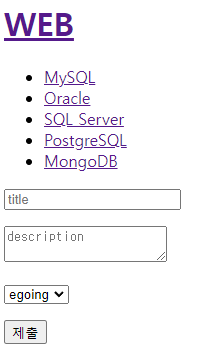

# 1. mySQL과 nodejs 연결

- `npm install mysql`을 통해 모듈 다운로드

- ```js
  //mysql로 import
  var mysql      = require('mysql');
  
  //sql데이터베이스와 연결(host는 localhost가 아니라 127.0.0.1을 사용해야 err가 안남)
  var connection = mysql.createConnection({
    host     : '127.0.0.1',
    user     : 'root',
    password : '963741dsa',
    database : 'opentutorials',
  });
  
   // sql 커넥션
  connection.connect();
   
  // query문을 작성하고 콜백함수로 호출
  connection.query('select * from topic', function (error, results, fields) {
    if (error) {
        console.log(error);
    };
    console.log(results);
  });
   
  connection.end();
  ```

- listen 포트는 3006 사용

# 2. mySQL로 홈페이지 구현

- 시작 페이지

  - 쿼리문을 통해 시작페이지 구현

  - ```js
     if(pathname === '/'){
          if(queryData.id === undefined){
            db.query(`SELECT * FROM topic`, (error, topics)=>{
              var title = 'Welcome';
              var description = 'Hello, Node.js';
                // template의 list에는 id와 title을 topics[i].id와 topics[i].title로 변경해야 함
              var list = template.list(topics);
              var html = template.HTML(title, list, 
                  `<h2>${title}</h2>${description}`,
                  `<a href="/create">create</a>`
                );
              response.writeHead(200);
              response.end(html);
            })
          }
    ```

  - 쿼리문을 통해 상세페이지 구현

  - ```js
    else {
            db.query(`SELECT * FROM topic`, (error, topics)=>{
              if(error){
                throw error;
              }
              db.query(`SELECT * FROM topic WHERE id=?`.[queryData.id], (error2, topic)=>{
                if(error2){
                  throw error2;
                }
                var title = topic[0].title;
                var description = topics[0].description;
                var list = template.list(topics);
                var html = template.HTML(title, list,
                  `<h2>${title}</h2>${description}`,
                  `<a href="/create">create</a>
                  <a href="/update?id=${queryData.id}">update</a>
                  <form action="delete_process" method="post">
                    <input type="hidden" name="id" value="${queryData.id}">
                    <input type="submit" value="delete">
                  </form>`
                );
                response.writeHead(200);
                response.end(html);
              })
            })
          }
    ```

    - query문을 이중으로 작성하여 사용한다.
    - 첫번째 쿼리문은 list에 넣을 topics를 구하기 위해서 필요하다
    - if 를 통한 error문은 생략가능
    - 두번째 쿼리문은 `SELECT * FROM topic WHERE id=?,[queryData.id]`로 작성하여서 '?'다음에 그 다음 인자를 배열로 주어 보안성 강화


# 3. 생성기능 구현(create)

- /create는 위와 비슷

- /create_process

  - ```js
    else if(pathname === '/create_process'){
          var body = '';
          request.on('data', function(data){
              body = body + data;
          });
          request.on('end', function(){
              var post = qs.parse(body);
              var title = post.title;
              var description = post.description;
              //readFile 대신 쿼리문 사용
              db.query(`INSERT INTO topic (title, description, created, author_id) VALUES (?, ?, NOW(), ?)`,
              [title, description, 1],(error, result)=>{
                if(error){
                  throw error;
                }
                  //데이터를 입력한 뒤(insert구문) insertId 메소드를 통해 id 확인가능
                response.writeHead(302, {Location: `/?id=${result.insertId}`});
                response.end();
              })
          });
        }
    ```

    - result.insertId를 통해 id값을 확인하여 반환


# 4. 수정 및 삭제 기능 구현 (Update)

- /update는 비슷

- /update_process

  - ```js
    else if(pathname === '/update_process'){
          var body = '';
          request.on('data', function(data){
              body = body + data;
          });
          request.on('end', function(){
              var post = qs.parse(body);
              var id = post.id;
              var title = post.title;
              var description = post.description;
              //update 쿼리문을 통해 수정
              db.query(`UPDATE topic SET title=?, description=? WHERE id=?`,[title, description, id],()=>{
                response.writeHead(302, {Location: `/?id=${id}`});
                response.end();
              })
          });
        } 
    ```

    - update 이후 반환하는 페이지는 id=${id}를 사용 (insertId x)

- delete_process

  - ```js
    else if(pathname === '/delete_process'){
          var body = '';
          request.on('data', function(data){
              body = body + data;
          });
          request.on('end', function(){
            var post = qs.parse(body);
            var id = post.id;
            db.query(`DELETE FROM topic WHERE id=?`,[id],()=>{
              response.writeHead(302, {Location: `/`});
              response.end();
            })
          });
    }
    ```

    

# 5. 생성 기능에 저자 추가

- 이중 쿼리문을 통해 authors 값을 콜백함수로 호출

  - ```js
    db.query(`SELECT * FROM topic`,(error, topics)=>{
            db.query(`SELECT * FROM author`, (error2, authors)=>{
            ...
            })
          });
    ```

- template.js에 authorSelect 메소드 추가

  - ```js
    authorSelect:function(authors){
        var tag = '';
        for(var i = 0;i<authors.length;i++){
            //main.js에 select태그와 함께 활용
          tag += `<option value="${authors[i].id}">${authors[i].name}</option>`
        }
        return tag;
      }
    ```

- main.js에서 tag변수를 선언하고 template.HTML의 body 매개변수에 tag를 추가

  - ```js
    var tag = template.authorSelect(authors);
    ...
    var html = template.HTML(`...
    	<p>
        <select name="author">
        ${tag}
        </select>
        </p>
        <p>
        ...`)
    ```

- 아래와 같은 기능 구현 가능

  - 


# 6. 수정 기능에 저자 추가

- /upate 에서 create와 마찬가지로 `SELECT * FROM author` 쿼리문 추가

- template.js에서 authorSelect 메소드에 topic[0].author_id 파라미터 추가

  - topic[0].author_id === authors[i].id 일 때 selected되도록 변경

  - ```js
    authorSelect:function(authors, author_id){
        var tag = '';
        for(var i = 0;i<authors.length;i++){
          if(author_id === authors[i].id){
            tag += `<option value="${authors[i].id}" selected>${authors[i].name}</option>`
          }else{
            tag += `<option value="${authors[i].id}">${authors[i].name}</option>`
          }
        }
        return tag;
      }
    ```

- tag 변수 변경

  - ```js
    var tag = template.authorSelect(authors, topic[0].author_id);
    ```

- update_process에서 쿼리문 `UPDATE topic SET title=?, description=?, author_id=? WHERE id=?, [title, description, author, id]`을 통해 author도 업데이트