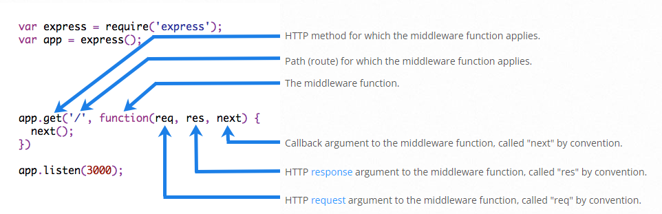
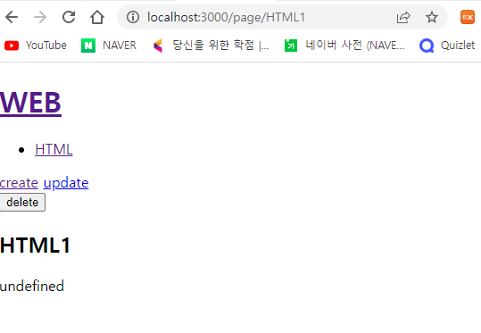
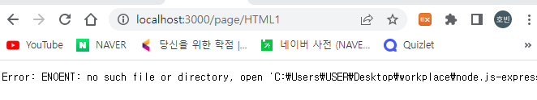

# 1. Hello world

- ```js
  const express = require('express')
  const app = express()
  const port = 3000
  
  //라우팅, 중첩 if문을 사용하지 않아도 됨
  //'/'->'/page'로 바꾸면 url도 똑같이 바뀜
  app.get('/', (req, res) => {
    res.send('Hello world!')
  })
  
  //app.listen(port)로 축약가능
  app.listen(port, () => {
    console.log(`Example app listening on port ${port}`)
  })
  ```

  

# 2. CRUD

- 상세페이지에서 `     var filteredId = path.parse(queryData.id).base;` 를 `  var filteredId = path.parse(req.params.pageId).base;`로 변경해줘야 함 (req.params.pageId는 HTML)

  - ```js
    app.get('/page/:pageId', (req, res)=>{
      fs.readdir('./data', function(error, filelist){
          //filteredId 변경
        var filteredId = path.parse(req.params.pageId).base;
        fs.readFile(`data/${filteredId}`, 'utf8', function(err, description){
          //title도 변경
          var title = req.params.pageId;
          var sanitizedTitle = sanitizeHtml(title);
          var sanitizedDescription = sanitizeHtml(description, {
            allowedTags:['h1']
          });
          var list = template.list(filelist);
          var html = template.HTML(sanitizedTitle, list,
            `<h2>${sanitizedTitle}</h2>${sanitizedDescription}`,
            ` <a href="/create">create</a>
              <a href="/update/{sanitizedTitle}">update</a>
              <form action="/delete_process" method="post">
                <input type="hidden" name="id" value="${sanitizedTitle}">
                <input type="submit" value="delete">
              </form>`
          );
          res.send(html);
        });
      });
    })
    ```

    - url을 `/page/:pageId`로 설정하여서 req.params.pageId를 통해 pageId값을 리턴받을 수 있음
    - 삭제 form에서 `delete_process`를 그대로 적으면 url이 /page/delete_process가 되기 때문에 앞에 `/`을 붙여주어서 최초페이지의 `/delete_process`가 되게 함
    - update의 href도 list에 맞게 변경(아래의 create와 update 기능에서도 같음)

- template.js에서 /?=${filelist[i]}를 /page/${filelist[i]}로 변경(검색엔진최적화, 데이터 디렉토리의 시각화 등의 이유)

  

### create

- /create 는 그대로 사용하면 됨(nodejs 참조)

- /create_process는 post방식이므로 app.post()로 사용해야 함

  - ```js
    app.post('/create_process', (req, res) => {
      var body = '';
      	req.on('data', function(data){
              body = body + data;
          });
      	req.on('end', function(){
          var post = qs.parse(body);
          var title = post.title;
          var description = post.description;
          fs.writeFile(`data/${title}`, description, 'utf8', function(err){
              res.redirect(`/page/${title}`);
              })
          });
    })
    ```

    - res.redirect 메소드를 통해 redirect


### update

- update는 update하는 대상의 pageId를 알아야 하므로 get방식에서 url을 `/update/:pageId`로 설정

  - ```js
    app.get('/update/:pageId', (req, res) => {
      fs.readdir('./data', function(error, filelist){
        var filteredId = path.parse(req.params.pageId).base;
        fs.readFile(`data/${filteredId}`, 'utf8', function(err, description){
          var title = req.params.pageId;
          var list = template.list(filelist);
          var html = template.HTML(title, list,
            `
            <form action="/update_process" method="post">
              <input type="hidden" name="id" value="${title}">
              <p><input type="text" name="title" placeholder="title" value="${title}"></p>
              <p>
                <textarea name="description" placeholder="description">${description}</textarea>
              </p>
              <p>
                <input type="submit">
              </p>
            </form>
            `,
            `<a href="/create">create</a> <a href="/update/${title}">update</a>`
          );
          res.send(html);
        });
      });
        
    app.post('/update_process', (req, res)=>{
      var body = '';
        req.on('data', function(data){
            body = body + data;
        });
        req.on('end', function(){
            var post = qs.parse(body);
            var id = post.id;
            var title = post.title;
            var description = post.description;
            fs.rename(`data/${id}`, `data/${title}`, function(error){
              fs.writeFile(`data/${title}`, description, 'utf8', function(err){
                  //create와 마찬가지
                res.redirect(`/page/${title}`);
              })
            });
          });
    })
    ```

    - create 기능과 마찬가지로 redirect 메소드를 통해 경로 지정 실시


### delete

- redirect 메소드 외 변경사항 없음

- ```js
  app.post('/delete_process', (req, res)=>{
    var body = '';
      req.on('data', function(data){
          body = body + data;
      });
      req.on('end', function(){
          var post = qs.parse(body);
          var id = post.id;
          var filteredId = path.parse(id).base;
          fs.unlink(`data/${filteredId}`, function(error){
            res.redirect('/');
          })
      });
  ```

  

# 3. 미들웨어의 사용 - body parser

- 사용자가 전송한 post데이터를 내부적으로 분석해서 모든 데이터를 가져온 다음에 해당되는 경로의 callback을 호출

- 코드를 간결하게 할 수 있음

  - ```js
    //bodyparser사용 이전
    var body = '';
          request.on('data', function(data){
              body = body + data;
          });
          request.on('end', function(){
              var post = qs.parse(body);
              ...
    ```

    

  - ```js
    var bodyParser = require('body-parser')
    app.use(bodyParser.urlencoded({ extended: false }))
    ...
    app.post('/create_process', (req, res) => {
        //위 사용 전 부분이 모두 req.body로 변경
      var post = req.body;
      var title = post.title;
      var description = post.description;
      fs.writeFile(`data/${title}`, description, 'utf8', function(err){
        res.redirect(`/page/${title}`);
      });
    ```

- create_process, delete_process도 동일하게 사용


# 4. 미들웨어의 사용 - compression

- 웹서버가 동작할 때 압축하여 데이터를 절약하는 미들웨어

- ```js
  var compression = require('compression')
  app.use(compression());
  
  ```

  - 위 코드로 자동으로 사용됨


# 5. 미들웨어 만들기/실행순서

- 공통적으로 사용되는 기능을 미들웨어로 만들면 편함

### 미들웨어 만들기

- 

- `fs.readdir('./data', function(err, filelist){})`를 미들웨어로 사용

  - ```js
    //get 메소드의 모든 url에서 사용
    app.get('*',(req, res, next)=>{
      fs.readdir('./data', function(err, filelist){
        //req.list에 filelist 저장
        req.list = filelist;
        next();
      })
    })
    ```

  - app.get 내 모든 filelist를 req.list로 변경하고, fs.readdir을 삭제

### 미들웨어 실행순서

- app.use()는 모두 미들웨어로 볼 수 있음

  - app.get(), app.post() 포함

- 미들웨어는 순서대로 실행되며, next()를 통해 다음 미들웨어 실행

  - ```js
    app.get('*',(req, res, next)=>{
      fs.readdir('./data', function(err, filelist){
        req.list = filelist;
        next();
      })
    })
    
    ...
    
    app.get('/create', (req, res) => {
      var title = 'WEB - create';
      var list = template.list(req.list);
      var html = template.HTML(title, list, `
        <form action="/create_process" method="post">
          <p><input type="text" name="title" placeholder="title"></p>
          <p>
            <textarea name="description" placeholder="description"></textarea>
          </p>
          <p>
            <input type="submit">
          </p>
        </form>
      `, '');
      res.send(html);
    })
    
    ...
    ```

    - 여기서 제일 위 app.get 실행 후 app.get('/create', ...) 실행(next())
    - next()가 없으면 모든 get방식의 url에서 ('*') readdir만 실행되고 끝남

- 2개의 미들웨어가 중복되어 있다면 2개의 미들웨어 먼저 실행 후 다음 미들웨어 실행

  - ```js
    app.get('/user/:id', (req, res, next) => {
        // 첫번째 실행
      console.log('ID:', req.params.id)
      next()
    }, (req, res, next) => {
        // 두번째 실행
      res.send('User Info')
    })
    
    app.get('/user/:id', (req, res, next) => {
        // 세번째 실행
      res.send(req.params.id)
    })
    ```

- if문을 통해 어느 미들웨어를 실행할지 결정할 수 있음

  - ```javascript
    app.get('/user/:id', (req, res, next) => {
      // id값이 0이면 다음 라우트 실행
      if (req.params.id === '0') next('route')
      // 그렇지 않으면 다음 미들웨어 실행
      else next()
    }, (req, res, next) => {
      // send a regular response
      res.send('regular')
    })
    
    // 조건을 통해 2번째 혹은 3번째로 실행되는 미들웨어
    app.get('/user/:id', (req, res, next) => {
      res.send('special')
    })
    ```

  - 라우트는 app.get()으로 감싸진 전체를 말하는 듯
  - 미들웨어는 라우트 안에 여러 개가 있을 수 있음


# 6. 정적인 파일 서비스(static)

- 제일 위에 `app.use(express.static('public'))` 추가 (public 폴더 내의 정적인 파일 사용)

- 홈페이지에 img파일 넣기

  - public > images에 'hello.jpg' 추가

  - ```js
    app.get('/', (req, res) => {
      var title = 'Welcome';
      var description = 'Hello, Node.js';
      var list = template.list(req.list);
      var html = template.HTML(title, list,
        `<h2>${title}</h2>${description}
        `,
        `<a href="/create">create</a>`
      );
      res.send(html);
    })
    ```

    - body 파라미터에 인자를 추가하여 img 태그 추가

# 7. 에러 처리

- 404 에러 처리

  - 마지막 미들웨어로 넣기

  - ```js
    app.use(function(req, res, next) {
      res.status(404).send('Sorry can\'t find that!');
    });
    ```

- 500 에러 처리(data를 호출할 때 잘못된 data 이름(html1)

  - 

    - html1 파일이 없지만 호출됨

  - 미들웨어에 next 파라미터를 넣고 readFile메소드에서 err처리

  - ```js
    app.get('/page/:pageId', (req, res, next)=>{
      var filteredId = path.parse(req.params.pageId).base;
      fs.readFile(`data/${filteredId}`, 'utf8', function(err, description){
        if(err){
          next(err);
        }else{
            ...
        }
      });
    })	
    ```

    - err가 있으면 err 호출
    - 

  - err 핸들러 작성

    - 404에러 처리 뒤에 붙여줘야 함

    - ```js
      app.use((err, req, res, next) => {
        console.error(err.stack)
        res.status(500).send('Something broke!')
      })
      ```

      - next(err)를 통해 모든 에러처리가 이곳으로 옴(순서 상 404제외)


# 8. 라우터

### 주소체계 변경

- 라우터를 하나로 묶기 위해 주소체계를 통일해야 함
  - 홈페이지 제외 /topic~ 으로 변경
  - 이 때 create, create_process 등 특정 주소는 '/page/:pageId'보다 앞에 와야 함

### 파일로 분리

- '/topic' 주소체계를 topic.js로 분리

- ```js
  //express, router는 필수
  const express = require('express')
  const router = express.Router()
  
  //... 기타 필요한 모듈...
  
  router.get('/create', (req, res)=>{
  ...
  }
  //...기타 모든 '/topic' 주소체계 라우터...
  
  //모듈 export
  module.exports = router;
  ```

  - 주소체계는 /topic/... 이지만, main.js에서 '/topic'으로 사용하기 때문에 topic.js에서는 중복을 제외해야 함

- main.js

  - ```js
    //모듈 import
    var topicRouter = require('./routes/topic.js');
    ....
    //라우터
    app.use('/topic', topicRouter);
    ```

- 같은 방식으로 index.js(홈페이지) 생성가능


# -----여기서부터 개인공부-----

# 9. session 사용

- 로그인 정보를 저장하기 위해 session 사용

- mysql 과 express session을 함께 사용

  - ```js
    var session = require('express-session');                      
    var MySQLStore = require('express-mysql-session')(session);
    var db = mysql.createConnection({
      host     : '127.0.0.1',
      user     : 'root',
      password : '963741dsa',
      database : 'milibest'
    });
    var sessionStore = new MySQLStore({}, db);
    
    app.use(session({    
      key: 'session_cookie_name',
      secret: 'session_cookie_secret',
      resave:false,
      saveUninitialized:false,
      store: sessionStore                                          
    }))
    ```

    - express-session과 express-mysql-session 모듈 사용

- 해당 라우터에서 req.session에 메소드 저장(로그인)

  - ```js
    app.post('/login_process', (req, res)=>{
      var post = req.body;
      db.query(`select * from users where id=? and password=?`,[post.id, post.password], (err, result)=>{
        if(err) throw err;
        if(result[0]!==undefined){
            //세션 메소드 생성
          req.session.uid = result[0].id;                           
          req.session.isLogined = true;
            //세션 정보 저장 필요
          req.session.save(function(){
            res.redirect('/');
        });
        }
      })
    })
    ```

- req.session 이 해당 포트에 저장됨

- 세션 삭제(로그아웃)

  - ```js
    app.post('/logout_process', (req, res)=>{
      delete req.session.uid;
      delete req.session.isLogined;
        //로그아웃도 세션 정보 저장 필요
      req.session.save(function(){
          res.redirect('/');
      })
    })
    ```

    

# 10. ajax와 json을 활용한 비동기 방식(아이디 중복 체크 구현)

- class="id" 태그에서 post방식으로 var id 값을 전송

  - ```js
    $(document).ready(()=>{
        $(".id").keyup(()=>{
          var id = $('input[name=id]').val();
          $.ajax({
              //해당 url로 전송
            url:"/signUp/signUp_idChk",
            type: "POST",
            dataType: "JSON",
            data: {"id":id}
          })
    ```

- 서버에서는 app.post로 데이터를 받아서 해당 아이디가 mysql에 있는지 확인하고 0, 1로 반환(idChk값)

  - ```js
    app.post('/signUp/signUp_idChk', (req, res)=>{
      db.query('select id from users', (err, result)=>{
        var id = req.body.id;
        var responseData = {};
        var idChk = 0;
        for(var i = 0; i < result.length; i++){
          if(id == result[i].id){
            idChk += 1;
          }
        }
        responseData.idChk = idChk;
        res.json(responseData);
      })
    })
    ```

- 반환받은 값은 .done((json)=>{})을 통해 받음

  - json.idChk 값이 서버에서 받은 값(0, 1)

  - ```js
    .done((json)=>{
            ...
            //json.idChk값을 이용해서 조건문으로 아이디 중복확인
            ...
            }
    ```

- script 전체(중복확인만 구현)

  - ```html
    //...
    <main>
        <form action="/signUp/signUp_process" method="post">
          <h2>회원가입</h2>
            <!-- input pattern 속성을 통해 valid, invalid 체크(css로 input:invalid로 invalid시 빨간 테두리 적용) -->
          id: <input type="text" class="id" name="id" pattern="[A-Za-z0-9+]{8,20}"/>소문자와 숫자만 사용하세요(8~20글자)</br>
        <!-- input 값에 따라 계속 바뀌는 태그 -->
          <div class="id_chk">아이디를 입력해주세요.</div>
        </form>
      </main>
    
      <script></script>src="https://cdn.jsdelivr.net/npm/jquery@3.5.1/dist/jquery.min.js"></script>  
    
      <script src="https://cdn.jsdelivr.net/npm/bootstrap@4.6.1/dist/js/bootstrap.bundle.min.js" integrity="sha384-fQybjgWLrvvRgtW6bFlB7jaZrFsaBXjsOMm/tB9LTS58ONXgqbR9W8oWht/amnpF" crossorigin="anonymous"></script>
    
      <script>
          //아이디 정규표현식에 만족하는 값을 찾기 위해 함수 적용
        function checkEngNum(str) {
          const regExp = /[a-z0-9]/g;
          if(regExp.test(str)){
            return true;
          }else{
            return false;
          }
        }
    
        $(document).ready(()=>{
            //.id 값이 바뀔 때(keyup사용, onclick도 가능)
        $(".id").keyup(()=>{
          var id = $('input[name=id]').val();
            //ajax를 통한 비동기방식(data로 id값을 전달)
          $.ajax({
            url:"/signUp/signUp_idChk",
            type: "POST",
            dataType: "JSON",
            data: {"id":id}
          })
            
    		//json값으로 실행되는 함수(.done)
          .done((json)=>{
            $(".id_chk").empty()
            var letters = id.split('')
            var regExp_chk = 0
            for(var i = 0;i<letters.length;i++){
              if(!checkEngNum(letters[i])){
                regExp_chk += 1
              }
            }
            if(regExp_chk>0){
              $(".id_chk").prepend("<div class=\"invalid\">소문자와 숫자만 사용해주세요</div>")
            }else{
              if(id.length < 8){
                $(".id_chk").prepend("<div class=\"invalid\">8자 이상 입력해주세요</div>")
              }else if(id.length > 20){
                $(".id_chk").prepend("<div class=\"invalid\">20자 이하로 입력해주세요</div>")
              }else{
                if(json.idChk === 1){
                $(".id_chk").prepend("<div class=\"invalid\">아이디가 중복됩니다.</div>")
                }else{
                $(".id_chk").prepend("<div style=\"color:blue;\">아이디를 사용할 수 있습니다.</div>")
                }
              }
            }
          })
    	//실패시 실행
        .fail((xhr, status, errThrown)=>{
          alert("Ajax failed")
          })
      })
       })
    
      </script>
    ```

    
