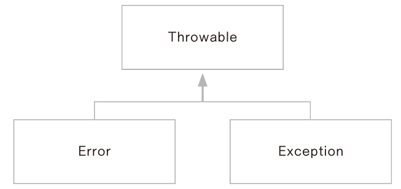
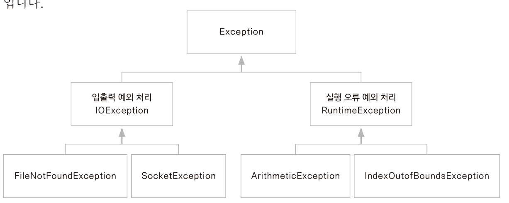

# 0. 오류와 예외

- 오류(Error) : 동적메모리가 없는 경우나 스택 메모리의 오버플로가 발생한 경우 등
  - 프로그램에서 제어할 수 없음
- 예외(Exception) : 파일을 읽을 때 파일이 없는 경우, 네트워크 연결이 안된 경우, 배열 값 출력 시 배열 요소가 없는 경우 등
  - 프로그램에서 제어 가능



### 예외 클래스의 종류




# 1. try-catch 문

- 형식

  - ```java
    try{
        /* 예외가 발생할 수 있는 코드 부분 */
    }catch(처리할 예외 타입 e){
        /* try 블록 안에서 예외가 발생했을 때 예외를 처리하는 부분 */
    }
    ```

    

- 예제

  - 요소가 5개인 정수형 배열 arr 에서 arr[5] 출력

  - ```java
    public static void main(String[] args) {
    		int[] arr = {1, 2, 3, 4, 5};
    		
    		try {
    			for(int i = 0; i <= 5; i++) {
    				System.out.println(arr[i]);
    			}
    		}catch(ArrayIndexOutOfBoundsException e) {
    			System.out.println(e);
    		}
    	}
    ```

    

- 컴파일러에 의해 예외가 체크되는 경우

  - FileInputStream 사용

  - ```java
    public static void main(String[] args) {
    
    		try {
    			FileInputStream fis = new FileInputStream("a.txt");
    		} catch (FileNotFoundException e) {
    			System.out.println(e);
    		}
    		System.out.println("end");
    	}
    }
    ```

    - output : java.io.FileNotFoundException: a.txt (지정된 파일을 찾을 수 없습니다)
                      end

    - 예외를 처리하면 예외 처리 후 프로그램이 계속 수행됨


# 2. finally

- finally 를 사용하여 예외처리 이후 항상 수행되는 부분을 만들 수 있음

- ```java
  try{
  	예외가 발생할 수 있는 부분
  }catch(처리할 예외 타입 e){
  	예외를 처리하는 부분
  }finally{
  	항상 수행되는 부분
  }
  ```

  - ```java
    public static void main(String[] args) {
    		FileInputStream fis = null;
    		
    		try {
    			fis = new FileInputStream("a.txt");
    		} catch(FileNotFoundException e) {
    			System.out.println(e);
    			return;
    		}finally {
    			if(fis != null) {
    				try {
    					fis.close();
    				}catch(IOException e) {
    					e.printStackTrace();
    				}
    			}
    			System.out.println("always implement");
    		}
    		System.out.println("implement too");
    	}
    ```

    

### try-with-resources 문

- close() 메서드를 명시적으로 호출하지 않아도 try 블록 내에서 열린 리소스를 자동으로 닫음

- try-with-resources 문법을 사용하려면 해당 리소스가 AutoCloseable 인터페이스를 구현해야 함

  - ```java
    package ch14;
    
    public class AutoCloseObj implements AutoCloseable {
    
    	@Override
    	public void close() throws Exception {
            //close() 메세드가 제대로 호출되는지 확인하기 위해 출력문만
    		System.out.println("resources close()");
    	}
    	
    }
    ```

- AutoClose Test 클래스를 만들어 테스트

  - ```java
    package ch14;
    
    public class AutoCloseTest {
    
    	public static void main(String[] args) {
    		try(AutoCloseObj obj = new AutoCloseObj()){
    		} catch (Exception e) {
    			System.out.println("Exception part");
    		}
    	}
    }
    
    ```

- 리스스 여러개 생성 시 문법 : 세미콜론(;)으로 구분

  - ```java
    try(A a = new A(); B b = new B()){
    	...
    }catch(Exception e){
    	...
    }
    ```

- try-with-resources 문 예외 발생 시

  - ```java
    package ch14;
    
    public class AutoCloseTest2 {
    	public static void main(String[] args) {
    		try(AutoCloseObj obj = new AutoCloseObj()){
                // 강제로 예외 발생
    			throw new Exception();
    		}catch(Exception e) {
    			System.out.println("exception part");
    		}
    	}
    }
    ```

    - close() 메서드를 명시적으로 호출하지 않아도 정상 종료된 경우와 예외가 발생한 경우 모두 리소스가 잘 해제됨

- try 문 안에서 외부에서 선언한 변수 사용 가능 (java9부터 사용 가능)

  - ```java
    public class AutoCloseTest2 {
    	public static void main(String[] args) {
            //외부에서 변수 선언 후 try 문 안에서 사용
            AutoCloseObj obj = new AutoCloseObj();
    		try(obj){
    			throw new Exception();
    		}catch(Exception e) {
    			System.out.println("exception part");
    		}
    	}
    ```

    

# 3. 예외 처리 미루기

### 예외 처리를 미루는 throws 사용

- 예외를 해당 메서드에서 처리하지 않고, 미룬 후 메서드를 호출하여 사용하는 부분에서 예외를 처리하는 방법

- ```java
  public class ThrowsException {
  	
      //throws 를 통해 두 예외를 메서드가 호출될 때 처리하도록 미룸
  	public Class loadClass(String fileName, String className) throws FileNotFoundException, ClassNotFoundException{
          //FileNotFoundException 발생 가능
  		FileInputStream fis = new FileInputStream(fileName);
          //ClassNotFoundException 발생 가능
  		Class c = Class.forName(className);
  		return c;
  	}
  	
  	public static void main(String[] args) {
  		ThrowsException test = new ThrowsException();
  		try {
              // 메서드 호출 시 예외 처리
  			test.loadClass("a.txt", "java.lang.String");
  		} catch (FileNotFoundException | ClassNotFoundException e) {
  			e.printStackTrace();
  		}
  	}
  }
  ```

  

### 다중 예외 처리

- 컴파일러에 의해 체크되지 않는 예외를 미리 알 수는 없지만 모든 예외 상황을 처리하고자 한다면 맨 마지막 부분에 Exception 클래스를 활용하여 catch블록을 추가

- ```java
  try{
  	...
  }catch(FileNotFoundException | ClassNotFoundException e){
      ...
  }catch(Exception e){
      // Exception 클래스로 그 외 예외 상황 처리
      e.printStackTrace();
  }
  ```

  - Exception 클래스는 모든 예외 클래스의 최상위 클래스로, 다른 catch 블록에 선언한 것 이외의 예외가 발생하더라도 Exception 클래스로 자동 형 변환됨

#### 다중 예외 처리 시 주의 사항

- 예외는 catch 문을 선언한 순서대로 검사하므로 catch(Exception e)문장은 맨 아래에 사용
  - 맨 위에 사용하면 error 발생


# 4. 사용자 정의 예외

- 사용자 정의 예외 클래스 구현 시 기존 JDK에서 제공하는 예외 클래스 중 가장 유사한 클래스 상속

- 잘 모르겠으면 가장 상위 클래스인 Exception 클래스 상속

- ex) 아이디가 null 값이거나 지정 범위를 벗어나는 경우의 예외 처리 클래스 생성

  - ```java
    public class IDFormatException extends Exception{
        
    	public IDFormatException(String message) {
    	// Exception 클래스에서 메시지 생성자, 멤버 변수와 메서드를 이미 제공하고 있으므로 super(message)를 사용하여 예외 메시지 설정
    		super(message);
    	}
    }
    ```

  - test class

  - ```java
    public class IDFormatTest {
    	private String userID;
    	
    	public String getUserID() {
    		return userID;
    	}
    	
        //userID 제약조건 구현
    	public void setUserID(String userID) throws IDFormatException{
    		if(userID == null) {
    			throw new IDFormatException("ID can not be null");
    		}
    		else if(userID.length() < 8 || userID.length() > 20) {
    			throw new IDFormatException("length should be between 8 to 20");
    		}
    		this.userID = userID;
    	}
    	
    	public static void main(String[] args) {
    		IDFormatTest test = new IDFormatTest();
    		
    		String userID = null;
    		try {
    			test.setUserID(userID);
    		} catch (IDFormatException e) {
                //getMessage 는 exception 메서드
    			System.out.println(e.getMessage());
    		}
    		
    		userID = "1234567";
    		try {
    			test.setUserID(userID);
    		} catch (IDFormatException e) {
    			System.out.println(e.getMessage());
    		}
    	}
    }
    ```

    