# 0. 스트림이란

- 입출력 장치와 무관하고 일관성 있게 프로그램을 구현할 수 있도록 일종의 가상 통로인 스트림 제공
- 입출력 스트림은 단방향으로 자료가 이동하기 때문에 동시 불가능
- 입력은 Input, Reader / 출력은 Output, Writer 등

  - 입력 스트림 : FileInputStream, FileReader, BufferedInputStream, BufferedReader 등
  - 출력 스트림 : FileOutputStream, FileWriter, BufferedOutputStream, BuffferedWriter 등
- 자바의 스트림은 바이트 단위로 입출력이 이루어짐

  - 그림, 동영상, 음악 파일 등 대부분의 파일
- 하지만 char형은 2바이트이므로 한글은 깨짐
  - 따라서 문자를 위한 문자스트림 별도 제공
- 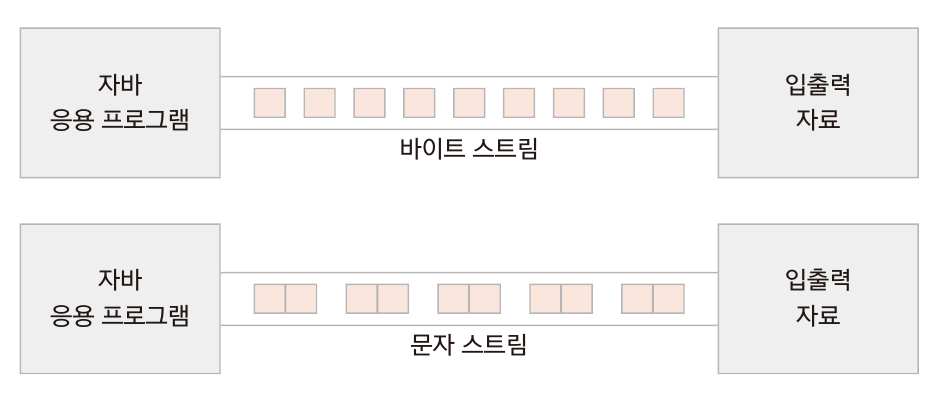
  
  - stream으로 끝나는 클래스는 바이트 단위 처리
  
  - reader나 writer로 끝나는 이름은 문자를 위한 스트림 클래스


### 기반 스트림과 보조 스트림

- 기반 스트림 : 읽어 들일 곳(소스)이나 써야할 곳(대상)에서 직접 읽고 쓸 수 있으며 입출력 대상에 직접 연결되어 생성
- 보조 스트림 : 직접 읽고 쓰는 기능은 없으며 항상 다른 스트림을 포함하여 생성됨
- 


# 1. 표준 입출력

### 표준 입출력을 위한 System 클래스

- System 클래스는 다음과 같이 세개의 변수를 가짐
  - 


#### System.in으로 화면에서 문자 입력받기

- 문자 하나 입력받기

  - ```java
    package ch15;
    
    import java.io.IOException;
    
    public class SystemInTest1 {
    
    	public static void main(String[] args) {
    		System.out.println("write an alphabet and press [Enter]");
    		
    		int i;
    		try {
                // 한 바이트만 읽음
    			i = System.in.read();
    			System.out.println(i);
                // 문자로 변환하여 출력
    			System.out.println((char)i);
    		}catch(IOException e) {
    			e.printStackTrace();
    		}
    	}
    }
    ```

    

- 문자 여러개 입력받기

  - ```java
    package ch15;
    
    import java.io.IOException;
    
    public class SystemInTest2 {
    
    	public static void main(String[] args) {
    System.out.println("write an alphabet and press [Enter]");
    		
    		int i;
    		try {
                // while 문에서 read()메서드로 한 바이트를 반복해 읽음
    			while((i = System.in.read()) != -1) {
    				System.out.println((char)i);
    			}
    		}catch(IOException e) {
    			e.printStackTrace();
    		}
    	}
    }
    ```

    - (i = System.in.read()) != -1 조건을 만족하는 경우는 [enter]에 해당하는 \n 값임


### 그 외 입력 클래스

#### Scanner 클래스

- 문자뿐 아니라 정수, 실수 등 다른 자료형도 읽을 수 있음
- 파일이나 문자열을 생성자의 매개변수로 받아 자료를 읽어 올 수 있음
- 대표 생성자
  - 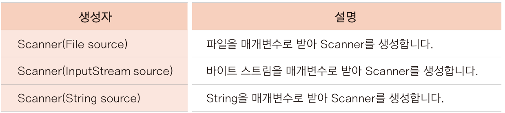

- Scanner 클래스에서 제공하는 메서드
  - 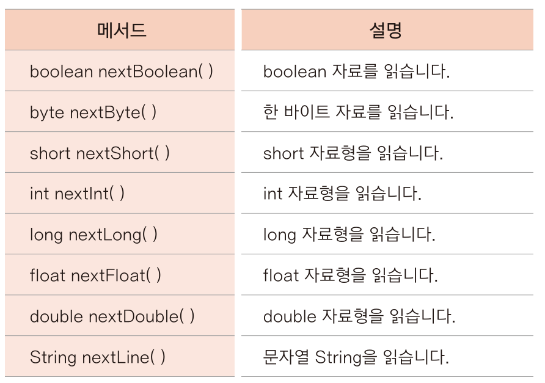

- Scanner 테스트

  - ```java
    package ch15;
    
    import java.util.Scanner;
    
    public class ScannerTest {
    
    	public static void main(String[] args) {
    		Scanner scanner = new Scanner(System.in);
    		
    		System.out.println("Name : ");
    		String name = scanner.nextLine();
    		System.out.println("Job : ");
    		String job = scanner.nextLine();
    		System.out.println("No. : ");
    		int num = scanner.nextInt();
    		
    		System.out.println(name);
    		System.out.println(job);
    		System.out.println(num);
    
    	}
    }
    ```

    - python의 input 과 비슷해보임


#### Console 클래스

- System.in을 사용하지 않고 간단히 콜솔내용을 읽을 수 있는 클래스
- 이클립스와는 연동되지 않음!
- 사용하는 메서드
  - 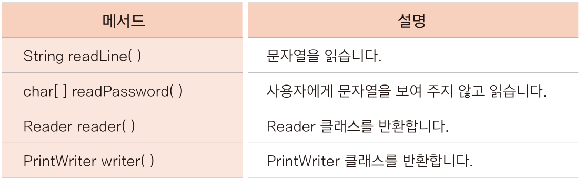

- Console 테스트

  - ```java
    package ch15;
    
    import java.io.Console;
    
    public class ConsoleTest {
    
    	public static void main(String[] args) {
    		Console console = System.console();
    		
    		System.out.println("Name : ");
    		String name = console.readLine();
    		System.out.println("Job : ");
    		String job = console.readLine();
    		System.out.println("Password : ");
            //readPassword() 메서드는 콘솔에 입력한 문자열을 보여주지 않음
    		char[] pass = console.readPassword();
    		String strPass = new String(pass);
    		
    		System.out.println(name);
    		System.out.println(job);
    		System.out.println(strPass);
    	}
    
    }
    ```

    - 이후 cmd 에서 java ch15.ConsoleTest 를 통해 실행
    - Scanner와 같이 한글도 읽을 수 있음


# 2. 바이트 단위 스트림

### InputStream

- 바이트 단위로 읽는 스트림 중 최상위 스트림
- 추상 메서드를 포함한 추상클래스로서 하위 스트림 클래스가 상속받아 각 클래스 역할에 맞게 추상 메서드 기능을 구현
- 주로 사용하는 하위 클래스
  - 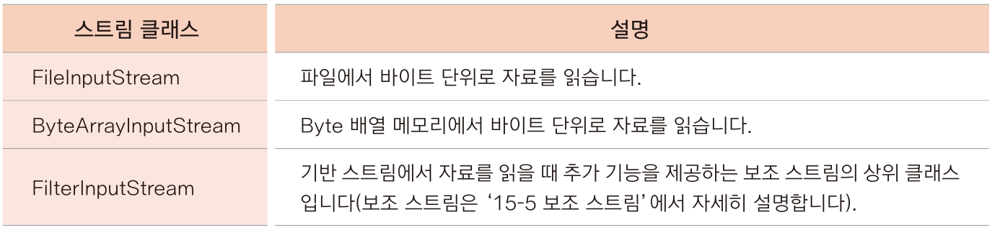

- InputStream이 바이트 자료를 읽기 위해 제공하는 메서드
  - 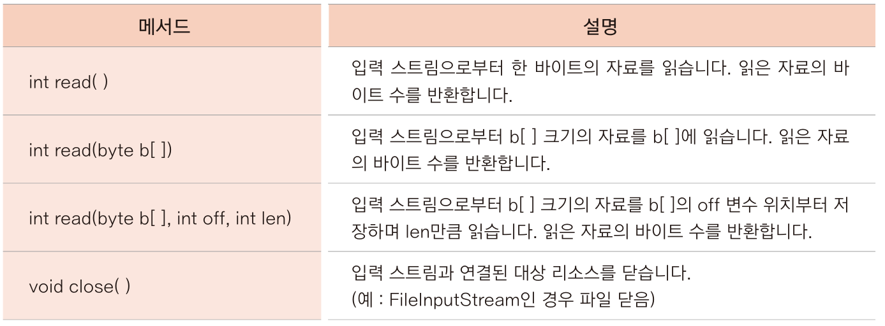


### FileInputStream

- 파일에서 바이트 단위로 자료를 읽어 들일 때 사용하는 스트림 클래스
- FIleInputStream 생성자
  - 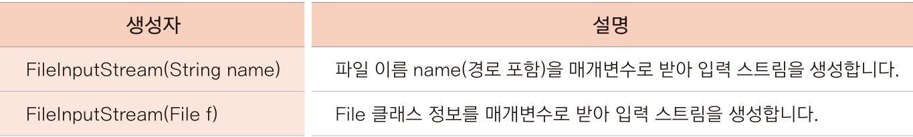

- 예제

  - ```java
    package ch15;
    
    import java.io.FileInputStream;
    import java.io.IOException;
    
    public class FileInputStreamTest1 {
    
    	public static void main(String[] args) {
    		FileInputStream fis = null;
    		
    		try {
                // 파일 입력 스트림 생성
    			fis = new FileInputStream("input.txt");
    			System.out.println(fis.read());
    			System.out.println(fis.read());
    			System.out.println(fis.read());
                //input.txt 가 없으므로 FileNotFoundException 예외 발생
                //그 상위 클래스인 IOException 발생
    		} catch (IOException e) {
    			System.out.println(e);
    		} finally {
    			try {
                    //열린 스트림은 finally 블록에서 닫음
    				fis.close();
    			} catch (IOException e) {
    				System.out.println(e);
                    //스트림이 null이므로 NullPointerException 발생
    			}catch (NullPointerException e) {
    				System.out.println(e);
    			}
    		}
    		System.out.println("end");
    	}
    }
    ```

  - 프로젝트 폴더에 input.txt 를 작성 (abc)

    - 결과는 97 98 99 end
    - read() 메서드는 한바이트씩 자료를 읽기 때문임
    - System.out.println((char)fis.read()); 로 변환하면 char 자료형으로 변환되어 a b c end 로 출력됨


### 파일 끝까지 읽기

- FileInputStream에선 input.txt 에 문자가 세 개 포함된 것을 알았기 때문에 read()메서드를 세번 호출

- 하지만 파일에 내용이 얼만큼 있는지 모르는 경우에는 끝까지 읽어야 함

- 예제 : while 문을 사용하여 fis.read() 가 -1 이 될 때까지 반복

  - ```java
    package ch15;
    
    import java.io.FileInputStream;
    import java.io.FileNotFoundException;
    import java.io.IOException;
    
    public class FileInputStreamTest2 {
    
    	public static void main(String[] args) {
    		try(FileInputStream fis = new FileInputStream("input.txt")) {
    			int i;
                // while 문을 통해 read() 메서드로 바이트단위로 반복해 읽음
    			while((i = fis.read()) != -1) {
    				System.out.println((char)i);
    			}
    			System.out.println("end");
    		} catch (FileNotFoundException e) {
    			e.printStackTrace();
    		} catch (IOException e) {
    			e.printStackTrace();
    		}
    	}
    }
    ```


### int read(byte[] b) 메서드로 읽기

- 한 바이트씩 읽는 것보다 배열을 사용하여 한꺼번에 많이 읽으면 처리 속도가 훨씬 빠름

- read(byte[] b) 메서드는 선언한 바이트 배열의 크기만큼 한꺼번에 자료를 읽음

- 예제

  - input2.txt 에 A~Z까지 알파벳을 적고 10바이트 크기 배열을 만들어 사용

  - ```java
    package ch15;
    
    import java.io.FileInputStream;
    import java.io.FileNotFoundException;
    import java.io.IOException;
    
    public class FileInputStreamTest3 {
    
    	public static void main(String[] args) {
    		try(FileInputStream fis = new FileInputStream("input2.txt")) {
                //크기가 10인 바이트 배열 생성
    			byte[] bs = new byte[10];
    			int i;
                //배열 bs 를 매개변수로
    			while((i = fis.read(bs)) != -1) {
    				//향상된 for문을 이용하여 bs 배열에 있는 자료를 출력
    				for(byte b : bs) {
    					System.out.println((char)b);
    				}
    				System.out.println(" : " + i + " byte");
    			}
    		} catch (IOException e) {
    			e.printStackTrace();
    		}
    		System.out.println("end");
    	}
    }
    ```

    - output - ABCDEFGHIJ : 10 byte

      ​              KLMNOPQRST : 10 byte

      ​              UVWXYZQRST : 6 byte

    - 마지막에 6 바이트를 읽었는데 QRST가 나온 이유

      - 두 번째 읽을 때 K~T까지 10개 알파벳 저장
      - 마지막으로 U~Z까지 저장할 때 새로 읽어들인 6개 외 남은 4개 공간에 기존 자료가 남음
      - 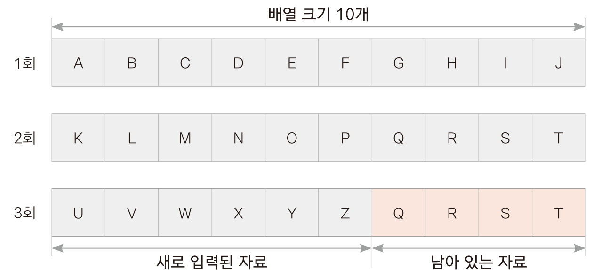

  - 전체 배열을 출력하는 것이 아닌, i 개수만큼 출력하도록 하면 됨
    - 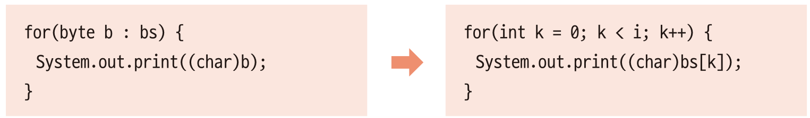


### OutputStream

- 바이트 단위로 쓰는 스트림 중 최상위 스트림
- 자료의 출력 대상에 따라 다른 스트림을 제공
  - 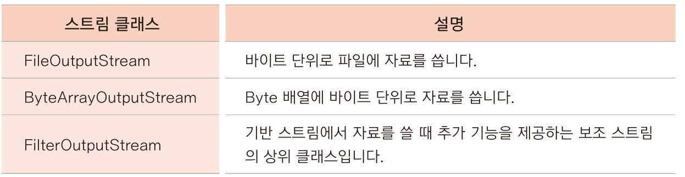

- 제공하는 메서드
  - 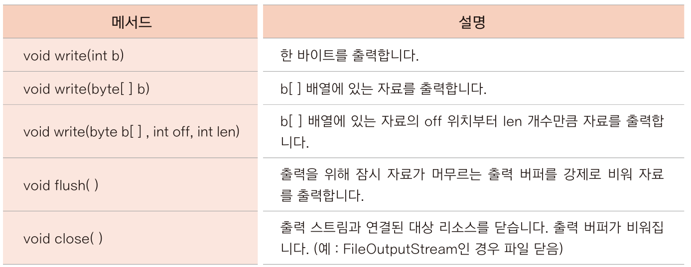


### FileOutputStream

- 파일에 바이트 단위 자료를 출력하기 위해 사용하는 스트림

- 생성자는 다음과 같음

  - 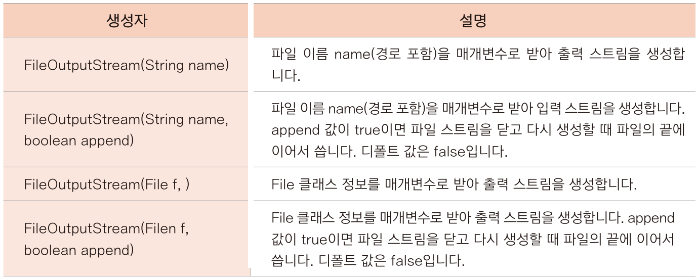

  - 생성자 매개변수로 전달한 파일이 경로에 없으면 FileOutputStream은 파일을 새로 생성
  - FileOutputStream을 사용할 때 overwrite 할지 append 할지 여부를 생성자의 매개변수로 전달
  - append값의 디폴트는 false 이므로 계속 이어쓰려면 append값을 반드시 true로 지정


#### write() 메서드 사용

- FileOutputStream을 생성하고 write() 메서드를 활용해 파일에 정수 값을 저장

- ```java
  package ch15;
  
  import java.io.FileOutputStream;
  import java.io.IOException;
  
  public class FileOutputStreamTest {
  
  	public static void main(String[] args) {
          //output.txt 이름으로 FileOtputStream 생성
  		try(FileOutputStream fos = new FileOutputStream("output.txt")){
              //write() 메서드에 따라 파일에 값을 출력하고 스트림을 닫음
  			fos.write(65);
  			fos.write(66);
  			fos.write(67);
  		} catch(IOException e) {
  			e.printStackTrace();
  		}
  		System.out.println("output complete");
  	}
  }
  
  ```

  - fos = new FileOutputStream("output.txt", true); 로 하면 이어쓰기(append) 가능

    

#### write(byte[] b) 메서드 활용하기

- 여러 자료를 한꺼번에 출력할 수 있음

- ```java
  package ch15;
  
  import java.io.FileOutputStream;
  import java.io.IOException;
  
  public class FileOutputStreamTest2 {
  
  	public static void main(String[] args) throws IOException  {
          // try-with-resources 문
  		FileOutputStream fos = new FileOutputStream("output2.txt",true);
  		try(fos){
              //bs 는 byte값 26개 배열
  			byte[] bs = new byte[26];
              //'A' 의 아스키값
  			byte data = 65;
              //bs[0]부터 65, 66, 67 ... 입력
  			for(int i = 0; i < bs.length; i++) {
  				bs[i] = data;
  				data++;
  			}
              //bs 배열 출력
  			fos.write(bs);
  		}catch(IOException e) {
  			e.printStackTrace();
  		}
  		System.out.println("print complete");
  	}
  }
  ```

  

#### write(byte[] b, int off, int len) 메서드 사용하기

- 배열의 전체 자료를 출력하지 않고 배열의 off 위치부터 len 길이만큼 출

  - ex) fos.write(bs, 2, 10) -> bs[]의 세번째부터 10개 바이트 자료 출력(bs[2] ~ bs[11])

- ```java
  package ch15;
  
  import java.io.FileOutputStream;
  import java.io.IOException;
  
  public class FileOutputStreamTest3 {
  
  	public static void main(String[] args) throws IOException {
  		FileOutputStream fos = new FileOutputStream("output3.txt");
  		try(fos){
  			byte[] bs = new byte[26];
  			byte data = 65;
  			for(int i = 0; i < bs.length; i++) {
  				bs[i] = data;
  				data++;
  			}
              // 위와 같으나, 시작위치와 개수를 정해줌
  			fos.write(bs, 2, 10);
  		}catch(IOException e){
  			e.printStackTrace();
  		}
  		System.out.println("print complete");
  	}
  }
  
  ```

  - output3 : CDEFGHIJKL (bs[2] 부터 10개)


#### flush() 메서드와 close() 메서드

- flush() 메서드는 강제로 자료를 출력하는 것
- write()메서드는 값을 썼다고 해도 바로 파일이나 네트워크로 전송되지 않고 출력을 위한 자료가 쌓이는 출력 버퍼에 어느 정도 자료가 모여야 출력
- 따라서 자료의 양이 많지 않으면 write()메서드로 출력해도 파일에 쓰이지 않거나 전송되지 않을 수도 있음
- 이런 경우 close() 메서드 안에서 flush()메서드를 호출하여 출력버퍼가 비워지면서 남아 있는 자료가 모두 출력됨


# 3. 문자 단위 스트림

### Reader

- 문자 단위로 읽는 스트림 중 최상위 스트림
- 하위 스트림 ->
  - 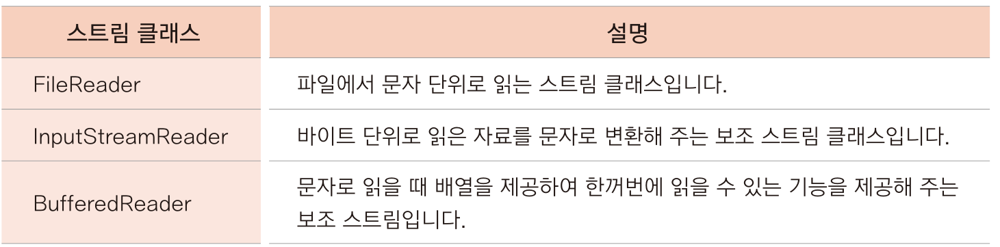

- 제공 메서드
  - 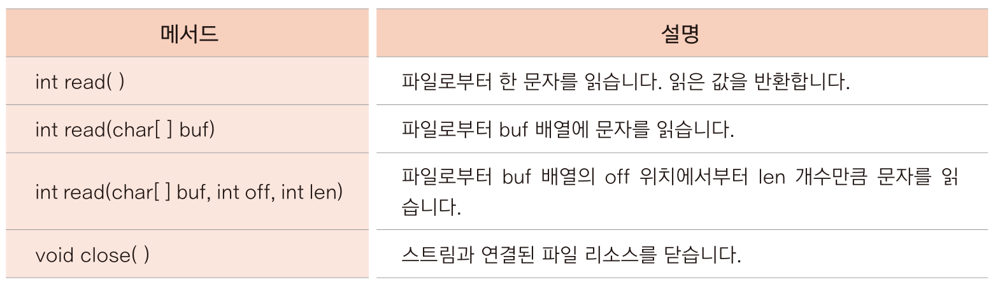


#### FileReader

- FileReader 의 생성자
  - 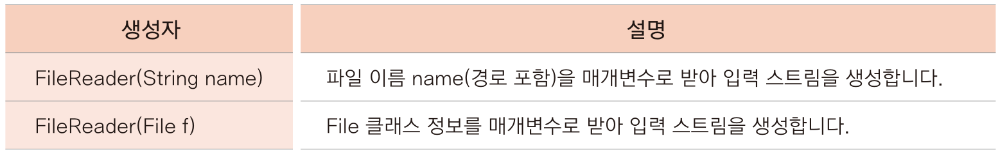

- ```java
  package ch15;
  
  import java.io.FileReader;
  import java.io.IOException;
  
  public class FileReaderTest {
  
  	public static void main(String[] args) {
          // 파일을 문자단위로 읽음
  		try(FileReader fr = new FileReader("reader.txt")){
  			int i;
  			while((i = fr.read()) != -1) {
  				System.out.println((char)i);
  			}
  		} catch (IOException e) {
  			e.printStackTrace();
  		} finally {
  			System.out.println("끝");
  		}
  	}
  }
  ```

  - 나머지 read(char[] buf) 메서드와 read(char[] buf, int off, int len) 메서드는 FileInputStream과 유사


### Writer

- 문자 단위로 출력하는 스트림 중 최상위 스트림
- 하위스트림으로 ->
  - 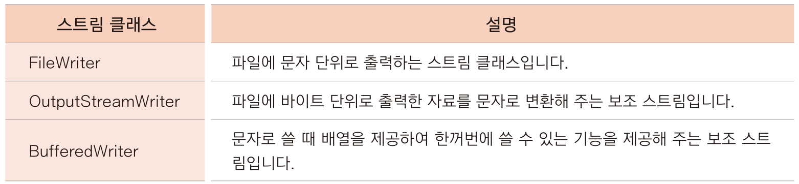

- 제공 메서드로 ->
  - 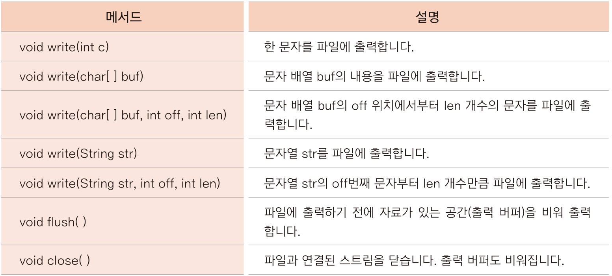


#### FileWriter

- FileOutputStream 과 마찬가지로 출력 파일이 존재하지 않으면 파일을 생성
- 생성자는 ->
  - 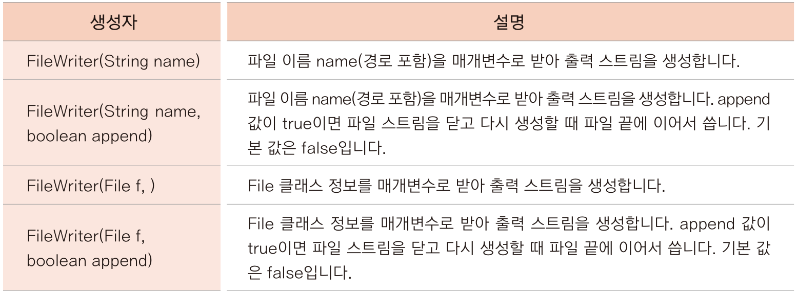

- ```java
  package ch15;
  
  import java.io.FileWriter;
  import java.io.IOException;
  
  public class FileWriterTest {
  
  	public static void main(String[] args) {
  		try(FileWriter fw = new FileWriter("writer.txt")){
              //문자 하나 출력
  			fw.write('A');
  			char buf[] = {'B','C','D','E','F','G'};
  			//문자 배열 출력
  			fw.write(buf);
              //문자열 출력
  			fw.write("안녕하세요.");
              //문자 배열의 일부 출력
  			fw.write(buf, 1, 2);
              //숫자를 그대로 출력
  			fw.write("65");
  		} catch(IOException e) {
  			e.printStackTrace();
  		}
  		System.out.println("print complete");
  	}
  }
  
  ```


# 4. 보조 스트림

### 보조스트림이란?

- 입출력 대상이 되는 파일이나 네트워크에 직접 쓰거나 읽는 기능 없음
- 보조기능을 추가하는 스트림(Wrapper 스트림)


### FilterInputStream과 FilterOutputStream

- 보조 스트림의 상위 클래스
- 두 클래스의 생성자는 ->
  - 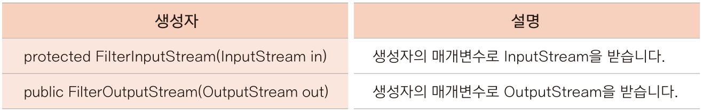

- 직접 생성하여 사용하는 경우는 거의 없고 이를 상속한 하위 클래스를 많이 사용
- **보조스트림의 생성자에 또 다른 보조 스트림을 매개변수로 전달받을 수도 있음**


### InputStreamReader 와 OutputStreamWriter

- 바이트 자료만 입력되는 스트림 : System.in / InputStream / OutputStream등
- 생성된 바이트 스트림을 문자로 변환해주는 보조 스트림


#### InputStreamReader

- InputStreamReader 의 생성자는 ->
  - 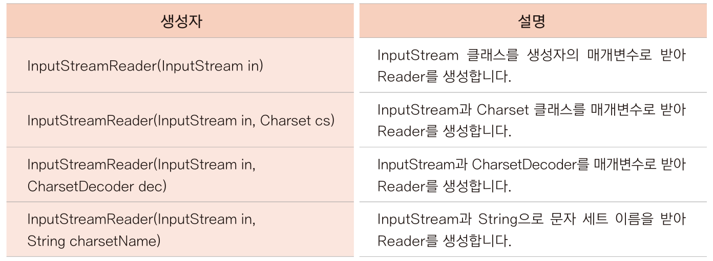

- 예제

  - ```java
    package ch15;
    
    import java.io.IOException;
    import java.io.InputStreamReader;
    import java.io.FileInputStream;
    
    public class InputStreamReaderTest {
    
    	public static void main(String[] args) {
            //보조스트림인 InputStreamReader의 매개변수로 기반 스트림은 FileInputStream을 받아 생성
    		try(InputStreamReader isr = new InputStreamReader(new FileInputStream("reader.txt"))){
    			int i;
    			while((i = isr.read()) != -1) {
    				System.out.print((char)i);
    			}
    		} catch(IOException e) {
    			e.printStackTrace();
    		}
    	}
    }
    ```

    

- 표준 입출력 스트림 System.in 과 System.out 은 모두 바이트 스트림
- 특히 System.in 은 콘솔화면에서 한글을 읽으려면 InputStreamReader 를 사용해야 함
- **Scanner  클래스는 이런 변환이 필요없어 콘솔 입력에 많이 쓰임 **
- 네트워크에 쓰이는 클래스는 스트림을 생성하면 InputStream 이나 OutputStream 으로 생성됨. 따라서 영어로만 채팅이 가능
  - 이를 해결하기 위해 읽어들인 자료를 InputStreamReader 나 OutputStreamWriter를 활용해 문자로 변환하여 사용


### Buffered 스트림

- 내부적으로 8,192바이트(8KB) 크기의 배열을 가짐
- 이미 생성된 스트림에 배열 기능을 추가해 더 빠르게 입출력 실행 가능
- 버퍼링 기능을 제공하는 스트림 클래스는 ->
  - 


#### BufferedInputStream

- BufferedInputStream의 생성자

  - 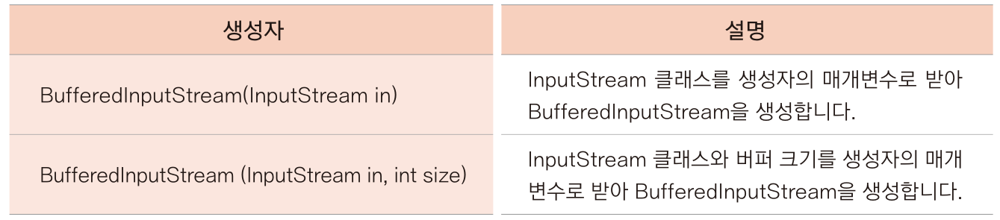
    - BufferedOutputStream은 OutputStream을, BufferedReader 는 Reader 를, BufferedWriter 는 Writer 클래스를 생성자 매개변수로 받음

- 예제) 파일복사 시간 비교

  - Buffered 스트림 미사용 시

  - ```java
    package ch15;
    
    import java.io.FileInputStream;
    import java.io.FileOutputStream;
    import java.io.IOException;
    
    public class FileCopyTest {
    
    	public static void main(String[] args) {
    		long millisecond = 0;
    		try(FileInputStream fis = new FileInputStream("a.zip");
    			FileOutputStream fos = new FileOutputStream("copy.zip")){
                	//파일을 복사하기 전 시간
    				millisecond = System.currentTimeMillis();
    				int i;
                	//파일 복사
    				while((i = fis.read()) != -1) {
    					fos.write(i);
    				}
                	//파일을 복사한 후 시간
    				millisecond = System.currentTimeMillis() - millisecond;
    		} catch(IOException e) {
    			e.printStackTrace();
    		}
    		System.out.println("파일을 복사하는데" + millisecond + "milliseconds 소요됨");
    	}
    }
    ```

    - 약 50millisec 소요

  - Buffered 스트림 사용 시

  - ```java
    package ch15;
    
    import java.io.BufferedInputStream;
    import java.io.BufferedOutputStream;
    import java.io.FileInputStream;
    import java.io.FileOutputStream;
    import java.io.IOException;
    
    public class bufferedStreamTest {
    
    	public static void main(String[] args) {
    		long millisecond = 0;
    		try(FileInputStream fis = new FileInputStream("a.zip");
    			FileOutputStream fos = new FileOutputStream("copy.zip");
    			BufferedInputStream bis = new BufferedInputStream(fis);
    			BufferedOutputStream bos = new BufferedOutputStream(fos)){
    				millisecond = System.currentTimeMillis();
    				int i;
    				while((i = bis.read()) != -1) {
    					bos.write(i);
    				}
    				millisecond = System.currentTimeMillis() - millisecond;
    		} catch(IOException e) {
    			e.printStackTrace();
    		}
    		System.out.println("파일을 복사하는데" + millisecond + "milliseconds 소요됨");
    	}
    }
    ```

    - 약 1~2millisec 소요 (25~50배 빠름)


### DataInputStream과 DataOutputStream

- 메모리에 저장된 0, 1 상태를 그대로 읽거나 씀. 따라서 자료형의 크기가 그대로 보존됨
- 제공되는 생성자 -> 
  - 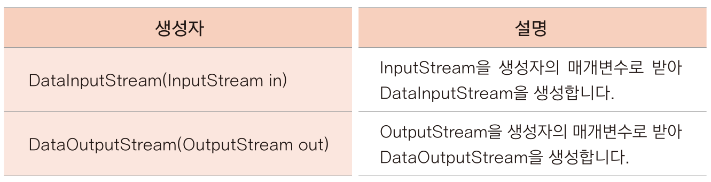

- DataInputStream의 자료형별 메서드
  - 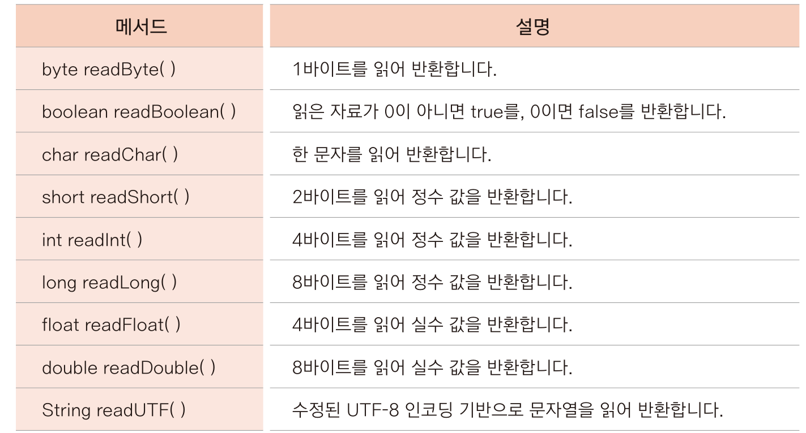

- DataOutputStream 메서드 (read()에 대응되는 write() 메서드 제공)
  - 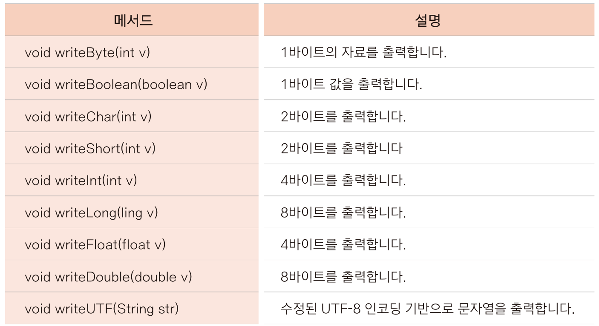

- 자료형을 그대로 읽고 쓰는 스트림이기에 자료를 쓸 때 사용한 메서드와 같은 자료형의 메서드로 읽어야 함

  - ex) 정수 100을 쓰는데 writeInt(100) 를 쓰고 readByte()로 읽으면 서로 사용한 메모리 크기가 달라서 같은 값을 가져올 수 없음

- 예제)

  - ```java
    package ch15;
    
    import java.io.DataInputStream;
    import java.io.DataOutputStream;
    import java.io.FileInputStream;
    import java.io.FileOutputStream;
    import java.io.IOException;
    
    public class DataStreamTest {
    
    	public static void main(String[] args) {
    		try(FileOutputStream fos = new FileOutputStream("data.txt");
    			DataOutputStream dos = new DataOutputStream(fos)){
                //각 자료형에 맞게 자료를 씀
    			dos.writeByte(100);	
    			dos.writeChar('A');
    			dos.writeInt(10);
    			dos.writeFloat(3.14f);
    			dos.writeUTF("Test");
    		} catch (IOException e) {
    			e.printStackTrace();
    		}
    		try(FileInputStream fis = new FileInputStream("data.txt");
    			DataInputStream dis = new DataInputStream(fis)){
                // 자료형에 맞게 자료를 읽어 출력
                // 파일에 쓴 순서와 같은 순서, 같은 메서드로 읽어야 함
    			System.out.println(dis.readByte());
    			System.out.println(dis.readChar());
    			System.out.println(dis.readInt());
    			System.out.println(dis.readFloat());
    			System.out.println(dis.readUTF());
    		} catch (IOException e) {
    			e.printStackTrace();
    		}
    	}
    }
    
    ```

    

# 5. 직렬화

- 클래스의 인스턴스가 생성되면 인스턴스 변수 값은 생명체처럼 계속 변하게 됨
- 그런데 인스턴스의 어느 순간 상태를 그대로 저장하거나 네트워크를 통해 전송할 일이 있을 수 있음 -> 이를 직렬화라고 함
- 저장된 내용이나 전송받은 내용을 다시 복원하는 것을 역직렬화라고 함
- 즉, 직렬화란 인스턴스 내용을 연속 스트림으로 만드는 것
- 보조스트림인 ObjectInputStream 과 ObjectOutputStream 을 사용하여 구현 가능
  - 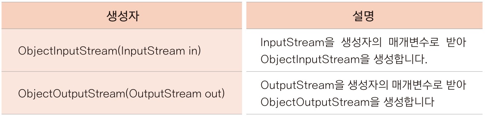

- 직렬화 예제 : Person 클래스를 하나 만들어 인스턴스로 생성 후 파일에 썼다가 복원

  - ```java
    package ch15;
    
    import ...
    
    //직렬화는 인스턴스 내용이 외부로 유출되는 것이므로 직렬화 의도를 표시해야 함
    class Person implements Serializable {
    	private static final long serialVersionUID = -1503252402544036183L;
    	String name;
    	String job;
    	
    	public Person() {}
    	
    	public Person(String name, String job) {
    		this.name = name;
    		this.job = job;
    	}
    	
    	public String toString() {
    		return name + "," + job;
    	}
    }
    
    public class SerializationTest {
        //역직렬화 시 클래스 정보가 존재하지 않을 수 있으므로 ClassNotFoundException 처리 필요
    	public static void main(String[] args) throws ClassNotFoundException {
    		Person personAhn = new Person("안재용", "대표이사");
    		Person personKim = new Person("김철수", "상무이사");
    		
    		try(FileOutputStream fos = new FileOutputStream("serial.out");
    			ObjectOutputStream oos = new ObjectOutputStream(fos)){
                //personAhn, Kim의 값을 파일에 씀(직렬화)
    			oos.writeObject(personAhn);
    			oos.writeObject(personKim);
    		} catch (IOException e) {
    			e.printStackTrace();
    		}
    		try(FileInputStream fis = new FileInputStream("serial.out");
    			ObjectInputStream ois = new ObjectInputStream(fis)){
                //personAhn과 personKim 의 값을 파일에 읽어 들임(역직렬화)
                //readObject() 반환 값이 Object 이므로 원래 자료형은 Person으로 형변환 필요
    			Person p1 = (Person)ois.readObject();
    			Person p2 = (Person)ois.readObject();
    			
    			System.out.println(p1);
    			System.out.println(p2);
    		} catch (IOException e) {
    			e.printStackTrace();
    		}
    	}
    }
    
    output : 안재용, 대표이사
             김철수, 상무이사
    ```

    - serial.out 파일은 읽을 수 없는 내용으로 저장되어 있음
    - readObject() 메서드로 저장된 순서대로 읽어들임

  - transient 예약어 

    - 직렬화 대상이 되는 클래스는 모든 인스턴스 변수가 직렬화되고 복원됨

    - 하지만 직렬화될 수 없는 클래스(Socket 등)가 인스턴스 변수로 있다거나 직렬화하고 싶지 않은 변수가 있을 때 transient 예야겅 사용

    - 해당 변수 정보는 그 자료형의 기본 값으로 저장됨

    - ```java
      String name;
      transient String job;
      
      output : 안재용, null
               김철수, null
      ```

      - job 내용이 저장되지 않음


#### serialVersionUID 를 사용한 버전 관리

- 객체를 직렬화할 때, 역직렬화할 때의 클래스와 상태가 다르면 오류가 발생함
- 따라서 직렬화할 때 자동으로 serialVersionUID 를 생성해 정보를 저장
- 이클립스에서 버전 정보 생성을 자동으로 제공
  - 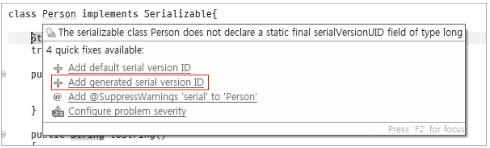


#### Externalizable 인터페이스

- 직렬화하는 데 사용하는 또 다른 인터페이스

- 객체의 직렬화와 역직렬화를 프로그래머가 직접 세밀하게 제어하고자 할 때, 메서드에 그 내용을 구현

- ```java
  package ch15;
  
  import java.io.Externalizable;
  import java.io.FileInputStream;
  import java.io.FileOutputStream;
  import java.io.IOException;
  import java.io.ObjectInput;
  import java.io.ObjectInputStream;
  import java.io.ObjectOutput;
  import java.io.ObjectOutputStream;
  
  	
  	class Dog implements Externalizable{
  		String name;
  		
  		//복원할 때 디폴드 생성자가 호출되므로 디폴트 생성자를 추가해야 함
  		public Dog() {}
  		
  		//Externalizable 인터페이스의 메서드 구현
  		@Override
  		public void writeExternal(ObjectOutput out) throws IOException {
  			out.writeUTF(name);
  		}
  
  		@Override
  		public void readExternal(ObjectInput in) throws IOException, ClassNotFoundException {
  			name = in.readUTF();
  		}
  		
  		public String toString() {
  			return name;
  		}
  	}
  public class ExternalizableTest {
  	public static void main(String[] args) throws IOException, ClassNotFoundException {
  		Dog myDog = new Dog();
  		myDog.name = "멍멍이";
  		
  		FileOutputStream fos = new FileOutputStream("external.out");
  		ObjectOutputStream oos = new ObjectOutputStream(fos);
  
  		try(fos;oos){
  			oos.writeObject(myDog);
  		} catch (IOException e) {
  			e.printStackTrace();
  		}
  		
  		FileInputStream fis = new FileInputStream("external.out");
  		ObjectInputStream ois = new ObjectInputStream(fis);
  		
  		Dog dog = (Dog)ois.readObject();
  		System.out.println(dog);
  	}
  
  }
  ```


# 6. 그 외 입출력 클래스

### File 클래스

- 파일이라는 개념을 추상화한 클래스
- 별도의 입출력기능은 없지만 파일 자체의 경로나 정보를 알 수 있고 파일 생성 가능
- 주요 생성자는 ->
  - 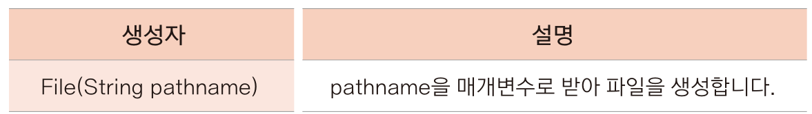

- 예제

  - ```java
    package ch15;
    
    import java.io.File;
    import java.io.IOException;
    
    public class FileTest {
    
    	public static void main(String[] args) throws IOException {
    		File file = new File("C:\\Users\\kimhobeen\\eclipse-workspace\\Java\\newFile.txt");
            //파일 생성
    		file.createNewFile();
    		
            //파일인지? (boolean)
    		System.out.println(file.isFile());
            //Directory 인지? (boolean)
    		System.out.println(file.isDirectory());
            //file이름 String
    		System.out.println(file.getName());
            //절대 경로 String
    		System.out.println(file.getAbsolutePath());
            //경로 String
    		System.out.println(file.getPath());
            //읽을 수 있는지 boolean
    		System.out.println(file.canRead());
            //쓸 수 있는지 boolean
    		System.out.println(file.canWrite());
    		
            //파일 삭제
    		file.delete();
    	}
    }
    ```

  - 이렇게 생성한 파일은 FileInputStream 과 같은 입출력 기능을 제공하는 클래스의 생성자 매개변수로 사용가능


### RandomAccessFile 클래스

- 입출력 클래스 중 유일하게 파일 입출력을 동시에 할 수 있는 클래스
- 지금까지 배운 스트림은 처음부터 차례로 자료를 읽었지만, RandomAccessFile 은 임의의 위치로 이동하여 자료를 읽을 수 있음
- 해당 클래스는 파일 포인터가 있는데, 현재 이 파일의 어느 위치에서 읽고 쓰는지 그 위치를 가리키는 속성임
- 스트림을 생성하지 않고 간단하게 파일에 자료를 쓰거나 읽을 때 사용
- 생성자는 ->
  - 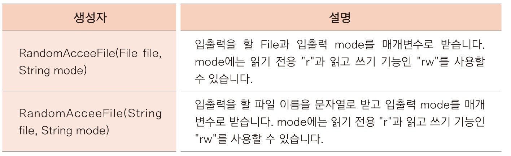

- 예제 )

  - ```java
    package ch15;
    
    import ...
    
    public class RandomAccessFileTest {
    
    	public static void main(String[] args) throws IOException {
    		RandomAccessFile rf = new RandomAccessFile("random.txt", "rw");
            //자료형으로 입력
    		rf.writeInt(100);
    		System.out.println("File pointer loc : " + rf.getFilePointer());
    		rf.writeDouble(3.14);
    		System.out.println("File pointer loc : " + rf.getFilePointer());
    		rf.writeUTF("안녕하세요");
    		System.out.println("File pointer loc : " + rf.getFilePointer());
    		
            //포인터 위치를 0으로 설정해야 처음부터 읽을 수 있음
    		rf.seek(0);
    		System.out.println("File pointer loc : " + rf.getFilePointer());
            
    		//자료형으로 출력
    		int i = rf.readInt();
    		double d = rf.readDouble();
    		String str = rf.readUTF();
    		
    		System.out.println("File pointer loc : " + rf.getFilePointer());
    		
    		System.out.println(i);
    		System.out.println(d);
    		System.out.println(str);
    	}
    }
    
    output : 
    // int형 4byte / Double 8byte / UTF 한글(3byte) * 3 + null(2byte) = 17byte
    File pointer loc : 4
    File pointer loc : 12
    File pointer loc : 29
    File pointer loc : 0
    File pointer loc : 29
    100
    3.14
    안녕하세요
    ```