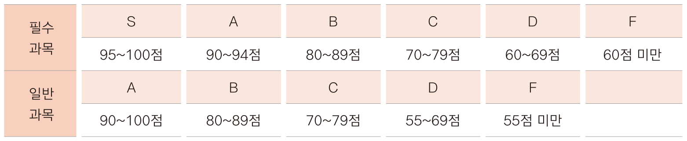
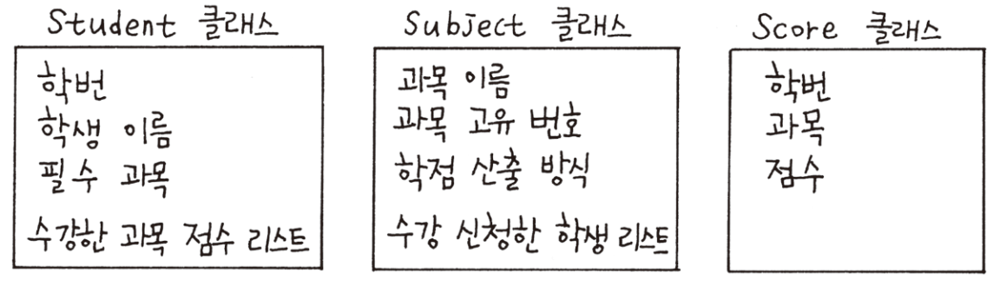
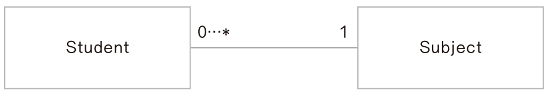
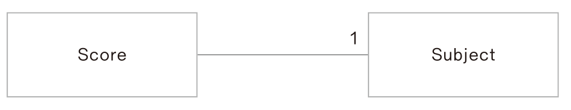
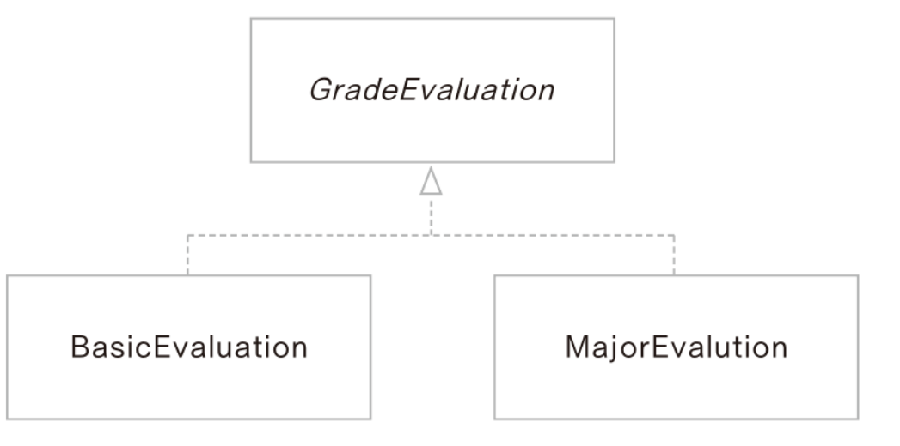

# 1. 문제 정의

### 프로그램 시나리오

- 5명의 학생들이 수업을 들음
- 과목은 국어, 수학
- 컴퓨터공학과 학생은 수학 / 국어국문학과 학생은 국어가 필수 과목
- 일반과목은 A~F, 필수과목은 S~F로 분류
  - 


# 2. 클래스 정의 / 관계도 그리기

### 필요한 클래스

- Student, Subject, Score
- 


### 클래스 관계도 그리기

- Student 와 Score 
  - 학생 한 명은 여러 과목의 점수를 가지게 됨
  - 

- Student 와 Subject
  - 학생 클래스에 여러 과목 포함 or 과목 클래스에 여러 학생 포함 둘 다 가능
  - 학생이 과목을 수강 신청하고 과목 단위로 성적 처리하므로 과목이 여러 학생을 포함하는 관계로 설정
  - 

- Subject 와 Score 
  - Score 클래스는 하나의 Subject 포함
  - 

- 최종 관계도
  - 


### 클래스 정의하기

#### 학생클래스

- 이름, 학번, 필수 과목, 자신이 수강하는 과목의 점수리스트

- ```java
  package school;
  
  public class Student {
  	private int studentId;
  	private String studentName;
  	private Subject majorSubject;
  	private ArrayList<Score> scoreList = new ArrayList<Score>();
  	
  	public Student(int studentId, String studentName, Subject majorSubject) {
  		this.studentId = studentId;
  		this.studentName = studentName;
  		this.majorSubject = majorSubject;
  	}
  	
  	public void addSubjectScore(Score score) {
  		scoreList.add(score);
  	}
  	
  	public int getStudentId() {
  		return studentId;
  	}
  
  	public void setStudentId(int studentId) {
  		this.studentId = studentId;
  	}
  
  	public String getStudentName() {
  		return studentName;
  	}
  
  	public void setStudentName(String studentName) {
  		this.studentName = studentName;
  	}
  
  	public Subject getMajorSubject() {
  		return majorSubject;
  	}
  
  	public void setMajorSubject(Subject majorSubject) {
  		this.majorSubject = majorSubject;
  	}
  
  	public ArrayList<Score> getScoreList() {
  		return scoreList;
  	}
  
  	public void setScoreList(ArrayList<Score> scoreList) {
  		this.scoreList = scoreList;
  	}
  }
  ```

  

#### 과목 클래스

- ```java
  package school;
  
  import java.util.ArrayList;
  //프로그램 전반에서 사용하는 상수 클래스
  import utils.Define;
  
  public class Subject {
  	private String subjectName;
  	private int subjectId;
  	private int gradeType;
  	private ArrayList<Student> studentList = new ArrayList<Student>();
  	
  	public Subject(String subjectName, int subjectId) {
  		this.subjectName = subjectName;
  		this.subjectId = subjectId;
  		this.gradeType = Define.AB_TYPE;
  	}
  
  	public String getSubjectName() {
  		return subjectName;
  	}
  
  	public void setSubjectName(String subjectName) {
  		this.subjectName = subjectName;
  	}
  
  	public int getSubjectId() {
  		return subjectId;
  	}
  
  	public void setSubjectId(int subjectId) {
  		this.subjectId = subjectId;
  	}
  
  	public int getGradeType() {
  		return gradeType;
  	}
  
  	public void setGradeType(int gradeType) {
  		this.gradeType = gradeType;
  	}
  
  	public ArrayList<Student> getStudentList() {
  		return studentList;
  	}
  
  	public void setStudentList(ArrayList<Student> studentList) {
  		this.studentList = studentList;
  	}
  	
  	public void register(Student student) {
  		//수강신청 메서드
  		studentList.add(student);
  	}
  }
  
  ```


#### Score 클래스

- ```java
  package school;
  
  public class Score {
  	int studentId;
  	Subject subject;
  	int point;
  	
  	public Score(int studentId, Subject subject, int point) {
  		this.studentId = studentId;
  		this.subject = subject;
  		this.point = point;
  	}
  
  	public int getStudentId() {
  		return studentId;
  	}
  
  	public void setStudentId(int studentId) {
  		this.studentId = studentId;
  	}
  
  	public Subject getSubject() {
  		return subject;
  	}
  
  	public void setSubject(Subject subject) {
  		this.subject = subject;
  	}
  
  	public int getPoint() {
  		return point;
  	}
  
  	public void setPoint(int point) {
  		this.point = point;
  	}
  	
  	public String toSting() {
  		return "학번 : " + studentId + ", " + subject.getSubjectName() + " : " + point;
  	}
  }
  ```


#### 프로그램 전반에서 사용하는 상수 클래스

- Define 클래스를 만들고 public static final  로 상수 선언

- ```java
  package utils;
  
  public class Define {
  	public static final int KOREAN = 1001;
  	public static final int MATH = 2001;
  	
  	public static final int AB_TYPE = 0;
  	public static final int SAB_TYPE = 1;
  }
  ```

  

# 3. 학점 평가 정책 설계/구현

### 인터페이스 정의

- 점수에 따른 학점 평가방법이 여러가지가 있음
- **그러므로 여러 산출 방법 크래스가 구현할 내용을 인터페이스로 정의 **

- ```java
  package GradingSystem;
  
  public interface GradeEvaluation {
  	public String getGrade(int point);
  }
  
  ```

- 이후 필수과목과 일반 과목으로 구분하여 학점 산출
  - 


### 인터페이스를 구현한 학점 산출 클래스

#### 일반과목 학점 산출

- ```java
  package GradingSystem;
  
  public class BasicEvaluation implements GradeEvaluation {
  
  	public String getGrade(int point) {
  		String grade;
  		if(point >= 90 && point <= 100)
  		grade = "A";
  		else if(point >= 80)
  			grade = "B";	
  		else if(point >= 70) 
  			grade = "C";
  		else if(point >= 55) 
  			grade = "D";
  		else
  			grade = "F";
  		
  		return grade;		 
  	}
  }
  ```

#### 필수과목 학점산출

- ```java
  package GradingSystem;
  
  public class MajorEvaluation implements GradeEvaluation {
  
  	public String getGrade(int point) {
  		String grade;
  		if(point >= 95 && point <= 100) 
  			grade = "S";
  		else if(point >= 90)
  			grade = new String("A");
  		else if(point >= 80)
  			grade = "B";
  		else if(point >= 70)
  			grade = "C";
  		else if(point >= 60)
  			grade = "D";
  		else
  			grade = "F";
  		return grade;
  	}
  
  }
  ```

#### 리포트 클래스

- ```java
  package shool.report;
  
  import java.util.ArrayList;
  
  import grade.BasicEvaluation;
  import grade.GradeEvaluation;
  import grade.MajorEvaluation;
  import school.School;
  import school.Score;
  import school.Student;
  import school.Subject;
  import utils.Define;
  
  public class GenerateGradeReport {
  	
  	School school = School.getInstance();
  	public static final String TITLE = " 수강생 학점 \t\t\n";
  	public static final String HEADER = " 이름 | 학번 | 필수과목 | 점수 \n";
  	public static final String LINE = "--------------------------------\n";
      //buffer 생성
  	private StringBuffer buffer = new StringBuffer();
  	
      //buffer 값 출력
  	public String getReport() {
  		ArrayList<Subject> subjectList = school.getSubjectList();
  		
  		for(Subject subject : subjectList) {
  			makeHeader(subject);
  			makeBody(subject);
  			makeFooter();
  		}
  		return buffer.toString();
  	}
  	
  	private void makeHeader(Subject subject) {
  		buffer.append(GenerateGradeReport.LINE);
  		buffer.append("\t" + subject.getSubjectName());
  		buffer.append(GenerateGradeReport.TITLE);
  		buffer.append(GenerateGradeReport.HEADER);
  		buffer.append(GenerateGradeReport.LINE);
  	}
  	
  	private void makeBody(Subject subject) {
  		ArrayList<Student> studentList = subject.getStudentList();
  		
  		for(int i = 0; i < studentList.size(); i++) {
  			Student student = studentList.get(i);
  			buffer.append(student.getStudentName());
  			buffer.append(" | ");
  			buffer.append(student.getStudentId());
  			buffer.append(" | ");
  			buffer.append(student.getMajorSubject().getSubjectName() + "\t");
  			buffer.append(" | ");
  
  			/* 학생별 수강 과목 학점 계산 */
  			getScoreGrade(student, subject.getSubjectId());
  			
  			buffer.append("\n");
  			buffer.append(LINE);
  		}
  	}
  	
      //점수의 학점을 계산
  	public void getScoreGrade(Student student, int subjectId) {
  		ArrayList<Score> scoreList = student.getScoreList();
  		int majorId = student.getMajorSubject().getSubjectId();
  		
          //학점 평가클래스, 0번 인덱스는 일반과목, 1번 인덱스는 필수과목
  		GradeEvaluation[] gradeEvaluation = {new BasicEvaluation(), new MajorEvaluation()};
  		
  		for(int i = 0; i < scoreList.size(); i++) {
  			Score score = scoreList.get(i);
  			if(score.getSubject().getSubjectId() == subjectId) {
  				String grade;
                  // 필수과목일 경우 학점산출
  				if(score.getSubject().getSubjectId() == majorId)
  					grade = gradeEvaluation[Define.SAB_TYPE].getGrade(score.getPoint());
                  // 일반과목일 경우 학점산출
  				else
  					grade = gradeEvaluation[Define.AB_TYPE].getGrade(score.getPoint());
  				
  				buffer.append(score.getPoint());
  				buffer.append(" : ");
  				buffer.append(grade);
  				buffer.append(" | ");
  			}
  		}
  	}
  	
  	private void makeFooter() {
  		buffer.append("\n");
  	}
  }
  ```

  

# 4. 프로그램 테스트

### 학교 클래스

```java
package school;

import java.util.ArrayList;

public class School {
	private static School instance = new School();
	private static String SCHOOL_NAME = "Good School";
	private ArrayList<Student> studentList = new ArrayList<>();
	private ArrayList<Subject> subjectList = new ArrayList<>();
	
	private School() {}
	
	public static School getInstance() {
		if(instance == null)
			instance = new School();
		return instance;
	}

	public ArrayList<Student> getStudentList() {
		return studentList;
	}

	public void addStudent(Student student) {
		studentList.add(student);
	}

	public ArrayList<Subject> getSubjectList() {
		return subjectList;
	}

	public void addSubject(Subject subject) {
		subjectList.add(subject);
	}
	
	public void setSubjectList(ArrayList<Subject> subjectList) {
		this.subjectList = subjectList;
	}
}
```


### 테스트 프로그램

```java
package test;

import school.School;
import school.Score;
import school.Student;
import school.Subject;
import school.report.GenerateGradeReport;
import utils.Define;

public class TestMain {
	School goodSchool = School.getInstance();
	Subject korean;
	Subject math;
	GenerateGradeReport gradeReport = new GenerateGradeReport();
	
	public static void main(String[] args) {
		TestMain test = new TestMain();
		
		test.creatSubject();
		test.createStudent();
		
        //리포트 생성 및 출력
		String report = test.gradeReport.getReport();
		System.out.println(report);
	}
	//과목 생성 메소드
	public void creatSubject() {
		korean = new Subject("Korean", Define.KOREAN);
		math = new Subject("Math", Define.MATH);
		
		goodSchool.addSubject(korean);
		goodSchool.addSubject(math);
	}
	//학생 생성 메소드
	public void createStudent() {
        //학생 생성
		Student student1 = new Student(181213, "Ahn", korean);
		Student student2 = new Student(181518, "Oh", math);
		Student student3 = new Student(171230, "Lee", korean);
		Student student4 = new Student(171255, "Jo", korean);
		Student student5 = new Student(171590, "Choi", math);
		
        //goodSchool에 학생추가
		goodSchool.addStudent(student1);
		goodSchool.addStudent(student2);
		goodSchool.addStudent(student3);
		goodSchool.addStudent(student4);
		goodSchool.addStudent(student5);
		
        //국어 수강학생 등록
		korean.register(student1);
		korean.register(student2);
		korean.register(student3);
		korean.register(student4);
		korean.register(student5);
		
        //수학 수강학생 등록
		math.register(student1);
		math.register(student2);
		math.register(student3);
		math.register(student4);
		math.register(student5);
		
        //addScoreForStudent 메소드로 각 학생의 과목별 점수 추가
		addScoreForStudent(student1, korean, 95);
		addScoreForStudent(student1, math, 56);
		
		addScoreForStudent(student2, korean, 95);
		addScoreForStudent(student2, math, 95);
		
		addScoreForStudent(student3, korean, 100);
		addScoreForStudent(student3, math, 88);
		
		addScoreForStudent(student4, korean, 89);
		addScoreForStudent(student4, math, 95);
		
		addScoreForStudent(student5, korean, 85);
		addScoreForStudent(student5, math, 56);
	}
	
    //addScoreForStudent 메소드
	public void addScoreForStudent(Student student, Subject subject, int point) {
		Score score = new Score(student.getStudentId(), subject, point);
		student.addSubjectScore(score);
	}
}
```

