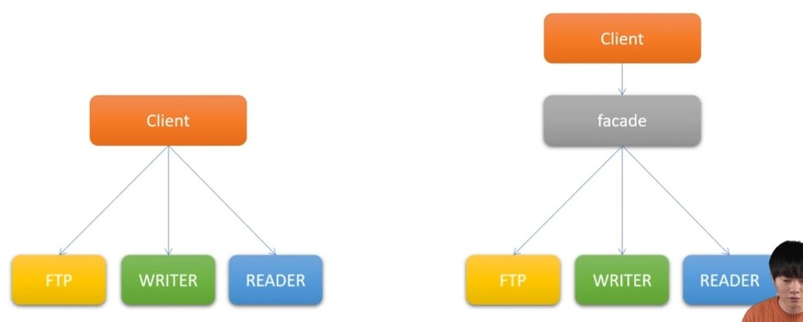
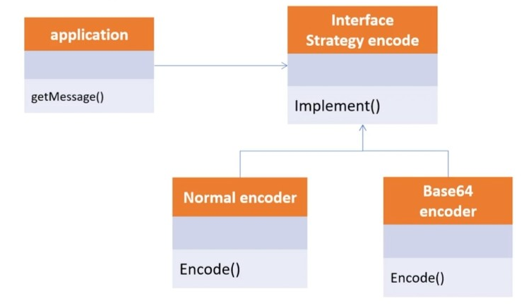

# 1. singleton 패턴

- 싱글톤 패턴은 어떠한 클래스(객체)가 유일하게 1개만 존재할 때 사용

- 서로 자원을 공유할 때 사용하는데, 실물 세계에서는 프린터가 해당되며, 실제 프로그래밍에서는 TCP Socket 통신에서 서버와 연결된 connect 객체에 주로 사용된다.

- SocketClient class

  - ```java
    package singleton;
    
    public class SocketClient {
        private static SocketClient socketClient = null;
    
        //private 으로 socketclient 직접 생성 불가
        private SocketClient(){
    
        }
    	//instance가 없으면 socketclient 생성
        public static SocketClient getInstance(){
            if(socketClient == null){
                socketClient = new SocketClient();
            }
            return socketClient;
        }
    
        public void connect(){
            System.out.println("connect");
        }
    }
    ```

- AClazz, BClazz

  - ```java
    package singleton;
    
    public class AClazz {
        private SocketClient socketClient;
    
        public AClazz(){
            this.socketClient = SocketClient.getInstance();
        }
    
        public SocketClient getSocketClient(){
            return this.socketClient;
        }
    }
    ```

  - ```java
    package singleton;
    
    public class BClazz {
        private SocketClient socketClient;
    
        public BClazz(){
            this.socketClient = SocketClient.getInstance();
        }
    
        public SocketClient getSocketClient(){
            return this.socketClient;
        }
    }
    ```

- main에서 Aclazz 와 Bclazz 비교

  - ```java
    import singleton.AClazz;
    import singleton.BClazz;
    import singleton.SocketClient;
    
    public class Main {
        public static void main(String[] args) {
            AClazz aClazz = new AClazz();
            BClazz bClazz = new BClazz();
    
            SocketClient aClient = aClazz.getSocketClient();
            SocketClient bClient = bClazz.getSocketClient();
    
            System.out.println("두 개의 객체가 동일한가");
            System.out.println(aClient.equals(bClient));
        }
    }
    
    //output : true
    ```

    - 즉 socketClient 가 같다는 것!


# 2. 어댑터패턴

- 100v를 220v로 변경해주거나, 그 반대로 해주는 변환기를 예로 들 수 있음

- 호환성이 없는 기존 클래스의 인터페이스를 변환하여 재사용

- SOLID중에서 개방폐쇄원칙(OCP)를 따름

- 예시) 어댑터로  220v를 110v에 연결

  - Electronic 110V, Electronic 220V

    - ```java
      package adapter;
      
      public interface Electronic110V {
          void powerOn();
      }
      ```

    - ```java
      package adapter;
      
      public interface Electronic220V {
          void connect();
      }
      ```

  - 110v 헤어드라이기, 220v 청소기, 에어컨

    - ```java
      package adapter;
      
      public class HairDryer implements Electronic110V{
      
          @Override
          public void powerOn() {
              System.out.println("헤어드라이기 110v on");
          }
      }
      ```

    - ```java
      package adapter;
      
      public class Cleaner implements Electronic220V{
          @Override
          public void connect() {
              System.out.println("청소기 220v on");
          }
      }
      ```

    - ```java
      package adapter;
      
      public class AirConditioner implements Electronic220V{
          @Override
          public void connect() {
              System.out.println("에어컨 220V on");
          }
      }
      ```

  - SocketAdapter 로 110v에 220v 연결

    - ```java
      package adapter;
      
       	//110v를 상속받아 사용
      public class SocketAdapter implements Electronic110V{
      	//220v 변수 선언
          private Electronic220V electronic220V;
      	
          // 생성자의 인수로 220v 받음
          public SocketAdapter(Electronic220V electronic220V){
              this.electronic220V = electronic220V;
          }
          
          //powerOn 메소드 호출 시 220v의 connect 사용
          @Override
          public void powerOn() {
              electronic220V.connect();
          }
      }
      
      ```

  - main 에서 connect 구현 

    - ```java
      import adapter.*;
      
      public class Main {
          public static void main(String[] args) {
              //hairdryer 는 110v로 connect 가능
              HairDryer hairDryer = new HairDryer();
              connect(hairDryer);
      		
              //cleaner, airconditioner 은 SocketAdapter로 어댑터사용
              Cleaner cleaner = new Cleaner();
              Electronic110V adapter = new SocketAdapter(cleaner);
              connect(adapter);
      
              AirConditioner airConditioner = new AirConditioner();
              Electronic110V airAdapter = new SocketAdapter(airConditioner);
              connect(airAdapter);
          }
      	//main이 static 이므로 static 으로 구현
          //110V를 매개변수로 받아 powerOn메소드 구현
          public static void connect(Electronic110V electronic110V){
              electronic110V.powerOn();
          }
      }
      ```


 # 3. Proxy 패턴

- proxy 는 대리인이라는 뜻으로써, 뭔가를 대신해서 처리하는 것

- proxy class 를 통해서 대신 전달하는 형태로 설계되며, 실제 Client 는 proxy 로 부터 결과를 받음

- Cache의 기능으로도 활용 가능

- SOLID 중에서 개방폐쇄원칙(OCP) 과 의존역전원칙(DIP) 를 따름

- 예시) browser 캐시

  - browser interface 

    - ```java
      package proxy;
      
      public interface IBrowser {
          Html show();
      }
      ```

  - Html class

    - ```java
      package proxy;
      
      public class Html {
          private String url;
      
          public Html(String url){
              this.url = url;
          }
      }
      ```

  - BrowserProxy class

    - ```java
      package proxy;
      
      public class BrowserProxy implements IBrowser{
      
          private String url;
          private Html html;
      
          public BrowserProxy(String url){
              this.url = url;
          }
      
          @Override
          public Html show() {
              //html 이 없으면 url로부터 로딩
              if(html == null){
                  this.html = new Html(url);
                  System.out.println("BrowserProxy loading html from : " + url);
              }
              //html 이 있으면 캐시를 통해 바로 호출
              System.out.println("BrowserProxy use cache html : " + url);
              return html;
          }
      }
      ```

  - BrowserProxy class 를 활용한 Main

    - ```java
      public class Main {
          public static void main(String[] args) {
              IBrowser browser = new BrowserProxy("www.naver.com");
              browser.show();
              browser.show();
              browser.show();
              browser.show();
              }
      }
      
      /* output : 
      rowserProxy loading html from : www.naver.com
      BrowserProxy use cache html : www.naver.com
      BrowserProxy use cache html : www.naver.com
      BrowserProxy use cache html : www.naver.com
      BrowserProxy use cache html : www.naver.com */
  
  

#### aop를 통해 로딩시간 비교

- aopBrowser

  - ```java
    package aop;
    
    import proxy.Html;
    import proxy.IBrowser;
    
    public class AopBrowser implements IBrowser {
    
        private String url;
        private Html html;
        private Runnable before;
        private Runnable after;
    
        public AopBrowser(String url, Runnable before, Runnable after){
            this.url = url;
            this.before = before;
            this.after = after;
        }
    
        @Override
        public Html show() {
            //시작 전 Run()
            before.run();
            if(html == null){
                this.html = new Html(url);
                System.out.println("AopBrowser html loading from : " + url);
                //시간 차이가 얼마 안나므로 sleep 1.5초
                try {
                    Thread.sleep(1500);
                } catch (InterruptedException e) {
                    throw new RuntimeException(e);
                }
            }
            //끝나고 run()
            after.run();
            System.out.println("AopBrowser html cache : " + url);
            return html;
        }
    }
    ```

    - runnable 인터페이스
      - run() 메소드를 가진 인터페이스

- Main

  - ```java
    import java.util.concurrent.atomic.AtomicLong;
    
    public class Main {
        public static void main(String[] args) {
    
            //AtomicLong 으로 start, end 값 사용
            AtomicLong start = new AtomicLong();
            AtomicLong end = new AtomicLong();
    		
            //람다식으로 Runnable before, after 의 run() 메소드 구현
            IBrowser aopBrowser = new AopBrowser("www.naver.com",
                    ()->{
                        System.out.println("before");
                        //start 의 값 = 현재 시간
                        start.set(System.currentTimeMillis());
                    },
                    ()->{
                        long now = System.currentTimeMillis();
                        //end 의 값 = 현재시간 - start 시간 = 소요 시간
                        end.set(now - start.get());
                    }
            );
            aopBrowser.show();
            System.out.println("loading time : " + end.get());
    
            aopBrowser.show();
            System.out.println("loading time : " + end.get());
    
        }
    }
    
    /* output :
    before
    AopBrowser html loading from : www.naver.com
    AopBrowser html cache : www.naver.com
    loading time : 1520
    before
    AopBrowser html cache : www.naver.com
    loading time : 0
    */
    ```

    - atomicLong 은 Long 자료형을 가진 Wrapping 클래스로 멀티쓰레드에서 synchronized 없이 사용가능 

    - cache 를 통해 2번째 호출부터 빠르게 호출됨을 알 수 있음


# 4.  Decorator 패턴

- 기존 뼈대(클래스)는 유지하되, 이후 필요한 형태로 꾸밀 때 사용

- 확장이 필요한 경우 상속의 대안으로도 활룡

- SOLID 중에서 개방폐쇄 원칙(OCP) 과 의존역전원칙(DIP) 를 따름

- 예시 ) 자동차 데코레이터

  - ICar 인터페이스 

    - ```java
      package decorator;
      
      public interface ICar {
          int getPrice();
          void showPrice();
      }
      ```

  - Audi 클래스

    - ```java
      package decorator;
      
      public class Audi implements ICar{
      
          private int price;
      
          public Audi(int price){
              this.price = price;
          }
      
          @Override
          public int getPrice() {
              return this.price;
          }
      
          @Override
          public void showPrice() {
              System.out.println("audi 의 가격은 " + this.price + "원 입니다.");
          }
      }
      ```

  - AudiDecorator

    - ```java
      package decorator;
      
      public class AudiDecorator implements ICar{
      
          protected ICar audi;
          protected String modelName;
          protected int modelPrice;
      
          public AudiDecorator(ICar audi, String modelName, int modelPrice){
              this.audi = audi;
              this.modelName = modelName;
              this.modelPrice = modelPrice;
          }
      
          //가격은 audi 기본 가격 + 개별 모델 가격
          @Override
          public int getPrice() {
              return audi.getPrice() + modelPrice;
          }
      
          @Override
          public void showPrice() {
              System.out.println(modelName + "의 가격은 " + getPrice() + "원입니다.");
          }
      }
      ```

  - A3~5 클래스

    - ```java
      package decorator;
      
      public class A3 extends AudiDecorator{
          //가격은 직접 설정 (1000, 2000, 3000)
          public A3(ICar audi, String modelName) {
              super(audi, modelName, 1000);
          }
      }
      ```

  - main 클래스

    - ```java
      import decorator.*;
      
      public class Main {
          public static void main(String[] args) {
              //audi 클래스를 설정
              ICar audi = new Audi(1000);
              audi.showPrice();
      
              // a3 생성
              ICar audi3 = new A3(audi, "A3");
              audi3.showPrice();
      
              // a4 생성
              ICar audi4 = new A4(audi, "A4");
              audi4.showPrice();
      
              // a5 생성
              ICar audi5 = new A5(audi, "A5");
              audi5.showPrice();
          }
      }
      
      /* output : 
      audi 의 가격은 1000원 입니다.
      A3의 가격은 2000원입니다.
      A4의 가격은 3000원입니다.
      A5의 가격은 4000원입니다.
      */
      ```

      


# 5. Observer 패턴

- 변화가 일어났을 때, 미리 등록된 다른 클래스에 통보해주는 패턴

- 안드로이드 등에서 쓰이는 event listener 에서 해당 패턴 사용

- 예제 : 버튼 생성 후 클릭 메소드 실행

  - IButtonListener 인터페이스

    - ```java
      package observer;
      
      public interface IButtonListener {
          void clickEvent(String event);
      }
      ```

  - Button 클래스

    - ```java
      package observer;
      
      public class Button{
      
          private String name;
          private IButtonListener buttonListener;
      
          //버튼 생성자
          public Button(String name){
              this.name = name;
          }
      
          //클릭 시 clickEvent 실행 
          public void click(String message){
              buttonListener.clickEvent(message);
          }
          //addListener를 통해 buttonListener 생성
          //override 는 main 에서 시행
          public void addListener(IButtonListener buttonListener){
              this.buttonListener = buttonListener;
          }
      }
      ```

  - main 클래스

    - ```java
      import observer.Button;
      import observer.IButtonListener;
      
      public class Main {
          public static void main(String[] args) {
              Button button = new Button("버튼");
              
      		//버튼에 리스너 생성
              button.addListener(new IButtonListener() {
                  @Override
                  public void clickEvent(String event) {
                      System.out.println(event);
                  }
              });
              
              //클릭 메소드 호출
              button.click("메시지 전달 : click1");
              button.click("메시지 전달 : click2");
              button.click("메시지 전달 : click3");
              button.click("메시지 전달 : click4");
          }
      }
      
      /* output :
      메시지 전달 : click1
      메시지 전달 : click2
      메시지 전달 : click3
      메시지 전달 : click4
      */
      ```

      

# 5. Facade 패턴

- facade 는 건물의 앞쪽 정면이라는 뜻
- 여러 개의 객체와 실제 사용하는 서브 객체 사이에 복잡한 의존관계가 있을 때, 중간에 facade 라는 객체를 두고 여기제 제공하는 interface 만을 활용하여 기능을 사용하는 방식
- Facade 는 자신이 가지고 있는 각 클래스의 기능을 명확히 알아야 함
- 


- 예제 1 : 퍼사드 패턴이 없을 떄

  - Ftp, Reader, Writer 클래스

    - ```java
      package facade;
      
      public class Ftp {
      
          private String host;
          private int port;
          private String path;
      
          public Ftp(String host, int port, String path){
              this.host = host;
              this.port = port;
              this.path = path;
          }
      
          public void connect(){
              System.out.println("FTP Host : " + host + ", Port : " + port + " 로 연결합니다.");
          }
      
          public void moveDirectory(){
              System.out.println("path : " + path + " 로 이동합니다.");
          }
      
          public void disConnect(){
              System.out.println("FTP 연결을 종료합니다.");
          }
      }	
      ```

    - ```java
      package facade;
      
      public class Reader {
      
          private String fileName;
      
          public Reader(String fileName){
              this.fileName = fileName;
          }
      
          public void fileConnect(){
              String msg = String.format("Reader %s 로 연결합니다.", fileName);
              System.out.println(msg);
          }
      
          public void fileRead(){
              String msg = String.format("Reader %s 을 내용을 읽어옵니다.", fileName);
              System.out.println(msg);
          }
      
          public void fileDisconnect(){
              String msg = String.format("Reader %s 로 연결을 종료합니다.", fileName);
              System.out.println(msg);
      
          }
      }
      ```

    - ```java
      package facade;
      
      public class Writer {
      
          private String fileName;
      
          public Writer(String fileName){
              this.fileName = fileName;
          }
      
          public void fileConnect(){
              String msg = String.format("Writer %s 로 연결합니다.", fileName);
              System.out.println(msg);
          }
      
          public void fileDisconnect(){
              String msg = String.format("Writer %s 로 연결종료합니다.", fileName);
              System.out.println(msg);
          }
      
          public void write(){
              String msg = String.format("Writer %s 로 파일쓰기를 합니다.", fileName);
              System.out.println(msg);
          }
      }
      ```

  - main 클래스

    - ```java
      import facade.Ftp;
      import facade.Reader;
      import facade.SftpClient;
      import facade.Writer;
      
      public class Main {
          public static void main(String[] args) {
              Ftp ftpClient = new Ftp("www.foo.co.kr", 22, "/home/etc");
              ftpClient.connect();
              ftpClient.moveDirectory();
      
              Writer writer = new Writer("text.tmp");
              writer.fileConnect();
              writer.write();
      
              Reader reader = new Reader("text.tmp");
              reader.fileConnect();
              reader.fileRead();
      
              reader.fileDisconnect();
              writer.fileDisconnect();
              ftpClient.disConnect();
          }
      }
      ```

      - facade 패턴이 없다면 각각의 클래스를 선언해서 파일 전송, 쓰기, 읽기를 connect 한 다음 disconnect 해야함

- 예제 2 : facade 패턴 사용

  - ```java
    package facade;
    
    public class SftpClient {
        //필요한 클래스를 미리 선언
        private Ftp ftp;
        private Reader reader;
        private Writer writer;
    
        public SftpClient(Ftp ftp, Reader reader, Writer writer){
            this.ftp = ftp;
            this.reader = reader;
            this.writer = writer;
        }
    
        public SftpClient(String host, int port, String path, String fileName){
            this.ftp = new Ftp(host, port, path);
            this.reader = new Reader(fileName);
            this.writer = new Writer(fileName);
        }
        
    	//connect 메소드로 connect 에 관한 모든 메소드 호출
        public void connect(){
            ftp.connect();
            ftp.moveDirectory();
            writer.fileConnect();
            reader.fileConnect();
        }
        
    	// disconnect 메소드
        public void disConnect(){
            reader.fileDisconnect();
            writer.fileDisconnect();
            ftp.disConnect();
        }
    
        public void read(){
            reader.fileRead();
        }
    
        public void write(){
            writer.write();
        }
    }
    ```

  - main 클래스

    - ```java
      import facade.Ftp;
      import facade.Reader;
      import facade.SftpClient;
      import facade.Writer;
      
      public class Main {
          public static void main(String[] args) {
             SftpClient sftpClient = new SftpClient("www.foo.co.kr", 22, "/home/etc", "text.tmp");
              sftpClient.connect();
              sftpClient.write();
              sftpClient.read();
              sftpClient.disConnect();
          }
      }
      ```

      - SftpClient 클래스를 통해 새로운 메소드를 만들어서 더 간단히 표현 가능


# 6. Stratery 패턴

- 유사한 행위들을 캡슐화하여, 객체의 행위를 바꾸고 싶은 경우 직접 변경하는 것이 아닌, 전략만 변경하여, 유연하게 확장하는 패턴

- SOLID 중에서 개방폐쇄원칙(OCP) 과 의존역전원칙(DIP) 를 따름

- 예제 : encoding

  - 전략 메서드를 가진 전략 객체(Normal Strategy, Base64 Strategy)
  - 전략 객체를 사용하는 컨텍스트(Encoder)
  - 전략 객체를 생성해 컨텍스트에 주입하는 클라이언트 
  - 

  - EncodingStrategy 인터페이스

    - ```java
      package strategy;
      
      public interface EncodingStrategy {
          String encode(String text);
      }
      ```

  - Encoder 클래스

    - ```java
      package strategy;
      
      public class Encoder {
          private EncodingStrategy encodingStrategy;
      
          //encoding 전략에 따른 메세지 출력
          public String getMessage(String message){
              return this.encodingStrategy.encode(message);
          }
      	//encoding 전략을 set
          //setEncodingStrategy 메소드를 통해 Encoder 클래스의 encodingStrategy를 계속 변경
          public void setEncodingStrategy(EncodingStrategy encodingStrategy) {
              this.encodingStrategy = encodingStrategy;
          }
      }
      ```

  - NormalStrategy, Base64Strategy, AppendStrategy 클래스

    - Normal

      - ```java
        package strategy;
        
        public class NormalStrategy implements EncodingStrategy{
            @Override
            public String encode(String text) {
                return text;
            }
        }
        ```

    - Base64

      - ```java
        package strategy;
        
        import java.util.Base64;
        
        public class Base64Strategy implements EncodingStrategy{
            @Override
            public String encode(String text) {
                return Base64.getEncoder().encodeToString(text.getBytes());
            }
        }
        ```

    - Append

      - ```java
        package strategy;
        
        public class AppendStrategy implements EncodingStrategy{
        
            @Override
            public String encode(String text) {
                return "ABCD" + text;
            }
        }
        ```

  - Main 클래스

    - ```java
      import strategy.*;
      
      public class Main {
          public static void main(String[] args) {
              Encoder encoder = new Encoder();
      
              //base64 
              EncodingStrategy base64 = new Base64Strategy();
      
              //Normal
              EncodingStrategy normal = new NormalStrategy();
      
              //Append
              EncodingStrategy append = new AppendStrategy();
      
              //출력할 메세지
              String message = "hello java";
              
              //encoder 의 EncodingStrategy를 base64로 변경
              //output : aGVsbG8gamF2YQ==
              encoder.setEncodingStrategy(base64);
              String base64Result = encoder.getMessage(message);
              System.out.println(base64Result);
      
              //encoder 의 EncodingStrategy를 normal로 변경
              //output : hello java
              encoder.setEncodingStrategy(normal);
              String normalResult = encoder.getMessage(message);
              System.out.println(normalResult);
       		//encoder 의 EncodingStrategy를 append로 변경
              //output : ABCDhello java
              encoder.setEncodingStrategy(append);
              String appendResult = encoder.getMessage(message);
              System.out.println(appendResult);
          }
      }
      ```

      