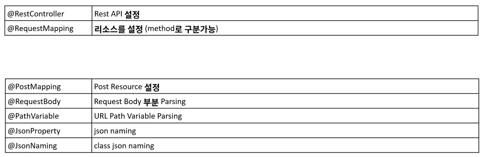
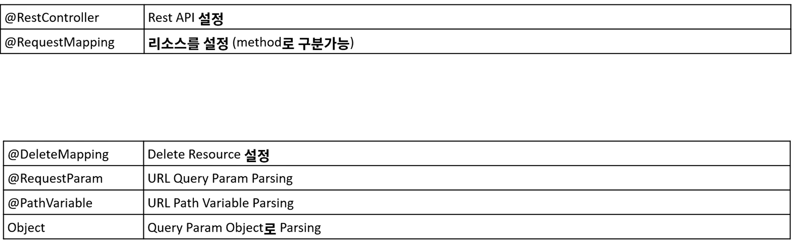

# 1. API 생성

- Intellij에서 new project -> spring boot -> gradle, java 로 생성(파일 이름 springstart)

- 파일 중 rc > main > java > com.example.springstart 에 controller 생

  - ApiController.java

    - ```java
      package com.example.springstart.controller;
      
      import org.springframework.web.bind.annotation.GetMapping;
      import org.springframework.web.bind.annotation.RequestMapping;
      import org.springframework.web.bind.annotation.RestController;
      
      //해당 class 는 REST API 를 처리하는 콘트롤러로 등록됨(자동인식)
      @RestController 
       // RequestMapping 은 URI 를 지정해주는 Annotation
      @RequestMapping("/api")
      public class ApiController {
          
           //http://localhost:808/api/hello	
          @GetMapping("/hello") 
          public String hello(){
              return "hello spring boot!";
          }
      }
      ```

    - 8080 포트에 실행됨 (//http://localhost:808/api/hello)

    - 브라우저 출력값 : hello spring boot 


# 2. GET method

### get 메소드 생성

- ```java
  @RestController
  @RequestMapping("/api/get")
  public class GetApiController {
  
      //http://localhostL80080/api/get/hello
      //GetMapping으로 자동으로 get method 사용
      @GetMapping(path = "/hello")
      public String Hello(){
          return "get Hello";
      }
  
      //예전에 사용하는 방식, 현재사용x
      //get 방식, http://localhost:8080/api/get/hi
      @RequestMapping(path = "hi", method = RequestMethod.GET)
      public String hi(){
          return "hi";
      }
  }
  ```

  

### Path Variable

- 형식 : http://localhost:8080/api/get/path-variable/{name}/{id}

- ```java
  @RestController
  @RequestMapping("/api/get")
  public class GetApiController {
  	//http://localhost:8080/api/get/path-variable/{name}
      //변수 이름을 다르게 설정할 때는 pathVariable 에 name = "name" / name = "id" 등으로 설정
      @GetMapping("/path-variable/{name}")
      //인자는 @Pathvariable Stirng name 으로 가능
      public String pathVariable(@PathVariable(name = "name") String pathName){
          System.out.println("PathVariable : " + pathName);
  
          return pathName;
      }
  }
  ```

- path variable 을 여러개 사용한다면?

  - ```java
     @GetMapping("/path-variable/{name}/{id}")
        public String pathVariable(
            //annotation여러개 사용 및 콤마
                @PathVariable(name = "name") String pathName,
                @PathVariable(name = "id") String id
        ){
            System.out.println("PathVariable : " + pathName);
      
            return pathName + " " + id;
        }
    ```

    

### Query Parameter

- query parameter는 검색을 위한 매개변수(Key value)

- 형식 : .../search?key=value&key=value&key=value...

- http://localhost:8080/api/get/query-param?user=steve&email=steve@gmail.com&age=30

- ``` java
  @RestController
  @RequestMapping("/api/get")
  public class GetApiController {
  
      //방법 1
  	@GetMapping(path = "query-param")
      public String queryParam(@RequestParam Map<String, String> queryParam){
  
          StringBuilder sb = new StringBuilder();
  
          queryParam.entrySet().forEach(entry -> {
              System.out.println(entry.getKey());
              System.out.println(entry.getValue());
              System.out.println("\n");
  
              sb.append(entry.getKey() + " = " + entry.getValue() + "\n");
          });
  
          return sb.toString();
      }
  
      //방법2
      @GetMapping("query-param02")
      public String queryParam02(
              @RequestParam String name,
              @RequestParam String email,
              @RequestParam int age
      ){
          System.out.println(name);
          System.out.println(email);
          System.out.println(age);
  
          return name + " " + email + " " + age;
      }
  
      //현업에서 가장 많이 쓰이는 방법
      //UserRequest 클래스를 통해 쿼리파라미터를 미리 정의, @RequestParam을 붙이지않음
      @GetMapping("query-param03")
      public String queryParam03(UserRequest userRequest){
          System.out.println(userRequest.getName());
          System.out.println(userRequest.getEmail());
          System.out.println(userRequest.getAge());
  
          return userRequest.toString();
      }
  }
  ```

  - UserRequest 클래스

    - ```java
      package com.example.springstart.dto;
      
      //parameter 정보 저장 및 getter and setter 설정
      //toString 설정해서 이용 가능
      public class UserRequest {
          private String name;
          private String email;
          private int age;
      
          public String getName() {
              return name;
          }
      
          public void setName(String name) {
              this.name = name;
          }
      
          public String getEmail() {
              return email;
          }
      
          public void setEmail(String email) {
              this.email = email;
          }
      
          public int getAge() {
              return age;
          }
      
          public void setAge(int age) {
              this.age = age;
          }
      
          @Override
          public String toString() {
              return "UserRequest{" +
                      "name='" + name + '\'' +
                      ", email='" + email + '\'' +
                      ", age=" + age +
                      '}';
          }
      }
      ```

      

# 3. POST method

### JSON

- 주로 데이터를 주고 받을 때는 JSON 사용

- JSON 형식

  - ```json
    string : value
    number : value
    boolean : value{}
    object : value
    array : value []
    
    {
        //스네이크 케이스
    	"phoneNumber" : "010-1111-2222",
        "age" : 10,
        "isAgree" : false,
        "account" : {
            "email" : "steve@gmail.com",
            "password" : "1234"
        }
    }
    
    //array 예시, user 조회하는 경우
    
    {
        "user_list" : [
            {
                "account" : "abcd",
                "password" : "1234"
            },
            {
                "account" : "aaaaa",
                "password" : "4321"
            },
            {
                "account" : "bbbb",
                "password" : "2222"
            }
        ]
    }
    ```

  

- 예시 ) 사용자 계정생성 시

  - ```json
    {
    	"account" : "",
        "email" : "",
        "password" : "",
        "address" : ""
    }
    ```

    

### 컨트롤러(Map방식)

- Map방식으로 정보를 받음

  - ```java
    package com.example.post.controller;
    
    import ...;
    
    @RestController
    @RequestMapping("/api")
    public class PostApiController {
    
        @PostMapping("/post")
        //@RequestBody 가 있어야 받을 수 있음
        public void post(@RequestBody Map<String, Object> requestData){
          
            /*requestData.entrySet().forEach(stringObjectEntry -> {
        		System.out.println("key : " + stringObjectEntry.getKey());
                System.out.println("value : " + stringObjectEntry.getValue());
        	}	
        		*/
            //위 코드를 간략화한 것
            requestData.forEach((key, value) -> {
                System.out.println("key : " + key);
                System.out.println("value : " + value);
            });
    
        }
    }
    ```

- JSON

  - ```json
    {
      "account" : "user01",
      "email" : "steve@gmail.com",
      "address" : "패스트캠퍼스",
      "password" : "abcd",
      "phone_number" : "01071744174"
    }
    ```

- OUTPUT : 이용하기 불편

  - key : account
    value : user01
    key : email
    value : steve@gmail.com
    key : address
    value : 패스트캠퍼스
    key : password
    value : abcd
    key : phone_number
    value : 01071744174


### 컨트롤러(Dto 방식)

- Map 방식이 이용하기 불편하기 때문에 Dto 방식 사용

  - ```java
    package com.example.post.controller;
    
    import ...
    
    @RestController
    @RequestMapping("/api")
    public class PostApiController {
    
        @PostMapping("/post")
        public void post(@RequestBody PostRequestDto requestData){
            System.out.println(requestData);
        }
        
    }
    ```

- PostRequestDto 클래스

  - ```java
    package com.example.post.dto;
    
    import com.fasterxml.jackson.annotation.JsonProperty;
    
    public class PostRequestDto {
    
        private String account;
        private String email;
        private String address;
        private String password;
        //스네이크 방식과 카멜방식을 사용가능
        @JsonProperty("phone_number")
        private String phoneNumber; //phone_number
    
        public String getPhoneNumber() {
            return phoneNumber;
        }
    
        public void setPhoneNumber(String phoneNumber) {
            this.phoneNumber = phoneNumber;
        }
    
        public String getAccount() {
            return account;
        }
    
        public void setAccount(String account) {
            this.account = account;
        }
    
        public String getEmail() {
            return email;
        }
    
        public void setEmail(String email) {
            this.email = email;
        }
    
        public String getAddress() {
            return address;
        }
    
        public void setAddress(String address) {
            this.address = address;
        }
    
        public String getPassword() {
            return password;
        }
    
        public void setPassword(String password) {
            this.password = password;
        }
    
        @Override
        public String toString() {
            return "PostRequestDto{" +
                    "account='" + account + '\'' +
                    ", email='" + email + '\'' +
                    ", address='" + address + '\'' +
                    ", password='" + password + '\'' +
                    ", phoneNumber='" + phoneNumber + '\'' +
                    '}';
        }
    }
    ```

- OUTPUT
  - PostRequestDto{account='user01', email='steve@gmail.com', address='패스트캠퍼스', password='abcd', phoneNumber='01071744174'}
  - key, value 값 정보를 이용가능


### annotation 정리

- 


# 4. PUT API

- 리소스의 갱신, 생성
- 리소스가 없으면 생성, 있으면 기존 것을 갱신(따라서 멱등하다)
- 잘못된 부분도 업데이트하기 때문에 안정성이 없음

### PutApiController

- ```java
  package com.example.put;
  
  import com.example.put.dto.PostRequestDto;
  import org.springframework.web.bind.annotation.*;
  
  @RestController
  @RequestMapping("/api")
  public class PutApiController {
  
      @PutMapping("/put")
      //put 메소드에 @REquestBody annotation, PostRequestDto 클래스 사용
      public PostRequestDto put(@RequestBody PostRequestDto requestDto){
          System.out.println(requestDto);
          //object 를 리턴시키면 object mapper 에서 json 으로 바꿔줌
          return requestDto;
      }
  }
  
  ```

### PostRequestDto

- @JsonNaming 어노테이션 사용

- ```java
  package com.example.put.dto;
  
  import com.fasterxml.jackson.databind.PropertyNamingStrategy;
  import com.fasterxml.jackson.databind.annotation.JsonNaming;
  
  import java.util.List;
  
  //해당클래스는 objectmapper 모듈이 동작할 때 snake method 로 동작(carList -> car_list)
  @JsonNaming(value= PropertyNamingStrategy.SnakeCaseStrategy.class)
  public class PostRequestDto {
  
      private String name;
      private int age;
      private List<CarDto> carList;
  
      public String getName() {
          return name;
      }
  
      public void setName(String name) {
          this.name = name;
      }
  
      public int getAge() {
          return age;
      }
  
      public void setAge(int age) {
          this.age = age;
      }
  
      public List<CarDto> getCarList() {
          return carList;
      }
  
      public void setCarList(List<CarDto> carList) {
          this.carList = carList;
      }
  
      @Override
      public String toString() {
          return "PostRequestDto{" +
                  "name='" + name + '\'' +
                  ", age=" + age +
                  ", carList=" + carList +
                  '}';
      }
  }
  ```

### CarDto

- CarDto list 형성을 위해서 만든 클래스

- 마찬가지로 JsonNaming 사용

- ```java
  package com.example.put.dto;
  
  import com.fasterxml.jackson.annotation.JsonProperty;
  import com.fasterxml.jackson.databind.PropertyNamingStrategy;
  import com.fasterxml.jackson.databind.annotation.JsonNaming;
  
  //마찬가지로 JsonNaming 사용
  @JsonNaming(value= PropertyNamingStrategy.SnakeCaseStrategy.class)
  public class CarDto {
  
      private String name;
      private String carNumber;
  
      public String getName() {
          return name;
      }
  
      public void setName(String name) {
          this.name = name;
      }
  
      public String getCarNumber() {
          return carNumber;
      }
  
      public void setCarNumber(String carNumber) {
          this.carNumber = carNumber;
      }
  
      @Override
      public String toString() {
          return "CarDto{" +
                  "name='" + name + '\'' +
                  ", carNumber='" + carNumber + '\'' +
                  '}';
      }
  }
  ```

- OUTPUT 

  - API

    - ```json
      {
      	"name" : "steve",
      	"age" : 20,
      	"car_list" : [
      		{
      			"name" : "BMW",
      			"car_number" : "11가 1234"
      		},
      		{
      			"name" : "A4",
      			"car_number" : "22가 3456"
      		}
      	]
      }
      ```

  - PostRequestDto{name='steve', age=20, carList=[CarDto{name='BMW', carNumber='11가 1234'}, CarDto{name='A4', carNumber='22가 3456'}]}


### PathVariable 사용

- ```java
  package com.example.put;
  
  import com.example.put.dto.PostRequestDto;
  import org.springframework.web.bind.annotation.*;
  
  @RestController
  @RequestMapping("/api")
  public class PutApiController {
  
      @PutMapping("/put/{userId}")
      public PostRequestDto put(@RequestBody PostRequestDto requestDto, @PathVariable(name = "userId") Long id){
          System.out.println(id);
          return requestDto;
      }
  }
  ```

- api는 위와 동일

- output : 100 

  - userId 가 출력됨 (return 값은 requestDto)


# 5. DELETE API

- CRUD 중 delete 기능

### DeleteApiController

- ```java
  package com.example.delete.controller;
  
  import org.springframework.web.bind.annotation.*;
  
  @RestController
  @RequestMapping("/api")
  public class DeleteApiController {
  
      @DeleteMapping("/delete/{userId}")
      //delete 는 dto 요청하는 값 자체가 작고 제한적이라서 pathVariable 이나 queryParameter 가 편함
      public void delete(@PathVariable String userId, @RequestParam String account){
          System.out.println(userId);
          System.out.println(account);
      }
  }
  ```

  - 동작 자체가 리소스 삭제이기 때문에 이미 리소스가 없는 상태라도 status 200을 던짐


### API Request

- http://localhost:8080/api/delete/100?account=user100
- OUTPUT : 
  - 100
    user100


### delete annotation 정리




# 6. Response 내려주기 및 모범사례

### Get

- ```java
  package com.example.response.controller;
  
  
  @RestController
  @RequestMapping("/api")
  public class ApiController {
  
      //TEXT
      @GetMapping("/text")
      public String text(@RequestParam String account){
          return account;
      }
  }
  ```

  - url : http://localhost:8080/api/text?account=user100
  - output : user100


### JSON 파일로 주기

- ```java
  package com.example.response.controller;
  
  @RestController
  @RequestMapping("/api")
  public class ApiController {
  
  
      //JSON
      //req -> object mapper -> object -> method -> object -> object mapper -> json -> res
      @PostMapping("/json")
      public User json(@RequestBody User user){
          return user;
      }
  
  }
  ```

- User 클래스

  - ```java
    package com.example.response.dto;
    
    @JsonNaming(value = PropertyNamingStrategy.SnakeCaseStrategy.class)
    //non_null 만 포함시키겠다 = null 값은 포함하지 않겠다
    @JsonInclude(JsonInclude.Include.NON_NULL)
    public class User {
        private String name;
        private int age;
        private String phoneNumber;
        private String address;
    
        public String getName() {
            return name;
        }
    
        public void setName(String name) {
            this.name = name;
        }
    
        public int getAge() {
            return age;
        }
    
        public void setAge(int age) {
            this.age = age;
        }
    
        public String getPhoneNumber() {
            return phoneNumber;
        }
    
        public void setPhoneNumber(String phoneNumber) {
            this.phoneNumber = phoneNumber;
        }
    
        public String getAddress() {
            return address;
        }
    
        public void setAddress(String address) {
            this.address = address;
        }
    
    
        @Override
        public String toString() {
            return "User{" +
                    "name='" + name + '\'' +
                    ", age=" + age +
                    ", phoneNumber='" + phoneNumber + '\'' +
                    ", address='" + address + '\'' +
                    '}';
        }
    }
    ```

- body

  - ```json
    {
    	"name" : "steve",
    	"age" : 10,
    	"phone_number" : "01071744174",
    	"address" : "패스트캠퍼스"
    }
    ```

- response

  - ```json
    {
    	"name" : "steve",
    	"age" : 10,
    	"phone_number" : "01071744174",
    	"address" : "패스트캠퍼스"
    }
    ```

    

### http status 정하는 방법

- ResponseEntity 를 사용하여 정함

- ```java
  package com.example.response.controller;
  
  import com.example.response.dto.User;
  import org.springframework.http.HttpStatus;
  import org.springframework.http.ResponseEntity;
  import org.springframework.web.bind.annotation.*;
  
  @RestController
  @RequestMapping("/api")
  public class ApiController {
  
      @PutMapping("/put")
      //http status 를 정하는 방법
      public ResponseEntity<User> put(@RequestBody User user){
          //status 를 201 로 내려주고 body 에 user 도 넣음
          return ResponseEntity.status(HttpStatus.CREATED).body(user);
      }
  }
  ```

  

### PageController(html 파일 사용)

- @Controller 사용

- ```java
  package com.example.response.controller;
  
  @Controller
  public class PageController {
  
      //return 자체가 String 이 되면 자동으로 resources 에 있는 html 을 찾아감
      @RequestMapping("/main")
      public String main(){
          return "main.html";
      } 
  }
  ```

- html(resource > static)

  - ```html
    <!DOCTYPE html>
    <html lang="en">
    <head>
        <meta charset="UTF-8">
        <title>Title</title>
    </head>
    <body>
    Main Html Spring Boot
    </body>
    </html>
    ```

  - output : Main Html Spring Boot


### 객체 자체가 리턴됐을 때 responsebody 로 내림

- ```java
  package com.example.response.controller;
  
  @Controller
  public class PageController {
  
      //이 부분에서 json 을 내려주는 방법
      //responseEntity도 있음(아래는 다른 방법)
      //객체 자체가 리턴했을 때 responsebody 로 내리겠다는 뜻
      @ResponseBody
      @GetMapping("/user")
      public User user(){
          var user = new User();
          user.setName("steve");
          user.setAddress("패스트 캠퍼스");
          return user;
      }
  }
  ```

  - output 

    - ```java
      {
      "name": "steve",
      "age": 0,
      "address": "패스트 캠퍼스"
      }
      ```

      - @JsonInclude(JsonInclude.Include.NON_NULL) 때문에 phone_number 미출력


# 7. 모범사례 - object

- objectmapper 는 간접적으로 계속 겪음
- objectmapper는 Text형태의 JSON 을 Object 로 바꿔주거나 반대로 Object 를 text 형태의 JSON 으로 바꿔줌


### User class

- ```java
  package com.example.objectmapper;
  
  import com.fasterxml.jackson.annotation.JsonProperty;
  
  public class User {
      private String name;
      private int age;
      //snake <-> camel case 전환
      @JsonProperty("phone_number")
      private String phoneNumber;
  
      //default 생성자
      public User(){
          this.name = null;
          this.age = 0;
          this.phoneNumber = null;
      }
  
      public User(String name, int age, String phoneNumber){
          this.name = name;
          this.age = age;
          this.phoneNumber = phoneNumber;
      }
  
      public String getPhoneNumber() {
          return phoneNumber;
      }
  
      public String getName() {
          return name;
      }
  
      public int getAge() {
          return age;
      }
  
  
      @Override
      public String toString() {
          return "User{" +
                  "name='" + name + '\'' +
                  ", age=" + age +
                  ", phoneNumber='" + phoneNumber + '\'' +
                  '}';
      }
  }
  ```

  - object 를 text 로 바꾸기 위해 getter 생성
  - 반대로 text 를 object 로 바꾸기 위해 디폴트 생성자 있음


### Text to Object / Object to Text

- test class 에서 진행함

- ```java
  package com.example.objectmapper;
  
  import com.fasterxml.jackson.core.JsonProcessingException;
  import com.fasterxml.jackson.databind.ObjectMapper;
  import org.junit.jupiter.api.Test;
  import org.springframework.boot.test.context.SpringBootTest;
  
  @SpringBootTest
  class ObjectMapperApplicationTests {
  
      @Test
      void contextLoads() throws JsonProcessingException {
          System.out.println("-----------");
  
          var objectMapper = new ObjectMapper();
          //object -> text
          var user = new User("steve", 10, "01011112222");
  
          //value 를 String 으로 바꿔줌
          //object mapper 는 get 메소드를 활용한다
          //내가 만들 클래스가 object mapper 에서 활용되면, 임의로 만드는 get 메소드는 없어야 함 ex) getDefault(){}
          var text = objectMapper.writeValueAsString(user);
          System.out.println(text);
  
          //text -> object
          //objectMapper 는 동작하기 위해서 디폴트 생성자가 있어야 함
          var objectUser = objectMapper.readValue(text, User.class);
          System.out.println(objectUser);
      }
  }
  ```

  - objectMapper.writevalueAsString 메소드는 throw 나 try/catch 필요
  - 또한 get 메소드 필요
  - get 메소드 사용 시 임의로 만든 get 메소드는 없어야 함(그것도 인식하기 때문)
  - objectMapper.readValue 메소드는 디폴트 생성자 필요

- OUTPUT 
  - {"name":"steve","age":10,"phone_number":"01011112222"}  -> text(String 타입)
    User{name='steve', age=10, phoneNumber='01011112222'} -> objectUser(User 타입)

