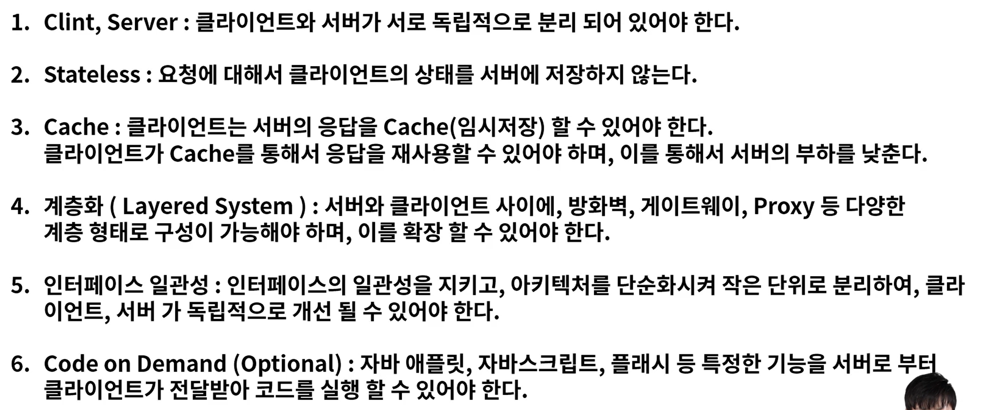
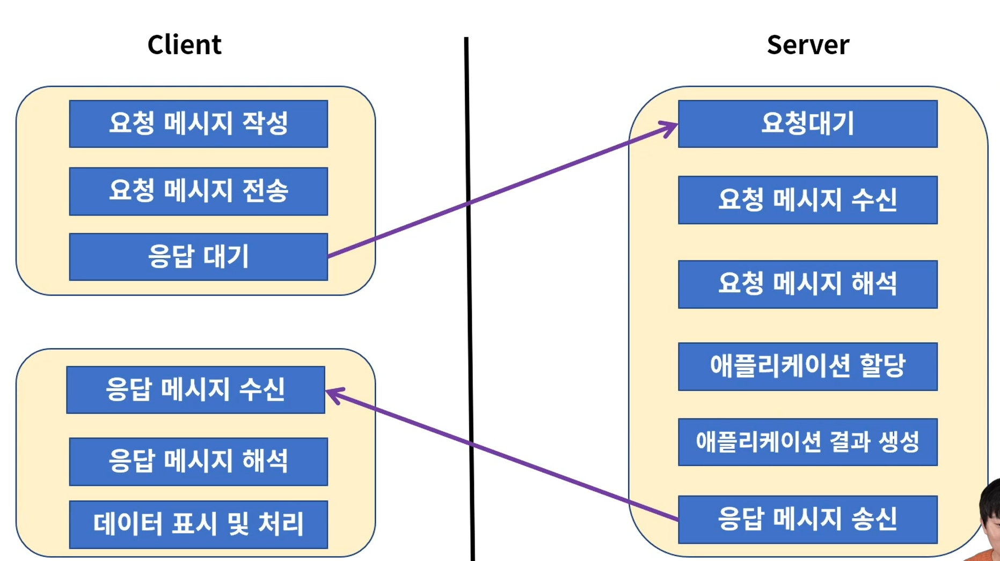
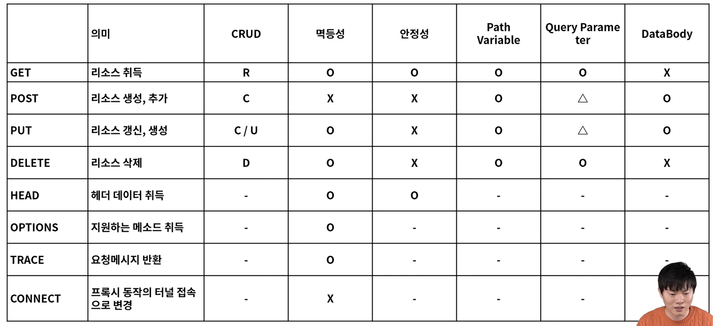
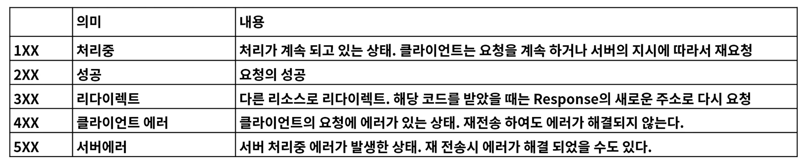
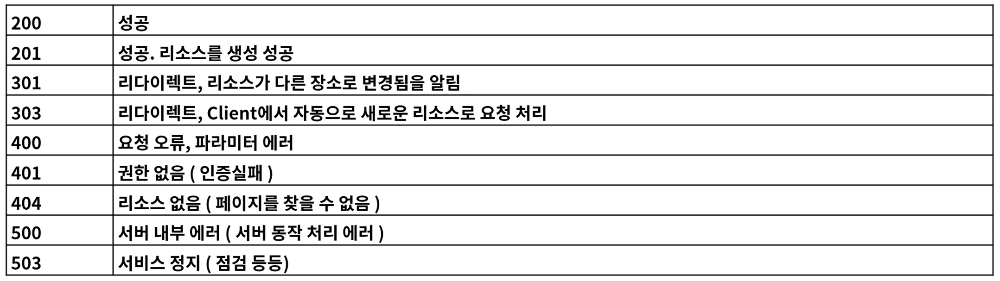

# 1. REST

- REST(Representational State Transfer : 자원의 상태 전달) - 네트워크 아키텍처
- 

- 인터페이스 일관성이 잘 지켜졌는지에 따라 REST가 잘 지켜졌는지 확인(4가지)
  - 자원의 식별
    - 웹 기반의 REST 에는 리소스 접근을 할 때  URI를 사용
      - http://foo.co.kr/user/100
      - resource : user / 식별자 : 100
  - 메시지를 통한 리소스 조작
    - HTML, XML, JSON, TEXT 등 어떤 타입의 데이터인지 알려주기 위해 HTTP Header 부분에 content-type 을 통해 데이터 타입 지정 가능
    - 리소스 조작을 위해 데이터 전체를 전달하지 않고, 이를 메세지로 전달
  - 자기서술적 메세지
    - 요청하는 데이터가 어떻게 처리되어져야 하는지 충분한 데이터를 포함할 수 있어야 함
    - GET, POST, PUT, DELETE 등
  -  Application상태에 대한 엔진으로써 하이퍼미디어
    - REST API를 개발할 때 단순히 client 요청에 대한 데이터만 응답해주는 것이 아니라 관련된 리소스에 대한 Link 정보까지 같이 포함

# 2. URI 설계 원칙

- 슬래시 (/) 는 계층관계를 나타내는 데 사용
- URI 마지막 문자로 (/) 는 포함하지 않음
- 하이폰(-)은 URI 가독성을 높이는데 사용
- 밑줄(_) 사용 금지
  - ex) http://fastcampus.co.kr/classes/java/curriculums/web-master
- URI 경로에는 소문자가 적함
- 파일 확장자는 URI에 포함하지 않음
- 프로그래밍언어에 의존적인 확장자 사용하지 않음
  - ex) ..../web-master.do (x)
- 구현에 의존적인 경로를 사용하지 않음
  - ex) http://.../servlet/... (x)

- session ID 를 포함하지 않음

  - ex) https://.../web-master?session-id=abcdf (x)

- 프로그래밍 언어의 Method명을 사용하지 않음

  - ex) https://.../web-master?action=intro (x)

- 명사에 단수형보다는 복수형을 사용

- 컨트롤러 이름으로는 동사나 동사구를 사용

- 경로부분 중 변하는 부부은 유일한 값으로 대체

  - ex) .../curriculums/web-master/lessons/{lesson-id}/users/{user-id}

  - ex) .../curriculums/web-master/lessons/2/users/100

- CRUD 기능을 나타내는 것은 URI에 사용하지 않음

- URI Query Parameter 디자인

  - URI 쿼리 부분으로 컬렉션 결과에 대해 필터링 할 수 있음
    - ex) .../curriculums/web-mater?chapter=2
  - URI 쿼리는 컬렉션의 결과를 페이지로 구분하여 나타내는데 사용
    - ex) .../curriculums/web-master?chapter=2&page=0&size=10&sort=asc

- API에 있어서 서브도메인은 일관성 있게 사용

- 클라이언트 개발자 포탈 서브 도메인은 일관성 있게 만듬

# 3. HTTP 프로토콜

- HTTP 는 메세지를 주고 받는 형태의 통신 방법
  - 

- HTTP의 요청을 특성하는 방법 8가지
  - 
    - 멱등성 : 같은 요청에 같은 값을 응답

- HTTP Status Code
  - 
  - 자주사용되는 코드
    - 