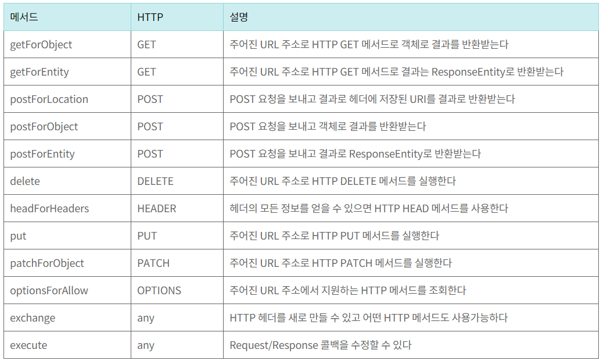

# 0. Server 로의 연결

- RestTemplate 을 통해 서버 연결


# 1. Rest Template 사용 : Get 방식

- Client 와 sever 를 따로 구동 => 8080, 9090 포트


### Client 

- ApiController 

  - RestTemplateService 클래스 이용

  - ```java
    package com.example.client.controller;
    
    
    import ...;
    
    @RestController
    @RequestMapping("/api/client")
    public class ApiController {
    
        private final RestTemplateService restTemplateService;
    
        public ApiController(RestTemplateService restTemplateService) {
            this.restTemplateService = restTemplateService;
        }
    
        @GetMapping("/hello")
        public UserResponse getHello(){
            return restTemplateService.hello();
        }
    }
    ```

- RestTemplateService 클래스

  - RestTemplate 클래스

    - Rest api를 호출할 수 있는  Spring 내장 클래스로, Rest api 호출이후 응답을 받을 때까지 기다리는 동기 방식	
    -  http 요청 후 JSON, XML, String 과 같은 응답을 받을 수 있는 템플릿
    - 

  - ```java
    package com.example.client.service;
    
    import com.example.client.dto.UserResponse;
    import org.springframework.http.ResponseEntity;
    import org.springframework.stereotype.Service;
    import org.springframework.web.client.RestTemplate;
    import org.springframework.web.util.UriComponentsBuilder;
    import java.net.URI;
    
    @Service
    public class RestTemplateService {
    
        //http://localhost/api/server/hello 를 호출해서 res 를 받아올거임
        public UserResponse hello(){
            //server 의 uri 로 접속
            //queryParam 사용 가능
            URI uri = UriComponentsBuilder
                    .fromUriString("http://localhost:9090")
                    .path("/api/server/hello")
                    .queryParam("name","steve")
                    .queryParam("age",10)
                    .encode().build().toUri();
    
            //http://localhost:9090/api/server/hello?name=steve&age=10
            System.out.println(uri.toString());
    
            //restTemplate 생성
            RestTemplate restTemplate = new RestTemplate();
            //getForObject나 getForEntity 를 사용하여 서버에서 실행함
            //상세한 정보를 얻기 위해 ResponseEntity<T> 클래스와 getForEntity 사용
            //String result = restTemplate.getForObject(uri, String.class); 사용 가능
            ResponseEntity<UserResponse> result = restTemplate.getForEntity(uri, UserResponse.class);
            System.out.println(result.getStatusCode());
            System.out.println(result.getBody());
    
            //Return 값은 UserResponse 클래스 임
            return result.getBody();
        }
    }
    ```

- UserResponse 클래스

  - ```java
    package com.example.client.dto;
    
    public class UserResponse {
    
        private String name;
        private int age;
    
        //getter, setter 및 toString 포함
    }
    ```


### Server

- application.properties 에 server.port = 9090

- ServerApiController

  - ```java
    package com.example.server.controller;
    
    import ...;
    
    @RestController
    @RequestMapping("/api/server")
    public class ServerApiController {
    
        @GetMapping("/hello")
        //client 에서 queryParam 을 보냈으므로 name, age 를 받을 수 있음
        public User hello(@RequestParam String name, @RequestParam int age){
            User user = new User();
            user.setName(name);
            user.setAge(age);
            return user;
        }
    }
    ```

- User 클래스

  - ```java
    package com.example.server.dto;
    
    import lombok.AllArgsConstructor;
    import lombok.Data;
    import lombok.NoArgsConstructor;
    
    @Data
    @NoArgsConstructor
    @AllArgsConstructor
    public class User {
        private String name;
        private int age;
    
    }
    ```

### 결과

- client log

  - http://localhost:9090/api/server/hello?name=steve&age=10
    200 OK
    UserResponse{name='steve', age=10}

- server log : 아무것도 없음

- body 

  - {

    "name": "steve",

    "age": 10

    }


# 2. Rest Template : Post 방식

### Client

- RestTemplateService 클래스

  - Server 로 보내는 값은 return 값인 UserResponse{name='steve', age=10}

  - ```java
    package com.example.client.service;
    
    import com.example.client.dto.UserRequest;
    import com.example.client.dto.UserResponse;
    import org.springframework.http.ResponseEntity;
    import org.springframework.stereotype.Service;
    import org.springframework.web.client.RestTemplate;
    import org.springframework.web.util.UriComponentsBuilder;
    
    import java.net.URI;
    
    @Service
    public class RestTemplateService {
    
        public UserResponse post(){
            // http://localhost:90090/api/server/user/{userId}/name/{userName}
            //expand() 에 순서대로 넣어주면 됨
            URI uri = UriComponentsBuilder
                    .fromUriString("http://localhost:9090")
                    .path("/api/server/user/{userId}/name/{name}")
                    .encode().build()
                    .expand("100", "steve")
                    .toUri();
    
            System.out.println(uri);
    
            //http body 가 있어야 하는데 object 만 보내면 object mapper 가
            // json 으로 바꿔서 rest template 에서 http body 에 json 으로 변경
            UserRequest req = new UserRequest();
            req.setName("steve");
            req.setAge(10);
    
            RestTemplate restTemplate = new RestTemplate();
            //uri 에 req 를 보내서 응답은 UserResponse.class 로 받을거야
            ResponseEntity<UserResponse> response = restTemplate.postForEntity(uri, req, UserResponse.class);
    
            System.out.println(response.getStatusCode());
            System.out.println(response.getHeaders());
            System.out.println(response.getBody());
    
            return response.getBody();
        }
    }
    ```

- UserRequest, UserResponse 클래스 (똑같은 코드)

  - ```java
    package com.example.client.dto;
    
    public class UserRequest {
    
        private String name;
        private int age;
    
       //getter, setter 및 toString 구성
    ```

- ApiController 

  - ```java
    package com.example.client.controller;
    
    
    import ...;
    
    @RestController
    @RequestMapping("/api/client")
    public class ApiController {
    
        private final RestTemplateService restTemplateService;
    
        public ApiController(RestTemplateService restTemplateService) {
            this.restTemplateService = restTemplateService;
        }
    
        @GetMapping("/hello")
        public UserResponse getHello(){
            //위 get 방식의 hello() 메소드에서 post() 메소드로만 변경
            return restTemplateService.post();
        }
    }
    ```

    

### Server

- client 에게 받는 값 : UserResponse{name='steve', age=10}

-  ServerApiController 클래스

  - ```java
    package com.example.server.controller;
    
    import com.example.server.dto.User;
    import lombok.extern.slf4j.Slf4j;
    import org.springframework.web.bind.annotation.*;
    
    @Slf4j
    @RestController
    @RequestMapping("/api/server")
    public class ServerApiController {
    
        //getmapping 생략
    
        //postMapping 으로 받음
        //uri 는 client 와 똑같아야 됨
        @PostMapping("/user/{userId}/name/{userName}")
        //@Requestbody -> client 에게 받은 값 / PathVariable -> uri 값
        public User post(@RequestBody User user, @PathVariable int userId, @PathVariable String userName){
            log.info("userId : {}, userName : {}", userId, userName);
            log.info("client req : {}", user);
            return user;
        }
    }
    ```

### 결과

- url : http://localhost:8080/api/client/hello

- client log

  - 200 OK
    [Content-Type:"application/json", Transfer-Encoding:"chunked", Date:"Mon, 03 Oct 2022 08:51:28 GMT", Keep-Alive:"timeout=60", Connection:"keep-alive"]
    UserResponse{name='steve', age=10}

- server log

  - 2022-10-03 17:51:28.452  INFO 13168 --- [nio-9090-exec-1] o.s.web.servlet.DispatcherServlet        : Completed initialization in 1 ms
    2022-10-03 17:51:28.522  INFO 13168 --- [nio-9090-exec-1] c.e.s.controller.ServerApiController     : userId : 100, userName : steve
    2022-10-03 17:51:28.534  INFO 13168 --- [nio-9090-exec-1] c.e.s.controller.ServerApiController     : client req : User(name=steve, age=10)

- body

  - ```json
    {
        "name": "steve",
        "age": 10
    }
    ```

    


# 3. Rest Template : Exchange()

### 기본 사용 (requestEntity, exchange())

- RestTemplateService

  - RequestEntity 사용

    - Springframework에서 제공하는 HttpEntity 의 상속클래스
    - url 요청을 보낼 때 사용, responseEntity랑 비슷
    - header, body, method, url, type을 생성자 파라미터로 넘길 수 있음

  - ```java
    package com.example.client.service;
    
    import com.example.client.dto.UserRequest;
    import com.example.client.dto.UserResponse;
    import org.springframework.http.MediaType;
    import org.springframework.http.RequestEntity;
    import org.springframework.http.ResponseEntity;
    import org.springframework.stereotype.Service;
    import org.springframework.web.client.RestTemplate;
    import org.springframework.web.util.UriComponentsBuilder;
    
    import java.net.URI;
    
    @Service
    public class RestTemplateService {
    
        //hello(), post() 메소드 생략
    
        public UserResponse exchange(){
            URI uri = UriComponentsBuilder
                    .fromUriString("http://localhost:9090")
                    .path("/api/server/user/{userId}/name/{name}")
                    .encode().build()
                    .expand("100", "steve")
                    .toUri();
    
            UserRequest req = new UserRequest();
            req.setName("steve");
            req.setAge(10);
    
            //RequestEntity 는 header, body, method, url, type을 생성자 파라미터로 넘길 수 있음
            RequestEntity<UserRequest> requestEntity = RequestEntity
                    .post(uri)
                    .contentType(MediaType.APPLICATION_JSON)
                    .header("x-authorization", "abcd")
                    .header("custom-header", "fffff")
                    .body(req);
    
            RestTemplate restTemplate = new RestTemplate();
            
            //exchange 로 ResponseEntity 로 넘김
            ResponseEntity<UserResponse> response = restTemplate.exchange(requestEntity, UserResponse.class);
    
            return response.getBody();
        }
    }
    ```

#### Server

- ServerApiController

  - ```java
    package com.example.server.controller;
    
    import com.example.server.dto.User;
    import lombok.extern.slf4j.Slf4j;
    import org.springframework.web.bind.annotation.*;
    
    @Slf4j
    @RestController
    @RequestMapping("/api/server")
    public class ServerApiController {
    
        @PostMapping("/user/{userId}/name/{userName}")
        public User post(@RequestBody User user,
                         @PathVariable int userId,
                         @PathVariable String userName,
                         //@RequestHeader 를 사용해서 header 값이 잘 들어갔는지 확인
                         @RequestHeader("x-authorization") String authorization,
                         @RequestHeader("custom-header") String customHeader
        ){
            log.info("userId : {}, userName : {}", userId, userName);
            log.info("authorization : {}, custom : {}", authorization, customHeader);
            log.info("client req : {}", user);
    
    
            return user;
        }
    }
    ```

    

#### 결과

- url : http://localhost:8080/api/client/hello

- Server log 

  - 2022-10-03 20:48:28.114  INFO 10368 --- [nio-9090-exec-1] c.e.s.controller.ServerApiController     : userId : 100, userName : steve
    2022-10-03 20:48:28.115  INFO 10368 --- [nio-9090-exec-1] c.e.s.controller.ServerApiController     : authorization : abcd, custom : fffff
    2022-10-03 20:48:28.115  INFO 10368 --- [nio-9090-exec-1] c.e.s.controller.ServerApiController     : client req : User(name=steve, age=10)

- body

  - ```json
    {
    "name": "steve",
    "age": 10
    }
    ```


# 4. Rest Template : Generic <T> 사용

- 예를 들어서, json 파일 중 body 가 변경되는 값으로 설정하려면? ->  Generic 타입 설정

  - ```json
    {
      "header" : {
          "response_code" : ""
      },
      "body" : {
          
      }
    }
    ```

### Client

- Req 클래스 (dto)

- 제네릭 클래스로 선언

  - ```java
    package com.example.client.dto;
    
    public class Req<T> {
    
        private Header header;
        private T resBody;
    
        //헤더에 관한 부분
        public static class Header{
            private String responseCode;
    
            public String getResponseCode() {
                return responseCode;
            }
    
            public void setResponseCode(String responseCode) {
                this.responseCode = responseCode;
            }
    
            @Override
            public String toString() {
                return "Header{" +
                        "responseCode='" + responseCode + '\'' +
                        '}';
            }
        }
    
        public Header getHeader() {
            return header;
        }
    
        public void setHeader(Header header) {
            this.header = header;
        }
    
        public T getResBody() {
            return resBody;
        }
    
        public void setResBody(T resBody) {
            this.resBody = resBody;
        }
    
        @Override
        public String toString() {
            return "Req{" +
                    "header=" + header +
                    ", body=" + resBody +
                    '}';
        }
    }
    ```

  

- RestTemplateService 클래스

  - ```java
    package com.example.client.service;
    
    import ...;
    
    @Service
    public class RestTemplateService {
    
        public Req<UserResponse> genericExchange(){
            URI uri = UriComponentsBuilder
                    .fromUriString("http://localhost:9090")
                    .path("/api/server/user/{userId}/name/{name}")
                    .encode().build()
                    .expand("100", "steve")
                    .toUri();
    
            UserRequest userRequest = new UserRequest();
            userRequest.setName("steve");
            userRequest.setAge(10);
    
            //<T> 가 <UserRequest> 가 되는 것이므로, T resBody -> UserRequest resBody
            Req<UserRequest> req = new Req<>();
    		//Header 클래스 선언 및 OK 값 전달
            Req.Header header = new Req.Header();
            header.setResponseCode("Ok");
            
            req.setHeader(
                    header
            );
            req.setResBody(
                    userRequest
            );
            //setResBody 가 받는 인자가 <T> resBody 이므로 userRequest 가 들어가야 함
            req.setResBody(
                    userRequest
            );
    
            //ReuqestEntity 에 Req 를 넣고 body에 Req<> req 를 넣음
            RequestEntity<Req<UserRequest>> requestEntity = RequestEntity
                    .post(uri)
                    .contentType(MediaType.APPLICATION_JSON)
                    .header("x-authorization", "abcd")
                    .header("custom-header", "fffff")
                    .body(req);
    
            RestTemplate restTemplate = new RestTemplate();
    
            //제네릭 타입에는 .class 를 쓰지 못하기 때문에 ParameterizedTypeReference 를 사용해야 함
            //이미 앞에서 제네릭 타입을 선언했기 때문에 new ParameterizedTypeReference<>(){} 라고 사용 가능
            ResponseEntity<Req<UserResponse>> response = restTemplate
                    .exchange(requestEntity, new ParameterizedTypeReference<Req<UserResponse>>(){});
    
            //response.getBody() 는 responseEntity 에서 꺼낸거고, getResBody() 는 req 에서 꺼낸 것
            return response.getBody();
        }
    }
    ```

- ApiController 

  - getHello() 클래스와 리턴값만 변경

  - ```java
    package com.example.client.controller;
    
    
    import ...;
    
    @RestController
    @RequestMapping("/api/client")
    public class ApiController {
    
        private final RestTemplateService restTemplateService;
    
        public ApiController(RestTemplateService restTemplateService) {
            this.restTemplateService = restTemplateService;
        }
    
        @GetMapping("/hello")
        public Req<UserResponse> getHello(){
            return restTemplateService.genericExchange();
        }
    
    }
    ```


### Server

- Req 클래스 (dto)

  - ```java
    package com.example.server.dto;
    
    import lombok.AllArgsConstructor;
    import lombok.Data;
    import lombok.NoArgsConstructor;
    
    @Data
    @AllArgsConstructor
    @NoArgsConstructor
    public class Req<T> {
    
        private Header header;
        private T resBody;
    
    
        @Data
        @AllArgsConstructor
        @NoArgsConstructor
        public static class Header{
            private String responseCode;
        }
    }
    ```

- ServerApiController

  - ```java
    package com.example.server.controller;
    
    import com.example.server.dto.Req;
    import com.example.server.dto.User;
    import lombok.extern.slf4j.Slf4j;
    import org.springframework.http.HttpEntity;
    import org.springframework.web.bind.annotation.*;
    
    @Slf4j
    @RestController
    @RequestMapping("/api/server")
    public class ServerApiController {
    
        @GetMapping("/hello")
        public User hello(@RequestParam String name, @RequestParam int age){
            User user = new User();
            user.setName(name);
            user.setAge(age);
            return user;
        }
    
        @PostMapping("/user/{userId}/name/{userName}")
        public Req<User> post(
                         @RequestBody Req<User> user,
                         @PathVariable int userId,
                         @PathVariable String userName,
                         @RequestHeader("x-authorization") String authorization,
                         @RequestHeader("custom-header") String customHeader
        ){
            
            log.info("userId : {}, userName : {}", userId, userName);
            log.info("authorization : {}, custom : {}", authorization, customHeader);
            log.info("client req : {}", user);
    
            Req<User> response = new Req<>();
            response.setHeader(
                    user.getHeader()
            );
            response.setResBody(user.getResBody());
    
            return response;
        }
    }
    ```

    

### 결과

- url : http://localhost:8080/api/client/hello

- server log

  - 2022-10-04 20:28:18.944  INFO 18468 --- [nio-9090-exec-1] c.e.s.controller.ServerApiController     : userId : 100, userName : steve
    2022-10-04 20:28:18.946  INFO 18468 --- [nio-9090-exec-1] c.e.s.controller.ServerApiController     : authorization : abcd, custom : fffff
    2022-10-04 20:28:18.946  INFO 18468 --- [nio-9090-exec-1] c.e.s.controller.ServerApiController     : client req : Req(header=Req.Header(responseCode="OK"), resBody=User(name=steve, age=10))

- body

  - ```java
    {
        "header":{
        	"responseCode": "Ok"
        },
        "resBody":{
            "name": "steve",
            "age": 10
        }
    }
    ```


# 5. Naver API 장소 검색 연동

### Naver API 접속방법

- 네이버 검색창에 네이버 open api 검색

- Documents -> 서비스 API 에서 필요한 요청 URL 및 파라미터 사용

- 요청 시 헤더로 앱 등록 시 받은 클라이언트 id, pw 입력해야 함

- 예시

  - ```sh
    "https://openapi.naver.com/v1/search/local.xml?query=%EC%A3%BC%EC%8B%9D&display=10&start=1&sort=random" \
        -H "X-Naver-Client-Id: {애플리케이션 등록 시 발급받은 클라이언트 아이디 값}" \
        -H "X-Naver-Client-Secret: {애플리케이션 등록 시 발급받은 클라이언트 시크릿 값}" -v
    ```


### Server 구성

- client 는 필요없이, 인터넷 브라우저에서 바로 접속하면 됨

#### ServerApiController 클래스

- ```java
  package com.example.server.controller;
  
  import com.example.server.dto.Req;
  import com.example.server.dto.User;
  import lombok.extern.slf4j.Slf4j;
  import org.springframework.http.HttpEntity;
  import org.springframework.http.RequestEntity;
  import org.springframework.http.ResponseEntity;
  import org.springframework.web.bind.annotation.*;
  import org.springframework.web.client.RestTemplate;
  import org.springframework.web.util.UriComponentsBuilder;
  
  import java.net.URI;
  import java.nio.charset.Charset;
  import java.nio.charset.StandardCharsets;
  import java.util.Base64;
  
  @Slf4j
  @RestController
  @RequestMapping("/api/server")
  public class ServerApiController {
  
      @GetMapping("/naver")
      //https://openapi.naver.com/v1/search/local.json
      // ?query=%EC%A3%BC%EC%8B%9D
      // &display=10
      // &start=1
      // &sort=random
      public String naver(){
  
          //query="중국집" //.encode() 로 인코딩해주니깐 그냥 쓰면 됨
          URI uri = UriComponentsBuilder
                  .fromUriString("https://openapi.naver.com/")
                  .path("v1/search/local.json")
              	//api 문서에 보면 각 query별 내용이 있음
                  .queryParam("query", "중국집")
                  .queryParam("display", 10)
                  .queryParam("start", 1)
                  .queryParam("sort", "random")
                  .encode(Charset.forName("UTF-8"))
                  .build()
                  .toUri();
  
          RestTemplate restTemplate = new RestTemplate();
  
          //get 으로 넣을거라 들어갈게 없으니까 void 사용
          RequestEntity<Void> req = RequestEntity
                  .get(uri)
                  .header("X-Naver-Client-Id", "JJNtW48QUuGmK0eDIstx")
                  .header("X-Naver-Client-Secret", "xEvUPGa62d")
                  .build();
  
          ResponseEntity<String> result = restTemplate.exchange(req, String.class);
  
          return result.getBody();
      }
  }
  ```

  

### 결과

- ```java
  {
     "lastBuildDate":"Tue, 04 Oct 2022 21:10:04 +0900",
     "total":5,
     "start":1,
     "display":5,
     "items":[
        {
           "title":"란주라미엔",
           "link":"",
           "category":"중식>중식당",
           "description":"",
           "telephone":"",
           "address":"서울특별시 중구 충무로1가 25-9",
           "roadAddress":"서울특별시 중구 소공로 64",
           "mapx":"310273",
           "mapy":"551463"
        },
        {
           "title":"초류향",
           "link":"",
           "category":"중식>중식당",
           "description":"",
           "telephone":"",
           "address":"서울특별시 중구 다동 164-2",
           "roadAddress":"서울특별시 중구 다동길 24-10",
           "mapx":"310128",
           "mapy":"552188"
        },
        {
           "title":"산동교자",
           "link":"",
           "category":"중식>중식당",
           "description":"",
           "telephone":"",
           "address":"서울특별시 중구 명동2가 105",
           "roadAddress":"서울특별시 중구 명동2길 26",
           "mapx":"310297",
           "mapy":"551592"
        },
        {
           "title":"크리스탈제이드 소공점",
           "link":"http:\/\/www.crystaljade.co.kr",
           "category":"중식>중식당",
           "description":"",
           "telephone":"",
           "address":"서울특별시 중구 소공동 21-1 한국빌딩 B1",
           "roadAddress":"서울특별시 중구 남대문로7길 16 한국빌딩 B1",
           "mapx":"310191",
           "mapy":"551829"
        },
        {
           "title":"웨스틴 조선 서울 홍연",
           "link":"https:\/\/www.josunhotel.com\/hotel\/westinSeoul.do",
           "category":"중식>중식당",
           "description":"",
           "telephone":"",
           "address":"서울특별시 중구 소공동 87-1 LL층",
           "roadAddress":"서울특별시 중구 소공로 106 LL층",
           "mapx":"310091",
           "mapy":"551852"
        }
     ]
  }
  ```

  
