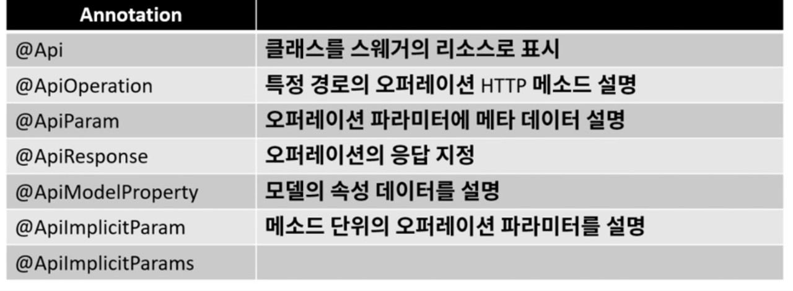

# 0. Swagger 란

- swagger 란 개발한 REST API 를 편리하게 문서화 해주고, 이를 통해서 관리 및 제 3의 사용자가 편리하게 API 를 호출해보고 테스트 할 수 있는 프로젝트이다.
- Spring boot 에서는 간단하게 springfox-boot-starter 를 gradle dependencies 에 추가함으로써 사용할 수 있다.
- 다만, 주의할 점은 운영환경과 같은 외부에 노출되면 안되는 곳에는 사용할 땐 주의해야 한다.
- Swagger
  - 

# 1. Swagger 사용

- spring initializer + lombok + spring web
- Maven Repository 에서 '[SpringFox Boot Starter](https://mvnrepository.com/artifact/io.springfox/springfox-boot-starter)' dependency 에 추가

### dismiss f@uck

