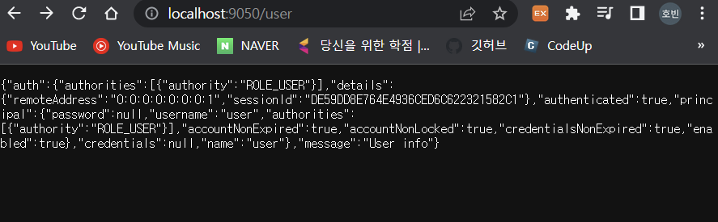
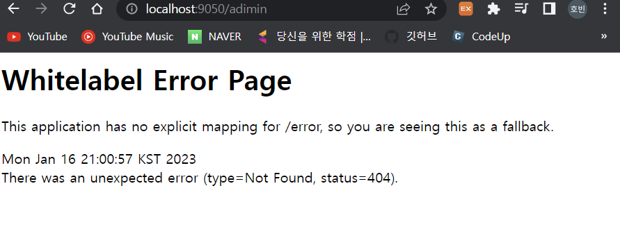

# 0. Spring Security 란

## 시큐리티가 필요한 이유

웹사이트는 각종 서비스를 하기 위한 리소스와 서비스를 사용하는 유저들의 개인 정보를 가지고 있습니다. 이들 리소스를 보호하기 위해서 일반적으로 웹 사이트는 두가지 보안 정책을 설정해야 합니다.

- 서버 리소스
- 유저들의 개인정보

### 인증 (Authentication)

사이트에 접근하는 사람이 누구인지 시스템이 알아야 합니다. 익명사용자(anonymous user)를 허용하는 경우도 있지만, 특정 리소스에 접근하거나 개인화된 사용성을 보장 받기 위해서는 반드시 로그인하는 과정이 필요합니다. 로그인은 보통 username / password 를 입력하고 로그인하는 경우와 sns 사이트를 통해 인증을 대리하는 경우가 있습니다.

​	UsernamePassword 인증

- Session 관리
- 토큰 관리 (sessionless)

​	Sns 로그인 (소셜 로그인) : 인증 위임

### 권한(Authorization)

사용자가 누구인지 알았다면 사이트 관리자 혹은 시스템은 로그인한 사용자가 어떤 일을 할 수 있는지 권한을 설정합니다. 권한은 특정 페이지에 접근하거나 특정 리소스에 접근할 수 있는 권한여부를 판단하는데 사용됩니다. **개발자는 권한이 있는 사용자에게만 페이지나 리소스 접근을 허용하도록 코딩해야 하는데, 이런 코드를 쉽게 작성할 수 있도록 프레임워크를 제공하는 것이 스프링 시큐리티 프레임워크(Spring Security Framework) 입니다.**

- Secured : deprecated

- PrePostAuthorize

- AOP

# 1. gradle 프로젝트 구성

### setting.gradle

- setting 에서는 전체 프로젝트 구조를 빌드함

- 일반적으로 한개의 프로젝트 구성

  - ```
    rootProject.name="project-name"
    include "project-name"
    ```

- 여러 모듈 프로젝트를 포함하는 경우

  - ```
    rootProject.name="project-name"
    include ":sub-project1"
    include ":sub-project2"
    ```

- 모듈 프로젝트들이 많아서 이들을 Group 으로 관리하고 싶다면 다음과 같이 자동 빌드하는 스크립트 사용

  - ```
    rootProject.name = 'security-gradle3'
    
    ["comp", "web", "server"].each {
    
        def compDir = new File(rootDir, it)
        if(!compDir.exists()){
            compDir.mkdirs()
        }
    
        compDir.eachDir {subDir ->
    
            def gradleFile = new File(subDir.absolutePath, "build.gradle")
            if(!gradleFile.exists()){
                gradleFile.text =
                        """
    
                        dependencies {
    
                        }
    
                        """.stripIndent(20)
            }
    
            [
                    "src/main/java/com/sp/fc",
                    "src/main/resources",
                    "src/test/java/com/sp/fc",
                    "src/test/resources"
            ].each {srcDir->
                def srcFolder = new File(subDir.absolutePath, srcDir)
                if(!srcFolder.exists()){
                    srcFolder.mkdirs()
                }
            }
    
            def projectName = ":${it}-${subDir.name}";
            include projectName
            project(projectName).projectDir = subDir
        }
    }
    ```

### build.gradle

- 루트 폴더의 build.gradle 에서는 전체 하위 프로젝트의 공통 설정에 대한 사항 기술

  - ```
    buildscript {
        ext {
            spring = "2.4.1"
            boot = "org.springframework.boot"
            lombok = "org.projectlombok:lombok"
        }
        repositories {
            mavenCentral()
        }
        dependencies {
            classpath("$boot:spring-boot-gradle-plugin:$spring")
        }
    }
    
    allprojects {
        group = "com.sp.fc"
        version = "1.0.0"
    }
    
    subprojects {
    
        apply plugin: "java"
        apply plugin: boot
        apply plugin: "io.spring.dependency-management"
        apply plugin: "idea"
    
        repositories {
            mavenCentral()
        }
    
        configurations {
            developmentOnly
            runtimeClasspath {
                extendsFrom developmentOnly
            }
        }
    
        dependencies {
            developmentOnly("$boot:spring-boot-devtools")
            implementation "$boot:spring-boot-starter-security"
            implementation 'com.fasterxml.jackson.core:jackson-annotations'
    
            compileOnly lombok
            testCompileOnly lombok
            annotationProcessor lombok
            testAnnotationProcessor lombok
    
            testImplementation "$boot:spring-boot-starter-test"
        }
    
        test {
            useJUnitPlatform()
        }
    
    }
    
    
    ["comp", "web"].each {
        def subProjectDir = new File(projectDir, it)
        subProjectDir.eachDir {dir->
            def projectName = ":${it}-${dir.name}"
            project(projectName){
                bootJar.enabled(false)
                jar.enabled(true)
            }
        }
    }
    ["server"].each {
        def subProjectDir = new File(projectDir, it)
        subProjectDir.eachDir {dir->
            def projectName = ":${it}-${dir.name}"
            project(projectName){
    
            }
        }
    }
    
    help.enabled(false)
    ```

### Test

- server 라이브러리에 basic-test 폴더 생성 시 하위 폴더 생성됨

- server.server-basic 생성 시

  #### build.gradle

  - ```
    dependencies {
        implementation("$boot:spring-boot-starter-web")
        implementation project(':comp-common-utils')
    }
    ```

    - spring-boot 파일 추가
    - comp-common-utils 추가하여 person 클래스 사용

  ### BasicTestApplication.java

  - ```java
    package com.sp.fc;
    
    import org.springframework.boot.SpringApplication;
    import org.springframework.boot.autoconfigure.SpringBootApplication;
    
    @SpringBootApplication
    public class BasicTestApplication {
        public static void main(String[] args){
    
            //comp-common-utils 에 있는 person 클래스 사용 가능
            Person person = Person.builder().name("test").build();
            System.out.println(person);
            SpringApplication.run(BasicTestApplication.class, args);
        }
    }
    ```

  - output : Person(name=test)

  

  ### comp.common-util.src.main.java.com.sp.fc.Person.java

  - ```java
    package com.sp.fc;
    
    import lombok.Data;
    import lombok.AllArgsConstructor;
    import lombok.NoArgsConstructor;
    import lombok.Builder;
    
    @Data
    @AllArgsConstructor
    @NoArgsConstructor
    @Builder
    
    public class Person {
        private String name;
    }
    ```

    

# Security 예제

### Res > application.yml

- spring.security.user 를 통해 최초 login 페이지에서 name, password, role 설정

- ```yaml
  server:
    port : 9050
  
  spring:
    security:
      user:
        name: user
        password: 1234
        roles: USER
  ```

  - Roles 를 통해 user 와 admin 구분 가능

### HomeController

- 홈페이지, user 권한 페이지, admin 권한 페이지로 구성

- ```java
  package com.sp.fc.web.controller;
  
  import ...;
  
  @RestController
  public class HomeController {
      //기본 홈페이지
      @RequestMapping("/")
      public String index(){
          return "homepage";
      }
  
      @RequestMapping("/auth")
      public Authentication auth(){
          return SecurityContextHolder.getContext()
                  .getAuthentication();
      }
  
      //PreAUthorize 를 통해 USER 만 접근 가능 페이지
      //SecurityMessage class 를 만들어서 간단하게 정보 표시
      @PreAuthorize("hasAnyAuthority('ROLE_USER')")
      @RequestMapping("/user")
      public SecurityMessage user(){
          return SecurityMessage.builder()
                  .auth(SecurityContextHolder.getContext().getAuthentication())
                  .message("User info")
                  .build();
      }
  
      //PreAUthorize 를 통해 Admin 만 접근 가능 페이지
      @PreAuthorize("hasAnyAuthority('ROLE_ADMIN')")
      @RequestMapping("/admin")
      public SecurityMessage admin(){
          return SecurityMessage.builder()
                  .auth(SecurityContextHolder.getContext().getAuthentication())
                  .message("admin info")
                  .build();
      }
  }
  ```

- SecurityMessage Class

  - ```java
    package com.sp.fc.web.controller;
    
    import lombok.Data;
    import lombok.AllArgsConstructor;
    import lombok.NoArgsConstructor;
    import lombok.Builder;
    import org.springframework.security.core.Authentication;
    
    @Data
    @AllArgsConstructor
    @NoArgsConstructor
    @Builder
    
    public class SecurityMessage {
    
        private Authentication auth;
        private String message;
    }
    ```

    - Authentication 은 인증정보를 표시
    - message 는 User info 와 admin info 로 구분

### web > config > SecurityConfig 클래스 생성

- yml 의 roles 에 따라 페이지 인증이 가능하도록 보안설정

- ```java
  package com.sp.fc.web.config;
  
  import org.springframework.context.annotation.Bean;
  import org.springframework.security.config.annotation.method.configuration.EnableMethodSecurity;
  import org.springframework.security.config.annotation.web.builders.HttpSecurity;
  import org.springframework.security.config.annotation.web.configuration.EnableWebSecurity;
  import org.springframework.security.config.annotation.web.configuration.WebSecurityConfiguration;
  import org.springframework.security.web.SecurityFilterChain;
  
  @EnableWebSecurity(debug = true)
  @EnableMethodSecurity(prePostEnabled = true)
  public class SecurityConfig{
      @Bean
      protected SecurityFilterChain configure(HttpSecurity http) throws Exception {
          http.formLogin().disable();
          return http.build();
      }
  }
  ```

### 결과

- User 로 http://localhost:9050/user 접근 시
  - 

- User 로 http://localhost:9050/admin 접근 시
  - 404 page
  - 

### SecurityConfig 안에서 Id, Pw 설정

- securityconfig class 안에서 id, pw 을 설정가능하다. 이렇게 되면 yml 에서 설정한거는 없어진다

- InMemoryUserDetailsManager 를 통해 build

- 이때 pw 는 인코딩처리가 필요하다

- ```java
  @Bean
  public InMemoryUserDetailsManager userDetailsService() {
      UserDetails user1 = User.builder()
          .username("user2")
          .password(passwordEncoder().encode("2222"))
          .roles("USER")
          .build();
  
      UserDetails user2 = User.builder()
          .username("admin")
          .password(passwordEncoder().encode("3333"))
          .roles("ADMIN")
          .build();
      return new InMemoryUserDetailsManager(user1, user2);
  }
  
  //인코딩 처리기
  @Bean
  PasswordEncoder passwordEncoder(){
      return new BCryptPasswordEncoder();
  }
  ```

### HomePage 는 누구나 접근가능하도록 설정하고 싶다면

- SecurityConfig 클래스에서 SecurityFilterChain 을 변경하면 된다.
- homepage 만 모두에게 permit(permitAll())

- ```java
  @Bean
  SecurityFilterChain configure(HttpSecurity http) throws Exception {
      http.authorizeHttpRequests((requests) ->
                                 
  //requestMatchers 로 인증없이 들어갈 수 있는 페이지 -> 홈페이지
  requests.requestMatchers("/").permitAll()
                                 //그외는 인증필요
                                 .anyRequest().authenticated()
                                );
      http.formLogin();
      http.httpBasic();
      return http.build();
  }
  ```

  