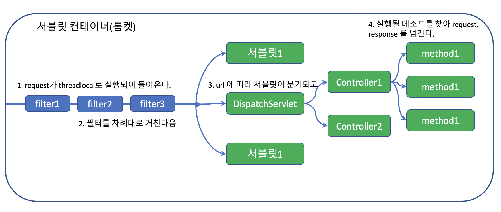
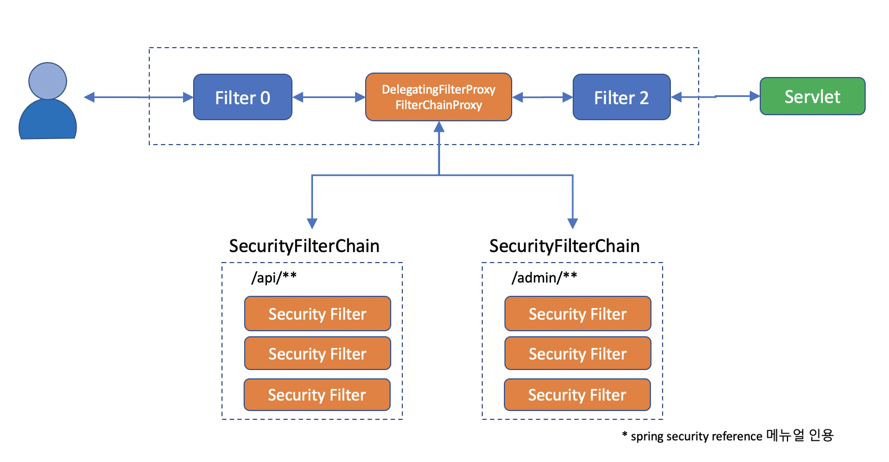
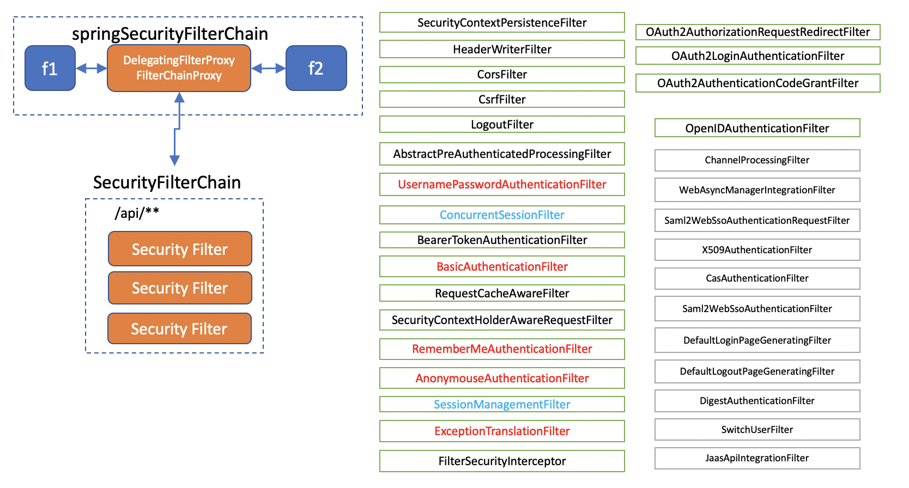
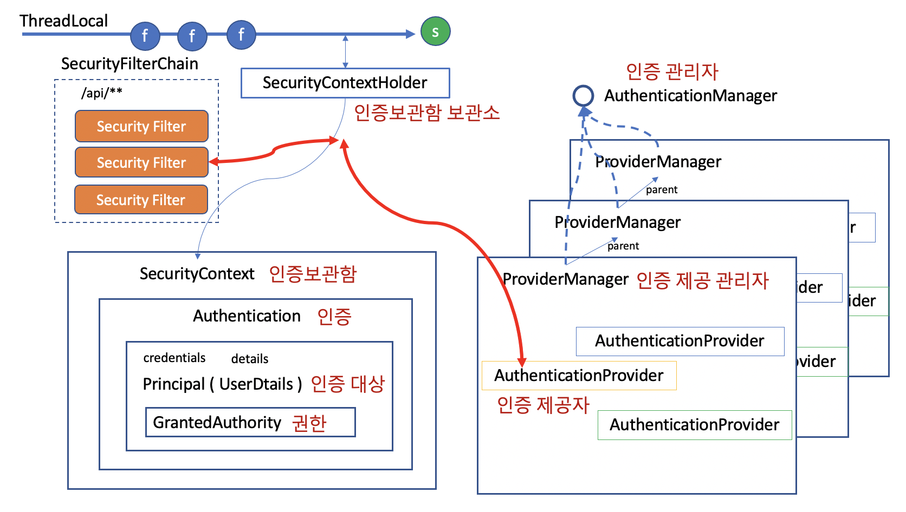

# 0. 스프링 시큐리티의 큰 그림

## 서블릿 컨테이너

- 톰켓과 같은 웹 애플리케이션을 서블릿 컨테이너라고 부르는데, 이런 웹 애플리케이션(J2EE Application)은 기본적으로 필터와 서블릿으로 구성되어 있습니다.



- 필터는 체인처럼 엮여있기 때문에 필터 체인이라고도 불리는데, 모든 request 는 이 필터 체인을 반드시 거쳐야만 서블릿 서비스에 도착하게 됩니다.

## 스프링 시큐리티의 큰 그림

- 그래서 스프링 시큐리티는 DelegatingFilterProxy 라는 필터를 만들어 메인 필터체인에 끼워넣고, 그 아래 다시 SecurityFilterChain 그룹을 등록합니다.



- 이 필터체인은 반드시 한개 이상이고, url 패턴에 따라 적용되는 필터체인을 다르게 할 수 있습니다. 본래의 메인 필터를 반드시 통과해야만 서블릿에 들어갈 수 있는 단점을 보완하기 위해서 필터체인 Proxy 를 두었다고 할 수 있습니다.
- web resource 의 경우 패턴을 따르더라도 필터를 무시(ignore)하고 통과시켜주기도 합니다.

## 시큐리티 필터들

- 이 필터체인에는 다양한 필터들이 들어갑니다.



- 각각의 필터는 단일 필터 단일 책임(?) 원칙 처럼, 각기 서로 다른 관심사를 해결합니다.. 예를 들면 아래와 같습니다.
  - *HeaderWriterFilter* : Http 해더를 검사한다. 써야 할 건 잘 써있는지, 필요한 해더를 더해줘야 할 건 없는가?
  - *CorsFilter* : 허가된 사이트나 클라이언트의 요청인가?
  - *CsrfFilter* : 내가 내보낸 리소스에서 올라온 요청인가?
  - *LogoutFilter* : 지금 로그아웃하겠다고 하는건가?
  - *UsernamePasswordAuthenticationFilter* : username / password 로 로그인을 하려고 하는가? 만약 로그인이면 여기서 처리하고 가야 할 페이지로 보내 줄게.
  - *ConcurrentSessionFilter* : 여거저기서 로그인 하는걸 허용할 것인가?
  - *BearerTokenAuthenticationFilter* : Authorization 해더에 Bearer 토큰이 오면 인증 처리 해줄게.
  - *BasicAuthenticationFilter* : Authorization 해더에 Basic 토큰을 주면 검사해서 인증처리 해줄게.
  - *RequestCacheAwareFilter* : 방금 요청한 request 이력이 다음에 필요할 수 있으니 캐시에 담아놓을게.
  - *SecurityContextHolderAwareRequestFilter* : 보안 관련 Servlet 3 스펙을 지원하기 위한 필터라고 한다.(?)
  - *RememberMeAuthenticationFilter* : 아직 Authentication 인증이 안된 경우라면 RememberMe 쿠키를 검사해서 인증 처리해줄게
  - *AnonymousAuthenticationFilter* : 아직도 인증이 안되었으면 너는 Anonymous 사용자야
  - *SessionManagementFilter* : 서버에서 지정한 세션정책을 검사할게.
  - *ExcpetionTranslationFilter* : 나 이후에 인증이나 권한 예외가 발생하면 내가 잡아서 처리해 줄게.
  - *FilterSecurityInterceptor* : 여기까지 살아서 왔다면 인증이 있다는 거니, 니가 들어가려고 하는 request 에 들어갈 자격이 있는지 그리고 리턴한 결과를 너에게 보내줘도 되는건지 마지막으로 내가 점검해 줄게.
  - 그 밖에... OAuth2 나 Saml2, Cas, X509 등에 관한 필터들도 있습니다.
- 필터는 넣거나 뺄 수 있고 순서를 조절할 수 있습니다. (이때 필터의 순서가 매우 critical 할 수 있기 때문에 기본 필터들은 그 순서가 어느정도 정해져 있습니다.)

# 1. 로그인 하기

- 스프링 프레임워크에서 로그인을 한다는 것은 authenticated 가 true인 Authentication 객체를 SecurityContext 에 갖고 있는 상태를 말합니다. 단 Authentication이 AnonymousAuthenticationToken 만 아니면 됩니다.

  ```plaintext
  로그인 == Authentication(authenticated = true) only if Authentication != AnonymousAuthenticationToken
  ```

  

## Authentication (인증)의 기본 구조

- 필터들 중에 일부 필터는 인증 정보에 관여합니다. 이들 필터가 하는 일은 AuthenticationManager 를 통해 Authentication 을 인증하고 그 결과를 SecurityContextHolder 에 넣어주는 일입니다.



- 인증 토큰(Authentication)을 제공하는 필터들
  - UsernamePasswordAuthenticationFilter : 폼 로그인 -> UsernamePasswordAuthenticationToken
  - RememberMeAuthenticationFilter : remember-me 쿠키 로그인 -> RememberMeAuthenticationToken
  - AnonymousAuthenticationFilter : 로그인하지 않았다는 것을 인증함 -> AnonymousAuthenticationToken
  - SecurityContextPersistenceFilter : 기존 로그인을 유지함(기본적으로 session 을 이용함)
  - BearerTokenAuthenticationFilter : JWT 로그인
  - BasicAuthenticationFilter : ajax 로그인 -> UsernamePasswordAuthenticationToken
  - OAuth2LoginAuthenticationFilter : 소셜 로그인 -> OAuth2LoginAuthenticationToken, OAuth2AuthenticationToken
  - OpenIDAuthenticationFilter : OpenID 로그인
  - Saml2WebSsoAuthenticationFilter : SAML2 로그인
  - ... 기타
- Authentication 을 제공(Provide) 하는 인증제공자는 여러개가 동시에 존재할 수 있고, 인증 방식에 따라 ProviderManager 도 복수로 존재할 수 있습니다.
- Authentication 은 인터페이스로 아래와 같은 정보들을 갖고 있습니다.
  - *Set<GrantedAuthority> authorities* : 인증된 권한 정보
  - *principal* : 인증 대상에 관한 정보. 주로 UserDetails 객체가 옴
  - *credentials* : 인증 확인을 위한 정보. 주로 비밀번호가 오지만, 인증 후에는 보안을 위해 삭제함.
  - *details* : 그 밖에 필요한 정보. IP, 세션정보, 기타 인증요청에서 사용했던 정보들.
  - *boolean authenticated* : 인증이 되었는지를 체크함.


# 2. 폼 로그인

## DefaultLoginPageGeneratingFilter

- GET /login 을 처리
- 별도의 로그인 페이지 설정을 하지 않으면 제공되는 필터
- 기본 로그인 폼을 제공
- OAuth2 / OpenID / Saml2 로그인과도 같이 사용할 수 있음.

## UsernamePasswordAuthenticationFilter

- POST /login 을 처리. processingUrl 을 변경하면 주소를 바꿀 수 있음.

- form 인증을 처리해주는 필터로 스프링 시큐리티에서 가장 일반적으로 쓰임.

- 주요 설정 정보

  - filterProcessingUrl : 로그인을 처리해 줄 URL (POST)

  - username parameter : POST에 username에 대한 값을 넘겨줄 인자의 이름

  - password parameter : POST에 password에 대한 값을 넘겨줄 인자의 이름

  - 로그인 성공시 처리 방법

    - defaultSuccessUrl : alwaysUse 옵션 설정이 중요

      - ```java
        http
            .formLogin(login->
                       login.defaultSuccessUrl("/",false))
        ```

        - alwaysUse 를 false 로 설정하여 중간에 로그인할 때 홈페이지로 이동하는 경우를 없앤다.

    - successHandler

  - 로그인 실패시 처리 방법

    - failureUrl
    - failureHandler

  - authenticationDetailSource : Authentication 객체의 details 에 들어갈 정보를 직접 만들어 줌.

  ```java
  @Override
  public Authentication attemptAuthentication(HttpServletRequest request, HttpServletResponse response)
  		throws AuthenticationException {
  	if (this.postOnly && !request.getMethod().equals("POST")) {
  		throw new AuthenticationServiceException("Authentication method not supported: " + request.getMethod());
  	}
  	String username = obtainUsername(request);
  	username = (username != null) ? username : "";
  	username = username.trim();
  	String password = obtainPassword(request);
  	password = (password != null) ? password : "";
  	UsernamePasswordAuthenticationToken authRequest = new UsernamePasswordAuthenticationToken(username, password);
  	// Allow subclasses to set the "details" property
  	setDetails(request, authRequest);
  	return this.getAuthenticationManager().authenticate(authRequest);
  }
  ```

  

## DefaultLogoutPageGeneratingFilter

- GET /logout 을 처리
- POST /logout 을 요청할 수 있는 UI 를 제공
- DefaultLoginPageGeneratingFilter 를 사용하는 경우에 같이 제공됨.

## LogoutFilter

- POST /logout 을 처리. processiongUrl 을 변경하면 바꿀 수 있음.

- 로그 아웃을 처리

  - session, SecurityContext, csrf, 쿠키, remember-me 쿠키 등을 삭제처리 함.
  - (기본) 로그인 페이지로 redirect

  ```java
  private void doFilter(HttpServletRequest request, HttpServletResponse response, FilterChain chain)
  		throws IOException, ServletException {
  	if (requiresLogout(request, response)) {
  		Authentication auth = SecurityContextHolder.getContext().getAuthentication();
  		if (this.logger.isDebugEnabled()) {
  			this.logger.debug(LogMessage.format("Logging out [%s]", auth));
  		}
  		this.handler.logout(request, response, auth);
  		this.logoutSuccessHandler.onLogoutSuccess(request, response, auth);
  		return;
  	}
  	chain.doFilter(request, response);
  }
  ```

  

- LogoutHandler

  - void logout(HttpServletRequest request, HttpServletResponse response, Authentication authentication);
  - SecurityContextLogoutHandler : 세션과 SecurityContext 를 clear 함.
  - CookieClearingLogoutHandler : clear 대상이 된 쿠키들을 삭제함.
  - CsrfLogoutHandler : csrfTokenRepository 에서 csrf 토큰을 clear 함.
  - HeaderWriterLogoutHandler
  - RememberMeServices : remember-me 쿠키를 삭제함.
  - LogoutSuccessEventPublishingLogoutHandler : 로그아웃이 성공하면 이벤트를 발행함.

- LogoutSuccessHandler

  - void onLogoutSuccess(HttpServletRequest request, HttpServletResponse response, Authentication authentication) throws IOException, ServletException;
  - SimpleUrlLogoutSuccessHandler