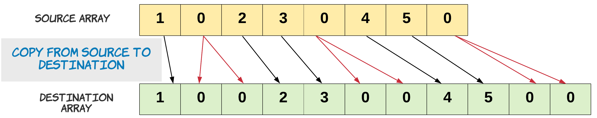
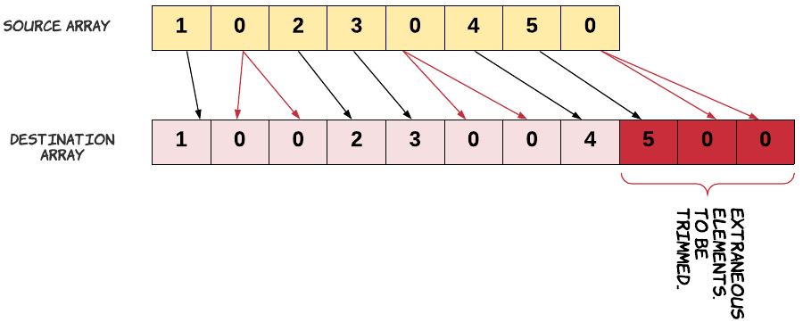
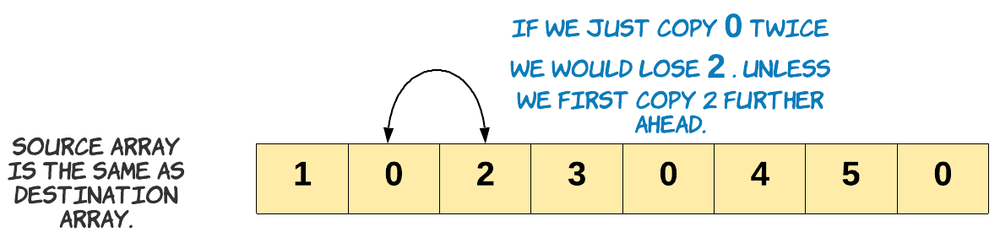
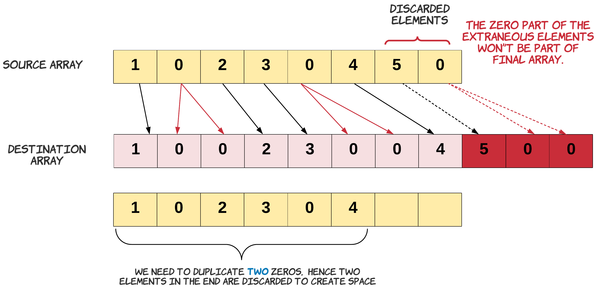
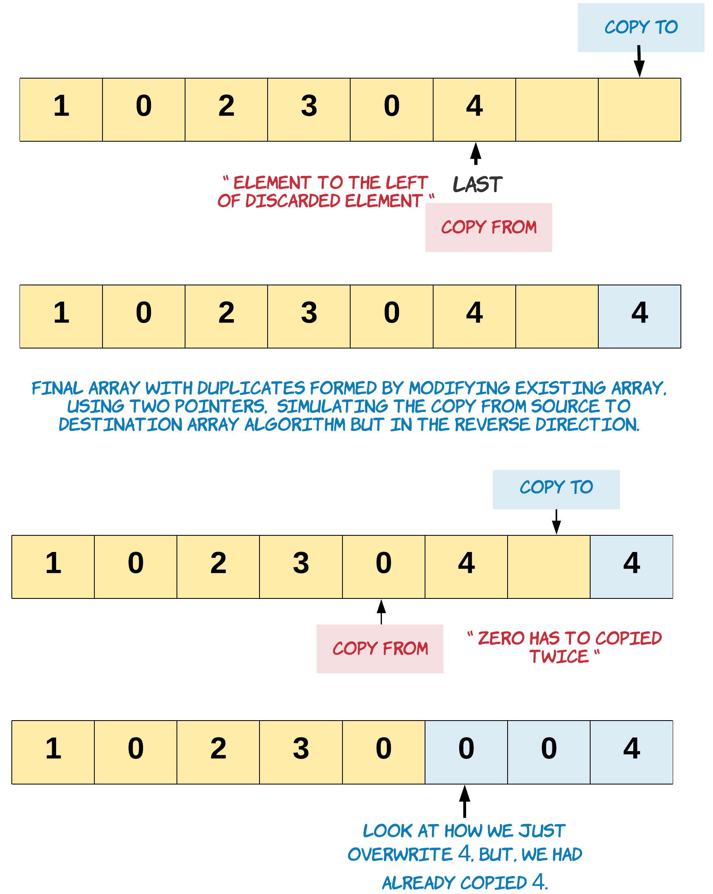

<!-- 

📋 This is the tech-news archives to help me keep track of what I am interested in!

- Reference tech news link: <https://thenextweb.com/news/blockchain-development-tech-career>
  

<div class="notice--danger">{{ notice-2 | markdownify }}</div> -->

📋 This is my note-taking from what I learned in LeetCode!
{: .notice--danger}

<br>

# Problem

Given a fixed-length integer array arr, duplicate each occurrence of zero, shifting the remaining elements to the right.

Note that elements beyond the length of the original array are not written. Do the above modifications to the input array in place and do not return anything.

Example 1:

- Input: arr = [1,0,2,3,0,4,5,0]
- Output: [1,0,0,2,3,0,0,4]
- Explanation: After calling your function, the input array is modified to: [1,0,0,2,3,0,0,4]

Example 2:

- Input: arr = [1,2,3]
- Output: [1,2,3]
- Explanation: After calling your function, the input array is modified to: [1,2,3]

Constraints:

- 1 <= arr.length <= 10<sup>4</sup>
- 0 <= arr[i] <= 9

Hint #1:

This is a great introductory problem for understanding and working with the concept of in-place operations. The problem statement clearly states that we are to modify the array in-place. That does not mean we cannot use another array. We just don't have to return anything.

Hint #2:

A better way to solve this would be without using additional space. The only reason the problem statement allows you to make modifications in place is that it hints at avoiding any additional memory.

Hint #3:

The main problem with not using additional memory is that we might override elements due to the zero duplication requirement of the problem statement. How do we get around that?

Hint #4:

If we had enough space available, we would be able to accommodate all the elements properly. The new length would be the original length of the array plus the number of zeros. Can we use this information somehow to solve the problem?

<br>

# Solution

[Solution Link](https://leetcode.com/problems/duplicate-zeros/editorial/)

The problem demands the array to be modified in-place. If in-place was not a constraint we might have just copied the elements from a source array to a destination array.



Notice, how we copied zero twice.

```
s = 0
d = 0

# Copy is performed until the destination array is full.
for s in range(N):
  if source[s] == 0:
    # Copy zero twice.
    destination[d] = 0
    d += 1
    destination[d] = 0
  else:
    destination[d] = source[s]

  d += 1
```

The problem statement also mentions that we do not grow the new array, rather we just trim it to its original array length. This means we have to discard some elements from the end of the array. These are the elements whose new indices are beyond the length of the original array.



Let's remind ourselves about the problem constraint that we are given. Since we can't use extra space, our source and destination array is essentially the same. We just can't go about copying the source into destination array the same way. If we do that we would lose some elements. Since, we would be overwriting the array.



Keeping this in mind, in the approach below we start copying to the end of the array.

<br>

## Approach 1: Two pass, O(1) space

Algorithm:

1. Find the number of zeros which would be duplicated. Let's call it possible_dups. We do need to make sure we are not counting the zeros which would be trimmed off. Since, the discarded zeros won't be part of the final array. The count of possible_dups would give us the number of elements to be trimmed off the original array. Hence at any point, length\_ - possible_dups is the number of elements which would be included in the final array.
   : 
   : - Note: In the diagram above we just show source and destination array for understanding purpose. We will be doing these operations only on one array.
2. Handle the edge case for a zero present on the boundary of the leftover elements. Let's talk about the edge case of this problem. We need to be extra careful when we are duplicating the zeros in the leftover array. This care should be taken for the zero which is lying on the boundary. Since, this zero might be counted as with possible duplicates, or may be just got included in the left over when there was no space left to accommodate its duplicate. If it is part of the possible_dups we would want to duplicate it otherwise we don't.
   : - An example of the edge case is - [8,4,5,0,0,0,0,7]. In this array there is space to accommodate the duplicates of first and second occurrences of zero. But we don't have enough space for the duplicate of the third occurrence of zero. Hence when we are copying we need to make sure for the third occurrence we don't copy twice. Result = [8,4,5,0,"0",0,"0",0]
3. Iterate the array from the end and copy a non-zero element once and zero element twice. When we say we discard the extraneous elements, it simply means we start from the left of the extraneous elements and start overwriting them with new values, eventually right shifting the left over elements and creating space for all the duplicated elements in the array.



```
def duplicateZeros(arr: list[int]) -> None:
    # Do not return anything, modify arr in-place instead.

    possible_dup = 0
    length_ = len(arr) - 1

    # Find the number of zeros to be duplicated
    for left in range(length_ + 1):
        # Stop when left points beyond the last element in the original list
        # which would be part of the modified list
        if left > length_ - possible_dup:
            break

        # Count the zeros
        if arr[left] == 0:
            # Edge case: This zero can't be duplicated. We have no more space,
            # as left is pointing to the last element which could be included
            if left == length_ - possible_dup:
                arr[length_] = 0  # For this zero we just copy it without duplication.
                length_ -= 1
                break
            possible_dup += 1

    # Start backwards from the last element which would be part of new list.
    last = length_ - possible_dup

    # Copy zero twice, and non zero once.
    for i in range(last, -1, -1):
        if arr[i] == 0:
            arr[i + possible_dup] = 0
            possible_dup -= 1
            arr[i + possible_dup] = 0
        else:
            arr[i + possible_dup] = arr[i]


arr = [1, 0, 2, 3, 0, 4, 5, 0]
duplicateZeros(arr)

print(arr)
```

Complexity Analysis

- Time Complexity: O(N), where N is the number of elements in the array. We do two passes through the array, one to find the number of possible_dups and the other to copy the elements. In the worst case we might be iterating the entire array, when there are less or no zeros in the array.
- Space Complexity: O(1). We do not use any extra space.

<br>

---

<br>

    🖋️ This is my self-taught blog! Feel free to let me know
    if there are some errors or wrong parts 😆

[Back to Top](#){: .btn .btn--primary }{: .align-right}
