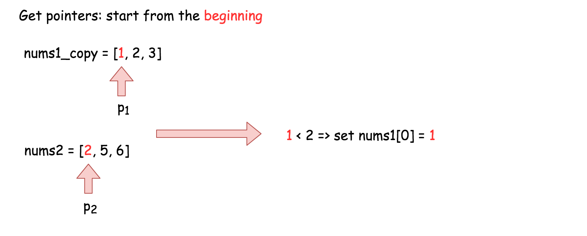
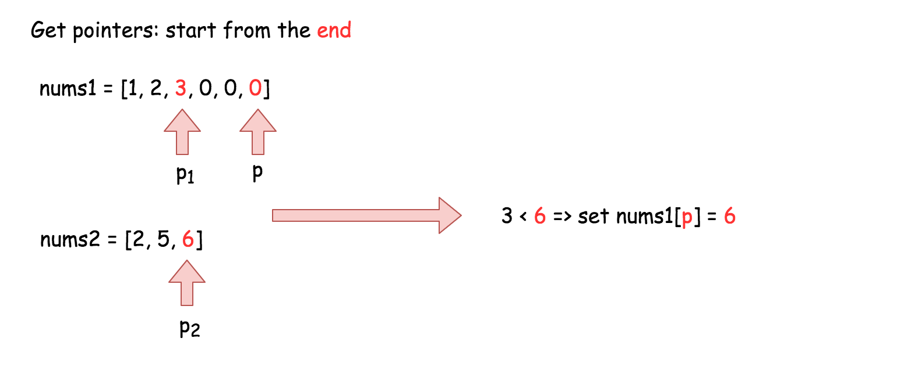

<!-- 

📋 This is the tech-news archives to help me keep track of what I am interested in!

- Reference tech news link: <https://thenextweb.com/news/blockchain-development-tech-career>
  

<div class="notice--danger">{{ notice-2 | markdownify }}</div> -->

📋 This is my note-taking from what I learned in LeetCode!
{: .notice--danger}

# Problem

You are given two integer arrays nums1 and nums2, sorted in non-decreasing order, and two integers m and n, representing the number of elements in nums1 and nums2 respectively.

Merge nums1 and nums2 into a single array sorted in non-decreasing order.

The final sorted array should not be returned by the function, but instead be stored inside the array nums1. To accommodate this, nums1 has a length of m + n, where the first m elements denote the elements that should be merged, and the last n elements are set to 0 and should be ignored. nums2 has a length of n.

> Example 1:
>
> - Input: nums1 = [1,2,3,0,0,0], m = 3, nums2 = [2,5,6], n = 3
> - Output: [1,2,2,3,5,6]
> - Explanation: The arrays we are merging are [1,2,3] and [2,5,6].
> - The result of the merge is [1,2,2,3,5,6] with the underlined elements coming from nums1.

> Example 2:
>
> - Input: nums1 = [1], m = 1, nums2 = [], n = 0
> - Output: [1]
> - Explanation: The arrays we are merging are [1] and [].
> - The result of the merge is [1].

> Example 3:
>
> - Input: nums1 = [0], m = 0, nums2 = [1], n = 1
> - Output: [1]
> - Explanation: The arrays we are merging are [] and [1].
> - The result of the merge is [1].
> - Note that because m = 0, there are no elements in nums1. The 0 is only there to ensure the merge result can fit in nums1.

Constraints:

- nums1.length == m + n
- nums2.length == n
- 0 <= m, n <= 200
- 1 <= m + n <= 200
- -10<sup>9</sup> <= nums1[i], nums2[j] <= 10<sup>9</sup>

Follow up: Can you come up with an algorithm that runs in O(m + n) time?



Hints!

1. You can easily solve this problem if you simply think about two elements at a time rather than two arrays. We know that each of the individual arrays is sorted. What we don't know is how they will intertwine. Can we take a local decision and arrive at an optimal solution?
2. If you simply consider one element each at a time from the two arrays and make a decision and proceed accordingly, you will arrive at the optimal solution.
   

<div class="notice--info">{{ notice-2 | markdownify }}</div>

<br>

# Solution

## Approach 1: Merge and sort

One way to merge two sorted arrays (nums1 and nums2) is to simply copy all the elements of nums2 into the end of nums1, and then sort the combined array (nums1) using any sorting algorithm. However, this approach can be slow because we're not taking advantage of the fact that the original arrays are already sorted.



Complexity Analysis

- The time complexity of the solution is O((n+m)log(n+m)), which means that the time required to run the solution increases logarithmically with the size of the input arrays. This is because the built-in sorting algorithm used in the solution has a time complexity of O(xlog(x)), where x is the length of the input array.
- The space complexity of the solution is O(n), which means that the amount of memory required by the solution increases linearly with the size of the second input array, nums2. However, this can vary depending on the implementation details of the sorting algorithm used by the programming language. In general, most programming languages have a built-in sorting algorithm that uses O(n) space.
  

<div class="notice--info">{{ notice-2 | markdownify }}</div>

```
using System;

namespace merge
{
  class Program
  {
    static void Main(string[] args)
    {
      int[] nums1 = { 1, 2, 3, 0, 0, 0 };
      int[] nums2 = { 2, 5, 6 };
      int m = 3;
      int n = 3;

      Merge(nums1, m, nums2, n);

      Console.WriteLine(string.Join(", ", nums1)); // Output: 1, 2, 2, 3, 5, 6
    }

    public static void Merge(int[] nums1, int m, int[] nums2, int n)
    {
      for (int i = 0; i < n; i++)
      {
        nums1[i + m] = nums2[i];
      }
      Array.Sort(nums1);
    }
  }
}
```

<br>

## Approach 2: Three Pointers (Start From the Beginning)

Since both arrays are already sorted, we can compare the elements of both arrays using two pointers that start at the beginning of each array. We'll then insert the smaller element into a new array, and move the pointer for the array it came from to the next element. We'll repeat this process until we've gone through all the elements in both arrays. This approach has a time complexity of O(n+m) since we only need to go through each element once.

Algorithm:

One way to solve this problem is to create a copy of the values in the first array (nums1), and then use two pointers to compare the values in the two arrays and write them back into nums1 in the correct order.

1. Initialize nums1Copy to be a new array containing the first m values of nums1.
2. Initialize read pointer p1 to the beginning of nums1Copy.
3. Initialize read pointer p2 to the beginning of nums2.
4. Initialize write pointer p to the beginning of nums1.
5. While p is still within nums1:
   : - If nums1Copy[p1] exists and is less than or equal to nums2[p2]: Write nums1Copy[p1] into nums1[p], and increment p1 by 1.
   : - Else: Write nums2[p2] into nums1[p], and increment p2 by 1.
   : - Increment p by 1.





Complexity Analysis

- Time complexity: O(n+m)
  : We are performing n+2m reads and n+2m writes. Because constants are ignored in Big O notation, this gives us a time complexity of O(n+m).
- Space complexity: O(m)
  : We are allocating an additional array of length m.
  

<div class="notice--info">{{ notice-2 | markdownify }}</div>

```
using System;

namespace merge
{
  class Program
  {
    static void Main(string[] args)
    {
      int[] nums1 = { 1, 2, 3, 0, 0, 0 };
      int[] nums2 = { 2, 5, 6 };
      int m = 3;
      int n = 3;
      Merge2(nums1, m, nums2, n);
      Console.WriteLine(string.Join(", ", nums1));
    }

    public static void Merge2(int[] nums1, int m, int[] nums2, int n)
    {
      // Make a copy of the first m elements of nums1.
      int[] nums1Copy = new int[m];
      Array.Copy(nums1, nums1Copy, m);

      // Read pointers for nums1Copy and nums2 respectively.
      int p1 = 0;
      int p2 = 0;

      // Compare elements from nums1Copy and nums2 and write the smallest to nums1.
      for (int p = 0; p < m + n; p++)
      {
        // We also need to ensure that p1 and p2 aren't over the boundaries
        // of their respective arrays.
        if (p2 >= n || (p1 < m && nums1Copy[p1] < nums2[p2]))
        {
          nums1[p] = nums1Copy[p1++];
        }
        else
        {
          nums1[p] = nums2[p2++];
        }
      }
    }
  }
}
```

<br>

## Approach 3: Three Pointers (Start From the End)

Interview Tip: This is a medium-level solution to an easy-level problem. Many of LeetCode's easy-level problems have more difficult solutions, and good candidates are expected to find them.
{: .notice--info}

To eliminate the additional space, we can start overwriting nums1 from the end instead of the beginning. We set three pointers: p1 to m-1, p2 to n-1, and p to m+n-1. We then compare the values at p1 and p2, and write the larger value to the current position of p. We continue this process until we've compared all values in both arrays and written them to their new positions in nums1.

This approach has a time complexity of O(n+m) and a space complexity of O(1).

Interview Tip: Whenever you're trying to solve an array problem in-place, always consider the possibility of iterating backwards instead of forwards through the array. It can completely change the problem, and make it a lot easier.
{: .notice--info}





Complexity Analysis

- Time complexity: O(n+m)
  : We are performing n+2m reads and n+2m writes. Because constants are ignored in Big O notation, this gives us a time complexity of O(n+m).
- Space complexity: O(1)
  : Unlike Approach 2, we're not using an extra array.
  

<div class="notice--info">{{ notice-2 | markdownify }}</div>

```
using System;

namespace merge
{
  class Program
  {
    static void Main(string[] args)
    {
      int[] nums1 = { 1, 2, 3, 0, 0, 0 };
      int[] nums2 = { 2, 5, 6 };
      int m = 3;
      int n = 3;

      Merge3(nums1, m, nums2, n);

      foreach (int num in nums1)
      {
          Console.Write(num + " ");
      }
      // Output: 1 2 2 3 5 6
    }

    public static void Merge3(int[] nums1, int m, int[] nums2, int n)
    {
      // Set p1 and p2 to point to the end of their respective arrays.
      int p1 = m - 1;
      int p2 = n - 1;

      // And move p backwards through the array, each time writing
      // the smallest value pointed at by p1 or p2.
      for (int p = m + n - 1; p >= 0; p--)
      {
        if (p2 < 0)
        {
          break;
        }
        if (p1 >= 0 && nums1[p1] > nums2[p2])
        {
          nums1[p] = nums1[p1--];
        }
        else
        {
          nums1[p] = nums2[p2--];
        }
      }
    }
  }
}
```



Proof (optional)

You might be a bit skeptical of this claim. Does it really work in every case? Is it safe to be making such a bold claim?

This way, it is guaranteed that once we start overwriting the first m values in nums1, we will have already written each into its new position. In this way, we can eliminate the additional space.

Great question! So, why does this work? To prove it, we need to ensure that p never overwrites a value in nums1 that p1 hasn't yet read from nums1.

Words of Advice: Terrified of proofs? Many software engineers are. Good proofs are simply a series of logical assertions, each building on the next. In this way, we can go from "obvious" statements, all the way to the one we want to prove. I recommend reading each statement one-by-one, ensuring that you understand each before moving onto the next.

1. We know that upon initialization, p is n steps ahead of p1 (in other words, p1 + n = p).
2. We also know that during each of the p iterations this algorithm performs, p is always decremented by 1, and either p1 or p2 is decremented by 1.
3. We can deduce that when p1 decremented, the gap between p and p1 stays the same, so there can't be an "overtake" in that case.
4. We can also deduce that when p2 is decremented though, the gap between p and p1 shrinks by 1 as p moves, but not p1.
5. And from that, we can deduce that the maximum number of times that p2 can be decremented is n. In other words, the gap between p and p1 can shrink by 1, at most n times.
6. In conclusion, it's impossible for an overtake to occur, as they started n apart. And when p = p1, the gap has to have shrunk n times. This means that all of nums2 have been merged in, and so there is nothing more to do.
   

<div class="notice--info">{{ notice-2 | markdownify }}</div>

<br>

# For better understanding

<br>

---

<br>

    🖋️ This is my self-taught blog! Feel free to let me know
    if there are some errors or wrong parts 😆

[Back to Top](#){: .btn .btn--primary }{: .align-right}
