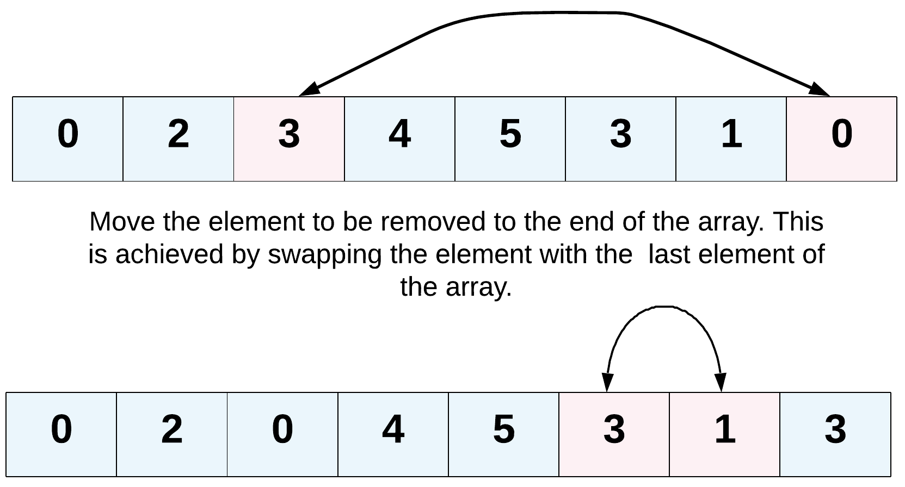

<!-- 

📋 This is the tech-news archives to help me keep track of what I am interested in!

- Reference tech news link: <https://thenextweb.com/news/blockchain-development-tech-career>
  

<div class="notice--danger">{{ notice-2 | markdownify }}</div> -->

📋 This is my note-taking from what I learned in LeetCode!
{: .notice--danger}

# Problem

Given an integer array nums and an integer val, remove all occurrences of val in nums "in-place". The order of the elements may be changed. Then return the number of elements in nums which are not equal to val.

Consider the number of elements in nums which are not equal to val be k, to get accepted, you need to do the following things:

- Change the array nums such that the first k elements of nums contain the elements which are not equal to val. The remaining elements of nums are not important as well as the size of nums.
- Return k.

Custom Judge:

The judge will test your solution with the following code:

```
int[] nums = [...]; // Input array
int val = ...; // Value to remove
int[] expectedNums = [...]; // The expected answer with correct length.
                            // It is sorted with no values equaling val.

int k = removeElement(nums, val); // Calls your implementation

assert k == expectedNums.length;
sort(nums, 0, k); // Sort the first k elements of nums
for (int i = 0; i < actualLength; i++) {
    assert nums[i] == expectedNums[i];
}
```

If all assertions pass, then your solution will be accepted.

> Example 1:
>
> - Input: nums = [3,2,2,3], val = 3
> - Output: 2, nums = [2,2,_,_]
> - Explanation: Your function should return k = 2, with the first two elements of nums being 2. It does not matter what you leave beyond the returned k (hence they are underscores).

> Example 2:
>
> - Input: nums = [0,1,2,2,3,0,4,2], val = 2
> - Output: 5, nums = [0,1,4,0,3,_,_,_]
> - Explanation: Your function should return k = 5, with the first five elements of nums containing 0, 0, 1, 3, and 4. Note that the five elements can be returned in any order. It does not matter what you leave beyond the returned k (hence they are underscores).

Constraints:

- 0 <= nums.length <= 100
- 0 <= nums[i] <= 50
- 0 <= val <= 100



Hints!

1. The problem statement clearly asks us to modify the array in-place and it also says that the element beyond the new length of the array can be anything. Given an element, we need to remove all the occurrences of it from the array. We don't technically need to remove that element per-say, right?
2. We can move all the occurrences of this element to the end of the array. Use two pointers!
   : 
3. Yet another direction of thought is to consider the elements to be removed as non-existent. In a single pass, if we keep copying the visible elements in-place, that should also solve this problem for us.
   

<div class="notice--info">{{ notice-2 | markdownify }}</div>

<br>

# Solution

<br>

# For better understanding

<br>

---

<br>

    🖋️ This is my self-taught blog! Feel free to let me know
    if there are some errors or wrong parts 😆

[Back to Top](#){: .btn .btn--primary }{: .align-right}
