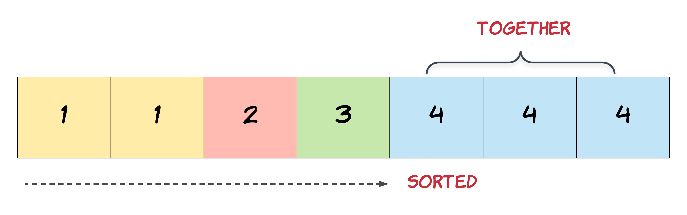

<!-- 

📋 This is the tech-news archives to help me keep track of what I am interested in!

- Reference tech news link: <https://thenextweb.com/news/blockchain-development-tech-career>
  

<div class="notice--danger">{{ notice-2 | markdownify }}</div> -->

📋 This is my note-taking from what I learned in LeetCode!
{: .notice--danger}

<br>

# Problem

[Problem Link](https://leetcode.com/explore/learn/card/fun-with-arrays/526/deleting-items-from-an-array/3248/)

Given an integer array nums sorted in non-decreasing order, remove the duplicates "in-place" such that each unique element appears only once. The relative order of the elements should be kept the same. Then return the number of unique elements in nums.

Consider the number of unique elements of nums to be k, to get accepted, you need to do the following things:

- Change the array nums such that the first k elements of nums contain the unique elements in the order they were present in nums initially. The remaining elements of nums are not important as well as the size of nums.
- Return k.

Custom Judge:

The judge will test your solution with the following code:

```
int[] nums = [...]; // Input array
int[] expectedNums = [...]; // The expected answer with correct length

int k = removeDuplicates(nums); // Calls your implementation

assert k == expectedNums.length;
for (int i = 0; i < k; i++) {
    assert nums[i] == expectedNums[i];
}
```

If all assertions pass, then your solution will be accepted.

Example 1:

- Input: nums = [1,1,2]
- Output: 2, nums = [1,2,_]
- Explanation: Your function should return k = 2, with the first two elements of nums being 1 and 2 respectively. It does not matter what you leave beyond the returned k (hence they are underscores).

Example 2:

- Input: nums = [0,0,1,1,1,2,2,3,3,4]
- Output: 5, nums = [0,1,2,3,4,_,_,_,_,_]
- Explanation: Your function should return k = 5, with the first five elements of nums being 0, 1, 2, 3, and 4 respectively. It does not matter what you leave beyond the returned k (hence they are underscores).

Constraints:

- 1 <= nums.length <= 3 \* 10<sup>4</sup>
- -100 <= nums[i] <= 100
- nums is sorted in non-decreasing order.

Hint #1:

In this problem, the key point to focus on is the input array being sorted. As far as duplicate elements are concerned, what is their positioning in the array when the given array is sorted? Look at the image above for the answer. If we know the position of one of the elements, do we also know the positioning of all the duplicate elements?


Hint #2:

We need to modify the array in-place and the size of the final array would potentially be smaller than the size of the input array. So, we ought to use a two-pointer approach here. One, that would keep track of the current element in the original array and another one for just the unique elements.

Hint #3:

Essentially, once an element is encountered, you simply need to bypass its duplicates and move on to the next unique element.

<br>

# Solution

[Solution Link](https://leetcode.com/problems/remove-duplicates-from-sorted-array/editorial/)

## Approach 1: Two indexes approach

- The problem states that we need to fill the first k elements of an array with unique values
- For doing so, we modify the input array in-place so that we don't use extra space
- In order to perform in-place operations, we use the Two indexes approach
- The first index updates the value in our input array while reading the data from the second index
- We continue the above steps until the second index reaches the end of an array

> First Index is responsible for writing unique values in our input array, while Second Index will read the input array and pass all the distinct elements to First Index.

Algorithm:

1. Start both indexes (insertIndex, i) from 1
   : insertIndex and i represents our First and second Index respectively.
2. Check if the previous element is different from the current element
   : The previous element is the element just before our i index i.e element present at arr[i-1]
3. If found different then perform arr[insertIndex] = arr[i] and increment insertIndex by 1
4. Increment i index by 1 till we reach end of the array
   : Note: After reaching the end of the array, our insertIndex variable will hold the count of unique elements in our input array.
   : 

```
def removeDuplicates(nums: list[int]) -> int:
    size = len(nums)
    insertIndex = 1
    for i in range(1, size):
        # Found unique element
        if nums[i - 1] != nums[i]:
            # Updating insertIndex in our main array
            nums[insertIndex] = nums[i]
            insertIndex += 1
    return insertIndex


nums = [1, 4, 5, 5, 6, 6]

print(removeDuplicates(nums))
```

> 코드 설명
>
> - 먼저 리스트의 길이를 구하고, 중복되지 않은 원소를 삽입할 위치를 '1'로 선언했어. (nums의 첫 번째 요소는 중복되지 않은 원소이므로, 1로 초기화한거야.)
> - 그리고 for 루프로 반복하면서 현재 요소와 바로 전 요소를 비교해서 중복된 요소를 찾았어.
> - 중복된 요소를 찾으면, 인덱스를 다음 인덱스로 업데이트하고, 중복되지 않은 요소를 해당 인덱스에 넣었어.
> - 그리고나서 해당 인덱스 값들을 반환했어.

Complexity Analysis

Let N be the size of the input array.

- Time Complexity: O(N), since we only have 2 pointers, and both the pointers will traverse the array at most once.
- Space Complexity: O(1), since we are not using any extra space.

<br>

---

<br>

    🖋️ This is my self-taught blog! Feel free to let me know
    if there are some errors or wrong parts 😆

[Back to Top](#){: .btn .btn--primary }{: .align-right}
