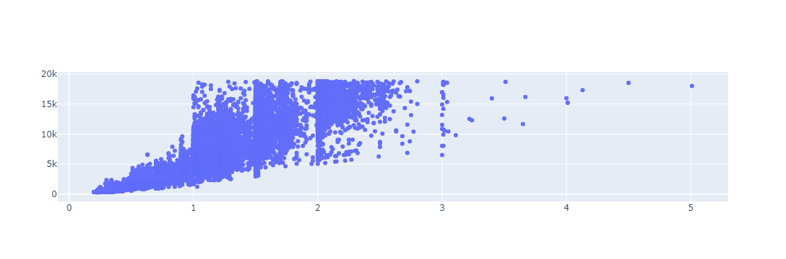
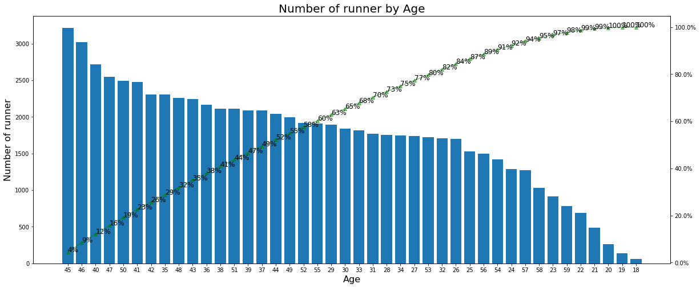

#  $\text{Mori-Zwanzig formalism and the Lorenz-96 Model}$


The **Lorenz-96** model is a simple dynamical system, of tunable dimension, that was designed as a caricature of the dynamics of Rossby waves in atmospheric dynamics. 


It is given by: 

\\ \dfrac{dv_k}{dt} = v_{k-1}(v_{k+1}- v_{k-2}) - v_k + F, \hspace{2 mm} k \in \{1, \cdots, K\}    \hspace{3 mm} (1) \\
$$ v_0 = v_K, \space v_{K+1} = v_1, \space v_{-1} = v_{K-1} \hspace{3 mm} (2)$$

Here $v_k$ is the state of the system and $F$ is the forcing constant.


# $ \text{Lorenz-96 Simulation } $


```python
import numpy as np
%matplotlib inline
import matplotlib.pyplot as plt
import matplotlib
import scipy
from mpl_toolkits.mplot3d import Axes3D
from scipy.integrate import odeint

```

## $ \text{Generating Lorenz-96 Paths for parameters} \space K=40 \space \text{and} \space F = 8$ 

Reference for part of the code : [Wikipedia](https://en.wikipedia.org/wiki/Lorenz_96_model)

Reference for Lorenz-96: [This article](https://www.aimsciences.org/article/doi/10.3934/dcdsb.2021064)


```python
# These are our constants 
K = 40  # Number of variables
F = 8  # Forcing


def L96(v,t):
    """Lorenz 96 model with constant forcing"""
    # Setting up vector
    d = np.zeros(K)
    # Loops over indices (with operations and Python underflow indexing handling edge cases)
    for i in range(K):
        d[i] = (v[(i + 1) % K] - v[i - 2]) * v[i - 1] - v[i] + F
    return d


mu, sigma = 0, 1 # mean and standard deviation
v_k0 = np.random.normal(mu, sigma ,size=(K))  # Initial state of each path v_k

t = np.arange(0.0, 100.0, 0.01)

v = odeint(L96, v_k0, t)  # scipy function for integrating a system of ODEs
#print(v_k0)
```


```python
# Plot the first three variables
fig = plt.figure()
ax = fig.gca(projection="3d")
ax.plot(v[:, 0], v[:, 1], v[:, 2])
axis_font = {'fontname':'Arial', 'size':'16'}
ax.set_xlabel("$v_1$", **axis_font)
ax.set_ylabel("$v_2$",  **axis_font)
ax.set_zlabel("$v_3$",  **axis_font)

plt.suptitle('Projection of The Lorenz-96 attractor onto 3 paths')
plt.show()
```

    /var/folders/d1/zn9nwmz172n413l8pt90v7yw0000gn/T/ipykernel_69668/2275268764.py:3: MatplotlibDeprecationWarning: Calling gca() with keyword arguments was deprecated in Matplotlib 3.4. Starting two minor releases later, gca() will take no keyword arguments. The gca() function should only be used to get the current axes, or if no axes exist, create new axes with default keyword arguments. To create a new axes with non-default arguments, use plt.axes() or plt.subplot().
      ax = fig.gca(projection="3d")


    

    


```python
# Dynamics of lorenz96 in chaotic regime (F,K) = (8,40)

fig, (ax1, ax2) = plt.subplots(1, 2, figsize= (14,4))

ax1.plot(t,v[:, 1])
ax2.plot(t,v[:, 2])

axis_font = {'fontname':'Arial', 'size':'16'}
ax1.set_xlabel(r'$v_1$ as a function of time', **axis_font)
ax2.set_xlabel(r'$v_2$ as a function of time', **axis_font)

plt.suptitle('Individual Lorenz-96 Paths wrt time for K = 40 and F = 8')

plt.show()

```


    

    


```python
# Mean Paths For Lorenz-96


# These are our constants 
K = 40  # Number of variables


def L96_2(v,t,F):
    """Lorenz 96 model with constant forcing"""
    # Setting up vector
    d = np.zeros(K)
    # Loops over indices (with operations and Python underflow indexing handling edge cases)
    for i in range(K):
        d[i] = (v[(i + 1) % K] - v[i - 2]) * v[i - 1] - v[i] + F
    return d


F = (8,20,15,5) # Forcing
t = np.arange(0.0, 100.0, 0.01)
v_m = np.zeros((len(F),len(t), K))

for i in range(len(F)):
    mu, sigma = 0, 1 # mean and standard deviation
    v_k0 = np.random.normal(mu, sigma ,size=(K))  # Initial state
    F_t = (F[i],)
    v = odeint(L96_2, v_k0, t, F_t)  # scipy function for integrating a system of ODEs
    v_m[i,:,:] = v


fig, (ax3, ax4, ax5, ax6) = plt.subplots(1, 4, figsize= (14,4))

ax3.plot(t,v_m[0,:,:].mean(axis=1))
ax4.plot(t,v_m[1,:,:].mean(axis =1))
ax5.plot(t,v_m[2,:,:].mean(axis =1))
ax6.plot(t,v_m[3,:,:].mean(axis =1))
#ax7.plot(t,v_m[4,:,:].mean(axis =1))

axis_font = {'fontname':'Arial', 'size':'10'}
ax3.set_xlabel(r'Sample mean as a function of time for $F = 8$', **axis_font)
ax4.set_xlabel(r'Sample mean as a function of time for $F= 20$', **axis_font)
ax5.set_xlabel(r'Sample mean as a function of time for $F= 15$', **axis_font)
ax6.set_xlabel(r'Sample mean as a function of time for $F= 5$', **axis_font)
#ax7.set_xlabel(r'Sample mean as a function of time for $F= 12$', **axis_font)


plt.suptitle('Sample Mean of the K = 40 paths and different values of F, wrt time')

plt.show()

```


    

    


# $ \text{Mori-Zwanzig reduction of the Lorenz-96 model} $

## $ \text{Case 1: Paths with respect to K (Keep F fixed)}$

Recall the **Lorenz-96** model:

$$ \dfrac{dv_k}{dt} = v_{k-1}(v_{k+1}- v_{k-2}) - v_k + F, \hspace{2 mm} k \in \{1, \cdots, K\}    \hspace{3 mm} (1) $$
$$ v_0 = v_K, \space v_{K+1} = v_1, \space v_{-1} = v_{K-1} \hspace{3 mm} (2)$$

Where $v_k$ is the state of the system and $F$ is the forcing constant.

Define $v = (v_1, \cdots, v_K)$

Suppose we only want to find the first $m$ components of $v$, i.e. $v_k$ for $k \in \{0, \cdots , m\}$, without finding the $(K+1) - m$ others.

Denote by $\hat{v}$, the first $m$ components and by $\tilde{v}$ the other $(K+1) - m$ components, then $v = (\hat{v},\tilde{v})$

We assume that the initial values of $\hat{v}$ are fixed (picked once and for all). We further assume that at time $t = 0$ we know the joint probability density function (pdf) of all the variables $v(0)$, and the pdf of $\tilde{v}$  is the joint pdf of all the $v$ with $\hat{v}$ fixed.

Define $R_k(v) := v_{k-1}(v_{k+1}- v_{k-2}) - v_k + F$, and $R = (R_1, \cdots, R_K)$, then $R = (\hat{R}, \tilde{R})$. $\hat{R}$ depends on all $k \in \{0, \cdots, K \}$.
We want $\hat{v}$.


### $\text{We apply Mori-Zwanzig:}$

**Consider the resoved variables, indexed by** $0 \leq k \leq m$.

We have the **Liouville Operator** $L = \displaystyle \sum_{k = 0}^K R_k \dfrac{\partial}{\partial v_{k0}}$, and the **Liouville Equation** : $ \dfrac{\partial u}{\partial t}  = Lu $, with initial data $u(0,v) = {v}_{k0}$, where ($v_{k0} = v_k(0)$). The goal here is to rewrite the system $(1)$ as a linear partial differential equation.

The solution of the Liouville equation is ${v}_k(t)$, and it can be written in semigroup notation as ${v}_k(t) =e^{tL}v_{k0}$. (See Chorin, Chap 9 for proof - page 169).

**Note**: Here $e^{tL} v_{k0}$ means $e^{tL}$ acting on $v_{k0}$, and the initial condition is the path $v_{k0}$ at $t = 0$.

Then the Liouville equation in semigroup notation is: 

$$ \dfrac{\partial}{\partial t}   e^{tL} v_{k0} = Le^{tL} v_{k0} = e^{tL}L v_{k0} \hspace{3 mm}   (3) $$


Now, let $\mathbb{P}$ be the projection defined by $\mathbb{P}g(\hat{v}) = E[g|\hat{v}]$.The probability density in this projection is the one used in the initial conditions. Thus $\mathbb{P}g(\hat{v}) = E[g|\hat{v}]$ represents the best estimate of $g$ given the partial data $\hat{v}(0)$.

Define a projection $\mathbb{Q}$ by $\mathbb{Q} = I - \mathbb{P}$ (and keep in mind that $\mathbb{P}$ and $\mathbb{Q}$ are orthogonal).

Then Equation $(3)$ can be rewritten as:

$$ \dfrac{\partial}{\partial t}   e^{tL} v_{k0} = e^{tL} \mathbb{P} L v_{k0}  + e^{tL} \mathbb{Q} L v_{k0} 
\hspace{3 mm}   (4)$$

Consider the first term. We have:

$$ L v_{k0}    = \displaystyle \sum_{k = 0}^K R_k \dfrac{\partial }{\partial v_{k0}} v_{k0} = R_k  \hspace{3 mm}   (5)$$ 

Thus $\mathbb{P} L v_{k0} = \mathbb{P} L v_{k0} = E[R_k|\hat{v}]$ is a function of $\hat{v}$ only (but it is a function of the whole vector of initial data).

The evolution operators $e^{tL}$ and $e^{t\mathbb{Q}L}$ satisfy the Duhamel relation:

$$ e^{tL} = e^{t\mathbb{Q}L} + \displaystyle \int_{0}^t e^{(t-s)L} \mathbb{P}L e^{s\mathbb{Q}L} ds$$

Hence,

$$ e^{tL} \mathbb{Q}Lv_{k0} = e^{t\mathbb{Q}L} \mathbb{Q}Lv_{k0} + \displaystyle \int_{0}^t e^{(t-s)L} \mathbb{P}L e^{s\mathbb{Q}L} \mathbb{Q}Lv_{k0} ds$$

Thus, from equation $(4)$, we get:

$$   \dfrac{\partial}{\partial t}   e^{tL} v_{k0} = e^{tL} \mathbb{P} L v_{k0} +  \displaystyle \int_{0}^t e^{(t-s)L} \mathbb{P}L e^{s\mathbb{Q}L} \mathbb{Q}Lv_{k0} ds + e^{t\mathbb{Q}L} \mathbb{Q}Lv_{k0} $$

For $0 \leq k \leq m$

* The first term on the right hand side is a function of the resolved variables only, and represents their self interaction. It is a **Markovian** term.


* The second term is the **Memory** term, because it involves integration over quantities that depend on the state of the system at earlier times (it depends on both resolved and unresoved variables, by the presence of **orthogonal dynamics**).

* The third term, which depends on full knowledge of the initial conditions,lies in the null space of $\mathbb{P}$ and can be viewed as **noise**.


## $ \text{Case 2: Mean Projection Paths} $

Here, the function of interest is $\phi(t) = \displaystyle \sum_{i=1}^N\left(\dfrac{\displaystyle \sum_{k=0}^K v^{(i)}_k(t)}{K+1}\right) \times \dfrac{1}{N} $, for $k = 0, \cdots, K$ and $i = 1, \cdots, N$, where $v^{(i)}_k(t)$ is a Lorenz96 path with initial data $v^{(i)}_{k0}$, drawn from a normal distribution (random) (i.e. we generate $(K+1)$ Lorenz96 paths $N$ times).

Thus we have

 $$\dfrac{d\phi}{dt}  = \displaystyle \sum_{i=1}^N\left(\dfrac{\displaystyle \sum_{k=0}^K \dfrac{dv^{(i)}_k(t)}{dt}}{K+1}\right) \times \dfrac{1}{N}  = \displaystyle \sum_{i=1}^N\left(\dfrac{\displaystyle \sum_{k=0}^K R^{(i)}_k}{K+1}\right) \times \dfrac{1}{N}  \hspace{7 mm} (6)$$

 $$ \phi(0) = \displaystyle \sum_{i=1}^N\left(\dfrac{\displaystyle \sum_{k=0}^K v^{(i)}_{k0}}{K+1}\right) \times \dfrac{1}{N} := \phi_0$$

 We obtain the Mori-Zwanzig equation:

$$   \dfrac{\partial}{\partial t}   e^{tL} \phi_0 = e^{tL} \mathbb{P} L \phi_0 +  \displaystyle \int_{0}^t e^{(t-s)L} \mathbb{P}L e^{s\mathbb{Q}L} \mathbb{Q}L\phi_0 ds + e^{t\mathbb{Q}L} \mathbb{Q}L\phi_0 $$


-----------------------------

$\phi_k(t) = \displaystyle \left(\dfrac{\displaystyle \sum_{i=1}^N v^{(i)}_k(t)}{N}\right)  $ (same dimension as $v_k$)

For $k = 0, \cdots, K$,  consider the first $M \leq K$ components of $\phi$ and consider those as our resolved variables.

We obtain the Mori-Zwanzig equation:

$$   \dfrac{\partial}{\partial t}   e^{tL} \phi_{k0} = e^{tL} \mathbb{P} L \phi_{k0} +  \displaystyle \int_{0}^t e^{(t-s)L} \mathbb{P}L e^{s\mathbb{Q}L} \mathbb{Q}L\phi_{k0} ds + e^{t\mathbb{Q}L} \mathbb{Q}L\phi_{k0}$$


Where

$$ \phi_k(0) = \displaystyle \left(\dfrac{\displaystyle \sum_{i=1}^N v^{(i)}_{k0}}{N}\right) := \phi_{k0} $$


Note: write MZ equation explicitly for this case. Ref: Chorin and Stinis (for details of workout of this case)


