<!-- 

📋 This is the tech-news archives to help me keep track of what I am interested in!

- Reference tech news link: <https://thenextweb.com/news/blockchain-development-tech-career>
  

{{ notice-2 | markdownify }}
 -->

📋 This is my note-taking from what I learned in the class "Math185-002 Discrete Mathematics"
{: .notice--danger}

 

# Overview of Course

## Topics

- Inductive and Deductive Reasoning
- Application of Inductive Reasoning
- Strategies for Problem Solving
- Symbols and Terminology (Set Theory)

## Weekly Learning Outcomes

- Solve problems using a variety of methods including inductive and deductive reasoning.
- Identify the next number using inductive reasoning.
- Designate sets.
- Calculate cardinality

 

# 1.1 Solving Problems by Inductive Reasoning

A conjecture is an educated guess based on repeated observations of a particular process or pattern.

## Inductive reasoning

Inductive reasoning is the process of making generalized conclusion or conjectures after observing repeated process or patterns. The conjecture made by inductive reasoning may not be always true. A counter example proves the conjecture is false.

> Example: The day before yesterday was sunny. Yesterday was sunny. Today is sunny so tomorrow will be sunny. If tomorrow is sunny then the conjecture made is true.

> Example (Counter Example): 2, 3, 5, 7, 11, 13, 17, 19, 23 are prime numbers (the number which is divisible only by itself and one is a prime number). So all prime numbers are odd.

## Deductive reasoning

Deductive reasoning is the process of drawing general conclusions from given facts, general principles, definitions and properties. Deductive reasoning usually follows steps. First, there is a premise (major premise), then a second premise (minor premise), and finally a conclusion.

Premise: A premise can be an assumption, law, rule, widely held idea, or observation. Then, reason inductively or deductively from the premises to obtain a conclusion. The premises and conclusion make up a logical argument.

> Example: All college graduates are hired fulltime within one year of graduation (major premise). Mark is graduating in 2018 (minor premise). He will be a fulltime employee by the end of 2019 (conclusion).

> Example: All prime numbers are divisible only by itself and one (major premise). 23 is a prime number (minor premise). 23 is divisible by 23(conclusion).

> Example: Identifying inductive or deductive reasoning
>
> Identify each premise and the conclusion in each of the following arguments. Then tell whether each argument is an example of inductive or deductive reasoning.
>
> - a) Our house is made of brick. Both of my next-door neighbors have brick houses. Therefore, all houses in our neighborhood are made of brick.
> - b) All keyboards have the symbol @. I have a keyboard. My keyboard has the symbol @.
> - c) Today is Tuesday. Tomorrow will be Wednesday.
>
> Solution:
>
> - a) The premises are “Our house is made of brick” and “Both of my next-door neighbors have brick houses.” The conclusion is “Therefore, all houses in our neighborhood are made of brick.” Because the reasoning goes from specific examples to a general statement, the argument is an example of inductive reasoning (although it may very well be faulty).
> - b) Here the premises are “All keyboards have the symbol @” and “I have a keyboard.” The conclusion is “My keyboard has the symbol @.” This reasoning goes from general to specific, so deductive reasoning was used.
> - c) There is only one premise here, “Today is Tuesday.” The conclusion is “Tomorrow will be Wednesday.” The fact that Wednesday immediately follows Tuesday is being used, even though this fact is not explicitly stated. Because the conclusion comes from general facts that apply to this special case, deductive reasoning was used.

> Example: Predicting the Next Number in a Sequence Use inductive reasoning to determine the probable next number in the list below.
>
> 5, 9, 13, 17, 21, 25, 29
>
> Solution:
>
> - Each number in the list is obtained by adding 4 to the previous number.
> - The probable next number is 29 + 4 = 33.

> Example: Predicting the Product of Two Numbers
>
> Use the list of equations and inductive reasoning to predict the next multiplication fact in the list:
>
> - 37 X 3 = 111
> - 37 X 6 = 222
> - 37 X 9 = 333
> - 37 X 12 = 444
>
> Solution:
>
> 37 X 15 = 555
>
> Inductive Reasoning VS Deductive Reasoning:
> 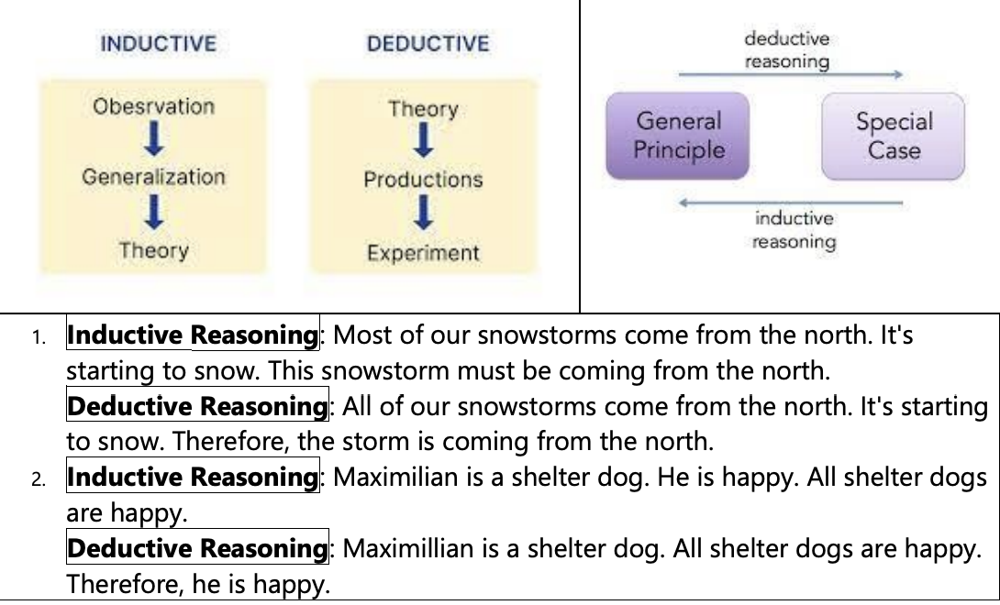

 

# 1.1 Solving Problems by Inductive Reasoning - Practice

## 1. Identifying inductive or deductive reasoning

1. The next number in the pattern 2, 4, 6, 8, 10 is 12.
2. To find the perimeter P of a square with side of length s, I can use the formula P = 4s. So the perimeter of a square with side of length 7 inches is 4 X 7 = 28 inches.
3. It has rained every day for the past six days, and it is raining today as well. So it will also rain tomorrow.
4. If you take your medicine, you’ll feel a lot better. You take your medicine. Therefore, you’ll feel a lot better.
5. Carrie’s first five children were boys. If she has another baby, it will be a boy.
6. If the same number is subtracted from both sides of a true equation, the new equation is also true. I know that 9 + 18 = 27. Therefore, (9 + 18) - 13 = 27 - 13.
7. In the sequence 5, 10, 15, 20, 25, … , the most probable next number is 30.
8. If you build it, they will come. You build it. Therefore, they will come.

## 2. Determine the most probable next term in each of the following lists of numbers.

1. 6, 9, 12, 15, 18
2. 13, 18, 23, 28, 33
3. 3, 12, 48, 192, 768
4. 32, 16, 8, 4, 2
5. 3, 6, 9, 15, 24, 39
6. 1/3, 3/5, 5/7, 7/9, 9/11

## 3. Use the list of equations and inductive reasoning to predict the next equation, and then verify your conjecture.

| 1                       | 2                    | 3                       |
| :---------------------- | :------------------- | :---------------------- |
| (1 X 9) + 2 = 11        | 15873 X 7 = 111,111  | 11 X 11 = 121           |
| (12 X 9) + 3 = 111      | 15873 X 14 = 222,222 | 111 X 111 = 12,321      |
| (123 X 9) + 4 = 1111    | 15873 X 21 = 333,333 | 1111 X 1111 = 1,234,321 |
| (1234 X 9) + 5 = 11,111 | 15873 X 28 = 444,444 |                         |

| 4                       | 5                                             | 6                             |
| :---------------------- | :-------------------------------------------- | :---------------------------- |
| 2 = 4 - 2               | 5(6) = 6(6 - 1)                               | 3 = 3(3 - 1)/2                |
| 2 + 4 = 8 - 2           | 5(6) + 5(36) = 6(36 - 1)                      | 3 + 9 = 3(9 - 1)/2            |
| 2 + 4 + 8 = 16 - 2      | 5(6) + 5(36) + 5(216) = 6(216 - 1)            | 3 + 9 + 27 = 3(27 - 1)/2      |
| 2 + 4 + 8 + 16 = 32 - 2 | 5(6) + 5(36) + 5(216) + 5(1296) = 6(1296 - 1) | 3 + 9 + 27 + 81 = 3(81 - 1)/2 |

 

# 1.2 An Application of Inductive Reasoning: Number Patterns

Number Sequences are defined as an ordered list of numbers. Each number in the sequences is defined as a term. For example: 6, 8, 10, 12, 14, ...

We will focus only on two types of number sequences:

1. Arithmetic Sequence
2. Geometric Sequence

## Arithmetic Sequence

Arithmetic Sequence is the sequence in which the difference between two consecutive terms is constant. The constant difference between two consecutive terms is called common difference.

> Example: 6, 8, 10, 12, …. Is an arithmetic sequence
>
> Common difference equal to 2 (8-6, 10-8, 12-10, ...)

## Geometric Sequence

Geometric Sequence is the sequence in which the ratio between two consecutive terms is constant. The constant ratio between two consecutive terms is called common ratio.

> Example: 6, 18, 54, 162, … is a geometric sequence
>
> Common ratio equal to 3, that is 18/6 or 54/18 or 162/54

## Successive Differences

Successive Differences: In some cases, to make a conjecture about the next term method of successive differences may be applied.

> Example: 14, 22, 32, 44, ...
> 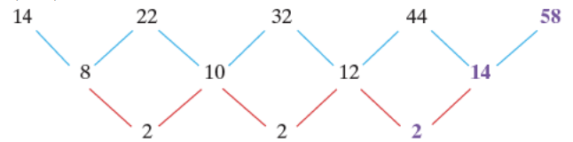
> Once the row of 2s was obtained and extended, we were able to obtain 12 + 2 = 14, and 44 + 14 = 58 as shown above. The next number in the sequence is 58.

## Number Patterns and Sum Formulas

1. Sum of the first n odd counting numbers: If n is any counting number, then the following is true.
   : 1 + 3 + 5 + ... + (2n - 1) = n2
   : - Example: 1 + 3 + 5 + 7 + 9 + 11 = [___] Number of terms n = 6. Therefore, 1 + 3 + 5 + 7 + 9 + 11 = n2 = 62 = 36
2. Sum of the First n Counting Numbers: If n is any counting number, then the following is true.
   : 1 + 2 + 3 + ... + n =
   $$ {n(n + 1)} \over {2} $$
   : - Example: 1 + 2 + 3 + 4 + 5 + 6 = [___] Number of terms n = 6. Therefore, 1 + 2 + 3 + 4 + 5 + 6 = 6(6+1)/2 = 21
3. Square of Sum of the Counting Numbers: If n is any counting number, then the following is true.
   : (1 + 2 + 3 + 4 + ... + n)2 = 13 + 23 + ... + n3
   : - Example: (1 + 2 + 3 + 4)2 = 13 + 23 + 33 + 43 = 100

## Figurate Number

A figurate number is a number that can be shown by taking dots, and arranging them into a regular shape, such as a triangle or a pentagon. They are also called polygonal numbers because they are arranged to form various polygons.

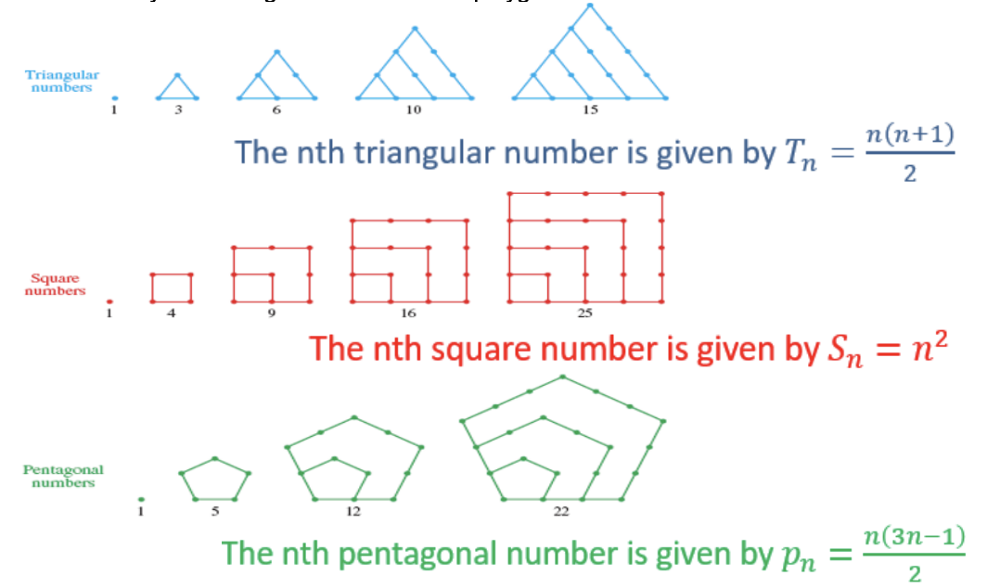

Example: Use the formula to find each of the following.

a) Fifth triangular number

T5 =
$$ {5(5 + 1)} \over {2} $$
= 15

b) Eighth square number

S8 = 82 = 64

c) Fourth pentagonal number

P4 =
$$ {5(3 X 5 - 1)} \over {2} $$
= 35

 

# 1.2 An Application of Inductive Reasoning: Number Patterns - Practice

## 1. For each of the following sequence, give the next term in the sequence.

| 1                      | 2                      | 3                         |
| :--------------------- | :--------------------- | :------------------------ |
| 6, 16, 26, 36, 46, ... | 8, 16, 24, 32, 40, ... | 2, 12, 72, 432, 2592, ... |

| 4                     | 5                            | 6                         |
| :-------------------- | :--------------------------- | :------------------------ |
| 2, 8, 18, 32, 50, ... | 4096, 1024, 256, 64, 16, ... | 10, 50, 90, 130, 170, ... |

## 2. Use the method of successive differences to determine the next number in each sequence.

| 1                           | 2                            | 3                                | 4                                       |
| :-------------------------- | :--------------------------- | :------------------------------- | :-------------------------------------- |
| 3, 14, 31, 54, 83, 118, ... | 1, 11, 35, 79, 149, 251, ... | 2, 57, 220, 575, 1230, 2317, ... | 3, 19, 165, 771, 2503, 6483, 14409, ... |

## 3. Determine what the next equation would be, and verify that it is indeed a true statement.

| 1                   | 2                                         | 3                                     | 4                               |
| :------------------ | :---------------------------------------- | :------------------------------------ | :------------------------------ |
| (1 x 8) + 1 = 9     | 1 = 12                         | 12 + 1 = 22 - 2 | 1 + 2 = 3                       |
| (12 x 8) + 2 = 98   | 1 + 2 + 1 = 22                 | 22 + 2 = 32 - 3 | 4 + 5 + 6 = 7 + 8               |
| (123 x 8) + 3 = 987 | 1 + 2 + 3 + 2 + 1 = 32         | 32 + 3 = 42 - 4 | 9 + 10 + 11 + 12 = 13 + 14 + 15 |
|                     | 1 + 2 + 3 + 4 + 3 + 2 + 1 = 42 |                                       |                                 |

## 4. Use the formula "S = {n(n + 1)}/2" to find each sum.

| 1                     | 2                     |
| :-------------------- | :-------------------- |
| 1 + 2 + 3 + ... + 500 | 1 + 2 + 3 + ... + 825 |

## 5. Use the formula "S = n2" to find each sum.

| 1                    | 2                     |
| :------------------- | :-------------------- |
| 1 + 3 + 5 + ... + 49 | 1 + 3 + 5 + ... + 301 |

## 6. The first five triangular, square, and pentagonal numbers can be obtained using sums of terms of sequences as shown below. Find first five hexagonal numbers.

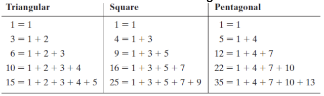

## 7. Use these formulas to find each of the following.

| 1                           | 2                              |
| :-------------------------- | :----------------------------- |
| the sixteenth square number | the eleventh triangular number |

## 8. Determine the indicated term in the given arithmetic sequence or geometric sequence.

| 1                                       | 2                                     | 3                                        | 4                                     |
| :-------------------------------------- | :------------------------------------ | :--------------------------------------- | :------------------------------------ |
| The 10th term of 1, 1/3, 1/9, 1/27, ... | The 101st term of 1/2, 1/ 3/2, 2, ... | The sixteenth term of 5, 15, 25, 35, ... | The eleventh term of 2, 4, 8, 16, ... |

 

# 1.3 Strategic Problem Solving

## Polya's four-step method for problem solving:

- Step 1 - Understand the problem: Read and analyze the problem for through understanding. If requires, read several times and figure out what to find.
- Step 2 - Devise a plan: Different strategies can be used to solve the problem (More explanation is in the next slide).
- Step 3 - Carry out the plan: Once strategy is decided, implement it.
- Step 4 - Look back and check: Check your answer is reasonable and addresses the problem. Think of an alternate strategy to solve the problem.



Devise the Plan (Step 2) - Problem-Solving Strategies

- Make a table or a chart.
- Look for a pattern.
- Solve a similar, simpler problem.
- Draw a sketch.
- Use inductive reasoning.
- Write an equation and solve it.
- If a formula applies, use it.
- Work backward.
- Guess and check.
- Use trial and error.
- Use common sense.
- Look for a "catch" if an answer seems too obvious or impossible.
  

{{ notice-2 | markdownify }}

> Example: Using a Table or Chart
>
> A man put a pair of rabbits in a cage. During the first month the rabbits produced no offspring but each month thereafter produced one new pair of rabbits. If each new pair produced reproduces in the same manner, how many pairs of rabbits will there be at the end of the 5th month?
>
> Solution:
>
> - Step 1: Understand the problem.
>   : How many pairs of rabbits will there be at the end of five months? The first month, each pair produces no new rabbits, but each month thereafter each pair produces a new pair.
> - Step 2: Devise a plan. Construct a table to help with the pattern
>   : | Month | Number of Pairs at Start | Number Produced | Number of Pairs at the End |
> - Step 3: Carry out the plan.
>   : 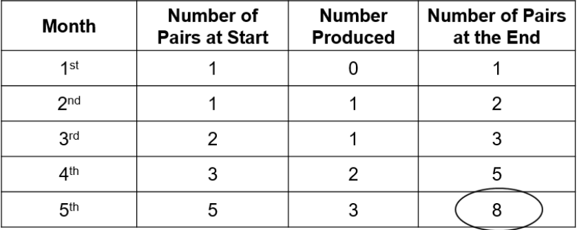
>   : Answer: There will be 8 pairs of rabbits.
> - Step 4: Look back and check.
>   : This can be checked by going back and making sure that it has been interpreted correctly. Double-check the arithmetic.

> Example: Working Backward
>
> Ronnie goes to the racetrack with his buddies on a weekly basis. One week he tripled his money, but then lost $12. He took his money back the next week, doubled it, but then lost $40. The following week he tried again, taking his money back with him. He quadrupled it, and then played well enough to take that much home, a total of $224. How much did he start with the first week?
>
> Solution:
>
> - Because his final amount was $224 and this represents four times the amount he started with on the third week, we divide $224 by 4 to find that he started the third week with $56. Before he lost $40 the second week, he had this $56 plus the $40 he lost, giving him $96.
> - The $96 represented double what he started with, so he started with $96 divided by 2, or $48, the second week. Repeating this process once more for the first week, before his $12 loss he had $48 + $12 = $60. This represents triple what he started with, so we divide $60 by 3 to find that he started with $20.
>
> To check,
>
> - 1st week: (3 × $20) − $12 = $60 − $12 = $48
> - 2nd week: (2 × $48) − $40 = $96 − $40 = $56
> - 3rd week: (4 × $56) = $224 (His final amount)

> Example: Using Trial and Error
>
> The mathematician Augustus De Morgan lived in the nineteenth century. He made the following statement:
>
> "I was x years old in the year x2"
>
> In what year was he born?
>
> Solution:
>
> He lived in the nineteenth century, which means during the 1800s. Find a perfect square that is between 1800 and 1900.
>
> - 422 = 1764
> - 432 = 1849
> - 442 = 1936
>
> 43 is the only natural number that works. De Morgan was 43 in 1849. Subtract 43 from 1849 to get that he was born in 1806.

> Example: Considering a Simpler Problem
>
> The digit farthest to the right in a counting number is called the ones or units digit, because it tells how many ones are contained in the number when grouping by tens is considered. What is the ones (or units) digit in 24000?
>
> Solution:
>
> Recall that 24000 means that 2 is used as a factor 4000 times. To answer the question, we examine some smaller powers of 2 and then look for a pattern. We start with the exponent 1 and look at the first twelve powers of 2.
> 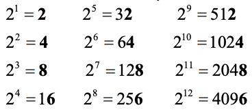
> Notice that in any one of the four rows above, the ones digit is the same all the way across the row. The final row, which contains the exponents 4, 8, and 12, has the ones digit 6. Each of these exponents is divisible by 4 and, because 4000 is divisible by 4, we can use inductive reasoning to predict that the unit’s digit in 24000 is 6.

> Example: Drawing a Sketch
>
> An array of nine dots is arranged in a 3 × 3 square as shown below. Join the dots with exactly four straight lines segments. You are not allowed to pick up your pencil from the paper and may not trace over a segment that has already been drawn.
> 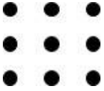
>
> Solution:
>
> Through trial and error with different attempts such as:
> 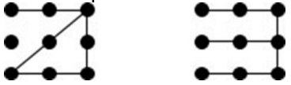
>
> We find an answer is:
> 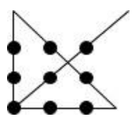

> Example: Using Common Sense
>
> Two currently minted United States coins together have a total value of $1.05. One is not a dollar. What are the two coins?
>
> Solution:
>
> Our initial reaction might be, “The only way to have two such coins with a total of $1.05 is to have a nickel and a dollar, but the problem says that one of them is not a dollar.” This statement is indeed true. What we must realize here is that the one that is not a dollar is the nickel, and the other coin is a dollar! So the two coins are a dollar and a nickel.

> Example:
>
> A certain part of a metropolitan area has a palindromic, 5-digit area code, say abcde, satisfying these conditions: a, b and c are all multiples of two and are all less than 8; a ≠ b but a + b = 6; c ≠ d but a + c = 12; e ≠ b or d; b + d ≠ 4. Determine the area code.
>
> Solution:
>
> a + b = 6 and a + c = 12, where a ≠ b
>
> - If a = 2 and b = 4 then c = 10 which is not possible because "c" cannot more than 8.
> - If a = 4 and b = 2 then c = 8 which is not possible because "c" cannot be equal to 8.
> - If a = 6 and b = 0 then c = 6 which is possible.
>
> As area code is palindromic, and we know the first three digits, we can write the rest as 60606.

 

# 1.3 Strategic Problem Solving - Practice

## 1. Bob gave four-fifths of his pencils to Barbara, then he gave two-thirds of the remaining pencils to Bonnie. If he ended up with ten pencils for himself, how many did he start with?

## 2. When 6 gallons of gasoline are put into a car’s tank, the indicator goes from 1/4 of a tank to 5/8. What is the total capacity of the gasoline tank?

## 3. The number in an unshaded square is obtained by adding the numbers connected with it from the row above. What is the value of x?

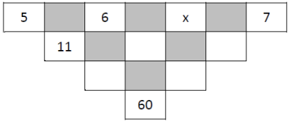

## 4. By drawing two straight lines, divide the face of a clock into three regions such that the numbers in the regions have the same total.

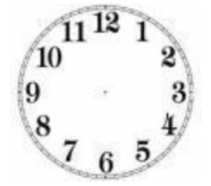

## 5. Today is your first day driving a city bus. When you leave downtown, you have twenty-three passengers. At the first stop, three people exit and five people get on the bus. At the second stop, eleven people exit and eight people get on the bus. At the third stop, five people exit and ten people get on. How old is the bus driver?

 

# 2.1 Symbols and Terminology (Set Theory)

Designate Sets:

Set: A collection of distinct objects. Each member of the set is called element of the set.

Sets are designated using the following three methods:

1. Word description, For Example: The set of even counting numbers less than 10
2. The listing method, For Example: {2, 4, 6, 8}
3. Set-builder notation, For Example: {x|x is an even counting number less than 10}

Note that:

- Sets are denoted by capital letters.
- Empty set or null set is the set with no element and is denoted by ∅ or { }
- ∈ : is a symbol that reads as “ELEMENT”,
- ∉ : is a symbol that reads as “NOT AN ELEMENT”

> Example:
>
> 1. A = {x|x is odd counting number less than 10}
> 2. A = {1,3,5,7,9}
> 3. 5 ∈ A, 5 is an element of set A
> 4. 6 ∉ A, is not an element of set A

> Example: Applying the Set Symbol
>
> Determine whether each statement is true or false
>
> | 1                                     | 2                                |
> | :------------------------------------ | :------------------------------- |
> | 4 ∈ {1,2,5,8,13}                      | 0 ∈ {0,1,2,3}                    |
> | 4 is not an element of the set; False | 0 is an element of the set; True |

Empty set:

The set containing no elements is called the empty set, or null set. The symbol ∅ is used to denote the empty set, so ∅ and { } have the same meaning. We do not denote the empty set with the symbol {∅} because this notation represents a set with one element.

Finite and Infinite Sets:

- Finite Sets: A set with finite in other words countable number of elements.
  : Example: A = {1, 3, 5, 7, 9, 11} has only six elements
- Infinite Sets: A set with infinite or in other words uncountable number of elements.
  : Example:
  : 1. A set of all even numbers, A = {2, 4, 6, 8, …}
  : 2. Natural numbers or counting numbers, A = {1, 2, 3, 4, …}
  : 3. Whole numbers, A = {0, 1, 2, 3, 4, …}
  : 4. Integers
  : 5. Rational numbers

Sets of Numbers and Cardinality:

- Sets of Numbers:
  : - Natural numbers (counting) {1, 2, 3, 4, ...}
  : - Whole numbers {0, 1, 2, 3, 4, ...}
  : - Integers {...,−3, −2, −1, 0, 1, 2, 3, ...}
  : - Rational numbers {p/q\|p and q are integers, with q ≠ 0} May be written as a terminating decimal, like 0.25, or a repeating decimal, like 0.333 ...
  : - Irrational {x\|x is not expressible as a quotient of integers} Decimal representations never terminate and never repeat.
  : - Real numbers is the set of numbers containing all of integers, whole numbers, the rational numbers and all of the irrational numbers.
- Cardinal Number or Cardinality: The number of elements in a set is called the cardinal number, or cardinality, of the set. The symbol n(A), which is read “n of A,”
  : Example:
  : - For set A = {a, b, c, d} cardinal number is n(A) = 4
  : - The empty set,∅, contains no elements, so n(∅) = 0.

Equality of Sets:

Set A and B are equal only if the following conditions are satisfied

1. Every element of A is an element of B
2. Every element of B is an element of A

> Example: If A = {a, b, c}, B = {c, a, b} the A = B
>
> Example: Determining Whether Two Sets Are Equal
>
> - Are {−5, 2, 6, 7} and {−5, 0, 2, 6, 7} equal sets?
>   : - Every element of the first set is an element of the second set. However, 0 is an element of the second set and not the first set.
>   : - The sets are Not equal.

Well-Defined set:

One for which we can determine membership. So if a set and object was given, we could determine if the set contains the object.

> Example:
>
> | 1              | 2            | 3                      |
> | :------------- | :----------- | :--------------------- |
> | 5 ∈ {-1,2,4,5} | 0 ∉ {2,3,6}  | {People who sing well} |
> | Well-Defined   | Well-Defined | Not Well-Defined       |

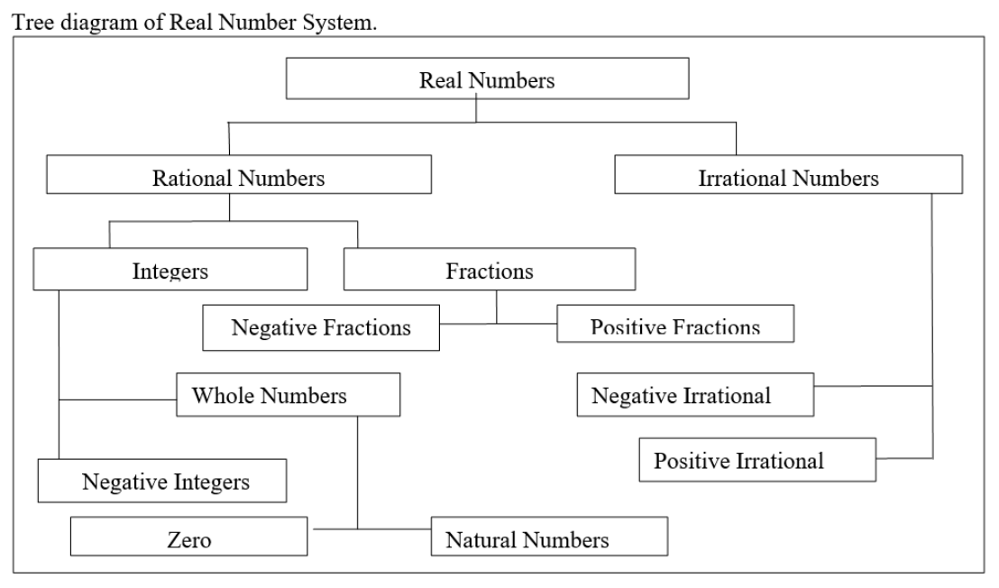

 

# 2.1 Symbols and Terminology (Set Theory) - Practice

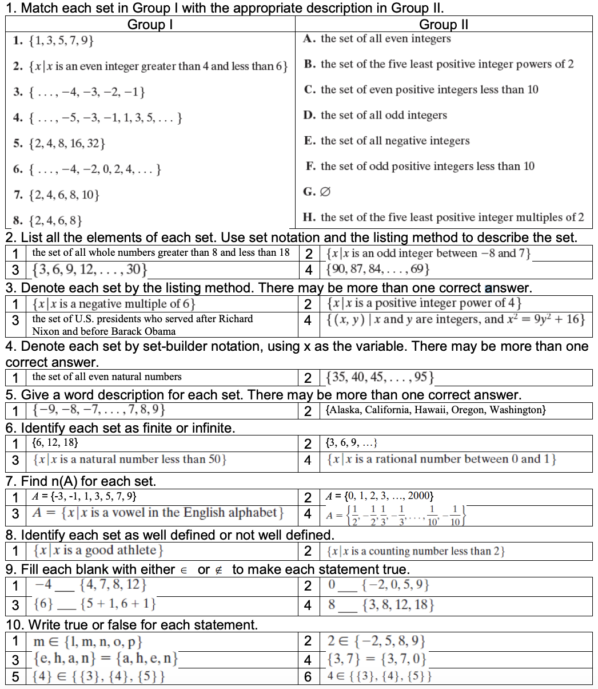

 

---

 

    🖋️ This is my self-taught blog! Feel free to let me know
    if there are some errors or wrong parts 😆

[Back to Top](#){: .btn .btn--primary }{: .align-right}
