<!-- 

📋 This is the tech-news archives to help me keep track of what I am interested in!

- Reference tech news link: <https://thenextweb.com/news/blockchain-development-tech-career>
  

{{ notice-2 | markdownify }}
 -->

📋 This is my note-taking from what I learned in the class "Math185-002 Discrete Mathematics"
{: .notice--danger}

 

# Overview of Course

## Topics

- Venn Diagrams and Subsets
- Set Operations
- Cardinal Numbers and Surveys & Mathematical Systems and Number Theory

## Weekly Learning Outcomes

- Find the complement, intersection, union, and difference of sets.
- Find subsets and proper subsets.
- Represent sets with Venn diagrams.
- Fill in a Venn diagrams using cardinal numbers

 

# 2.2 Venn Diagrams and Subsets

Venn Diagrams and Subsets

## Set

A collection of distinct objects. Each member of the set is called element of the set.

Sets are designated using the following three methods:

1. Word description,For Example: The set of even counting numbers less than 10
2. The listing method, For Example: {2, 4, 6, 8}
3. Set-builder notation, For Example: {x\|x is an even counting number less than 10}

Note that:

- Sets are denoted by capital letters.
- Empty set or null set is the set with no element and is denoted by ∅ or { }
- ∈ : is a symbol that reads as “ ELEMENT”,
- ∉ : is a symbol that reads as “NOT AN ELEMENT”

> Example 1:
>
> 1. A = {x\|x is odd counting number less than 10}
> 2. A = {1,3,5,7,9}
> 3. 5 ∈ A, 5 is an element of set A
> 4. 6 ∉ A , is not an element of set A

 

## Empty set

The set containing no elements is called the empty set, or null set. The symbol ∅ is used to denote the empty set, so ∅ and { } have the same meaning. We do not denote the empty set with the symbol {∅} because this notation represents a set with one element.

 

## Subsets

### 1. Subset:

Set A is subset of set B if every element of A is also an element of B. Symbolically A ⊆ B

> Example 1:
>
> If A = {a,b,c} and B = {c,b,a}, then A ⊆ B

> Example 2:
>
> Write ⊆ or ⊈ in each blank to make a true statement.
>
> - {3,4,5,6} ? {3,4,5,6,8} &rarr; Therefore, {3,4,5,6} ⊆ {3,4,5,6,8}
> - {1,2,6} ? {2,4,6,8} &rarr; Therefore, {1,2,6} ⊈ {2,4,6,8}
> - {5,6,7,8} ? {6,5,8,7} &rarr; Therefore, {5,6,7,8} ⊆ {6,5,8,7}

### 2. Proper Subsets:

Set A is a proper subset of B if A ⊆ B and 𝐴 ≠ 𝐵. Symbolically A ⊂ B

> Example 1:
>
> If A = {a,b,c} and B = {a,b,c,d}, then A ⊂ B

> Example 2:
>
> Decide whether ⊆, ⊂, or both could be placed in each blank to make a true statement.
>
> - {5,6,7} ? {5,6,7,8} &rarr; Therefore, {5,6,7} ⊂ {5,6,7,8}
> - {a,b,c} ? {a,b,c} &rarr; Therefore, {a,b,c} ⊆ {a,b,c}

 

## Set equality

Set A = B if and only if A ⊆ B and B ⊆ A

> Example 1:
>
> If A = {1,2,3} and B = {3,1,2}, then A ⊆ B and B ⊆ A, therefore A = B

 

## Number of Subsets

### 1. Number of Subsets

The number of subsets of a set is given by 2n where n is the cardinal number.

### 2. Number of Proper Subsets

The number of proper subsets of a set is given by 2n − 1 where n is the cardinal number.

> Example 1:
>
> Find the number of subsets and proper subsets of A= {w,x,y,z}
>
> - Number of subsets: 24 = 16
> - Number of proper subsets: 24 - 1 = 15

> Example 2:
>
> Find all possible subsets of a set {a,b,c} by trial and error.
>
> Here, trial and error leads to eight subsets for {a,b,c}: ∅ , {a}, {b}, {c}, {a,b}, {a,c}, {b,c}, {a,b,c}.
>
> An alternative method involves drawing a tree diagram
> 
>
> - Number of subsets: 23 = 8
> - Number of proper subsets: 23 - 1 = 7

 

## Universal Set

The set containing all objects or elements and of which all other sets are subsets. The symbol U is used to denote the universal set.

 

## The Complement of a Set A

The set of elements of U that are not elements of A. Symbolically A' = {x\|x ∈ U and x ∉ A}

> Example 1:
>
> Find each set a)M' b)N'
>
> Let U = {a,b,c,d,e,f,g,h}, M = {a,b,e,f}, and N = {b,d,e,g,h}.
>
> - a) M' = {c,d,g,h}
> - b) N' = {a,c,f}

 

## Venn Diagram

Venn diagram of universal set U is represented by the rectangle and any subset A of U is represented by an oval. The region inside U and outside the oval represents A'.

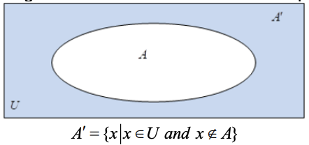

> Example 1:
>
> Let U = {1,2,3,4,5,6,7,8}, A = {2,3,5,6}
>
> - What is: A', the complement of A? Therefore A' = {1, 4, 7, 8}
> - What is U', the complement of U? Therefore U' = ∅
> - What is ∅', the complement of ∅? Therefore ∅' = U

> Example 2:
>
> If U = {a,b,c,...,z}, A = {a,b,c}, and B = {a,b,c,d}, then A ⊂ B
>
> Venn diagram for A ⊂ B is depicted in the figure below.
> 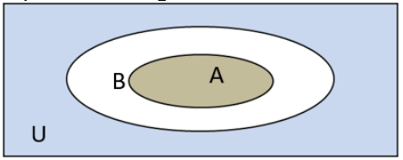

 

# 2.3 Set Operations

Set Operations

## Intersection of Sets

The set of common elements. Symbolically A ∩ B = {x\|x ∈ A and x ∈ B}

> Example 1:
>
> For sets A = {1,2,3,4,5,6} and B = {4,6,8,10}, then A ∩ B = {4,6}

 

## Union of Sets

The set of all elements belonging to either of the sets. Symbolically A ∪ B = {x\|x ∈ A or x ∈ B}

> Example 1:
>
> For sets A = {1,2,3,4,5,6} and B = {4,6,8,10}, then A ∪ B = {1,2,3,4,5,6,8,10}

> Example 2: Describing Sets in Words
>
> Describe each set in words
>
> - A ∩ (B ∪ C') &rarr; This set might be described as "the set of all elements that are in A, and also are in B or not in C."
> - (A' ∪ C') ∩ B' &rarr; One possibility is "the set of all elements that are not in A or not in C, and also are not in B."

 

## Disjoint Sets

Two sets which have no elements in common. So that A ∩ B = ∅

> Example 1:
>
> For sets A = {1,2,3} and B = {4,6,8}, then A ∩ B = ∅

 

## Difference of Sets A and B

Difference of Sets A and B is the set of all elements belonging to set A and not to set B. Symbolically A - B

A - B = {x\|x ∈ A and x ∉ B} OR A - B = {x\|x ∈ A and x ∈ B'}

> Example 1:
>
> For sets A = {1,2,3,4,5,6} and B = {4,6,8,10}, then A - B = {1,2,3,5}



- In general, A - B ≠ B - A
- A - B can also be represented by A ∩ B'
  

{{ notice-2 | markdownify }}

 

## Ordered Pair

A group of two objects designed as first and second components.

In the ordered pair (a,b):

- a is termed the first component.
- b is termed the second component. In the ordered pair (a,b), a is called the first component and b is called the second component.

> (a,b) ≠ (b,a) but {a,b} = {b,a}



- Ordered pairs are represented by the parentheses (,)
- In general, (a,b) ≠ (b,a). i.e. order is important!
- Two ordered pairs (a,b) and (c,d) are equal if and only a = c and b = d.
- Sets can contain ordered pairs: {(a,b), (c,d), ...}
  

{{ notice-2 | markdownify }}

 

## Cartesian Product of Sets

A set of ordered pairs in which each element of one set can be paired with each element of B. Symbolically A x B

A x B = {(a,b)\|a ∈ A and b ∈ B}

> Example 1:
>
> Find the Cartesian product of A x B and B x A if A = {a,b,c} and B = {p,q}. What are the similarities/differences between the two resulting sets?
>
> - The Cartesian product of A x B = {(a,p), (a,q), (b,p), (b,q), (c,p), (c,q)}
> - The Cartesian product of B x A = {(p,a), (p,b), (p,c), (q,a), (q,b), (q,c)}
>
> Therefore the number of order pairs in the set are same but the order pairs are different in both A x B and B x A.

 

## Cardinal Number of a Cartesian Product

For any two sets A and B, if n(A) = a and n(B) = b, then n(A x B) = n(B x A) = n(A) x n(B) = ab

> Example 1:
>
> If n(A) = 3 and n(B) = 2, then n(A x B) = n(B x A) = n(A) x n(B) = 3 x 2 = 6

 

## De Morgan's Laws

For any two sets A and B, (A ∩ B)' = A' ∪ B' and (A ∪ B)' = A' ∩ B'

 

## Set Operations and Venn Diagram

Let A and B be any sets within a universal set U.

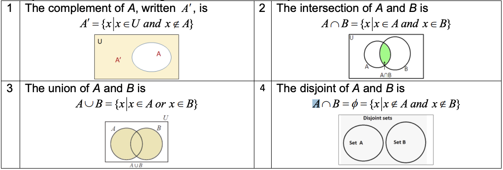
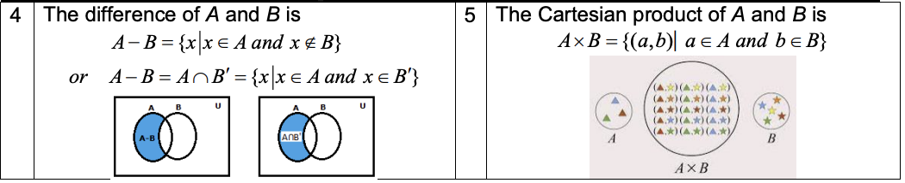

 

## Fundamental Set Properties

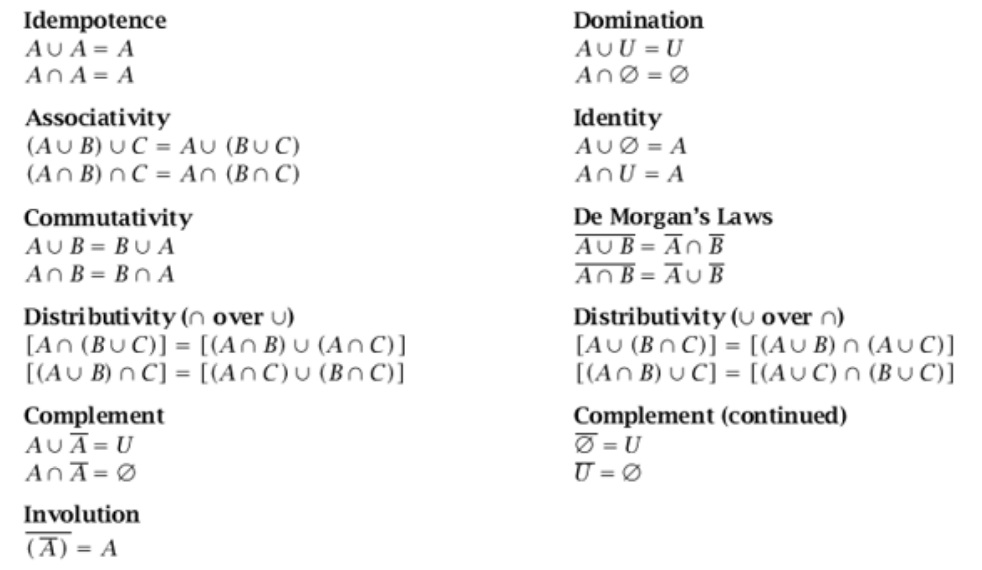

 

## Symbols Used in Set Notation

| Notation            | Name              | Meaning                                                                    |
| :------------------ | :---------------- | :------------------------------------------------------------------------- |
| A ∪ B               | Union             | Elements that belong to set A or set B or both A and B                     |
| A ∩ B               | Intersection      | Elements that belong to both set A and set B                               |
| A ⊆ B               | Subset            | Every element of set A is also in set B                                    |
| A ⊂ B               | Proper Subset     | Every element of A is also in B, but B contains more elements              |
| A ⊄ B               | Not a Subset      | Elements of set A are not elements of set B                                |
| A = B               | Equal Sets        | Both set A and B have the same elements                                    |
| Ac or A' | Complement        | Elements not in set A but in the universal set                             |
| A - B or A\B        | Set Difference    | Elements in set A but not in set B                                         |
| P(A)                | Power Set         | The set of all subsets of set A                                            |
| A x B               | Cartesian Product | The set that contains all the ordered pairs from set A and B in that order |
| n(A) or \|A\|       | Cardinality       | The number of elements in set A                                            |
| ∅ or { }            | Empty Set         | The set that has no elements                                               |
| U                   | Universal Set     | The set that contains all the elements under consideration                 |

 

# 2.4 Surveys and Cardinal Numbers

Surveys and Cardinal Numbers

## Cardinal Number Formula

For any two sets A and B, n(A ∪ B) = n(A) + n(B) − n(A ∩ B)

> Example 1:
>
> Find n(A) if n(A ∪ B) = 22, n(A ∩ B) = 8, and n(B) = 12. We solve the cardinal number formula for n(A).
>
> n(A) = n(A ∪ B) − n(B) + n(A ∩ B) = 22 − 12 + 8 = 18

> Example 2:
>
> Find n(B) if n(A ∪ B) = 30, n(A ∩ B) = 10, and n(A) = 18 We solve the cardinal number formula for n(A).
>
> n(B) = n(A ∪ B) − n(A) + n(A ∩ B) = 30 − 10 + 18 = 38

> Example 3:
>
> Use the numerals representing cardinalities in the Venn diagrams to give the cardinality of each set specified.
> 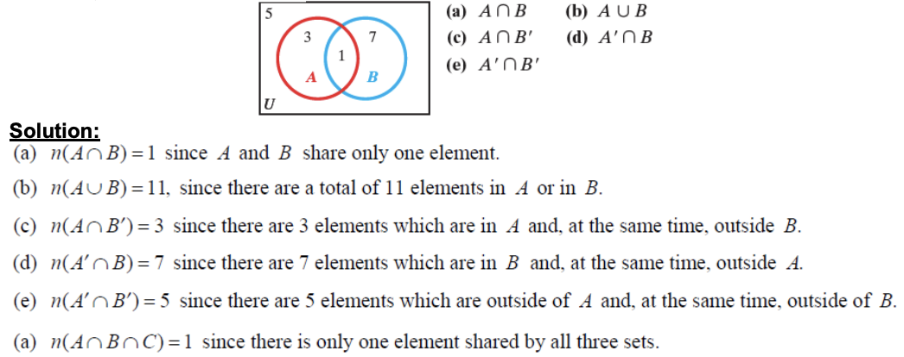

> Example 4:
>
> Find n(A) if n(A ∪ B) = 55, n(A ∩ B) = 15, and n(B) = 35. We solve the cardinal number formula for n(A).
>
> n(A) = n(A ∪ B) − n(B) + n(A ∩ B) = 55 − 35 + 15 = 35

> Example 5:
>
> Find n(A∪B) if n(B) = 28, n(A∩B) = 5, and n(A) = 16. We solve the cardinal number formula for n(A).
>
> n(A ∪ B) = n(A) + n(B) − n(A ∩ B) = 16 + 28 − 5 = 39

> Example 6:
>
> Draw a Venn diagram and use the given information to fill in the number of elements in each region.
>
> n(A) = 19, n(B) = 13, n(A ∪ B) = 25, n(A') = 11
>
> Solution:
>
> 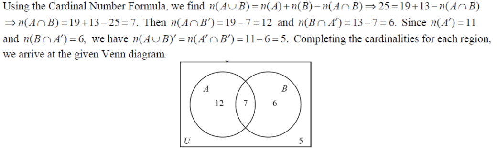

> Example 7: Use Venn diagrams
>
> Joe Long worked on 9 music projects last year.
>
> 1. He wrote and produced 3 projects.
> 2. He wrote a total of 5 projects.
> 3. He produced a total of 7 projects.
>
> - (a) How many projects did he write but not produce?
> - (b) How many projects did he produce but not write?
>
> Solution:
>
> 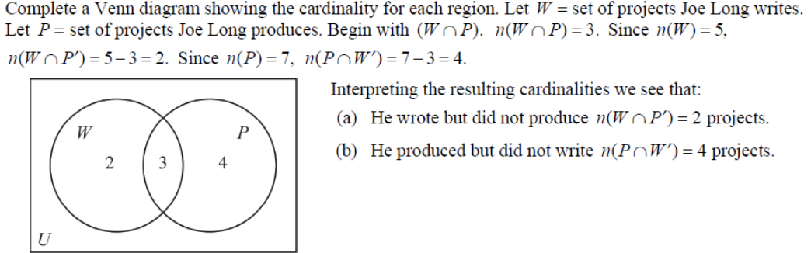

> Example 8:
>
> Sofia, who sells college textbooks, interviewed first-year students on a community college campus to find out the main goals of today’s students.
>
> - Let W = the set of those who want to be wealthy,
> - F = the set of those who want to raise a family,
> - E = the set of those who want to become experts in their fields.
>
> Sofia’s findings are summarized here.
>
> - n(W) = 160
> - n(F) = 140
> - n(E) = 130
> - n(W ∩ F) = 95
> - n(E ∩ F) = 90
> - n(W ∩ F ∩ E) = 80
> - n(E') = 95
> - n[(W ∪ F ∪ E)'] = 10
>
> Find the total number of students interviewed.
>
> Solution:
>
> 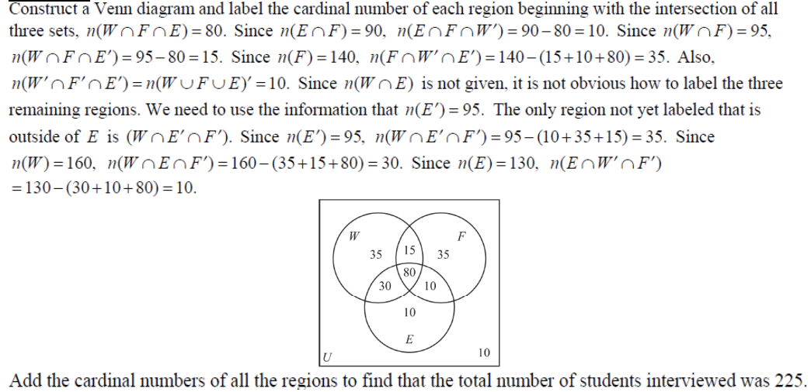

> Example 9: Use Venn diagram
>
> Gitti is a fan of the music of Paul Simon and Art Garfunkel. In her collection of 25 compact discs, she has the following:
>
> 1. 5 on which both Simon and Garfunkel sing
> 2. 7 on which Simon sings
> 3. 8 on which Garfunkel sings
> 4. 15 on which neither Simon nor Garfunkel sings.
>
> - (a) How many of her compact discs feature only Paul Simon?
> - (b) How many of her compact discs feature only Art Garfunkel?
> - (c) How many feature at least one of these two artists?
> - (d) How many feature at most one of these two artists?
>
> Solution:
>
> 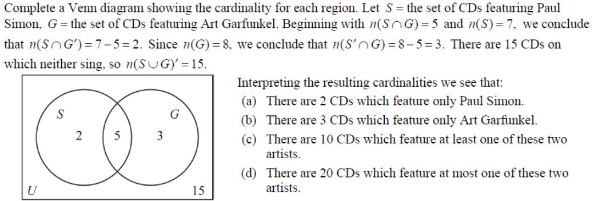

> Example 10: Analyzing a Survey
>
> Suppose that a group of 140 people were questioned about particular sports that they watch regularly and the following information was produced.
>
> 1. 93 like football
> 2. 70 like baseball
> 3. 40 like hockey
> 4. 40 like football and baseball
> 5. 25 like baseball and hockey
> 6. 28 like football and hockey
> 7. 20 like all three
>
> - a) How many people like only football?
> - b) How many people don’t like any of the sports?
>
> Solution:
>
> 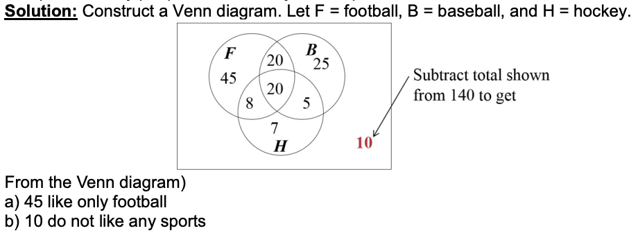

 

---

 

    🖋️ This is my self-taught blog! Feel free to let me know
    if there are some errors or wrong parts 😆

[Back to Top](#){: .btn .btn--primary }{: .align-right}
