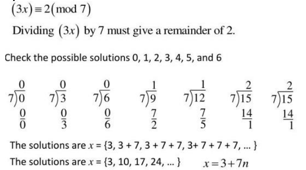
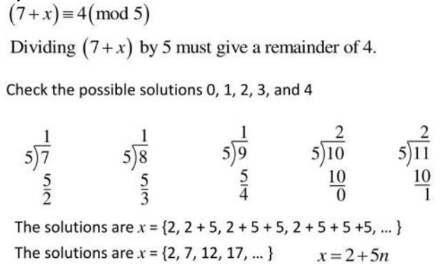
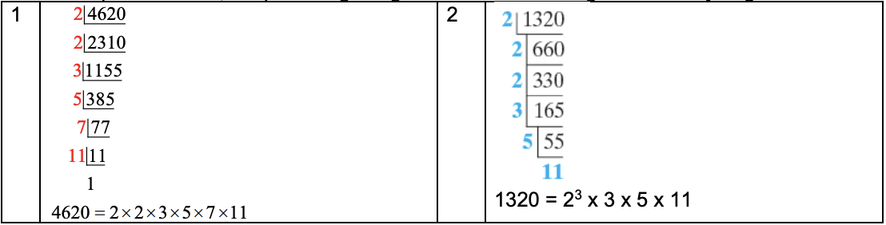
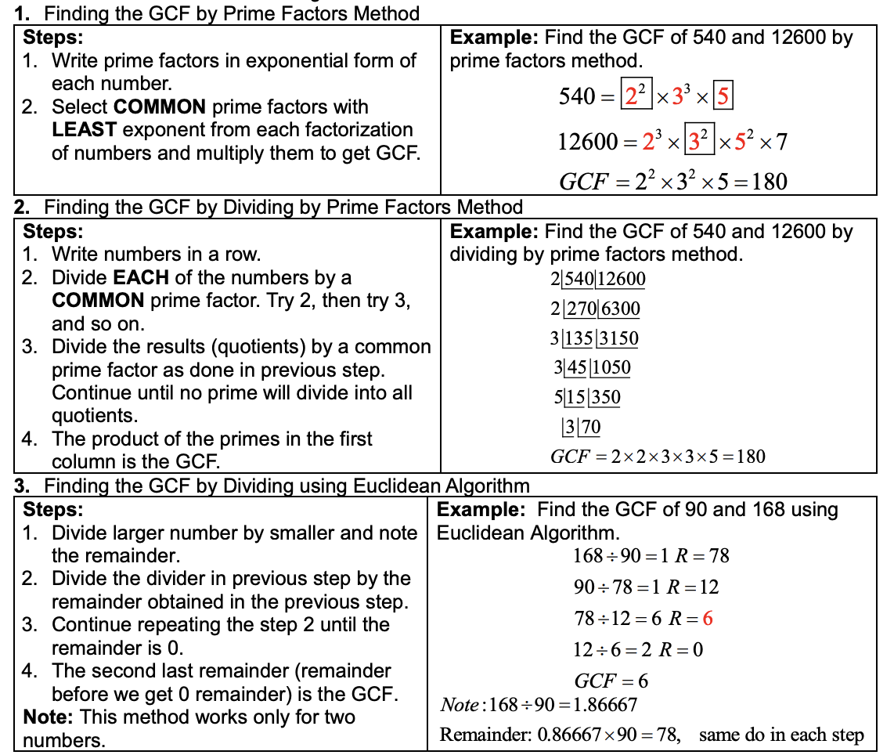

<!-- 

📋 This is the tech-news archives to help me keep track of what I am interested in!

- Reference tech news link: <https://thenextweb.com/news/blockchain-development-tech-career>
  

{{ notice-2 | markdownify }}
 -->

📋 This is my note-taking from what I learned in the class "Math185-002 Discrete Mathematics"
{: .notice--danger}

 

# Overview of Course

## Topics

- Modular Systems and Clock Arithmetic
- Prime and Composite Numbers
- Greatest Common Factor, Least Common Multiple

## Weekly Learning Outcomes

- Solve problems using modular arithmetic.
- Find the prime factorization of composite numbers.
- Find the greatest common factor and least common multiple of a group of numbers.

 

# 4-ext. Modular Systems and Clock Arithmetic

Modular Systems and Clock Arithmetic

## Modular Arithmetic

Modular Arithmetic is a system of arithmetic for integers where the numbers are not placed on a straight and infinite number line, instead numbers are placed on the circle. Number set is finite in modular arithmetic. The length of the circular number line is called the modulus.

 

## Clock Arithmetic

In the above diagram, the face of the clock is shown where 12 is replaced with 0. For a clock calibrated this way, the number set is {0, 1, 2, 3, 4, 5, 6, 7, 8, 9, 10, 11} and it is a finite set.

> Example 1
>
> If it is 9 o’clock now, what time will it be after 29 hours? Or in other words, in 12-hour clock, find the sum 9 + 29.
>
> Solution:
>
> For this addition, add 9 and 29, divide result by 12 and find the remainder (residue). Remainder is the answer.
>
> - 9 + 29 = 38
> - 38 / 12 = 3 and the remainder 2, so 9 + 29 = 2

> Example 2: Multiplication also works for clock numbers
>
> - 3 \* 4 = 4 + 4 + 4 = 0
> - 6 \* 0 = 0
> - 5 \* 4 = 8
>
> The last product shows that 20 is equivalent to 8. This can be written as 20 ≡ 8(mod12)

 

## Remainder

Divide `a` by `b` and multiply the decimal part of the result by `b` to get the remainder.

> Example 1
>
> In 12-hour clock arithmetic, find 17 \* 253.
>
> - 17 \* 253 = 4301
> - 4301 / 12 = 358.416
> - 358.416 - 358 = 0.416
> - 0.416 \* 12 = 5 Remainder
>
> Therefore, 17 \* 253 = 5

 

## Modular System

Modular System is a set of finite whole numbers based on remainders. For example, in a 7-day clock system, 8 and 1 are equivalent (because 8 divided by 7 gives remainder of 1). We say that 8 and 1 are congruent modulo 7. Symbolically: 8 ≡ 1(mod 7)

### Congruence Modulo n

The integers a and b are congruent modulo n (n is a natural number greater than 1 called the modulus) if and only if the difference a-b is divisible by n.

> a ≡ b(mod n) if and only if a - b = kn for some integer k.

- a ≡ b(mod n) if and only if the same remainder is obtained when a and b are divided by n
- a = kn + b
- b is a remainder of residue

> Example 1
>
> Decide if the statement is true or false
>
> - 15 ≡ 9(mod 2)
>
> Solution:
>
> True because 15 – 9 = 6 which is divisible by 2.

> Example 2
>
> Indicate whether the following statements are true or false
>
> - a) 14 ≡ 6(mod 4)
> - b) 25 ≡ 13(mod 7)
> - c) 4 ≡ 109(mod 5)
>
> Solution:
>
> - a) 14 ≡ 6(mod 4) &rarr; True: because 14 - 6 = 8 which is divisible by 4
> - b) 25 ≡ 13(mod 7) &rarr; False: because 25 - 13 = 12 which is divisible by 7
> - c) 4 ≡ 109(mod 5) &rarr; True: because 4 - 109 = -105 which is divisible by 5 (Note: It doesn't matter if we find 4 - 109 or 109 - 4)

> Example 3
>
> Find each sum, difference, or product.
>
> - a) (50 + 34)(mod 7)
> - b) (27 - 5)(mod 6)
> - c) (8 \* 9)(mod 10)
> - d) (5 + 6 \* 3)(mod 5)
>
> Solution:
>
> - a) First 50 + 34 = 84, then divide 84 by 7. The remainder is 0. Therefore, 84 ≡ 0(mod 7) &rarr; (50 + 34) ≡ 0(mod 7)
> - b) First 27 - 5 = 22, then divide 22 by 6. The remainder is 4. Therefore, 22 ≡ 4(mod 6) &rarr; (27 - 5) ≡ 4(mod 6)
> - c) First 8 \* 9 = 72, then divide 72 by 10. The remainder is 2. Therefore, 72 ≡ 2(mod 10) &rarr; (8 \* 9) ≡ 2(mod 10)
> - d) First 5 + 6 \* 3 = 23, then divide 23 by 5. The remainder is 5. Therefore, 23 ≡ 3(mod 5) &rarr; (5 + 6 \* 3) ≡ 3(mod 5)

 

## Solving Modular Equations

We can solve for modular equations with mod n by trying all of the values from 0, 1, 2, ..., n-1 (only practical when n is small).

> Example 1
>
> Solve the following for all whole number solutions.
>
> - a) (3 + x) ≡ 5(mod 7)
> - b) 5x ≡ 4(mod 9)
> - c) 3x ≡ 2(mod 7)
> - d) (7 + x) ≡ 4(mod 5)
>
> Solution:
>
> a) The criterion for congruence is that the given equation is true only if dividing 3 + x by 7 yields remainder 5. Try replacing x by 0, 1, 2, 3, 4, 5, and 6.
>
> - x = 0; (3 + 0) ≡ 5(mod 7) is false. The remainder is 3
> - x = 1; (3 + 1) ≡ 5(mod 7) is false. The remainder is 4
> - x = 2; (3 + 2) ≡ 5(mod 7) is true. The remainder is 5
>
> Try x=3, x=4, x=5 and x=6 to see that none work. Because 2 is a solution of the equation (3 + x) ≡ 5(mod 7), find other solutions to this mod 7 equation by repeatedly adding y. &rarr; The set of all nonnegative solutions of (3 + x) ≡ 5(mod 7) is {2, 9, 16, 23, 30, 37, ...}
>
> b) The criterion for congruence is that the given equation is true only if dividing 5x by 9 yields remainder 4. Try replacing x by 0, 1, 2, 3, 4, 5, 6, 7, and 8.
>
> - x = 0; (5 + 0) ≡ 4(mod 9) is false. The remainder is 0
> - x = 1; (5 + 1) ≡ 4(mod 9) is false. The remainder is 5
> - Continue trying numbers, only x = 8 works
> - x = 8; (5 + 8) ≡ 4(mod 9) is true. The remainder is 4
>
> The set of all nonnegative solutions of 5x ≡ 4(mod 9) is {8, 17, 26, 35, 44, 53, ...}
>
> c) Alternate Method
> 
>
> d) Alternate Method
> 

> Example 2: Finding the Number using Congruence Modulo n
>
> Julio wants to arrange his CD collection in equal size stacks, but after trying stacks of 4, stacks of 5, and stacks of 6, he finds that there is always 1 disc left over. Assuming Julio owns more than one CD, what is the least possible number of discs in his collection?
>
> Solution:
>
> The given information leads to three modular equations:
>
> x ≡ 1(mod 4) x ≡ 1(mod 5) x ≡ 1(mod 6)
>
> Try for x, the value x = 1 works for all three equations. So the solution sets are, respectively,
>
> - {1,5,9,13,17,21,25,29,33,37,41,45,49,53,57,61,65,69,…}
> - {1,6,11,16,21,26,31,36,41,46,51,56,61,66,71,…}
> - and {1,7,13,19,25,31,37,43,49,55,61,67,73,…}
>
> The least common solution greater than 1 is 61, so the least possible number of discs in the collection is 61.

> Example 3: Applying a 7-days "Clock"
>
> Consider Monday Dec 27, 2021. What day of the week will it be in exactly one year from today?
>
> Solution:
>
> Because 2021 is not divisible by 4, it is not leap year, so it has 365 days. We need the remainder after 365 is divided by 7. We could rotate the “day hand” on the 7-day clock face in the given figure or calculate as follows:
>
> 365/7 = 52.14285714 and 52.14285714 - 52 = 0.14285714
>
> 7 \* 0.14285714 = 1
>
> &rarr; One year from today will be one day past Monday – that is, Tuesday.

 

## Residues of Large Numbers

The residue of a number is the number b when given a whole number a in the set {0, 1, 2, 3, … , n –1} such that

> a ≡ b(mod n)

The residue b will be the remainder when a is divided by n.

### Procedure for finding the residue of a, Modulo n

In a modular system, the residue modulo n for a number a can be found by completing these three steps, in turn.

1. Divide a by the modulus n.
2. Retain the portion of the remainder that follows the decimal.
3. Multiply the decimal part of the quotient by n. (A calculator’s mixed number button can also be used to find the remainder)

The final result is the residue modulo n.

> Example 1: Find the residue of 846238527 modulo 23.
>
> Solution:
>
> 846238527/23 = 36,792,979.4347826 and 36,792,979.4347826 - 36,792,979 = 0.4347826
>
> 23 \* 0.4347826 = 10
>
> &rarr; The residue is 10. (846238527 = 36,792,979 \* 23 = 10)

> Example 2: Find the residue of 458687 x 931056 modulo 18.
>
> Solution:
>
> 1.
>
> - 458687/18 = 25,482.61111
> - 25,482.61111 - 25,482 = 0.61111
> - 0.61111 \* 18 = 11
>
> 2.
>
> - 931056/18 = 51,725.33333
> - 51,725.33333 - 51,725 = 0.33333
> - 0.33333 \* 18 = 6
>
> Now the product of the individual residues is 11 x 6 = 66. Since 66 is still not less than 18, simply mod again.
>
> - 66/18 = 3.66666...
> - 3.66666... - 3 = 0.66666...
> - 18 \* 0.66666... = 12
>
> The residue, modulo 18, of 458687 x 931056 is 12.

 

# 5.1 Prime and Composite Numbers

Prime and Composite Numbers

## Divisibility

The natural number a is divisible by the natural number b if there exists a natural number k such that a/b = k. If b divides a, then we write b\|a

## Properties

- If a natural number b divides a natural number a, a/b is also a natural number.
- If a natural number b divides a natural number a, then b is a factor of a and a is a multiple of b.

> Example 1
>
> 5\|30
>
> 5 is a factor of 30 and 30 is a multiple of 5 because 5 divides 30, 30 = 5 x 6 is called a factorization of 30

> Example 2
>
> Find all the natural number factors of the following:
>
> - a) 42 &rarr; Factors = {1,2,3,6,7,14,21,42}
> - b) 51 &rarr; Factors = {1,3,17,51}

 

## Prime number

A natural number greater than 1 that has only itself and 1 as a factor is called a prime number 2, 3, 5, 7...

## Composite number

A natural number greater than 1 that is not prime is called composite
4, 6, 8...

Note: 1 is neither a prime number nor a composite number.{: .notice--danger}

 

## Sieve of Eratosthenes

There is a systematic method for identifying prime numbers in a list of numbers: 2, 3, ... , n. The method, known as the `Sieve of Eratosthenes`, is named after the Greek geographer, poet, astronomer, and mathematician (about 276 – 192 b.c.). To construct such a sieve, list all the natural numbers from 2 through some given natural number n, such as 100.

- We know 2 is a prime. Circle it and cross out all the remaining multiples of 2.
- The least number remaining, 3, is then prime. Circle it and cross out all the remaining multiples of 3.
- The least number remaining, 5, is then prime. Circle it and cross out all the remaining multiples of 5.
- soon on.

The numbers that are left {2, 3, 5, 7, 11, 13, 17, 19, 23, 29, 31, 37, 41, 43, 47, 53, 59, 61, 67, 71, 73, 79, 83, 89, 97} are the primes less than or equal to 100.

 

## The Fundamental Theorem of Arithmetic

The Fundamental Theorem of Arithmetic states that every composite number can be uniquely factored as a product of prime numbers.

Example: a) 15 = 3 x 5, b) 24 = 23 x 3

OR

Every natural number greater than 1 either is prime itself or is the product of a unique combination of prime numbers. This unique product of prime numbers is called Prime Factorization of the Natural Number.

 

## Divisibility tests for Natural Numbers

| Divisibility Tests                                                                           | Example                                                                                         |
| :------------------------------------------------------------------------------------------- | :---------------------------------------------------------------------------------------------- |
| A number is divisible by 2, If the last digit is 0, 2, 4, 6 or 8.                            | 168 is divisible by 2 since the last digit is 8.                                                |
| A number is divisible by 3, If the sum of the digits is divisible by 3.                      | 168 is divisible by 3 since the sum of the digits is 15 (1+6+8 = 15), and 15 is divisible by 3. |
| A number is divisible by 4, If the number formed by the last two digits is divisible by 4.   | 316 is divisible by 4 since 16 is divisible by 4.                                               |
| A number is divisible by 5, If the last digit is either 0 or 5.                              | 195 is divisible by 5 since the last digit is 5.                                                |
| A number is divisible by 6, If it is divisible by 2 AND it is divisible by 3.                | 168 is divisible by 6 since it is divisible by 2 AND it is divisible by 3.                      |
| A number is divisible by 8, If the number formed by the last three digits is divisible by 8. | 7,120 is divisible by 8 since 120 is divisible by 8.                                            |
| A number is divisible by 9, If the sum of the digits is divisible by 9.                      | 549 is divisible by 9 since the sum of the digits is 18 (5+4+9 = 18), and 18 is divisible by 9. |
| A number is divisible by 10, If the last digit is 0.                                         | 1,470 is divisible by 10 since the last digit is 0.                                             |

> Example 1
>
> Decide whether the first number (45864) is divisible by the second (9). Explain the divisibility test applied. 45864; 9
>
> Solution:
>
> Divisibility test for 9: Since the sum of the digits 4 + 5 + 8 + 6 + 4 = 27 is divisible by 9, the number 45864 is divisible by 9.

> Example 2
>
> Decide whether each number is prime or composite.
>
> - a) 89
> - b) 83,572
>
> Solution:
>
> - a) 89; Because 89 is circled in the table on the previous slide, it is prime. If 89 had a smaller prime factor, 89 would have been crossed out as a multiple of that factor.
> - b) 83572; The number 83572 is even, so it is divisible by 2. It is composite.

> Example 3
>
> Find the Prime factors; 1) 4620 2) 1320
>
> Solution:
>
> To find the prime factors, keep dividing the given numbers starting with 2 until you get 1.
> 

> Example 4
>
> Is the number 2,984,094 divisible by 4?
>
> Solution:
>
> The last two digits form the number 94. Since 94 is not divisible by 4, the given number is not divisible by 4.

> Example 5
>
> Is the number 4,355,211 divisible by 3?
>
> Solution:
>
> The sum of the digits is 4 + 3 + 5 + 5 + 2 + 1 + 1 = 21, which is divisible by 3. Therefore, the given number is divisible by 3.

 

# 5.4 Greatest Common Factor and Least Common Multiple

Greatest Common Factor and Least Common Multiple

## Greatest Common Factor (Divisor) GCF or GCD

The greatest common factor (GCF) of a set of natural numbers is the largest number that divides each number in the set.

> Example 1
>
> 6 is the GCF of 12 and 18.

 

## Methods of Finding GCF

There are three methods of finding GCF:

 

## Least Common Multiple (LCM)

Least Common Multiple (LCM) is the smallest common multiple of all the natural numbers in a set.

> Example 1
>
> 20 is the LCM of 4 and 10.
>
> - Multiples of 4 = {4,8,12,16,20,24,28,...}
> - Multiples of 10 = {10,20,30,40,50,60,...}
> - Common multiples are {20,40,60,...}
> - Smallest common multiples is 20.
> - LCM = 20

 

## Methods of Finding LCM

LCM can be found in three different ways:

> Example 1
>
> Joshua has 450 football cards and 840 baseball cards. He wants to place them in stacks on a table so that each stack has the same number of cards, and no stack has different types of cards within it. What is the greatest number of cards that he can have in each stack?
>
> Solution:
>
> Here, we are looking for the greatest number that will divide evenly into 450 and 840. This is, of course, the greatest common factor of 450 and 840. Using any of the methods described in this section, we find that greatest common factor of 450 and 840 = 30. Therefore, the greatest number of cards he can have in each stack is 30. He will have 15 stacks of 30 football cards and 28 stacks of 30 baseball cards.

 

---

 

    🖋️ This is my self-taught blog! Feel free to let me know
    if there are some errors or wrong parts 😆

[Back to Top](#){: .btn .btn--primary }{: .align-right}
