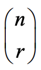
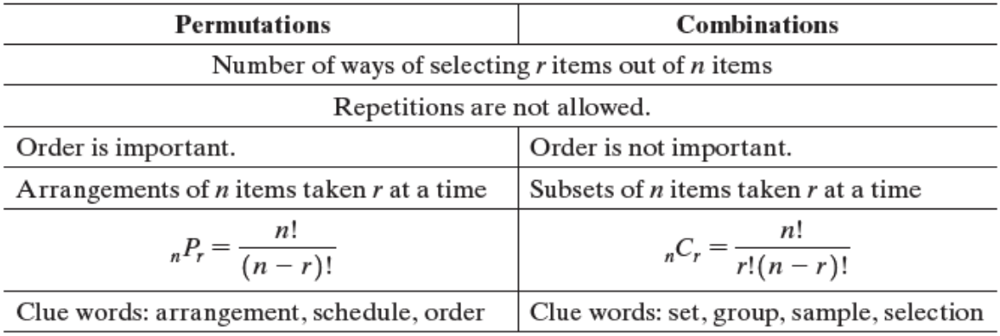
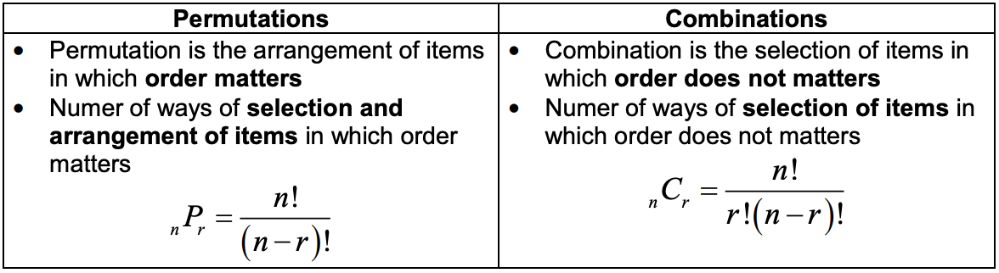
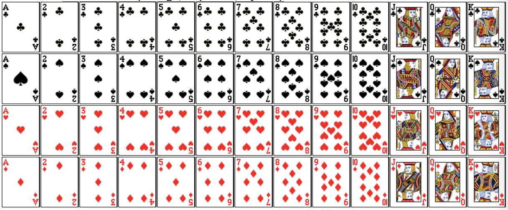

<!-- 

📋 This is the tech-news archives to help me keep track of what I am interested in!

- Reference tech news link: <https://thenextweb.com/news/blockchain-development-tech-career>
  

{{ notice-2 | markdownify }}
 -->

📋 This is my note-taking from what I learned in the class "Math185-002 Discrete Mathematics"
{: .notice--danger}

 

# Overview of Course

## Topics

- Counting by Systematic Listing
- The Fundamental Counting Principle
- Permutations and Combinations

## Weekly Learning Outcomes

- Apply systematic listing to counting problems.
- Use the Fundamental Counting Principle.
- Use permutations and combinations in counting problems.

 

# 10.1 Counting by Systematic Listing

Counting by Systematic Listing

## One-Part Tasks

The results for simple, one-part tasks can often be listed easily. For the task of tossing a fair coin, the list is heads, tails, with two possible results. For the task of rolling a single fair die the list is 1, 2, 3, 4, 5, 6, with six possibilities.

> Example 1:
>
> Consider a club N with four members: N = {Adam, Brian, Cindy, David} or in abbreviated form N = {A, B, C, D}. In how many ways can this group select a president?
>
> Solution:
>
> Club can select any of the four members as a president. So there are total 4 possible selections: A, B, C, and D.

> Example 2:
>
> Consider a club N with four members: N = {Mike, Adam, Ted, Helen} or in abbreviated form N = {M, A, T, H}. In how many ways can this group select a president?
>
> Solution:
>
> The task is to select one of the four members as president. There are four possible results: M, A, T, and H.

 

## Two-Part Tasks and Product Table

Two-part tasks can be listed by using a product table (it is not a database table that you normally come across in database courses). Product table can be created by listing first part results in rows and second part results in columns and then combine them to get the final list.

> Example 1:
>
> Determine the number of two-digit numbers that can be written using the digits from the set {2, 4, 6}.
>
> Solution:
>
> The task consists of two parts.
>
> 1. Choose a first digit.
> 2. Choose a second digit.
>
> The results for a two-part task can be pictured in a product table, as shown on the next slide.
>
> 
>
> From the table we obtain the list of nine possible results: 22, 24, 26, 42, 44, 46, 62, 64, 66.

> Example 2:
>
> Determine the number of two-digit numbers that can be written using only the digits 1, 2, and 3.
>
> Solution:
>
> 
>
> Thus the possible results. 11, 12, 13, 21, 22, 23, 31, 32, 33; there are nine possibilities.

> Example 3:
>
> Consider a club N with four members: N = {Adam, Brian, Cindy, David} or in abbreviated form N = {A, B, C, D}.
>
> - a) In how many ways can this group select a president and secretary assuming all the members are eligible, and no one can hold both offices?
> - b) In how many ways can this club select a committee of two people?
>
> Solution:
>
> 

> Example 4:
>
> Determine the number of different possible results when two ordinary dice are rolled.
>
> Solution:
>
> 

 

## Tree Diagrams for Multiple-Part Tasks

A task that has more than two parts can be analyzed by a tree diagram.

> Example 1:
>
> Find the number of three-digit numbers that can be written using the digits from the set {2, 4, 6} assuming repeated digits are not allowed.
>
> Solution:
>
> 

> Example 2:
>
> Pamela’s computer printer allows for optional settings with a panel of four on-off switches in a row. How many different settings can she select if no two adjacent switches can both be off?
>
> Solution:
>
> We denote `on` and `off` with 1 and 0, respectively. The number of possible settings is eight
>
> 
>
> Notice that each time a switch is indicated as off (0), the next switch can only be on (1). This is to satisfy the restriction that no two adjacent switches can both be off.

 

## Other Systematic Listing Methods

There are additional systematic ways to produce complete listings of possible results besides product tables and tree diagrams. One of these ways is shown in the following example.

> Example 1:
>
> How many triangles (of any size) are in the figure below?
>
> 
>
> Solution:
>
> One systematic approach is to label the points as shown, begin with A, and proceed in alphabetical order to write all 3-letter combinations (like ABC, ABD, ...), then cross out ones that are not triangles. There are 12 different triangles.

 

# 10.2 The Fundamental Counting Principle

The Fundamental Counting Principle

## Uniformity Criterion for Multiple-Part Tasks

A multiple-part task is said to satisfy the `uniformity criterion` if the number of choices for any particular part is the same no matter which choices were selected for the previous parts.

> Example 1:
>
> Construct a tree diagram showing all possible results when a fair coin is tossed four times, if no two consecutive tosses can both be heads.
>
> Solution:
>
> 
>
> {htht, htth, httt, thth, thtt, ttht, ttth, tttt}

 

## Fundamental Counting Principle

When a task consists of `k` separate parts and satisfies the uniformity criterion, if the first part can be done in n1 ways, the second part can be done in n2 ways, and so on through the `k` th part, which can be done in nk ways, then the total number of ways to complete the task is given by the product n1 x n2 x n3 ... nk

> Example 1:
>
> How many two-digit numbers can be made from the set {0, 1, 2, 3, 4, 5}?
>
> Solution:
>
> - First digit can be selected 5 ways (first digit cannot be 0).
> - Second digit can be selected 6 ways.
> - Total number of two-digit numbers = 5 x 6 = 30.

> Example 2:
>
> How many two-digit numbers that do not contain repeated digits can be made from the set {0, 1, 2, 3, 4, 5}?
>
> Solution:
>
> - First digit can be selected 5 ways (first digit cannot be 0).
> - Second digit can be selected 5 ways.
> - Total number of two-digit numbers = 5 x 5 = 25.

> Example 3:
>
> How many ways can you select two letters followed by three digits for an ID?
>
> Solution:
>
> - First letter can be selected 26 ways.
> - Second letter can be selected 26 ways.
> - First digit can be selected 10 ways.
> - Second digit can be selected 10 ways.
> - Third digit can be selected 10 ways.
> - Total number of ID = 26 x 26 x 10 x 10 x 10 = 676000.

> Example 4:
>
> In some states, auto license plates have contained three letters followed by three digits. How many such licenses are possible?
>
> Solution:
>
> The basic task is to design a license plate with three letters followed by three digits. There are six component parts to this task. There are no restrictions on letters or digits, so the fundamental counting principle gives 26 x 26 x 26 x 10 x 10 x 10 = 263 x 103 = 17,576,000 possible licenses. In practice, a few of the possible sequences of letters are considered undesirable and are not used.

 

## Factorials

For any counting number n, the product of all counting numbers from n down through 1 is called n factorial and is denoted n!

- n! = n x (n-1) x (n-2) x ... x 1
- Note: 0! = 1 and 1! = 1

> Example 1:
>
> Evaluate each expression.
>
> - 3!
> - 6!
> - (6-3)!
> - 6! - 3!
>
> Solution:
>
> - 3! = 3 x 2 x 1 = 6
> - 6! = 6 x 5 x 4 x 3 x 2 x 1 = 720
> - (6-3)! = 3! = 3 x 2 x 1 = 6
> - 6! - 3! = 720 - 6 = 714

> Example 2:
>
> Evaluate
> $$ {100!} \over {98!} $$
>
> Solution:
>
> $$ {100!} \over {98!} $$
> \=
> $$ {100 × 99 × 98!} \over {98!} $$
> \= 9900

 

## Arrangements of Objects

When finding the total number of ways to `arrange` a given number of `DISTINCT` objects, we can use a factorial. The total number of different ways to arrange n distinct objects is n!.

> Example 1:
>
> How many ways can you line up 6 different books on a shelf?
>
> Solution:
>
> 6! = 720

 

## Arrangements of n Objects Containing Look-Alikes

The number of distinguishable arrangements of n objects, where one or more subsets consist of look-alikes (say n1 are of one kind, n2 are of another kind, ..., and nkare of yet another kind), is given by
$$ {n!} \over {n_1!n_2!...n_k!} $$

> Example 1:
>
> Determine the number of distinguishable arrangements of the letters of the word INITIALLY
>
> Solution:
>
> Total = 9 and I=3, N=1, T=1, A=1, L=2, Y=1
>
> $$ {9!} \over {3!2!1!1!1!1!} $$
> \= 30240

> Example 2:
>
> Alex, Barbie, Christopher, Diana, Eric and Fiona have reserved six seats in a raw at the theatre, starting at the aisle seat.
>
> - a) In how many ways can they arrange themselves?
> - b) In how many ways can they arrange themselves so that Alex and Barbie will be next to each other?
> - c) In how many ways can they arrange themselves if the men and women are to alternate seats and a men must seat on the aisle seat?
>
> Solution:
>
> - a) 6! = 720
> - b) Alex and Barbie must be next to each other. We can treat them as a single thing, and they can be arranged in 2! Ways. Now we have total 5 things (Alex and Barbie is a one thing) to arrange and it can be done 5! Ways.
>   : - Total number of possible arrangement = 2! x 5! = 240
> - c) First isle seat can be occupied only by a man and there are 3 men so it can be done in 3 ways. Second seat must be occupied by women and there are 3 women so it can be done in 3 ways. Third seat can be occupied only by a man and there are 2 men left so it can be done in 2 ways. Fourth seat can be occupied only by a woman and there are 2 women left so it can be done in 2 ways. Fifth seat can be occupied only by a man and there is 1 man left so it can be done in 1 way. Final seat can be occupied only by a woman and there is 1 woman left so it can be done in 1 way.
>   : - Total ways = 3 x 3 x 2 x 2 x 1 x 1 = 36

 

# 10.3 Permutations and Combinations

Permutations and Combinations

## Permutations

In the context of counting problems, arrangements are often called permutations; the number of permutations (arrangements) of n DISTINCT (no repetitions) things taken r at a time is denoted P(n,r) or nPr or nPr

P(n,r) = nPr = nPr =
$$ {n!} \over {(n-r)!} $$
(r ≤ n)



Note:

- nPn = n!
- nP1 = n
- nP0 = 1
- nPn-1 = n!

Permutations can be used to find number of arrangements of r objects that can be selected from n objects only is cases where:

- Repetitions are not allowed
- Order is important
  

{{ notice-2 | markdownify }}

> Example 1:
>
> Evaluate each permutation
>
> Solution:
>
> 8P5 =
> $$ {8!} \over {(8-5)!} $$
> \= 
> $$ {8!} \over {3!} $$
> \= 8 x 7 x 6 x 5 x 4 = 6720

> Example 2:
>
> Evaluate each permutation
>
> Solution:
>
> 12P8 =
> $$ {12!} \over {(12-8)!} $$
> \= 
> $$ {12!} \over {4!} $$
> \= 12 x 11 x 10 x 9 x 8 x 7 x 6 x 5 = 19958400

> Example 3:
>
> How many four-digit numbers can be written using the numbers from the set {1, 3, 5, 7, 9} if repetitions are not allowed?
>
> Solution:
>
> Selecting 4 digits from 5 digits without repetition can be done in 5P4 ways
>
> 5P4 =
> $$ {5!} \over {(5-4)!} $$
> \=
> $$ {5!} \over {1!} $$
> \= 5! = 5 x 4 x 3 x 2 x 1 = 120

> Example 4:
>
> How many ways can you select two letters if repeats are not allowed?
>
> Solution:
>
> Selecting 2 letters from 26 letters without repetition can be done in 26P2 ways
>
> 26P2 =
> $$ {26!} \over {(26-2)!} $$
> \=
> $$ {26 × 25 × 24!} \over {24!} $$
> \= 26 × 25 = 650

> Example 5:
>
> How many ways can you select three digits if repeats are not allowed?
>
> Solution:
>
> Selecting 3 digits from 10 digits without repetition can be done in 10P3 ways
>
> 10P3 =
> $$ {10!} \over {(10-3)!} $$
> \=
> $$ {10 × 9 × 8 × 7!} \over {7!} $$
> \= 10 × 9 × 8 = 720

> Example 6:
>
> How many ways can you select two letters followed by three digits for an ID if repeats are not allowed?
>
> Solution:
>
> Two letters can be selected 26P2 ways and three digits can be selected in 10P3 ways.
>
> Applying fundamental principle of counting, total number of ways =
> 26P2 x 10P3 = 650 x 720 = 468000

> Example 7:
>
> Subject identification numbers in a certain scientific research project consist of three letters followed by three digits and then three more letters. Assume repetitions are not allowed within any of the three groups, but letters in the first group of three may occur also in the last group of three. How many distinct identification numbers are possible?
>
> Solution:
>
> This is a three-part task. For each of the first and third groups, there are 26P3 possible arrangements of letters. For the second group, there are 10P3 possible arrangements for the digits. Thus, by the fundamental counting principle,
> 26P3 x 10P3 x 26P3 = 15600 x 720 x 15600 = 175219200000
>
> There are 175219200000 identification numbers.

 

## Combinations

In the context of counting problems, subsets, where order of elements makes no difference, are often called combinations; the number of combinations (or subsets) of n DISTINCT (no repetitions) things taken r at a time is denoted C(n,r) or nCr or nCr or 

C(n,r) = nCr = nCr =  =
$$ {n!} \over {r!(n-r)!} $$
(r ≤ n)



Note:

- nCr = nCn-r
- nCn = 1

Combinations can be used to find number of arrangements of r objects that can be selected from n objects only is cases where:

- Repetitions are not allowed
- Order is NOT important
  

{{ notice-2 | markdownify }}

 

## Guidelines on Which Method to Use

The following table summarizes the similarities and differences between permutations and combinations and appropriate formulas for calculating their values.

 

## Permutations vs Combinations

> Example 1:
>
> Evaluate 11C5
>
> Solution:
>
> 11C5 =
> $$ {11!} \over {5!(11-5)!} $$
> \=
> $$ {11!} \over {5!6!} $$
> \= 462

> Example 2:
>
> In a 7/39 lottery, you select seven distinct numbers from the set 1 through 39, where order makes no difference. How many different ways can you make your selection?
>
> Solution:
>
> Selection can be made in the following ways:
>
> 39C7 =
> $$ {39!} \over {7!(39-7)!} $$
> \=
> $$ {39!} \over {7!32!} $$
> \= 15380937

> Example 3:
>
> In Super Lotto Plus, a California state lottery game, you select five distinct numbers from 1 to 47, and one MEGA number from 1 to 27, hoping that your selection will match a random list selected by lottery officials.
>
> - a) How many different sets of six numbers can you select?
> - b) Paul always includes his age and his wife’s age as two of the first five numbers in his Super Lotto Plus selections. How many ways can he complete his list of six numbers?
>
> Solution:
>
> - a) This is a two-part task. The number of different lotto combinations is 47C5 = 1,533,939. The number of MEGA ticket possibilities is 27C1 = 27. By the fundamental counting principle, the total number of 6-number sets is given by 47C5 x 27C1 = 41,416,353
> - b) Since two of Paul’s lottery numbers are already determined, he only needs to select 3 numbers from the remaining 45 numbers. The number of ways in which Paul can complete his list is 45C3 x 27C1 = 383130

> Example 4:
>
> Find the number of different subsets of size 2 in the set {a, b, c, d}. List them.
>
> Solution:
>
> A subset of size 2 must have two distinct elements, so repetitions are not allowed. The order in which the elements of a set are listed makes no difference, 4C2 =
> $$ {4!} \over {2!(4-2)!} $$
> \=
> $$ {4!} \over {2!2!} $$
> \= 6
>
> The six subsets of size 2 are {a,b} {a,c} {a,d} {b,c} {b,d} {c,d}

 

## A standard 52-card deck contains

- 13 diamonds ♦ (all red)
- 13 hearts ♥ (all red)
- 13 spades ♠ (all black)
- 13 clubs ♣ (all black)
- 4 aces
- 12 face cards (4 kings, 4 queens, 4 jacks)

> Example 1:
>
> A common form of poker involves "hands" (sets) of five cards each, dealt from a standard deck consisting of 52 different cards. How many different 5-card hands are possible?
>
> Solution:
>
> A 5-card hand must contain five distinct cards, so repetitions are not allowed. Also, the order is not important because a given hand depends only on the cards it contains, and not on the order in which they were dealt or the order in which they are displayed or played. Order does not matter, so we use combinations and a calculator.
>
> 52C5 =
> $$ {52!} \over {5!(52-5)!} $$
> \=
> $$ {52!} \over {5!47!} $$
> \= 2,598,960



Note:

- Total number of different ways to arrange n DISTINCT objects (no repetition) is n!
- n available things can be arranged in m available spaces with repetition allowed = nm ways.
- Use the fundamental counting principle to count number of ways when arrangement with repetition is allowed.
- Number of arrangements of n DISTINCT (no repetitions) things taken r at a time is nPr Permutations can be used to find number of arrangements of r objects that can be selected from n objects only in cases where repetitions are not allowed, and order is important.
- Number of arrangements (or subsets) of n DISTINCT (no repetitions) things taken r at a time is nCr. Combinations can be used to find number of arrangements of r objects that can be selected from n objects only in cases where repetitions are not allowed, and order is not important.
  

{{ notice-2 | markdownify }}

 

---

 

    🖋️ This is my self-taught blog! Feel free to let me know
    if there are some errors or wrong parts 😆

[Back to Top](#){: .btn .btn--primary }{: .align-right}
