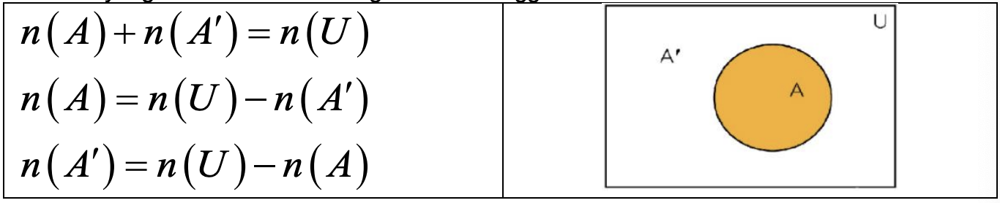

<!-- 

📋 This is the tech-news archives to help me keep track of what I am interested in!

- Reference tech news link: <https://thenextweb.com/news/blockchain-development-tech-career>
  

{{ notice-2 | markdownify }}
 -->

📋 This is my note-taking from what I learned in the class "Math185-002 Discrete Mathematics"
{: .notice--danger}

 

# Overview of Course

## Topics

- Counting Problems using Not and Or
- Discrete Probability- Basic Concepts

## Weekly Learning Outcomes

- Solve counting problems involving "not" and "or"
- Calculate probability using the theoretical and empirical formula.

 

# 10.5 Counting Problems using Not and Or

Counting Problems using Not and Or

## Set Theory-Logic-Arithmetic Correspondences

|                                  | Set Theory    | Logic  | Arithmetic     |
| :------------------------------- | :------------ | :----- | -------------- |
| Operation or Connective (symbol) | Complement(') | Not(~) | Subtraction(-) |
| Operation or Connective (symbol) | Union(U)      | Or(V)  | Addition(+)    |

## Problems Involving "NOT"

Suppose `U` is the set of all possible results of some type. Let `A` be the set of all those results that satisfy a given condition. The figure below suggests that:

## Complements Principle of Counting

The number of ways a certain condition can be satisfied is the total number of possible results minus the number of ways the condition would `not` be satisfied.

> Symbolically, if A is any set within the universal set U, then
>
> n(A) = n(U) - n(A')

## Some events and its complements (NOT)

| n(A)           | n(A')                                |
| :------------- | :----------------------------------- |
| At least one   | None                                 |
| At least two   | Less than two = zero OR one          |
| At least three | Less than three = zero OR one OR two |
| At least n     | Less than n                          |

> Example 1:
>
> Three friends are boarding a plane. There are only 7 seats left, two of which are window seats. How many ways can the three friends arrange themselves in available seats so that at least one of them gets the window seat?
>
> Solution:
>
> - The total number of ways three friends can arrange themselves among 7 seats &rarr; n(U) = 7P3 = 210
> - The number of ways to arrange three people among five non-window seats &rarr; n(A') = 5P3 = 60
> - By complements principle we get the following &rarr; n(A) = n(U) - n(A') = 210 - 60 = 150

> Example 2: Counting the Proper Subsets of a Set
>
> For the set S = {c, a, l, u, t, o, r}, find the number of proper subsets.
>
> Solution:
>
> A proper subset has less than seven elements. Subsets of many sizes would satisfy this condition. It is easier to consider the one subset that is not proper, namely S itself. S has a total of 27 = 128 subsets. From the complements principle, the number of proper subsets is 128 - 1 = 127.

> Example 3: Counting Coin-Tossing Results
>
> If five fair coins are tossed, in how many ways can at least one tail be obtained?
>
> Solution:
>
> By the fundamental counting principle, there are 25 = 32 different results possible. Exactly one of these fails to satisfy "at least one tail." So from the complements principle, we have the answer: 32 - 1 = 31.

 

## Problems Involving "Or" - Additive Principle of Counting

The number of ways that one or the other of two conditions could be satisfied is the number of ways one of them could be satisfied plus the number of ways the other could be satisfied minus the number of ways they could both be satisfied together.

| If A and B are any two sets, then | If A and B are disjoint (n(A∩B)=0, A and B are disjoint), then |
| :-------------------------------- | :------------------------------------------------------------- |
| n(A∪B) = n(A) + n(B) - n(A∩B)     | n(A∪B) = n(A) + n(B)                                           |

> Example 1:
>
> If you toss eight fair coins, in how many ways can you obtain at least two heads?
>
> Solution:
>
> For each coin there are 2 outcomes (H or T) and we have total eight coins. So total number of outcomes are n(U) = 28 = 256. Complement of "at least two heads" is less than two heads and is equivalent to 0 head `OR` 1 head.
>
> This involves both the complements principle and additive principle:
>
> Number of ways to obtain at least two heads: n(U) - n(A∪B) = n(U) - [n(A) + n(B)] = 256 - [1+8] = 247
>
> Note: tossing n fair coins and getting m heads/tails = nCr

> Example 2:
>
> How many five-card hands consist of all hearts or all black cards?
>
> Solution:
>
> n(all heart or all black cards) = n(all hearts) + n(all black cards) = 13C5 + 26C5 = 1287 + 65780 = 67067

> Example 3: Counting Three-Digit Numbers with Conditions
>
> How many three-digit counting numbers are multiples of 2 or multiples of 5?
>
> Solution:
>
> There are 9(10)(5) = 450 three-digit multiples of 2. A multiple of 5 ends in a 0 or 5, so there are 9(10)(2) 180 of those. A multiple of 2 and 5 must end in a 0. There are 9(10)(1) = 90 of those. So we have 450 + 180 - 90 = 540 three-digit counting numbers that are multiples of 2 or 5.

> Example 4: Counting Card-Drawing Results
>
> A single card is drawn from a standard 52-card deck.
>
> - a) In how many ways could it be a club or a queen?
> - b) In how many ways could it be a red card or a face card?
>
> Solution:
>
> - a) n(Club OR Queen) = n(Club) + n(Queen) - n(Club ∩ Queen) = 13C1 + 4C1 - 1C1 = 13 + 4 - 1 = 16
> - b) n(Red OR Face) = n(Red) + n(Face) - n(Red ∩ Face) = 26C1 + 12C1 - 6C1 = 26 + 12 - 6 = 32

 

# 11.1 Discrete Probability - Basic Concepts

Discrete Probability - Basic Concepts

## Definitions - 1

- The study of probability is concerned with random phenomena. Even though we can not be certain whether a given result will occur, we often can obtain a good measure of its likelihood, or `probability`.
- In the study of probability, any observation, or measurement, of a random phenomenon is an `experiment`.
- The possible results of the experiment are called `outcomes`, and the set of all possible outcomes is called the `sample space S`.

> Example 1:
>
> Tossing three fair coins gives the following eight outcomes. What is sample space?
>
> Solution:
>
> - Outcomes: hhh, hht, hth, htt, thh, tht, tth, ttt
> - Sample space: S = {hhh, hht, hth, htt, thh, tht, tth, ttt}

 

## Definitions - 2

- An `event` is any collection of results or outcomes of an experiment
- Outcome that belongs to the event are `favorable outcome or success`
- `Equally likely` events are events that have the same likelihood of occurring

> Example 1:
>
> 1. Event = {htt, tht, tth}
> 2. Tossing three coins and getting one head is an event
> 3. Tossing three coins and getting exactly one head is a favorable outcome or success
> 4. When the die is tossed, each numeral on a die is `equally likely` to occur

 

## Theoretical (mathematical) Probability Formula

If all outcomes in a `finite` sample space S are `equally likely`, and E is an event within that sample space, then the `theoretical probability` of the event E is given by the formula below. This formula is often referred to as the `classical definition of probability`.

- p(E) =
  $$ {number of favorable outcomes(or success)} \over {total number of outcomes} $$
- p(E) =
  $$ {n(E)} \over {n(S)} $$

> Example 1: Finding Probability When Tossing a Coin
>
> If a single fair coin is tossed, find the probability that it will land heads up.
>
> Solution:
>
> The sample space S = {h,t}, and the event whose probability we seek it E = {h}.
>
> P(heads) = P(E) =
> $$ {1} \over {2} $$

 

---

 

    🖋️ This is my self-taught blog! Feel free to let me know
    if there are some errors or wrong parts 😆

[Back to Top](#){: .btn .btn--primary }{: .align-right}
