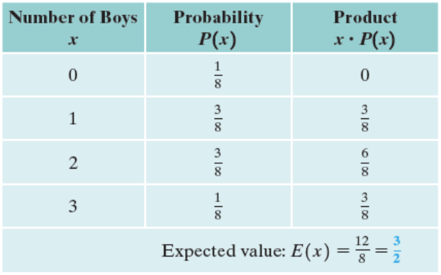

<!-- 

📋 This is the tech-news archives to help me keep track of what I am interested in!

- Reference tech news link: <https://thenextweb.com/news/blockchain-development-tech-career>
  

{{ notice-2 | markdownify }}
 -->

📋 This is my note-taking from what I learned in the class "Math185-002 Discrete Mathematics"
{: .notice--danger}

 

# Overview of Course

## Topics

- Events Involving Not and Or
- Events Involving And
- Estimating Probability by Simulation

## Weekly Learning Outcomes

- Calculate probability for events involving "not" and “or."
- Calculate probability for events involving "and."
- Calculate conditional probability.
- Estimate probabilities by simulation.

 

# 11.2 Events Involving Not and Or

Events Involving Not and Or

## Properties of Probability

- The probability of an event is always between 0 and 1 inclusive.
- The probability of an impossible event is 0.
- The probability of an event that is certain to occur is 1.

OR Let E be an event from the sample space S.

- 0 ≤ P(E) ≤ 1
- P(∅) = 0 (Probability of an impossible event)
- P(S) = 1 (Probability of a certain event)

> Example 1: When a single fair die is rolled, find the probability of each event.
>
> - a) The number 2 is rolled.
> - b) A number other than 2 is rolled.
> - c) The number 7 is rolled.
> - d) A number less than 7 is rolled.
>
> Solution:
>
> - a) Since one of the six possibilities is a 2, P(2) = 1/6.
> - b) There are five such numbers, 1, 3, 4, 5, and 6, so P(a number other than 2) = 5/6.
> - c) None of the possible outcomes is 7. Thus, P(7) = 0/6 = 0.
> - d) Since all six of the possible outcomes are less than 7, P(a number less than 7) = 6/6 = 1.

 

## Events Involving "Not"

- The probability that event A occurs is denoted by P(A) and event A does not occur is P(A').
- Probability of complementary event P(A') = 1 - P(A) or P(A) = 1 - P(A').
- Calculated probabilities are to be rounded off to 3 significant digits or leave as a fraction.

> Example 1:
>
> If five fair coins are tossed, find the probability of obtaining at least two heads.
>
> Solution:
>
> A tree diagram will show that there are 25 = 32 possible outcomes for the experiment of tossing five fair coins. Most include at least two heads. In fact, only the outcomes {ttttt, htttt, thttt, tthtt, tttht, tttth} 6 of these do not include at least two heads. If E denotes the event "at least two heads," then E is the event "not at least two heads."
>
> P(E) = 1 - P(E') = 1 - 6/32 = 26/32 = 13/16

> Example 2:
>
> When a single card is drawn from a standard 52-cards deck, what is the probability that it will not be a face card?
>
> Solution:
>
> P(not a face card) = 1 - P(face card) = 1 - 12/52 = 10/13

 

## Events Involving "Or"

- Probability of one event or another should involve the union ∪ and addition.
- Two events A and B are `mutually exclusive events` if they have no outcomes in common. (Mutually exclusive events cannot occur simultaneously) A∩B=∅
- If A and B are any two events, then P(A or B) = P(A∪B) = P(A) + P(B) - P(A∩B)
- If A and B are mutually exclusive P(A∩B) = 0, then P(A or B) = P(A∪B) = P(A) + P(B)

> Example 1:
>
> When a single card is drawn from a standard 52-card deck, what is the probability that it will be a face card or a red card?
>
> Solution:
>
> P(face card or red card) = P(face card) + P(red card) - P(red face card) = 12/52 + 26/52 - 6/52 = 8/13

> Example 2:
>
> If a single die is rolled, what is the probability of a 5 or even?
>
> Solution:
>
> P(5 or even) = P(5) + P(even) = 1/6 + 3/6 = 2/3

> Example 3:
>
> If one number is selected randomly from the set {1, 2, 3, 4, 5, 6, 7, 8, 9, 10}, find the probability of each of the following events.
>
> - a) The number is odd or a multiple of 4.
> - b) The number is odd or a multiple of 3.
>
> Solution:
>
> Define the following events.
>
> > - S = {1, 2, 3, 4, 5, 6, 7, 8, 9, 10} &rarr; Sample space
> > - A = {1, 3, 5, 7, 9} &rarr; Odd outcomes; P(A) = 5/10
> > - B = {4, 8} &rarr; Multiple of 4; P(B) = 2/10
> > - C = {3, 6, 9} &rarr; Multiple of 3; P(C) = 3/10
>
> - a) The 10 integers within the sample space and within the pertinent sets A and B. The composite event "A or B" corresponds to the set A∪B = {1, 3, 4, 5, 7, 8, 9}. A∪B has seven elements. By the theoretical probability formula, P(A or B) = P(A) + P(B) = 5/10 + 2/10 = 7/10
> - b) The 10 integers within the sample space and within the pertinent sets A and B. The composite event "A or C" corresponds to the set A∪C = {1, 3, 5, 6, 7, 9}. A∪C has six elements. By the theoretical probability formula, P(A or C) = P(A) + P(C) - P(A and C) = 5/10 + 3/10 - 2/10 = 6/10 = 3/5

 

# 11.3 Events Involving And

Events Involving And

## Conditional Probability and Events Involving "And"

- Sometimes the probability of an event must be computed using the knowledge that some other event has already occurred. This type of probability is called `conditional probability`.
- The probability of an event A, given that the event B has occurred, is called the conditional probability of A, given that B has already occurred, denoted by `P(A|B)`. The vertical bar is read "given" and the events appearing to the right of the bar are those that you know have occurred.

## Formula

The conditional probability of B given A is calculated as follows:

P(B|A) =
$$ {P(A∩B)} \over {P(A)} $$
\=
$$ {P(A and B)} \over {P(A)} $$

## Independent Events

Two events, A and B, are said to be independent if and only if the probability of event B is not influenced or changed by the occurrence of event A, or vice versa.

> A and B are independent, if P(B|A) = P(B) or P(A|B) = P(A)

> Example: Rolling a dice and having a 5 in the first roll and then a 6 in the second roll as the outcome are independent events because having 6 in the second roll is not influenced by having 5 in the first roll.

## Dependent Events

Two events, A and B, are said to be dependent if and only if the probability of event B is influenced or changed by the occurrence of event A, or vice versa.

> Example: The events of drawing a diamond and a heart cards(without putting back the first card) from a deck of 52 cards are dependent events because the second selection is now done from 51 cards.

## Multiplication Rule("And" rule) for Dependent Events

P(A and B) represents that the probability that event A occurs and event B occurs.

By classical definition, P(A and B) = P(A∩B) =
$$ {n(A∩B)} \over {n(S)} $$

Involving conditional probability, P(A∩B) = P(A) × P(B|A) OR P(A∩B) = P(B) × P(A|B), where P(B|A) is known as conditional probability.

## Multiplication Rule for Independent Events

P(A and B) = P(A∩B) = P(A) × P(B)

For independent events, P(B|A) = P(B) and P(A|B) = P(A)

- Selection `with replacement` will result in selections that are `independent` events.
- Selection `without replacement` will result in selections that are `dependent` events.

> Example 1:
>
> In a color preference experiment, eight balls are placed in a container. The balls are identical except for color - two are red, and six are green. A child is asked to choose two balls at random, one at a time.
>
> - a) What is the probability that the child chooses the two red balls?
> - b) What is the probability that the child chooses one red and one blue balls?
>
> Solution:
>
> - a) What is the probability that the child chooses the two red balls? &rarr; P(R and R) = P(R) × P(R|R) = 2/8 × 1/7 = 1/28
> - b) What is the probability that the child chooses one red and one blue balls? &rarr; P(R and B) = P(R) × P(B|R) = 2/8 × 6/7 = 3/14

> Example 2:
>
> Determine the probability of rolling a dice and having a 5 in the first roll and then a 6 in the second roll as the outcome.
>
> Solution:
>
> Events are independent. &rarr; P(5 and 6) = P(5) × P(6) = 1/6 × 1/6 = 1/36

> Example 3:
>
> Drawing two cards from a deck of 52 cards, determine the probability of drawing
>
> - a) a red card and then a 3 of hearts, without replacement.
> - b) a red card and then a 3 of hearts, with replacement.
>
> Solution:
>
> - a) a red card and then a 3 of hearts, without replacement. &rarr; P(R and 3H) = P(R) × P(3H|R) = 26/52 × 1/51 = 1/102
> - b) a red card and then a 3 of hearts, with replacement. &rarr; P(R and 3H) = P(R) × P(3H|R) = 26/52 × 1/52 = 1/104

 

# 11.5 Estimating Probability by Simulation

To calculate a mark, we need to find the weighted average:

| Evaluation | Mark | Weight |
| :--------- | :--- | :----- |
| Test 1     | 60   | 0.25   |
| Test 2     | 70   | 0.35   |
| Exam       | 80   | 0.40   |
|            |      | 1.00   |

Final Mark = 60 × 0.25 + 70 × 0.35 + 80 × 0.40 = 71.

## Expected Value

If a random variable x can have any of the values x1, x2, x3, ..., xn and the corresponding probabilities of these values occurring are P(x1), P(x2), P(x3), ..., P(xn), then E(x), the `expected value of x`, is calculated as follows

E(x) = x1P(x1) + x2P(x2) + x3P(x3) + ... + xnP(xn)

> Example 1: Finding the Expected Number of Boys
>
> Find the expected number of boys for a three-child family - that is, the expected value of the number of boys. Assume girls and boys are equally likely.
>
> Solution:
>
> The sample space for this experiment is S = {ggg, ggb, gbg, bgg, gbb, bgb, bbg, bbb}. The probability distribution is shown in Table below, along with the products and their sum, which gives the expected value.
>
> 
>
> The expected number of boys is 3/2, or 1.5. This result seems reasonable. Boys and girls are equally likely, so "half" the children are expected to be boys.

> Example 2: Finding the Fair Cost to Play a Game
>
> In a certain state lottery, a player chooses three digits, in a specific order. Leading digits may be 0, so numbers such as 028 and 003 are legitimate entries. The lottery operators randomly select a three-digit sequence, and any player matching that selection receives a payoff of $600. What is a fair cost to play this game?
>
> Solution:
>
> In this case, no cost has been proposed, so we have no choice but to compute expected gross winnings. The probability of selecting all three digits correctly is 1/10 × 1/10 × 1/10 = 1/100
>
> And the probability of not selecting all three correctly is 1 - 1/1000 = 999/1000
>
> The expected gross winnings are E(gross winning) = $600×1/1000 + $0×999/1000 = $0.60.
>
> Thus the fair cost to play this game is 60 cents. (In fact, the lottery charges $1 to play, so players should expect to lose 40 cents per play on the average)

 

## Simulation

An important area within probability theory is the process called `simulation`. Simulation can be used to study a complicated process. `Simulation methods` (also called `Monte Carlo methods`) require huge numbers of random digits, so computers are used to produce them. A computer, however, cannot toss coins. It must use an algorithmic process, programmed into the computer that is called a `random number generator`.

In human births, boys and girls are (essentially) equally likely. Therefore, an individual birth can be simulated by tossing a fair coin, letting a head correspond to a girl and a tail to a boy.

> Example 1: Simulating Births with Coin Tossing
>
> A sequence of 40 actual coin tosses produced the results below. &rarr; bbggb, gbbbg, gbgbb, bggbg, bbbbg, gbbgg, gbbgg, bgbbg
>
> - a) How many pairs of two successive births are represented by the sequence?
> - b) How many of those pairs consist of both boys?
> - c) Find the empirical probability, based on this simulation, that two successive births both will be boys. Give your answer to three decimal places.
>
> Solution:
>
> - a) Beginning with the 1st-2nd pair and ending with the 39th-40th pair, there are 39 pairs.
> - b) Observing the above sequence, we count 11 pairs of two consecutive boys.
> - c) Utilizing parts (a) and (b), we have 11/39 = 0.282.

 

---

 

    🖋️ This is my self-taught blog! Feel free to let me know
    if there are some errors or wrong parts 😆

[Back to Top](#){: .btn .btn--primary }{: .align-right}
