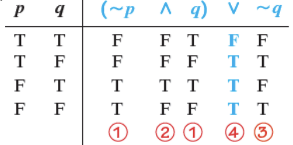
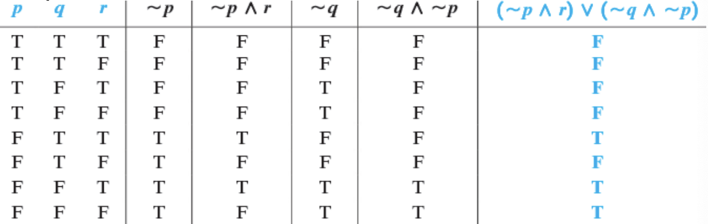
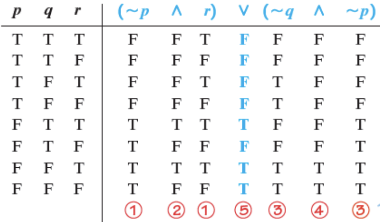
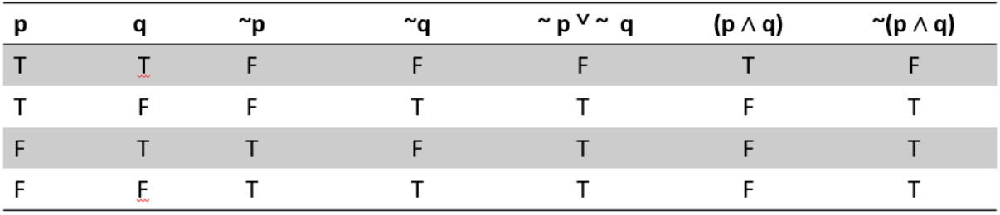

<!-- 

📋 This is the tech-news archives to help me keep track of what I am interested in!

- Reference tech news link: <https://thenextweb.com/news/blockchain-development-tech-career>
  

{{ notice-2 | markdownify }}
 -->

📋 This is my note-taking from what I learned in the class "Math185-002 Discrete Mathematics"
{: .notice--danger}

 

# Overview of Course

## Topics

- Statements and Quantifiers
- Truth Tables and Equivalent Statements

## Weekly Learning Outcomes

- Identify compound statements, logical connectives, and negations.
- Evaluate the truth value of statements involving conjunctions, disjunctions, and negations.
- Evaluate statements using truth tables.

 

# 3.1 Statements and Quantifiers

Statements and Quantifiers

## Statement

A statement(or proposition) is a sentence that is true or false, but not both. Symbolic logic discuss only statements that involve `facts`. (e.g. The sun is a star &rarr; Fact)

## Not Statement

Sentences which cannot be statement.

- A command: sentence beginning with a verb.
  : E.g. Close the door.
- A question
  : E.g. Was it a tough choice?
- A opinion
  : E.g. Health informatics program is better than game designing.
- A paradox: one having seemingly contradictory qualities or phases.
  : E.g. I am a liar.

## Compound Statements

A compound statement may be formed by combining two or more statements. The statements making up the compound statement are called the `component statements`. Various connectives such as `and`, `or`, `not`, and `if...then`, can be used in forming compound statements.

- E.g.
  : The cat is fat `and` it is sleeping.
  : Yesterday, the student went to the park `or` the theatre.
  : A jaguar is `not` a car.
  : `If` it yawns, `then` it must be alive.

> Example 1: Deciding whether a statement is compound.
>
> Decide whether each statement is compound. If so, identify the connective.
>
> - a) Lord Byron wrote sonnets, and the poem exhibits iambic pentameter.
> - b) You can pay me now, or you can pay me later.
> - c) If it's on the Internet, then it must be true.
> - d) My pistol was made by Smith and Wesson.
>
> Solution:
>
> - a) This statement is compound, because it is made up of the component statements "Lord Byron wrote sonnets", and "the poem exhibits iambic pentameter." The connective is `and`.
> - b) The connective here is `or`. The statement is compound.
> - c) The connective here is `if...then`. The statement is compound.
> - d) Although the word `and` is used in this statement, it is not used as a `logical` connective. It is part of the name of the manufacturer. THe statement is not compound.

 

## Remark

A statement such as "Today is not Monday" is not formed of two components statements, for convenience it is considered compound, because its truth value is determined by the truth value of a statement such as "Today is Monday".

## Negations

The negation of a true statement is false, and the negation of a false statement is true.

> Example 1:
>
> - a)
>   : Statement: Ontario is a province in Canada. (True)
>   : Negation: Ontario is not a province. (False)
> - b)
>   : Statement: The moon is not a planet. (True)
>   : Negation: The moon is a planet. (False)

> Example 2: Forming negations
>
> Form the negation of each statement.
>
> - a) That city has a mayor.
> - b) The moon is not a planet.
>
> Solution:
>
> - a) To negate this statement, we introduce `not` into the sentence: "That city does not have a mayor."
> - b) The negation is "The moon is a planet."

 

## Inequality Symbols and their Negation

| Symbolism | Meaning                         | Negation | Meaning                         |
| :-------- | :------------------------------ | :------- | :------------------------------ |
| a < b     | a is less than b                | a ≥ b    | a is greater than or equal to b |
| a > b     | a is greater than b             | a ≤ b    | a is less than or equal to b    |
| a ≤ b     | a is less than or equal to b    | a > b    | a is greater than b             |
| a ≥ b     | a is greater than or equal to b | a < b    | a is less than b                |

> Example 1:
>
> Give a negation of each inequality.
>
> - a) x < 2 &rarr; negation: x ≥ 2
> - b) 3b-2a ≤ 0 &rarr; negation: 3b-2a > 0

 

## Symbols

Symbols for connectives are shown as, statements are represented with letters as p, q, or r.

| Connective | Symbol | Type of Statement |
| :--------- | :----- | :---------------- |
| and        | ∧      | Conjunction       |
| or         | ∨      | Disjunction       |
| not        | ~      | Negation          |

- `~p` is read `not p` or `It is not the case that p` and is called the `negation of p`.
- `p q` is read `p and q` and is called the `conjunction of p and q`.
- `p q` is read `p or q` and is called the `disjunction of p and q`.
- `p but q` is often translated as `p and q`.
- `neither p nor q` means `not p and not q`.
- Mathematical inequalities can be written using `AND` and `OR`.
  : - x ≤ a means x < a or x = a.
  : - a ≤ x ≤ b means a ≤ x and x ≤ b.

> Example 1:
>
> Let p represent "It is snowing," and let q represent "It is January." Write each symbolic statement in words.
>
> - a) p ∨ q &rarr; It is snowing or it is January.
> - b) ~(p ∧ q) &rarr; It is not the case that it is snowing, and it is January.

> Example 2: Translating from symbols to words.
>
> Let p represent the statement "Nursing informatics is a growing field," and let q represent "Critical care will always be in demand." Translate each statement from symbols to words.
>
> - a) p ∨ q
> - b) ~p ∧ q
> - c) ~(p ∨ q)
> - d) ~(p ∧ q)
>
> Solution:
>
> - a) p ∨ q: From the table, ∨ symbolizes or. Thus, p ∨ q represents "Nursing informatics is a growing field, or critical care will always be in demand."
> - b) ~p ∧ q: Nursing informatics is not a growing field and critical care will always be in demand.
> - c) ~(p ∨ q): It is not the case that nursing informatics is a growing field or critical care will always be in demand. (This is usually translated as "Neither p nor q.")
> - d) ~(p ∧ q): It is not the case that nursing informatics is a growing field and critical care will always be in demand.

 

## Quantifiers

- Universal Quantifiers: The words `all`, `each`, `every`, and `no(ne)` are called Universal Quantifiers.
- Existential Quantifiers: Words and phrases such as `some`, `there exists`, and `(for) at least one` are called Existential Quantifiers.
- Quantifiers are used extensively in mathematics to indicate `how many` cases of a particular situation exist.

## Negations of Quantified Statements

| Statement | Negation                                          |
| :-------- | :------------------------------------------------ |
| All do.   | Some do not. (Not all do. / At least one do not.) |
| Some do.  | None do. (All do not.)                            |

> Example 1: Forming Negations of Quantified Statements
>
> Form the negation of each statement.
>
> - a) Some cats have fleas.
> - b) Some cats do not have fleas.
> - c) No cats have fleas.
>
> Solution:
>
> - a) Because some means "at least one," the statement "Some cats have fleas" is really the same as "At least one cat has fleas." The negation of this is "No cat has fleas."
> - b) The statement "Some cats do not have fleas" claims that at least one cat, somewhere, does not have fleas. The negation of this is "All cats have fleas."
> - c) The negation is "Some cats have fleas."

> Example 2: Form the negation of each statement.
>
> 1. Some students are good in Physics. &rarr; Negation: No students are good in Physics.
> 2. Some students are not good in Math. &rarr; Negation: All students are good in Math.
> 3. No students are good in Stat. &rarr; Negation: Some students are good in Stat.

 

## Quantifiers and Number Sets

- Natural numbers or counting numbers: {1, 2, 3, 4, ...}
- Whole numbers: {0, 1, 2, 3, 4, ...}
- Integers: {..., -1, 0, 1, ...}
- Rational numbers: {p/q \| p and q are integers, q≠0}
- Irrational numbers: {x\|x is a real number and cannot be expressed as a quotient of integers} Decimal representations never terminate and never repeat.
- Real numbers: Real numbers include rational numbers like positive and negative integers, fractions, and irrational numbers.

> Example 1: Deciding whether quantified statements are true or false.
>
> Decide whether each statement involving a quantifier is true or false.
>
> - a) There exists a whole number that is not a natural number.
> - b) Every integer is a natural number.
> - c) Every natural number is a rational number.
> - d) There exists an irrational number that is not real.
>
> Solution:
>
> - a) Because there is such a whole number (it is 0), this statement is true.
> - b) This statement is false, because we can find at least one integer that is not a natural number. For example, -1 is an integer but is not a natural number.
> - c) Because every natural number can be written as a fraction with denominator 1, this statement is true.
> - d) In order to be an irrational number, a number must first be real. Because we cannot give an irrational number that is not real, this statement is false. (Had we been able to find at least one, the statement would have been true.)

> Example 2:
>
> Decide whether each of the following statements about sets of numbers is true or false.
>
> 1. Every integer is a natural number. &rarr; This is false, (-1 is an integer and not a natural number).
> 2. There exists a whole number that is not a natural number. &rarr; This is true, (0 is a whole number but not a natural number).

> Example 3:
>
> Decide whether each is a statement or not a statement.
>
> 1. July 17, 2018 is a Tuesday. &rarr; It is a statement.
> 2. Some numbers are positive. &rarr; It is a statement.
> 3. Did you get A+ in programming 1? &rarr; It is a not a statement.

> Example 4:
>
> Decide whether each statement is compound. If compound, identify component statements.
>
> 1. If Mike is a professor, then Peter is a plumber. &rarr;
>    : Answer: It is a compound statement.
>    : Component statements: Mike is a professor. Peter is a plumber.
> 2. John loves to shop from Jinny and Johnny. &rarr;
>    : Answer: It is not a compound statement.

 

## Other Symbols for Quantifiers

Symbolic logic also uses symbols for quantifiers.

- The symbol for the existential quantifier is ∃ (a rotated E).
- The symbol for the universal quantifier is ∀ (an inverted A).

> Example 1:
>
> - The statement "For some x, p is true" can be symbolized (∃x)(p).
> - The statement "For all x, p is true" can be symbolized (∀x)(p).
> - The negation of (∃x)(p) is (∀x)(~p).
> - The negation of (∀x)(p) is (∃x)(~p).

 

# 3.2 Truth Tables and Equivalent Statements

Truth Tables and Equivalent Statements

## Conjunctions (And)

- The truth values of component statements are used to find the truth values of compound statements.
- The truth values of the conjunction p `and` q, symbolized (p ∧ q) are given in the `truth table`. The connective `and` implies "`both`."

## Disjunctions (Or)

- The truth values of the disjunction p `or` q, symbolized (p ∨ q) are given in the `truth table`.
- (p ∨ q) means "p or q or both." For the disjunction (p ∨ q) to be false, both p and q must be false.

## Negations (Not)

- The truth values of the negation of p, symbolized `~p` are given in the `truth table`.

## Truth Values

Note: A logical statement having n component statements will have 2n rows in its truth table.

> Example 1:
>
> Let p represent the statement 4 > 1, q represent the statement 12 < 9, find the truth value of (p ∧ q).
>
> Solution:
>
> Truth Table for p ∧ q: The conjunction of two statements p ∧ q is true only in the case when both statements p and q are true, In all other cases, p ∧ q is false.
>
> | p   | q   | p ∧ q |
> | :-- | :-- | ----: |
> | T   | T   |     T |
> | T   | F   |     F |
> | F   | T   |     F |
> | F   | F   |     F |
>
> False, since q is false.

> Example 2:
>
> Let p represent the statement 4 > 1, q represent the statement 12 < 9, find the truth value of (p v q).
>
> Solution:
>
> Truth Table for p v q: The disjunction of two statements p v q is false only in the case when both statements p and q are false, In all other cases, p v q is true.
>
> | p   | q   | p ∧ q |
> | :-- | :-- | ----: |
> | T   | T   |     T |
> | T   | F   |     T |
> | F   | T   |     T |
> | F   | F   |     F |
>
> True, since p is true.

> Example 3:
>
> Let p represent the statement 4 > 1, q represent the statement 12 < 9. Decide whether each statement is true or false. How about ~p ∧ ~q?
>
> | p   | q   | ~p  | ~q  | ~p ∧ ~q |
> | :-- | :-- | :-- | :-- | ------: |
> | T   | T   | F   | F   |       F |
> | T   | F   | F   | T   |       F |
> | F   | T   | T   | F   |       F |
> | F   | F   | T   | T   |       T |
>
> Here p is true, and q is false; in second row, so (~p ∧ ~q) is false.

> Example 4:
>
> Suppose p is false, q is true, and r is false. What is the truth value of the compound statement ~p ∧ (q v ~r)?
>
> | Truth Value   |
> | :------------ |
> | ~p ∧ (q v ~r) |
> | ~F ∧ (T v ~F) |
> | T ∧ (T v T)   |
> | T ∧ T         |
> | T             |

> Example 5:
>
> Construct the truth table for p ∧ (~p v ~q).
>
> | p   | q   | ~p  | ~q  | ~p v ~q | p ∧ (~p v ~q) |
> | :-- | :-- | :-- | :-- | ------: | ------------: |
> | T   | T   | F   | F   |       F |             F |
> | T   | F   | F   | T   |       T |             T |
> | F   | T   | T   | F   |       T |             F |
> | F   | F   | T   | T   |       T |             F |

> Example 6:
>
> Consider the statement (~p ∧ q) v ~q.
>
> | p   | q   | ~p  | ~p ∧ q | ~q  | (~p ∧ q) v ~q |
> | :-- | :-- | :-- | -----: | :-- | ------------: |
> | T   | T   | F   |      F | F   |             F |
> | T   | F   | F   |      F | T   |             T |
> | F   | T   | T   |      T | F   |             T |
> | F   | F   | T   |      F | T   |             T |
>
> Alternative Method: The steps can be summarized as follows:
>
> 

> Example 7:
>
> Consider the statement (~p ∧ r) v (~q ∧ ~p).
>
> 
>
> Alternative Method: The steps can be summarized as follows:
>
> 

 

## Logical Equivalence

Two statement forms are logically equivalent if and only if they have identical truth tables. If P and Q are logically equivalent, we write P ≡ Q.

Note: Testing Whether Two Statement Forms P and Q Are Logically Equivalent:

1. Construct a truth table with one column for the truth values of P and another column for the truth values of Q.
2. Check each combination of truth values of the statement variables to see whether the truth value of P is the same as the truth value of Q.
   : a) If ,in each row, the truth value of P is the same as the truth value of Q, then P and Q are logically equivalent.
   : b) If ,in some row, P has a different truth value from Q, then P and Q are not logically equivalent.

## DeMorgan's Laws

- The negation of an `and statement` is logically equivalent to the `or statement` in which each component is negated.
  : Symbolically: ~(p ∧ q) ≡ ~p v ~q.
- The negation of an `or statement` is logically equivalent to the `and statement` in which each component is negated.
  : Symbolically: ~(p v q) ≡ ~p ∧ ~q.

> Example 1:
>
> Find a negation of each statement by applying De Morgan’s Law.
>
> 1. I am good in MATH185 or I am good in Java.
> 2. She won’t try and he will succeed.
>
> Solution:
>
> 1. I am not good in MATH185 and I am not good in Java.
> 2. She will try, or he won’t succeed.

> Example 2:
>
> Are the following statements equivalent ~p v ~q and ~(p ∧ q)?
>
> 
>
> From the truth values in the fifth and last columns, we can say ~p v ~q and ~(p ∧ q) that are equivalent.

> Example 3: Applying De Morgan’s Laws.
>
> Find a negation of each statement by applying De Morgan’s Laws.
>
> - a) I got an A or I got a B.
> - b) She won't try and he will succeed.
>
> Solution:
>
> - a) If p represents "I got an A" and q represents "I got a B," then the compound statement is symbolized p v q. The negation of p v q is ~(p v q). By one of De Morgan's laws, this is equivalent to ~p ∧ ~q, or, in words, `I didn't get an A and I didn't get a B.` This negation is reasonable - the original statement says that I got either an A or a B. The negation says that I didn't get either grade.
> - b) From De Morgan's laws, ~(p ∧ q) ≡ ~p v ~q, so the negation becomes `She will try or he won't succeed.`

 

---

 

    🖋️ This is my self-taught blog! Feel free to let me know
    if there are some errors or wrong parts 😆

[Back to Top](#){: .btn .btn--primary }{: .align-right}
