<!-- 

📋 This is the tech-news archives to help me keep track of what I am interested in!

- Reference tech news link: <https://thenextweb.com/news/blockchain-development-tech-career>
  

{{ notice-2 | markdownify }}
 -->

📋 This is my note-taking from what I learned in the class "Math185-002 Discrete Mathematics"
{: .notice--danger}

 

# Overview of Course

## Topics

- Analyzing Arguments with Truth Tables
- Boolean Algebra

## Weekly Learning Outcomes

- Analyze arguments with truth tables and by comparing to the valid/invalid forms.
- Simplify expression using Boolean algebra.

 

# 3.6 Analyzing Arguments with Truth Tables

Analyzing Arguments with Truth Tables

## Testing the Validity of an Argument with a Truth Table

- Step 1: Assign a letter to represent each component statement in the argument.
- Step 2: Express each premise and the conclusion symbolically.
- Step 3: Form the symbolic statement of the entire argument by writing the conjunction of all the premises as the antecedent of a conditional statement, and the conclusion of the argument as the consequent.
- Step 4: Complete the truth table for the conditional statement formed in Step 3. If it is a `tautology`, then the argument is `valid`; otherwise it is invalid.

 

## [(p &rarr; q) ∧ p] &rarr; q

Example: Determine whether the argument is valid or invalid.

- If there is a problem, then I must fix it.
- <u>There is a problem.</u>
- I must fix it.

Solution:

- p: There is a problem
- q: I must fix it

| First premise is | Second Premise is | Conclusion |
| :--------------- | :---------------- | :--------- |
| p &rarr; q       | p                 | q          |

=> [(p &rarr; q) ∧ p] &rarr; q

To decide if this argument is valid, we must determine whether the conjunction of both premises implies the conclusion for all possible combinations of truth values for p and q. Therefore, write the conjunction of the premises as the antecedent of a conditional statement, and write the conclusion as the consequent.

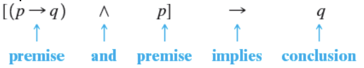

 

## To Test for Validity Construct a Truth Table For [(p &rarr; q) ∧ p] &rarr; q

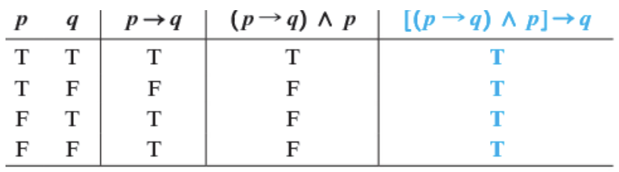

Because the final column, shown in color, indicates that the conditional statement that represents the argument is true for all possible truth values of p and q, the statement is a tautology. Thus, the argument is valid.

 

## [(p &rarr; q) ∧ q] &rarr; p

Example: Determine whether the argument is valid or invalid.

- If we arrive at the bus stop before the bus arrives, we will grab cotton candy.
- <u>We order cotton candy.</u>
- We arrive at the bus stop before the bus arrives.

Solution:

- p: We arrive at the bus stop before the bus arrives
- q: We order cotton candy

| First premise is | Second Premise is | Conclusion |
| :--------------- | :---------------- | :--------- |
| p &rarr; q       | q                 | p          |

=> [(p &rarr; q) ∧ q] &rarr; p

 

## To Test for Validity Construct a Truth Table For [(p &rarr; q) ∧ q] &rarr; p

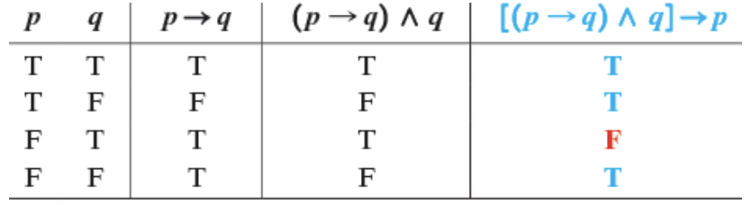

The last column of the truth table contains an F, so the argument is invalid.

 

## [(p &rarr; q) ∧ ~q] &rarr; ~p

Example: Determine if the argument is valid or invalid.

- If I can avoid sweets, I can avoid the dentist.
- <u>I can’t avoid the dentist.</u>
- I can’t avoid sweets.

Solution:

Let p represent "I can avoid sweets" and q represent "I can avoid the dentist."

p &rarr; q

$$ {~q} \over {~p} $$

| [(p &rarr; q) |  ∧  |   ~q]   | &rarr;  |     ~p     |
| :-----------: | :-: | :-----: | :-----: | :--------: |
|    Premise    | And | Premise | Implies | Conclusion |

The truth table for this argument indicates a tautology, and the argument is valid.

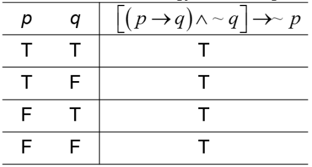

The pattern of reasoning of this example is called "Modus Tollens," or the law of contraposition, or indirect reasoning.

 

## Valid Argument Forms

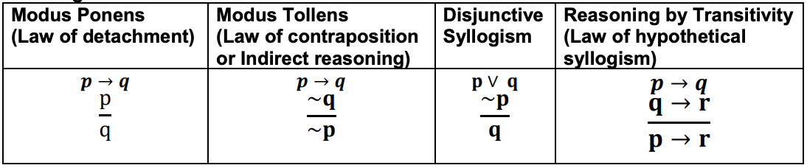

## Invalid Argument Forms (Fallacies)

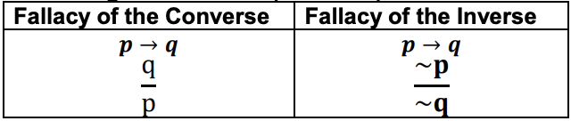

> Example 1: Determine whether the argument is valid or invalid.
>
> - If Eddie goes to town, then Mabel stays at home.
> - If Mabel does not stay at home, then Rita will cook.
> - Rita will not cook.
> - Therefore, Eddie does not go to town.
>
> Solution:
>
> Let p represent "Eddie goes to town," let q represent "Mabel stays at home," and let r represent "Rita will cook."
>
> [(p &rarr; q) ∧ (~q ∧ r) ∧ ~r] &rarr; ~p
>
> 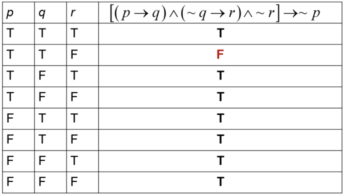
>
> Because the final column does not contain all Ts, the statement is not a tautology and the argument is invalid.

> Example 2: Decide whether the argument is valid or a fallacy and give the form that applies.
>
> "A mathematician is a device for turning coffee into theorems."
>
> $$ {You turn coffee into Theorems} \over {You are a mathematician} $$
>
> Solution:
>
> - p: You are a mathematician
> - q: You turn coffee into theorem
>
> p &rarr; q
>
> $$ {q} \over {p}$$
>
> Since this is the form "fallacy of the converse," it is invalid and considered fallacy.

> Example 3: Decide whether the argument is valid or a fallacy and give the form that applies.
>
> "If you’re going through hell, keep going." (quote from Winston Churchill)
>
> $$ {You are not going through hell} \over {Don't Keep going} $$
>
> Solution:
>
> - p: You are going through hell.
> - q: Keep going.
>
> p &rarr; q
>
> $$ {~p} \over {~q}$$
>
> Since this is the form "fallacy of the inverse," it is invalid and considered fallacy.

> Example 4: Decide whether the argument is valid or a fallacy and give the form that applies.
>
> "If you use binoculars, then you get a glimpse of the bald eagle."
>
> $$ {If you get a glimpse of a bald eagle, then you'll be amazed} \over {If you use binoculars, then you'll be amazed} $$
>
> Solution:
>
> - p: You use binoculars
> - q: You get a glimpse of a bald eagle
> - r: You will be amazed
>
> p &rarr; q
>
> $$ {q → r} \over {p → r}$$
>
> Since this is the form "reasoning by transitivity," it is a valid and considered true.

> Example 5: Use the truth table to determine whether the argument is valid or invalid.
>
> ~p &rarr; ~q
>
> $$ {q} \over {p}$$
>
> Solution:
>
> Conditional Statement: [(~p &rarr; ~q) ∧ q] &rarr; p
>
> 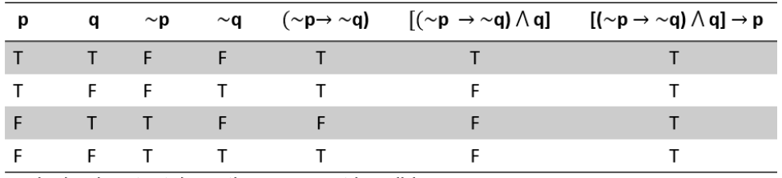
>
> The conclusion is a tautology, the argument is valid.

 

# Boolean Algebra

`Boolean algebra` is a division of mathematics that deals with operations on logical values and incorporates binary variables. Boolean algebra is specifically used for two-valued logic (True/False, 1/0, open/closed etc.). A Boolean algebra is an algebraic structure that incorporates the properties of set operations (union, intersection, and complement) and logic operations (OR, AND, and NOT).

 

## Definitions: There are three operations defined as followed

1. Disjunction or a logical sum (OR function)
   : 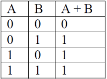
2. Conjunction or a logical product (AND function)
   : 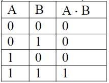
3. Negation (NOT function)
   : 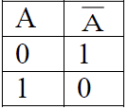

The first two operators are `binary` since it combines or operates on two elements of a set to produce another element of the set. The last operation is `unary` since it combines or operates on a single element of a set to produce another element of the set.

Note: the only result in these three definitions, which contradicts ordinary arithmetic, is 1 + 1 = 1.

 

## Boolean Postulates & Theorems

## Duality

A true Boolean algebra expression can be converted into another true Boolean algebra
expression by making the following substitutions.

1 ⟷ 0 and · ⟷ +

> Example 1: Simplifying Boolean Expressions
>
> - (AB)(BC)
> - A + B + AC + AB
> - 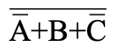
>
> Solution:
>
> 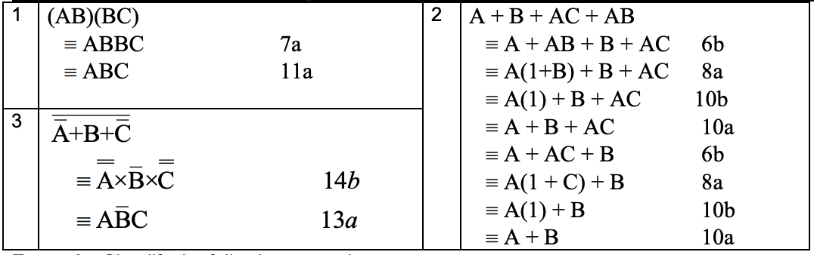

> Example 2: Simplify the following examples
>
> 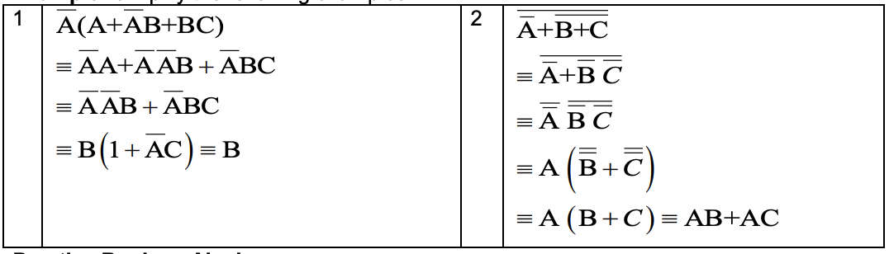

 

---

 

    🖋️ This is my self-taught blog! Feel free to let me know
    if there are some errors or wrong parts 😆

[Back to Top](#){: .btn .btn--primary }{: .align-right}
