<!-- 

📋 This is the tech-news archives to help me keep track of what I am interested in!

- Reference tech news link: <https://thenextweb.com/news/blockchain-development-tech-career>
  

{{ notice-2 | markdownify }}
 -->

📋 This is my note-taking from what I learned in the class "Math185-002 Discrete Mathematics"
{: .notice--danger}

 

# Overview of Course

## Topics

- Logic Gates

## Weekly Learning Outcomes

- Simplify expression using Boolean algebra.
- Represent Boolean expressions with logic diagrams.

 

# 1. Logic Gates

Logic Gates

## Boolean expressions correspond to logic gates

## Logic Gate Truth Tables

|     |     | OR  | AND  |       NOT        |        NOR         |        NAND        |
| :-: | :-: | :-: | :--: | :--------------: | :----------------: | :----------------: |
|  A  |  B  | A+B | A\*B | $$\overline{A}$$ | $$\overline{A+B}$$ | $$\overline{A*B}$$ |
|  0  |  0  |  0  |  0   |        1         |         1          |         1          |
|  0  |  1  |  1  |  0   |        1         |         0          |         1          |
|  1  |  0  |  1  |  0   |        0         |         0          |         1          |
|  1  |  1  |  1  |  1   |        0         |         0          |         0          |

> Example 1:
>
> Draw a logic circuit for (A+B)C.
>
> Solution:
>
> 

> Example 2:
>
> Draw a logic circuit for A + BC + $$\overline{D}$$.
>
> Solution:
>
> 

> Example 3:
>
> Write the Boolean expression for the diagram below.
>
> Solution:
>
> 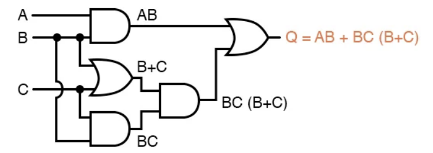

> Example 4:
>
> Write the Boolean expression for the diagram below.
>
> Solution:
>
> 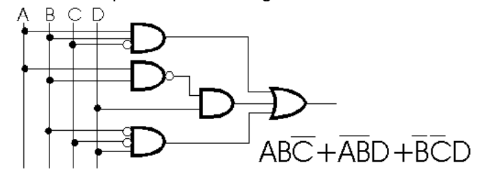

> Example 5:
>
> - a) Write the Boolean expression for the diagram below.
> - b) Simplify the Boolean expression.
> - c) Draw the simplified logic diagram.
>
> Solution:
>
> - a) $$\overline{AB}$$ \* $$\overline{B + C}$$
> - b)
>   : 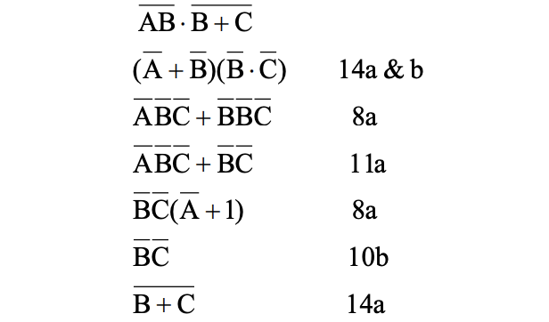
> - c) The simplified drawing is as follows:
>   : 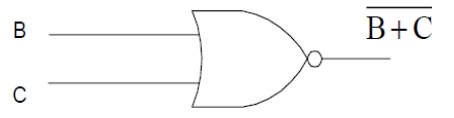

> Example 6:
>
> 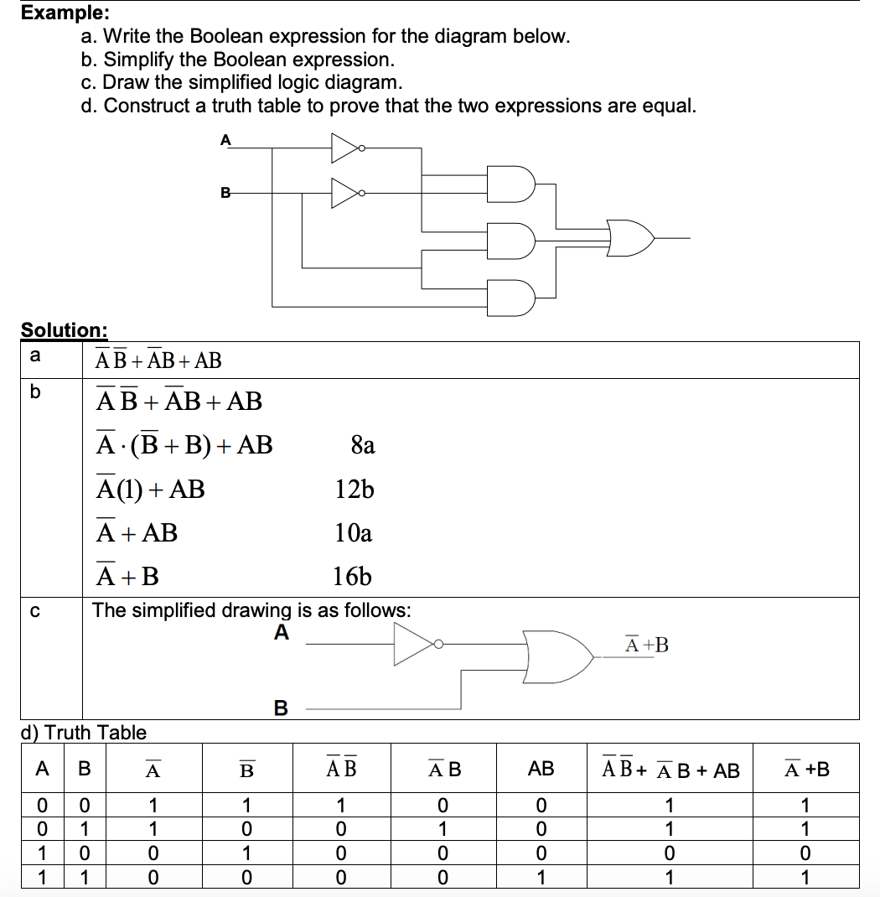

 

## Practice Logic Gates

| Logic Gate                                    | Boolean Algebra                                                                                                  |
| :-------------------------------------------- | :--------------------------------------------------------------------------------------------------------------- |
| 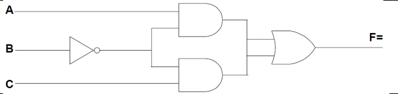 | F = A $$\overline{B}$$ + $$\overline{B}$$ C; F = $$\overline{B}$$ (A + C)                                        |
| 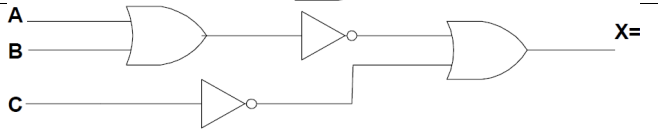 | X = $$\overline{A + B}$$ + $$\overline{C}$$                                                                      |
| 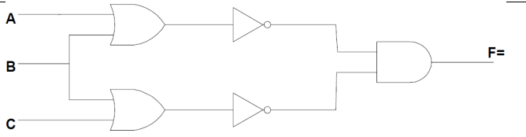 | F = ($$\overline{A + B}$$)($$\overline{B + C}$$); F = $$\overline{A + B + C}$$                                   |
| 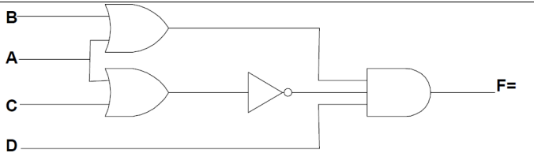 | F = (A + B)($$\overline{A + C}$$)D; F = $$\overline{A}$$ B $$\overline{C}$$ D                                    |
| 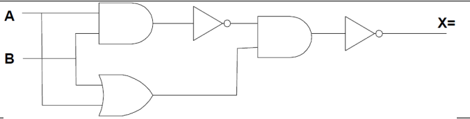 | X = $$\overline{ \overline{AB} (A + B)}$$; X = $$\overline{A + B}$$ + AB                                         |
| 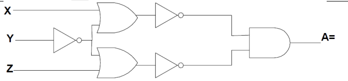 | A = $$\overline{(X + \overline{Y})}$$ $$\overline{(\overline{Y} + Z)}$$; A = $$\overline{X}$$ Y $$\overline{Z}$$ |

 

# 2. Implementation of Truth Tables

Implementation of a truth table is the process of translating a table of data (the truth table – which describes inputs and outputs) into a circuit diagram.

`Sum-Of-Products`, or SOP, Boolean expressions may be generated from truth tables quite easily, by determining which rows of the table have an output of 1, writing one product term for each row, and finally summing all the product terms. This creates a Boolean expression representing the truth table as a whole. Sum-Of-Products expressions lend themselves well to implementation as a set of AND gates (products) feeding into a single OR gate (sum).

Procedure:

1. For any row which has an output (Y) value of 1 write the Boolean product for the variables’ truth values in that particular row.
2. Write a Boolean expression for the output as a sum of the products found in step 1.
3. Simplify the resulting Boolean expression (if possible) to draw a circuit diagram.

Remarks:

- The Boolean expression obtained from the truth table is not necessarily the most efficient. It may be possible to simplify this expression which would indicate a more efficient circuit design.

> Example: Write a Boolean expression
>
> 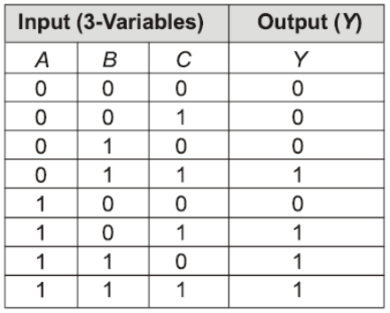

 

## SOP & POS

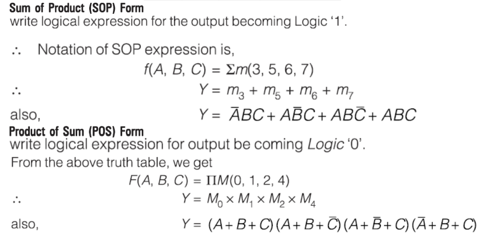

 

## Practice SOP & POS

| Truth Table                                       | Write a Boolean expression                                                                                                                                                     | Simplify the Boolean expression                                  |
| :------------------------------------------------ | :----------------------------------------------------------------------------------------------------------------------------------------------------------------------------- | :--------------------------------------------------------------- |
| 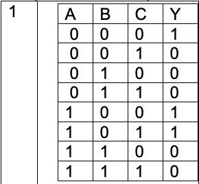 | Y = $$\overline{A}$$ $$\overline{B}$$ $$\overline{C}$$ + A $$\overline{B}$$ $$\overline{C}$$ + A $$\overline{B}$$ C                                                            | Y = $$\overline{B}$$ ($$\overline{C}$$ + A)                      |
| 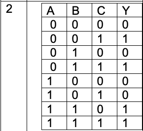 | Y = $$\overline{A}$$ $$\overline{B}$$ C + $$\overline{A}$$ BC + AB $$\overline{C}$$ + ABC                                                                                      | $$\overline{A}$$ C + AB                                          |
| 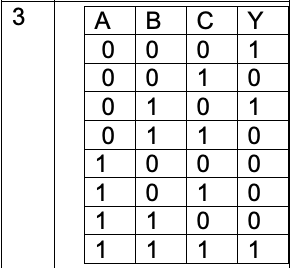 | Y = $$\overline{A}$$ $$\overline{B}$$ $$\overline{C}$$ + $$\overline{A}$$ B $$\overline{C}$$ + ABC                                                                             | Y = $$\overline{A}$$ $$\overline{C}$$ + ABC                      |
| 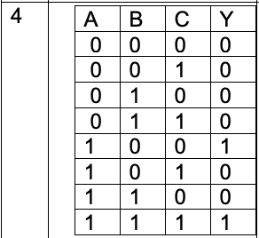 | Y = A $$\overline{B}$$ $$\overline{C}$$ + ABC                                                                                                                                  | Y = A($$\overline{B + C}$$ + BC)                                 |
| 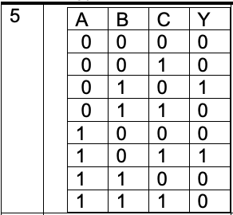 | Y = $$\overline{A}$$ B $$\overline{C}$$ + A $$\overline{B}$$ C                                                                                                                 | Y = $$\overline{A}$$ B $$\overline{C}$$ + A $$\overline{B}$$ C   |
|  | Y = $$\overline{A}$$ $$\overline{B}$$ $$\overline{C}$$ + $$\overline{A}$$ $$\overline{B}$$ C + $$\overline{A}$$ BC + A $$\overline{B}$$ $$\overline{C}$$ + AB $$\overline{C}$$ | Y = $$\overline{A}$$ ($$\overline{B}$$ + C) + A $$\overline{C}$$ |

 

---

 

    🖋️ This is my self-taught blog! Feel free to let me know
    if there are some errors or wrong parts 😆

[Back to Top](#){: .btn .btn--primary }{: .align-right}
