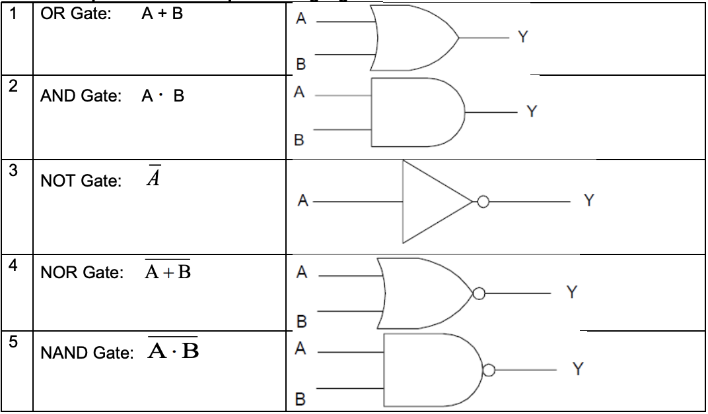
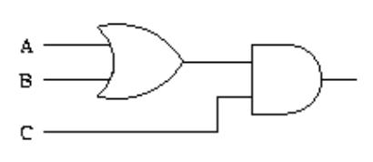
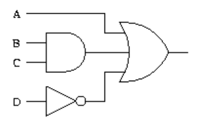

<!-- 

📋 This is the tech-news archives to help me keep track of what I am interested in!

- Reference tech news link: <https://thenextweb.com/news/blockchain-development-tech-career>
  

{{ notice-2 | markdownify }}
 -->

📋 This is my note-taking from what I learned in the class "Math185-002 Discrete Mathematics"
{: .notice--danger}

 

# Overview of Course

## Topics

- Logic Gates

## Weekly Learning Outcomes

- Simplify expression using Boolean algebra.
- Represent Boolean expressions with logic diagrams.

 

# 1. Logic Gates

Logic Gates

## Boolean expressions correspond to logic gates

## Logic Gate Truth Tables

|     |     | OR  | AND  |      NOT       |       NOR        |       NAND       |
| :-: | :-: | :-: | :--: | :------------: | :--------------: | :--------------: |
|  A  |  B  | A+B | A\*B | $\overline{A}$ | $\overline{A+B}$ | $\overline{A*B}$ |
|  0  |  0  |  0  |  0   |       1        |        1         |        1         |
|  0  |  1  |  1  |  0   |       1        |        0         |        1         |
|  1  |  0  |  1  |  0   |       0        |        0         |        1         |
|  1  |  1  |  1  |  1   |       0        |        0         |        0         |

> Example 1:
>
> Draw a logic circuit for (A+B)C.
>
> Solution:
>
> 

> Example 2:
>
> Draw a logic circuit for A + BC + $\overline{D}$.
>
> Solution:
>
> 

 

---

 

    🖋️ This is my self-taught blog! Feel free to let me know
    if there are some errors or wrong parts 😆

[Back to Top](#){: .btn .btn--primary }{: .align-right}
