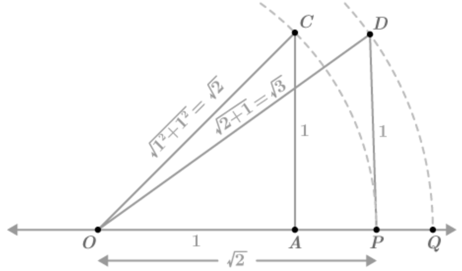

<!-- 

📋 This is the tech-news archives to help me keep track of what I am interested in!

- Reference tech news link: <https://thenextweb.com/news/blockchain-development-tech-career>
  

{{ notice-2 | markdownify }}
 -->

📋 This is my note-taking from what I learned in the class "Math175-002 Functions & Number Systems"
{: .notice--danger}

## Sets of Real Numbers

> ### Objectives
>
> 1. A number on a number line
> 2. A number as positive, negative, or zero
> 3. A number as belonging to one or more sets of numbers
> 4. Given 2 numbers A and B, determine whether A = B, A < B, or A > B
> 5. Given a number A, determine its additive inverse and absolute value
> 6. Signed numbers in tables of economic and occupations data

### 1. Natural numbers

{1, 2, 3, 4, ...} is the set of **natural numbers**
&rarr; Numbers which we can count

### 2. Whole numbers

{0, 1, 2, 3, 4, ...} is the set of **whole numbers**
&rarr; Including 0

### 3. Number Line

> [Number Line Image Link](https://d138zd1ktt9iqe.cloudfront.net/media/seo_landing_files/number-line-negative-and-positive-1634275662.png)
>
> - Origin: "0"
> - The right of "0": Positive numbers {1, 2, 3, ...}
> - The left of "0": Negative numbers {-1, -2, -3, ...}

- Signed numbers: Positive numbers and Negative numbers
- "0" itself: Neither positive nor negative
- Practical applications of negative numbers: Temperatures, Altitude below sea level

### 4.Integers

{..., -2, -1, 0, 1, 2, ...} is the set of **integers**
&rarr; The **natural numbers**, **negative numbers**, and **zero** make up the set of integers.

- An integer, such as 2, is also a rational number &rarr; 2 = 2/1

### 5. Rational numbers

{x | x is a quotient of two integers, with denominator not equal to 0} is the set of **rational numbers**

- The set symbolism used in the definition of rational numbers: {x | x has a certain property} &rarr; Set-builder notation
- [Set-builder notation](https://www.cuemath.com/algebra/set-builder-notation/)
- [Set-builder notation(KR)](https://ko.wikipedia.org/wiki/%EC%A1%B0%EA%B1%B4%EC%A0%9C%EC%8B%9C%EB%B2%95)

### 6. Irrational numbers

{: .align-left .width-quarter}

 

    🖋️ This is my self-taught blog! Feel free to let me know
    if there are some errors or wrong parts 😆

[Back to Top](#){: .btn .btn--primary }{: .align-right}
