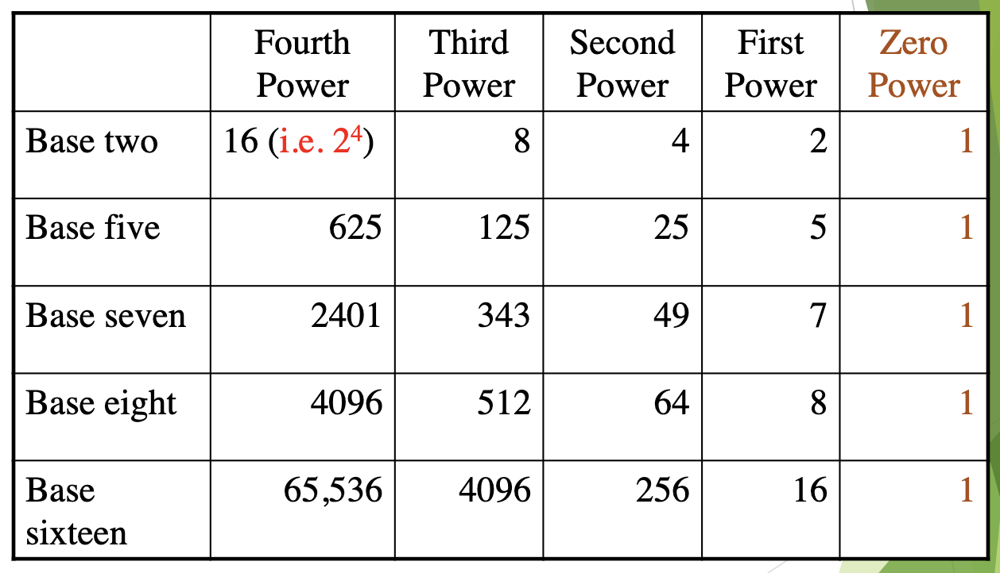

<!-- 

📋 This is the tech-news archives to help me keep track of what I am interested in!

- Reference tech news link: <https://thenextweb.com/news/blockchain-development-tech-career>
  

{{ notice-2 | markdownify }}
 -->

📋 This is my note-taking from what I learned in the class "Math175-002 Functions & Number Systems"
{: .notice--danger}

## General Base Conversions

- We consider bases other than ten. Bases other than ten will have a <u>spelled-out subscript</u> as in the numeral
  54eight
- When a number appears <u>without a subscript</u> assume it is <u>base ten; 96</u>
- Note that
  54eight is read “five four base eight.” &rarr; Do Not read it as “fifty-four.”

### <u>Powers of Alternative Bases</u>

### <u>Example 1: Converting Bases to Decimal</u>

Convert 2134five to decimal form using <u>expanded form.</u> &rarr; Number has four digits -> Maximum power of base is 4 - 1 = 3

> <u>Solution</u>
>
> 2134five   = 2(
> $$5^{3}$$
> ) + 1(
> $$5^{2}$$
> ) + 3(
> $$5^{1}$$
> ) + 4(
> $$5^{0}$$
> ) &rarr; Exponent starts with "3"(Cuz maximum power of base is "3")
>   = (2\*125) + (1\*25) + (3\*5) + 4
>   = 250 + 25 + 15 + 4
>   = 294

> <u>Exercise</u>
>
> Convert 234five to decimal form using expanded form. (Hint: Maximum power of base five is 3-1=2)
>
> <u>Solution</u>
>
> 234five   = 2(
> $$5^{2}$$
> ) + 3(
> $$5^{1}$$
> ) + 4(
> $$5^{0}$$
> ) &rarr; Exponent starts with "2"(Cuz maximum power of base is "2")
>   = (2\*25) + (3\*5) + 4
>   = 50 + 15 + 4
>   = 69

 

## Calculator Shortcut for Base Conversion to Decimal

To convert from another base to decimal form:

- Start with the first digit on the left and
  multiply by the base.
- Then add the next digit, multiply again by the
  base, and so on.
- The last step is to add the last digit on the
  right. Do not multiply it by the base.

### <u>Example 2: Calculator Shortcut for Base Conversion to Decimal</u>

Use the calculator shortcut to convert 432134five

to decimal form.

> <u>Solution</u>
>
> 432134five   = ((((4\*5 + 3)\*5 + 2)\*5 + 1)\*5 + 3)\*5 + 4
>   = 14669

> <u>Exercise</u>
>
> Use the calculator shortcut to convert 321four to decimal form.
>
> <u>Solution</u>
>
> 321four   = (3\*4 + 2)\*4 + 1
>   = 57

### <u>Example 3: Converting from Decimal to Another Base</u>

Convert 7508 to base seven.

> <u>Solution</u>
>
> 
>
> - Divide by 7, record the resulting whole number and remainder as shown.
> - Then divide the resulting whole number by 7, and record the resulting whole number and remainder again.
> - Repeat until resulting whole number is zero.
> - From the remainders (bottom to top) we get the answer: 7508 = 30614seven

> <u>Exercise</u>
>
> Convert 8619 to base eight.
>
> <u>Solution</u>
>
> 8619 = 20653eight

 

## Converting Between Two Bases Other Than Ten

Many people feel the most comfortable
handling conversions between arbitrary bases
(where neither is ten) by <u>going from the given
base to base ten</u> and <u>then to the desired base.</u>

Example: Convert from Base 7 to Base 5

> <u>Base 7</u>   &rarr; Extended OR Calculator &rarr;   <u>Base 10(Decimal)</u>   &rarr; Long division AND Remainder &rarr;   <u>Base 5</u>

### <u>Example 4: Converting Between Two Bases Other Than Ten</u>

Convert 3164seven to base 5.

> <u>Solution</u>
>
> 3164seven
>
> = (((3\*7 + 1)\*7 + 6)\*7 + 4) = 1124(Decimal)
>
> 1124(Decimal) = 134445

> <u>Exercise</u>
>
> Convert 4275nine to base six.
>
> <u>Solution</u>
>
> 4275nine
> = (((4\*9 + 2)\*9 + 7)\*9 + 5 = 3146
>
> 3146 = 223226

 

## Computer Mathematics

- There are <u>three alternative base systems</u> that are most useful in computer applications.
- These are <u>binary (base two), octal (base eight), and
  hexadecimal (base sixteen) systems.</u>
- <u>Computers and handheld calculators</u> use the <u>binary system.</u>

### <u>Example 5: Converting from Binary to Decimal</u>

Convert 111001two to decimal form.

> <u>Solution</u>
>
> 111001two
>
> = ((((1\*2 + 1)\*2 + 1)\*2 + 0)\*2 + 0)\*2 + 1
> = 57

> <u>Exercise</u>
>
> Convert 1100111two to decimal form.
>
> <u>Solution</u>
>
> 1100111two
> = (((((1\*2 + 1)\*2 + 0)\*2 + 0)\*2 + 1)\*2 + 1)\*2 + 1
> = 103

### <u>Example 6: Converting from Decimal to Binary</u>

Convert 39 to binary.

> <u>Solution</u>
>
> 39 = 100111two

> <u>Exercise</u>
>
> Convert 19 to binary.
>
> <u>Solution</u>
>
> 19 = 10011two

### <u>Example 7: Converting from Decimal to Octal</u>

Convert 9583 to octal form.

> <u>Solution</u>
>
> Divide repeatedly by 8, writing the remainders at the side.
> From the remainders (From bottom to top), 9583 = 22557eight

> <u>Exercise</u>
>
> Convert 8472 to Octal form.
>
> <u>Solution</u>
>
> 8472 = 20430eight

### <u>Example 8: Converting from Octal to Decimal</u>

Convert 654301eight to decimal form.

> <u>Solution</u>
>
> 654301eight   = ((((6\*8 + 5)\*8 + 4)\*8 + 3)\*8 + 0)\*8 + 1
>   = 219329

> <u>Exercise</u>
>
> Convert 156eight to decimal form.
>
> <u>Solution</u>
>
> 156eight
> = 110

### <u>Example 9: Converting from Hexadecimal to Decimal</u>

Computer programmers commonly use the letter A, B, C, D, E, and F as hexadecimal digits for the numbers ten through fifteen, respectively.

- A: 10
- B: 11
- C: 12
- D: 13
- E: 14
- F: 15

Convert FA5sixteen to decimal form.

> <u>Solution</u>
>
> FA5sixteen   = (15 \* $${16}^{2}$$
> ) + (10 \* $${16}^{1}$$
> ) + (5 \* $${16}^{0}$$
> )
>   = 3840 + 160 + 5
>   = 4005

> <u>Exercise</u>
>
> Convert ED9sixteen to Decimal.
>
> <u>Solution</u>
>
> ED9sixteen   = 3801

### <u>Example 10: Converting from Decimal to Hexadecimal</u>

Convert 748 from decimal form to hexadecimal form.

> <u>Solution</u>
>
> Use repeated division by 16.
> 
> From the remainders at the right, 748 = 2ECsixteen

> <u>Exercise</u>
>
> Convert 859 decimal to hexadecimal form.
>
> <u>Solution</u>
>
> 859 = 35Bsixteen

 

---

 

    🖋️ This is my self-taught blog! Feel free to let me know
    if there are some errors or wrong parts 😆

[Back to Top](#){: .btn .btn--primary }{: .align-right}
