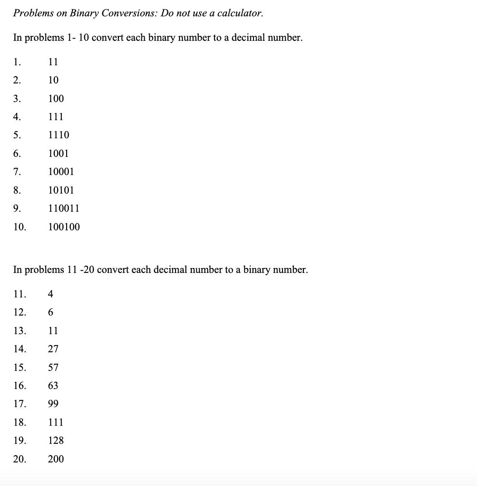
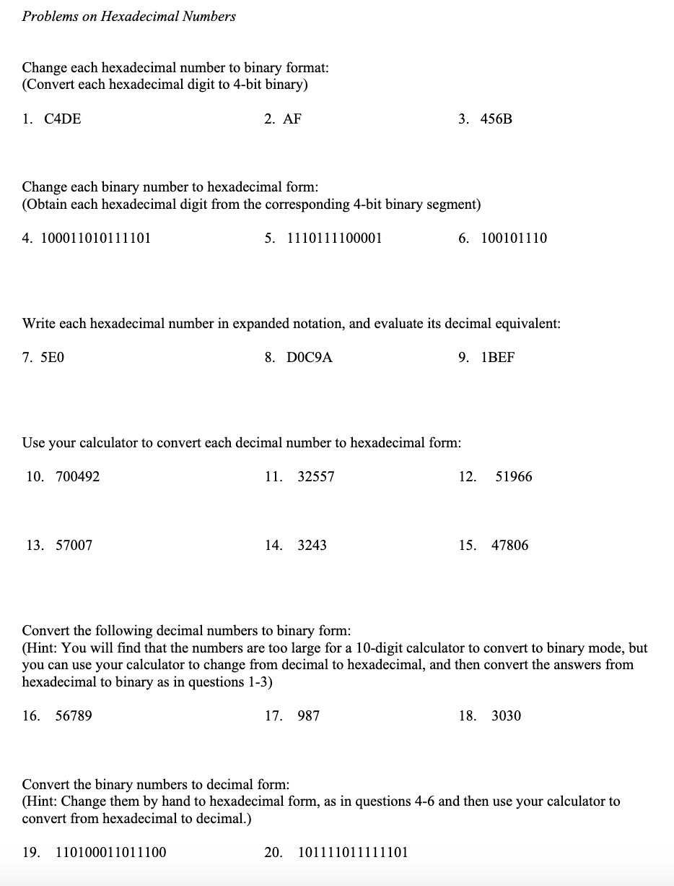

<!-- 

📋 This is the tech-news archives to help me keep track of what I am interested in!

- Reference tech news link: <https://thenextweb.com/news/blockchain-development-tech-career>
  

{{ notice-2 | markdownify }}
 -->

📋 This is my note-taking from what I learned in the class "Math175-002 Functions & Number Systems"
{: .notice--danger}

## [Base Converter Calculator](https://www.rapidtables.com/convert/number/base-converter.html)

## Some Decimal Equivalents in the Common Computer-Oriented Bases

(Use Table <u>to Convert Between Hexadecimal/Binary/Octal</u>)

### <u>Example 1: Converting from Octal to Binary</u>

Convert 473eight to binary form.
Each Octal digit is represented by <u>3 Binary</u> digits

> <u>Solution</u>
>
> | Octal  | 4   | 7   | 3   |
> | :----- | :-- | :-- | --- |
> | Binary | 100 | 111 | 011 |
>
> 473eight = 100111011two

> <u>Exercise</u>
>
> Convert 514eight to binary form.
>
> <u>Solution</u>
>
> | Octal  | 5   | 1   | 4   |
> | :----- | :-- | :-- | --- |
> | Binary | 101 | 001 | 100 |
>
> 514eight = 101001100two

### <u>Example 2: Converting from Binary to Octal</u>

Convert 10011110two to octal form

> <u>Solution</u>
>
> | Binary | (0)10 | 011 | 110 |
> | :----- | :---- | :-- | --- |
> | Octal  | 2     | 3   | 6   |
>
> (0)10 011 110two = 236eight

> <u>Exercise</u>
>
> Convert 1101111two to Octal form.
>
> <u>Solution</u>
>
> | Binary | (00)1 | 101 | 111 |
> | :----- | :---- | :-- | --- |
> | Octal  | 1     | 5   | 7   |
>
> (00)1 101 111two = 157eight

### <u>Example 3: Converting from Hexadecimal to Binary</u>

Convert 8B4Fsixteen to binary form.

> <u>Solution</u>
>
> Each hexadecimal digit yields a <u>4-digit</u> binary equivalent.
>
> | Hexadecimal | 8    | B    | 4    | F    |
> | :---------- | :--- | :--- | :--- | ---- |
> | Binary      | 1000 | 1011 | 0100 | 1111 |
>
> 8B4Fsixteen = 1000101101001111two

> <u>Exercise</u>
>
> Convert EBD9sixteen to binary form.
>
> <u>Solution</u>
>
> | Hexadecimal | E    | B    | D    | 9    |
> | :---------- | :--- | :--- | :--- | ---- |
> | Binary      | 1110 | 1011 | 1101 | 1001 |
>
> EBD9sixteen = 1110 1011 1101 1001two

### <u>Example 4: Converting from Binary to Hexadecimal</u>

Convert 10011110two to hexadecimal form.

> <u>Solution</u>
>
> | Binary      | 1001 | 1110 |
> | :---------- | :--- | ---- |
> | Hexadecimal | 9    | E    |
>
> 1001 1110two = 9Esixteen

> <u>Exercise</u>
>
> Convert (0)1101111two to Hexadecimal form.
>
> <u>Solution</u>
>
> | Binary      | (0)110 | 1111 |
> | :---------- | :----- | :--- |
> | Hexadecimal | 6      | F    |
>
> (0)1101111two = 6Fsixteen

 

## Exercise

### Section 4.4: 5 ~ 47 (odd)

<u>List the first twenty counting numbers in each base.</u>

[How to count the Number Bases](https://www.mathsisfun.com/numbers/bases.html)

- 5. seven (Only digits 0 through 6 are used in base seven.) &rarr; 0, 1, 2, 3, 4, 5, 6, 10, 11, 12, 13, 14, 15, 16, 20, 21, 22, 23, 24, 25
- 7. nine (Only digits 0 through 8 are used.) &rarr; 0, 1, 2, 3, 4, 5, 6, 7, 8, 10, 11, 12, 13, 14, 15, 16, 17, 18, 20, 21

<u>Write (in the same base) the counting numbers just before and just after the given number. (Do not convert to base ten.)</u>

- 9. 14five &rarr; 13, 20
- 11. B6Fsixteen &rarr; B6E, B70 &rarr; Solution link: [List of Hexadecimal Numbers with base 16 subscripts](https://www.minus40.info/sky/hexadecimal.html)

<u>Determine, in each base, the least and greatest four-digit numbers and their decimal equivalents.</u>

[How to get the least and greatest numbers and decimal 1](https://www.quora.com/What-is-the-largest-4-digit-number-in-base-9-What-is-the-smallest-4-digit-number-in-base-9)
 [How to get the least and greatest numbers and decimal 2](https://www.quora.com/What-is-the-greatest-four-digit-number-in-base-7)

- 13. five &rarr; the least: 10005 &rarr; 12510, the greatest: 44445 &rarr; 62410

<u>Convert each number to decimal form by expanding in
powers and by using the calculator shortcut.</u>

- 15. 3BCsixteen &rarr; 956
- 17. 2356seven &rarr; 874
- 19. 70266eight &rarr; 28854
- 21. 2023four &rarr; 139
- 23. 31544six &rarr; 4312

<u>Convert each number from decimal form to the given base.</u>

- 25. 147 to base sixteen &rarr; 9316
- 27. 36401 to base five &rarr; 21311015
- 29. 587 to base two &rarr; 10010010112
- 31. 9346 to base six &rarr; 1111346
- 33. 8407 to base three &rarr; 1021121013

<u>Make each conversion as indicated.</u>

- 35. 43five to base seven &rarr; 327
- 37. 6748nine to base four &rarr; 10313214

<u>Convert each number from octal form to binary form.</u>

- 39. 367eight &rarr; 111101112

<u>Convert each number from binary form to octal form.</u>

- 41. 100110111two &rarr; 4678

<u>Make each conversion as indicated.</u>

- 43. ACsixteen to binary &rarr; 101011002
- 45. 101101two to hexadecimal &rarr; 2D16

<u>Identify the greatest number from each list.</u>

- 47. 42seven, 37eight, 1Dsixteen &rarr; 37eight

### e-Centennial Supplement pages 5 and 6 All. (Answers page: 13)

<u>In problems 1~10, Convert each binary number to a decimal number</u>

- 1. 11 &rarr; 3
- 2. 10 &rarr; 2
- 3. 100 &rarr; 4
- 4. 111 &rarr; 7
- 5. 1110 &rarr; 14
- 6. 1001 &rarr; 9
- 7. 10001 &rarr; 17
- 8. 10101 &rarr; 21
- 9. 110011 &rarr; 51
- 10. 100100 &rarr; 36

<u>In problems 11~20, Convert each decimal number to a binary number</u>

- 11. 4 &rarr; 100
- 12. 6 &rarr; 110
- 13. 11 &rarr; 1011
- 14. 27 &rarr; 11011
- 15. 57 &rarr; 111001
- 16. 63 &rarr; 111111
- 17. 99 &rarr; 1100011
- 18. 111 &rarr; 1101111
- 19. 128 &rarr; 10000000
- 20. 200 &rarr; 11001000

<u>Change each hexadecimal number to binary format: (Convert each hexadecimal digit to 4-bit binary)</u>

- 1. C4DE
- 2. AF
- 3. 456B

<u>Change each binary number to hexadecimal format: (Obtain each hexadecimal digit from the corresponding 4-bit binary segment)</u>

- 4. 100011010111101
- 5. 1110111100001
- 6. 100101110

<u>Write each hexadecimal number in expanded notation, and evaluate its decimal equivalent:</u>

- 7. 5E0
- 8. D0C9A
- 9. 1BEF

<u>Use your calculator to convert each decimal number to hexadecimal form:</u>

- 10. 700492
- 11. 32557
- 12. 51966
- 13. 57007
- 14. 3243
- 15. 47806

<u>Convert the following decimal numbers to binary form: (Hint: You will find that the numbers are too large for a 10-digit calculator to convert to binary mode, but you can use your calculator to change from decimal to hexadecimal, and then convert the answers from hexadecimal to binary as in questions 1-3)</u>

- 16. 56789
- 17. 987
- 18. 3030

<u>Convert the binary numbers to decimal form: (Hint: Change them by hand to hexadecimal from, as in questions 4-6 and then use your calculator to convert from hexadecimal to decimal)</u>

- 19. 110100011011100
- 20. 101111011111101

 

---

 

    🖋️ This is my self-taught blog! Feel free to let me know
    if there are some errors or wrong parts 😆

[Back to Top](#){: .btn .btn--primary }{: .align-right}
