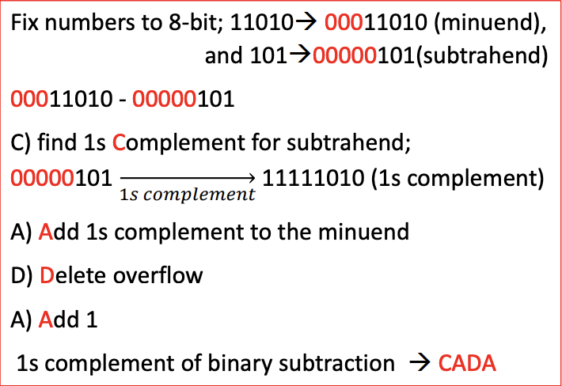
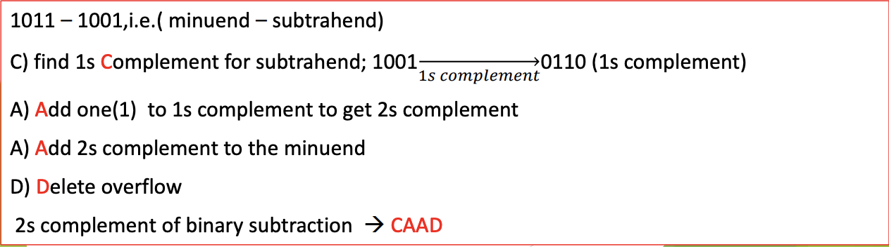

<!-- 

📋 This is the tech-news archives to help me keep track of what I am interested in!

- Reference tech news link: <https://thenextweb.com/news/blockchain-development-tech-career>
  

{{ notice-2 | markdownify }}
 -->

📋 This is my note-taking from what I learned in the class "Math175-002 Functions & Number Systems"
{: .notice--danger}

## Binary Addition

The "Binary Addition Table" shows the four basic binary sums:

| +   | 0   | 1   |
| :-- | :-- | :-- |
| 0   | 0   | 1   |
| 1   | 1   | 10  |

The binary addition algorithm is:

1. Add the units column on the right and write down the unit digit of the sum.
2. Carry the remaining digit, or digits, to the next column on the left.
3. Repeat steps 1 and 2 with each column to the left.

| BINARY           | SUMS                   |
| :--------------- | :--------------------- |
| 0+0=0            |                        |
| 0+1=1+0=1        |                        |
| 1+1=10           | (0 WITH A CARRY OF 1)  |
| 1+1+1=10+1=11    | (1 WITH A CARRY OF 1)  |
| 1+1+1+1=11+1=100 | (0 WITH A CARRY OF 10) |

Example :

Add the binary numbers: 110 +111

Solution: Apply the addition algorithm. Add each column starting with the units column and working from right to left. For each column write down the units digit and carry the remaining digit to the next.

column:

Notice the carry of 1 to the fourth column. As you can see, the addition algorithm for binary numbers is the same as for decimal numbers.

 

## Binary Subtraction

Mathematically it is possible to subtract binary numbers by an algorithm that is similar to the one used to subtract decimal numbers.

Example: To perform the operation 1101 - 111, we begin by writing the numbers in rows. We subtract the number in the second row from the one in the top row, beginning column-wise from right to left. Since it is not possible to perform this subtraction in the second column (zero is less than one), we borrow 1 from the next column (see below). Note, however, that since we are working in base 2, the new number in the second column is 10 So the subtraction in this column yields 1. Next, we proceed to the third column from the right. Since we had previously lent 1 from this column, the number in the first row of this column is now zero. We proceed by borrowing 1 from the next column and continue as before:

Although this algorithm is mathematically simple, computers use different methods which allow for simpler circuits in their design. Two of these methods are discussed below:

### <u>The Method of 1's Complements</u>

Definition: The 1's complement of a binary number is the (binary) number obtained by changing each 0 to 1 and each 1 to 0 (see examples below).

Examples: The following table shows the 1's complements of some binary numbers.

| Binary Number | 1's complement |
| :------------ | :------------- |
| 101           | 010            |
| 11010         | 00101          |
| 1011          | 0100           |

Note that the 1 's complement of a number is not unique since 101 can also be written as 0101, in which case its 1’s complement would be 1010 ; or 101 could be written as 00101 in which case, its 1's complement would be 11010.

In practice, all numbers used in a calculation are "normalized" to a fixed number of bits, which is specified prior to the determination of the 1's complement.

Examples: The 8-bit 1’s complements of the numbers shown in the previous table are:

| Binary Number | Number as 8 - bit binary | 8 - bit 1's complement |
| :------------ | :----------------------- | :--------------------- |
| 101           | 00000101                 | 11111010               |
| 11010         | 00011010                 | 11100101               |
| 1011          | 00001011                 | 11110100               |

Subtraction using 1's complements:

- Step 1: Determine the appropriate-bit 1's complement of the subtrahend (the number to be subtracted).
- Step 2: Add the 1's complement of the subtrahend to the other number.
- Step 3: The number of bits in the answer from step 2 exceeds the number of bits used in the calculation. The extra bit is called an overflow. Delete the overflow from the answer.
- Step 4: Add 1 to the answer from step 3. The combination of steps 3 and 4 is called end around carry.

Example: Use 8-bit 1's complements to perform the operation 11010 − 101

1’s Complement - CADA - Comp. Add Del Add

### <u>The Method of 2's Complements</u>

Definition: The 2’s complement of a binary number is the (binary) number obtained by adding 1 to its 1's complement.

Note: As in the case of the 1's complement, the 2’s complement is not unique, and in practice, calculations are "normalized" to a fixed number of bits.

Subtraction using 2’s complements:

- Step 1: Determine the appropriate 1's complement of the subtrahend.
- Step 2: Calculate the 2's complement of the subtrahend by adding 1 to the 1's complement obtained in step 1.
- Step 3: Add the 2’s complement (determined in step 2) to the other number.
- Step 4: Delete the overflow. The result is the required answer.

Example: Use 4-bit 2’s complements to calculate 1011 – 1001

Remark: The method of subtraction using 2’s complements only differs from the 1's complements in that the order of the operations is different (in the method of 2's complements, the combination of steps 1 and 4 is equivalent to the end around carry).

There are two useful pneumonics for the 1’s and 2’s complement.

2’s Complement - CAAD - Comp. Add Add Del

 

## Exercise

### e-Centennial Supplement "page 11 #1~12" (Answers page: 13)

<u>In problems 1-12, Calculate each of the binary sums.</u>

- 1: 101
- 2: 111
- 3: 1011
- 4: 1110
- 5: 1111
- 6: 1010
- 7: 1111
- 8: 10100
- 9: 10011
- 10: 1110
- 11: 110010
- 12: 1100011

### e-Centennial Supplement "page 11 #13~29" (Answers page: 13)

<u>In problems 13-21, Calculate each of the binary subtractions using the method of 1's compliments in 8-bit mode.</u>

- 13: 10
- 14: 1
- 15: 11
- 16: 1001
- 17: 10001
- 18: 100
- 19: 101
- 20: 100
- 21: 110

<u>In problems 22-29, Calculate each of the binary subtractions using the method of 2's compliments in 8-bit mode.</u>

- 22: 10
- 23: 1
- 24: 11
- 25: 1001
- 26: 100
- 27: 101
- 28: 100
- 29: 110

 

---

 

    🖋️ This is my self-taught blog! Feel free to let me know
    if there are some errors or wrong parts 😆

[Back to Top](#){: .btn .btn--primary }{: .align-right}
