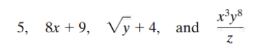
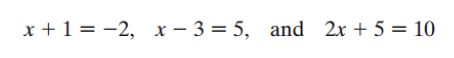
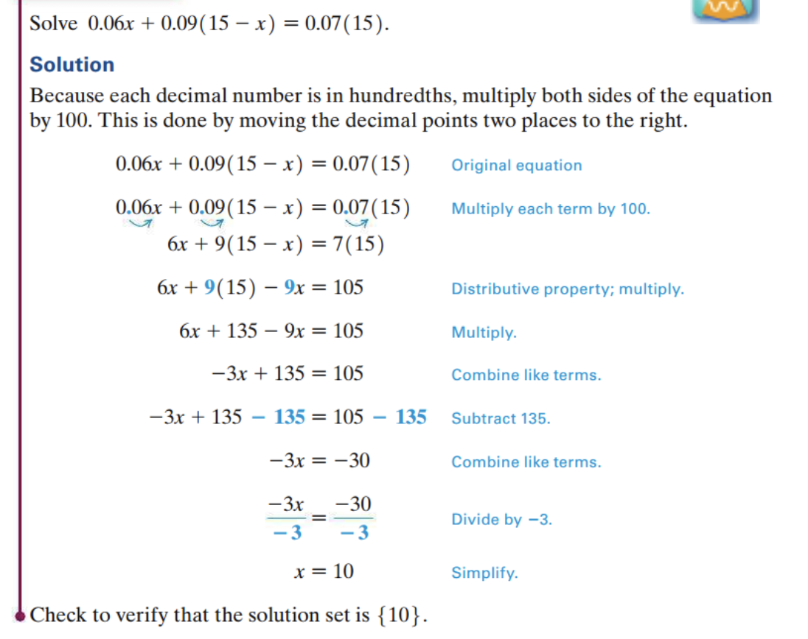

<!-- 

📋 This is the tech-news archives to help me keep track of what I am interested in!

- Reference tech news link: <https://thenextweb.com/news/blockchain-development-tech-career>
  

{{ notice-2 | markdownify }}
 -->

📋 This is my note-taking from what I learned in the class "Math175-002 Functions & Number Systems"
{: .notice--danger}

> ## Objectives
>
> 1. Solve a linear equation.
> 2. Identify a linear equation as a conditional equation, an identity, or a contradiction.
> 3. Solve a literal equation or a formula for a specified variable.
> 4. Use a linear model in an application.

## Solving Linear Equations

An algebraic expression involves only the basic operations of addition, subtraction, multiplication, or division (except by 0), raising to powers, and taking roots on any collection of variables and numbers.

- Solving Linear Equations
- Special Kinds of Linear Equations
- Literal Equations and Formulas
- Models

### <u>Examples of Algebraic Expressions</u>

 

## Equation

An equation is a statement that two algebraic expressions are equal. A linear equation in one variable involves only real numbers and one variable.

### <u>Examples of Linear Equations</u>

- 4x - 7 = 8
- 5k + 3 = k + 1

 

## Linear Equation in One Variable

An equation in the variable "x" is a linear equation if it can be written in the form "Ax + B = C", where A, B, and C are real numbers, with A != 0.

- A linear equation in one variable is also called a first-degree equation
  : because the greatest power on the variable is one.

- If the variable in an equation is replaced by a real number that makes the statement true, then that number is a solution of the equation. For example, 8 is a solution of the equation "x - 3 = 5"
  : because replacing "x" with 8 gives a true statement. An equation is solved by finding its solution set, the set of all solutions. The solution set of the equation "x - 3 = 5" is {8}.

- Equivalent equations are equations with the same solution set. Equations generally are solved by starting with a given equation and producing a sequence of simpler equivalent equations.
  : For example, 8x + 1 = 17, 8x = 16, and x = 2 &rarr; These equations are equivalent equations because each has the same solution set, {2}

 

## Addition Property of Equality

For all real numbers A, B, and C, the equations

"A = B and A + C = B + C" are equivalent.

(The same number may be added to both sides of an equation without changing the solution set.)

 

## Multiplication Property of Equality

For all real numbers A, B, and C, where C ≠ 0, the equations

"A = B and AC = BC" are equivalent.

(Both sides of an equation may be multiplied by the same non-zero number without changing the solution set.)

> Because subtraction and division are defined in terms of addition and multipli-cation, respectively, we are able to subtract the same number from both sides of the equation and divide both sides by the same nonzero number without affecting the solution set.

 

## Solving a Linear Equation in One Variable

- Step 1 Clear fractions.
  : Eliminate any fractions by multiplying both sides of the equation by a common denominator.

- Step 2 Simplify each side separately.
  : Use the distributive property to clear parentheses, and combine like terms as needed.

- Step 3 Isolate the variable terms on one side.
  : Use the addition property of equality to transform the equation so that all terms with variables are on one side and all terms without variables are on the other.

- Step 4 Transform so that the coefficient of the variable is 1.
  : Use the mul-tiplication property of equality to obtain an equation with only the variable (with coefficient 1) on one side.

- Step 5 Check.
  : Substitute the solution into the original equation.

### <u>Example: Solve a Linear Equation using the Distributive Property</u>

Q. Solve 2(x - 5) + 3x = x + 6

Step 1: Because there are no fractions in this equation, Step 1 does not apply.

Step 2: Use the distributive property to simplify and combine terms on the left.

- 2(x - 5) + 3x = x + 6 &rarr; Original equation
- 2x - 10 + 3x = x + 6 &rarr; Distributive property
- 5x - 10 = x + 6 &rarr; Combine like terms

Step 3: Next, use the addition property of equality.

- 5x - 10 + 10 = x + 6 + 10 &rarr; Add 10
- 5x = x + 16 &rarr; Combine like terms
- 5x - x = x + 16 - x &rarr; Subtract x
- 4x = 16 &rarr; Combine like terms

Step 4: Use the multiplication property of equality to isolate x on the left.

- 4x/4 = 16/4 &rarr; Divide by 4
- x = 4 &rarr; Simplify

Step 5: Check by substituting 4 for x in the original equation.

- 2(x - 5) + 3x = x + 6 &rarr; Original equation
- 2(4 - 5) + 3(4) = 4 + 6 &rarr; Let x = 4
- 2(-1) + 12 = 10 &rarr; Work inside the parentheses on the left, and add on the right
- -2 + 12 = 10 &rarr; Multiply
- 10 = 10 &rarr; True

A true statement indicates that {4} is the solution set.

### <u>Example: Solve a Linear Equation with Fractions</u>

Q. Solve
$${x + 7} \over {6}$$
\+
$${2x - 8} \over {2}$$
\= -4

| Solution              |                                                                                    |
| :-------------------- | :--------------------------------------------------------------------------------- |
| Multiply by LCD, 6    |    |
| Distributive property |  |
| Multiply              | x + 7 + 3(2x - 8) = -24                                                            |
| Distributive property | x + 7 + 6x – 24 = –24                                                              |
| Combine like terms    | 7x – 17 = –24                                                                      |
| Add 17                | 7x – 17 + 17 = –24 + 17                                                            |
| Combine like terms    | 7x = –7                                                                            |
| Divide by 7           | 7x/7 = -7/7 &rarr; x = -1                                                          |

### <u>Example: Solve a Linear Equation with Decimals</u>

 

---

 

    🖋️ This is my self-taught blog! Feel free to let me know
    if there are some errors or wrong parts 😆

[Back to Top](#){: .btn .btn--primary }{: .align-right}
