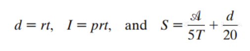
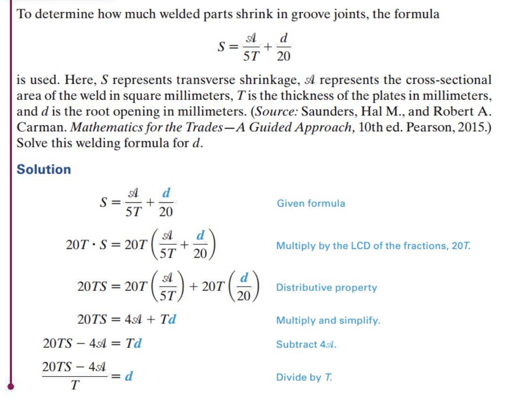
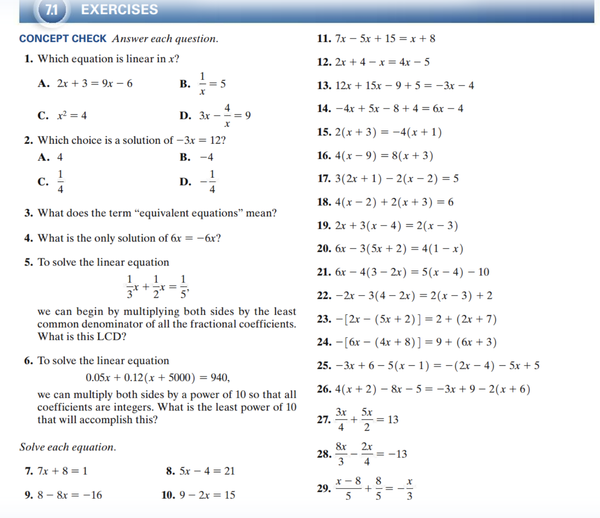
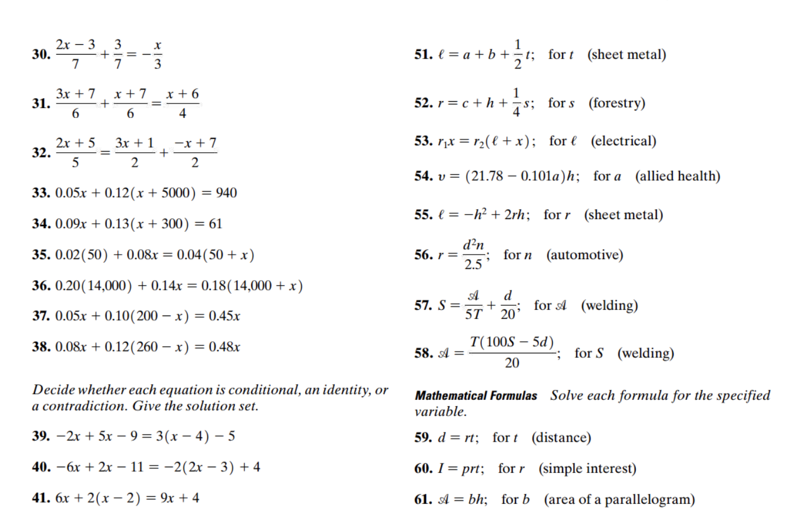

<!-- 

📋 This is the tech-news archives to help me keep track of what I am interested in!

- Reference tech news link: <https://thenextweb.com/news/blockchain-development-tech-career>
  

{{ notice-2 | markdownify }}
 -->

📋 This is my note-taking from what I learned in the class "Math175-002 Functions & Number Systems"
{: .notice--danger}

## Special Kinds of Linear Equations

| Type          | Number of Solutions                       | Final Line When Solving                       |
| :------------ | :---------------------------------------- | :-------------------------------------------- |
| Conditional   | One                                       | Final line is x = a number                    |
| Identity      | Infinite; solution set {all real numbers} | Final line is True statement, such as 0 = 0.  |
| Contradiction | None; solution set ∅                      | Final line is False statement, such as 0 = 1. |

### <u>Example: Conditional</u>

Solve 5x - 9 = 4(x - 3).

| Solution                   |                       |
| :------------------------- | :-------------------- |
| 5x - 9 = 4(x - 3)          | Original equation     |
| 5x - 9 = 4x - 12           | Distributive property |
| 5x - 9 - 4x = 4x - 12 - 4x | Subtract 4x           |
| x - 9 = -12                | Combine like terms    |
| x - 9 + 9 = -12 + 9        | Add 9                 |
| x = -3                     | Solution set {-3}     |

The solution set has one element, so 5x - 9 = 4(x - 3) is a "conditional equation".

### <u>Example: Identity</u>

Solve 5x - 15 = 5(x - 3).

| Solution           |                        |
| :----------------- | :--------------------- |
| 5x - 15 = 5(x - 3) | Original equation      |
| 5x - 15 = 5x - 15  | Distributive property  |
| 0 = 0              | Subtract 5x and add 15 |

The final line, 0=0, indicates that the solution set is {all real numbers}, and the equation 5x - 15 = 5(x - 3) is an "identity". (Note: The first step yielded 5x - 15 = 5x - 15, which is true for all values of x, implying an identity there.)

### <u>Example: Contradiction</u>

Solve 5x - 15 = 5(x - 4).

| Solution                    |                       |
| :-------------------------- | :-------------------- |
| 5x - 15 = 5(x - 4)          | Original equation     |
| 5x - 15 = 5x - 20           | Distributive property |
| 5x - 15 - 5x = 5x - 20 - 5x | Subtract 5x           |
| -15 = -20                   | False                 |

Because the result, -15 = -20, is false, the equation has no solution. The solution set is ∅, and the equation is a "contradiction".

 

## Literal Equations and Formulas

An equation involving variables (or letters), such as cx+d=e, is called a "literal equation". The most useful examples of literal equations are formulas. The solution of a problem in algebra often depends on the use of a mathematical statement or "formula" in which more than one letter is used to express a relationship.

### <u>Examples of formulas</u>

In some cases, a formula must be solved for one of its variables. This process is called "solving for a specified variable". The steps used are similar to those used in solving linear equations.

### <u>Solving for a Specified Variable</u>

When you are solving for a specified variable, the key is to treat that variable as if it were the only one. Treat all other variables like numbers (constants).
{: .notice--info}

- Step 1
  : If the equation contains fractions, multiply both sides by the LCD to clear the fractions.
- Step 2
  : Transform so that all terms with the specified variable are on one side and all terms without that variable are on the other side.
  : If necessary, use the distributive property to combine the terms with the specified variable.
- Step 3
  : Divide each side by the factor that is the coefficient of the specified variable. (Divide both sides by the factor that is multiplied by the specified variable.)

### <u>Example: Solving for a Specified Variable</u>

Solve the formula "P = 2L + 2W" for L.

| Solution                                    |                    |
| :------------------------------------------ | :----------------- |
| P – 2W = 2L + 2W – 2W                       | Subtract 2W        |
| P – 2W = 2L                                 | Combine like terms |
| $${P – 2W} \over {2}$$ = $${2L} \over {2}$$ | Divide by 2        |

The result is

- $$ {P – 2W} \over {2} $$ = L
- $$ {P} \over {2} $$ - W = L

 

## Models

An equation or an inequality that expresses a relationship among various quantities is an example of a "mathematical model". The relationship between the Fahrenheit and Celsius temperature scales is an example of a linear model.

A mathematical model is an equation (or inequality) that describes the relationship between two quantities. A linear model is a linear equation.

### <u>Example: Using the Formulas for Fahrenheit and Celsius</u>

The relationship between degrees Celsius (C) and degrees Fahrenheit (F) is "modeled by the linear equation" "F = 1.8C + 32."

What Celsius degree corresponds to a Fahrenheit reading of 50°F?

| Solution                             |                |
| :----------------------------------- | :------------- |
| Because F = 50, the equation becomes | 50 = 1.8C + 32 |
| 500 = 18C + 320                      | Multiply by 10 |
| 180 = 18C                            | Subtract 320   |
| C = 10                               | Divide by 18   |

Therefore, a reading of "50 degrees Fahrenheit" corresponds to a reading of "10 degrees Celsius".

 

## Exercise

### <u>Section. 7-1: 1 – 31, 51 – 61 (odds)</u>

<u>Answer each question.</u>

- 1: Which equation is linear in x ?
  : - A. 2x + 3 = 9x -6 &rarr; ○
  : - B. 1/x = 5 &rarr; ✕
  : - C. x2 = 4 &rarr; ✕
  : - D. 3x - 4/x = 9 &rarr; ✕
- 3: What does the term "equivalent equations" mean? &rarr; They have the same solution set.
- 5: To solve the linear equation
  $$ {1}x \over {3}$$
  \+
  $$ {1}x \over {2} $$
  \=
  $$ {1} \over {5} $$
  we can begin by multiplying both sides by the least common denominator of all the fractional coefficients. &rarr; What is this LCD? &rarr; 30

<u>Solve each equation.</u>

- 7: Solution set x is -1
- 9: Solution set x is 3
- 11: Solution set x is -7
- 13: Solution set is empty set, and the equation is "Contradiction"
- 15: Solution set x is -5/3
- 17: Solution set x is -1/2
- 19: Solution set x is 2
- 21: Solution set x is -2
- 23: Solution set x is 7
- 25: Solution set x is 2
- 27: Solution set x is 4
- 29: Solution set is empty set, and the equation is "Contradiction"

- 31: Solution set x is -2

<u>Formulas from Trades and Occupations: The formulas here are found in various trades and occupations. Solve each formula for the specified variable. (Sources: Saunders, Hal M., and Robert A. Carman. Mathematics for the Trades—A Guided Approach, 10th ed. Pearson, 2015; Timmons, Daniel L., and Catherine W. Johnson. Math Skills for Allied Health Careers. Pearson, 2008.)</u>

- 51: t = 2(l - a - b)
- 53: l =
  $$ {r_1}x \over {r_2} $$
  \- x
- 55: r =
  $$ {l + h^2} \over {2h} $$
- 57: A =
  5T(S -
  $$ {d} \over {20} $$
  )

<u>Mathematical Formulas: Solve each formula for the specified variable.</u>

- 59: t =
  $$ {d} \over {r} $$
- 61: b =
  $$ {A} \over {h} $$

 

---

 

    🖋️ This is my self-taught blog! Feel free to let me know
    if there are some errors or wrong parts 😆

[Back to Top](#){: .btn .btn--primary }{: .align-right}
