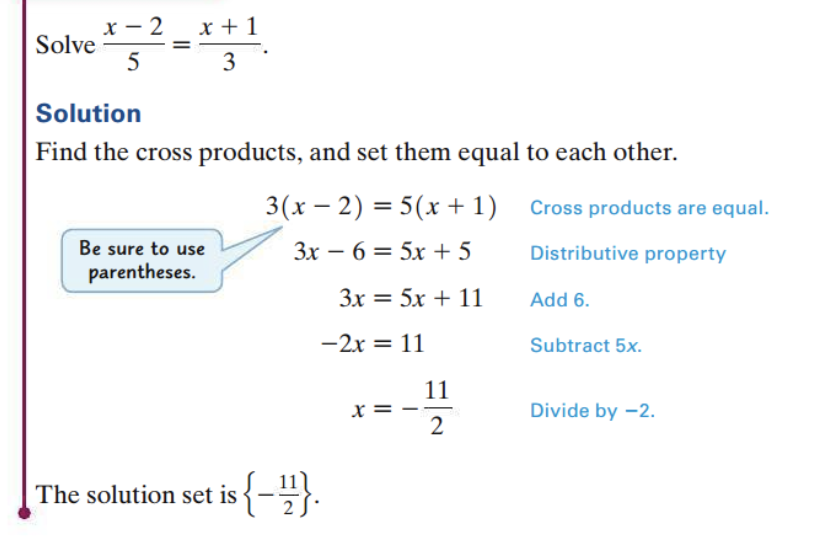

<!-- 

📋 This is the tech-news archives to help me keep track of what I am interested in!

- Reference tech news link: <https://thenextweb.com/news/blockchain-development-tech-career>
  

{{ notice-2 | markdownify }}
 -->

📋 This is my note-taking from what I learned in the class "Math175-002 Functions & Number Systems"
{: .notice--danger}

> ## Objectives
>
> 1. Write a comparison of two quantities as a ratio.
> 2. Find unit price.
> 3. Solve proportions using equation-solving methods.
> 4. Write proportions in applications from nursing and biological field studies and solve them.
> 5. Determine the constant of variation in direct, inverse, joint, and combined variation, and solve variation applications.

 

## Writing Ratios

One of the most frequently used mathematical concepts in everyday life is ratio. A baseball player’s batting average is actually a ratio. The slope, or pitch, of a roof on a building may be expressed as a ratio. A percent is a ratio (a comparison to 100). Ratios provide a way of comparing two numbers or quantities.

### <u>Ratio</u>

A ratio is a comparison of two quantities expressed as a quotient. The ratio of "the number a" to "the number b" is written in any of the following ways.

| The ratio | of two              | number |
| :-------- | :------------------ | :----- |
| a to b    | $$ {a} \over {b} $$ | a:b    |

### <u>Example: Writing Ratios</u>

Write a ratio for the word phrase: 8 hours to 2 days.

<u>Solution</u>

$$ {8hr} \over {2days} $$ =
$$ {8hr} \over {48hr} $$ =
$$ {8} \over {48} $$ =
$$ {1} \over {6} $$

### <u>Unit Pricing</u>

Ratios can be applied in unit pricing, to see which size of an item offered in different sizes has the best price per unit.

When ratios are used in comparing units of measure, the units should be the same. {: .notice--info}

 

## Solving Proportions

### <u>Proportion</u>

A proportion is a statement that two ratios are equal.

For example,
$$ {1} \over {2} $$ =
$$ {3} \over {6} $$

In the proportion
$$ {a} \over {b} $$ =
$$ {c} \over {d} $$ (b ≠ 0, d ≠ 0),

a, b, c, and d are the "terms" of the proportion.

- The "a and d" terms are called the "extremes"
- the "b and c" terms are called the "means"

We read the proportion
$$ {a} \over {b} $$ =
$$ {c} \over {d} $$
as “a is to b as c is to d.”

### <u>Cross Products</u>

If
$$ {a} \over {b} $$ =
$$ {c} \over {d} $$,
then the cross products of the proportion, "ad" and "bc", are "equal".

Also, if ad = bc, then
$$ {a} \over {b} $$ =
$$ {c} \over {d} $$ (as long as b ≠ 0, d ≠ 0).

For a proportion to be true, "the product of the extremes" must "equal" "the product of the means".

If
$$ {a} \over {c} $$ =
$$ {b} \over {d} $$,
then ad = cb, or ad = bc

This means that these two corresponding proportions are equivalent.

$$ {a} \over {b} $$ =
$$ {c} \over {d} $$
can also be written as 
$$ {a} \over {c} $$ =
$$ {b} \over {d} $$

### <u>Example: Solving Proportions</u>

Solve the proportion
$$ {4} \over {5} $$ =
$$ {22} \over {x} $$

| Solution                                   |                                 |
| :----------------------------------------- | :------------------------------ |
| $$ {4} \over {5} $$ = $$ {22} \over {x} $$ | Start with the given proportion |
| 4 \* x = 22 \* 5                           | Set the cross products equal    |
| 4x = 110                                   | Multiply                        |
| x = $$ {110} \over {4} $$                  | Divide by 4                     |

The solution set is
$$ {55} \over {2} $$

 

## Direct Variation

"y varies directly as x", or "y is directly proportional to x", if there exists a non-zero constant k such that

y = kx, or equivalently,
$$ {y} \over {x} $$
= k

The "constant k" is a numerical value called the "constant of variation".

In direct variation where k > 0, as x increases, y increases, and similarly as x decreases, y decreases.

### <u>Solving a Variation Problem</u>

- Step 1 Write the variation equation.
- Step 2 Substitute the initial values and solve for k.
- Step 3 Rewrite the variation equation with the value of k from Step 2.
- Step 4 Substitute the remaining values, solve for the unknown, and find the required answer.

### <u>Example: Direct Variation</u>

Suppose y varies directly as x, and y = 45 when x = 30, find "y" when x = 12.

| Solution                      |                                    |
| :---------------------------- | :--------------------------------- |
| y = kx                        | Variation equation                 |
| 45 = k \* 30                  | Let y = 45 and x = 30              |
| $$ {45} \over {30} $$ = k     | Divide by 30 and interchange sides |
| $$ {3} \over {2} $$ = k       | Lowest terms                       |
| y = $$ {3} \over {2} $$ \* x  | Variation equation with k          |
| y = $$ {3} \over {2} $$ \* 12 | Let x = 12                         |
| y = 18                        | Multiply and Simplify              |

Thus, when x = 12, y = 18

 

## Exercise

### <u>Section 7.3: 9, 11, 17–21(odds), 33–41(odds), 45, 47</u>

<u>Determine the ratio and write it in lowest terms.</u>

- 9: 288 inches to 12 feet &rarr;
- 11: 5 days to 40 hours &rarr;

<u>Merchandise Pricing A supermarket was surveyed to find the prices charged for items in various sizes. Find the best buy (based on price per unit) for each item.</u>

<u>Solve each equation.</u>

- 21: $$ {x} \over {4} = {175} \over {20} $$

<u>Drug Dosage Calculations. Solve the following problems involving drug dosages.</u>

- 33: A drug label notes that the client’s medicine has 250 milligrams in 5 milliliters of syrup. How many milliliters would deliver 375 milligrams of medicine? (Data from Lesmeister, Michele Benjamin. Math Basics  for the Health Care Professional, 4th ed. Pea rson, 2 014.) &rarr;
- 35: A label for lorazepam indicates that each milliliter contains 4 milligrams of the drug. How many mil-ligrams are in 3milliliters? (Data from Lesmeister, Michele Benjamin. Math Basics for the Health Care Professional, 4th ed. Pearson, 2014.) &rarr;

<u>Solve each problem involving proportions.</u>

- 37: Price of Gasoline. If 6 gallons of premium unleaded gaso-line cost $17.82, how much would it cost to completely fill a 15-gallon tank? &rarr;
- 39: Tagging Fish for a Population Estimate. Louisiana biolo-gists tagged 250 fish in the oxbow lake False River on October 5. On a later date they found 7 tagged fish in a sample of 350. Estimate the total number of fish in False River to the nearest hundred. &rarr;
- 41: Distance between Cities. The distance between Singapore and Tokyo is 3300 miles. On a certain wall map, this dis-tance isrepresented by 11 inches. The actual distance between Mexico City and Cairo is 7700 miles. How far apart are they on the same map? &rarr;
- 45: Cleaning Mixture. According to the directions on a bottle of Armstrong® Concentrated Floor Cleaner, for routine cleaning, $$ {1} \over {4} $$ cup of cleaner should be mixed with 1 gallon of warm water. How much cleaner should be mixed with 10 $$ {1} \over {2} $$ gallons of water? &rarr;
- 47: Suppose you are the one hundred twentieth person in line at airport security.
  : a) In 75 seconds, 5 people are able to pass through secu-rity. Assuming this rate stays the same, how long (in minutes) will you be waiting in the security line? &rarr;
  : b) It takes 15 minutes to walk from security to the gate for your flight. If the flight stops boarding in 60 minutes, will you arrive at the gate in time? &rarr;

 

---

 

    🖋️ This is my self-taught blog! Feel free to let me know
    if there are some errors or wrong parts 😆

[Back to Top](#){: .btn .btn--primary }{: .align-right}
