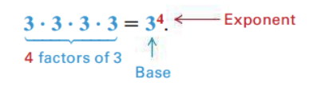
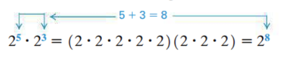
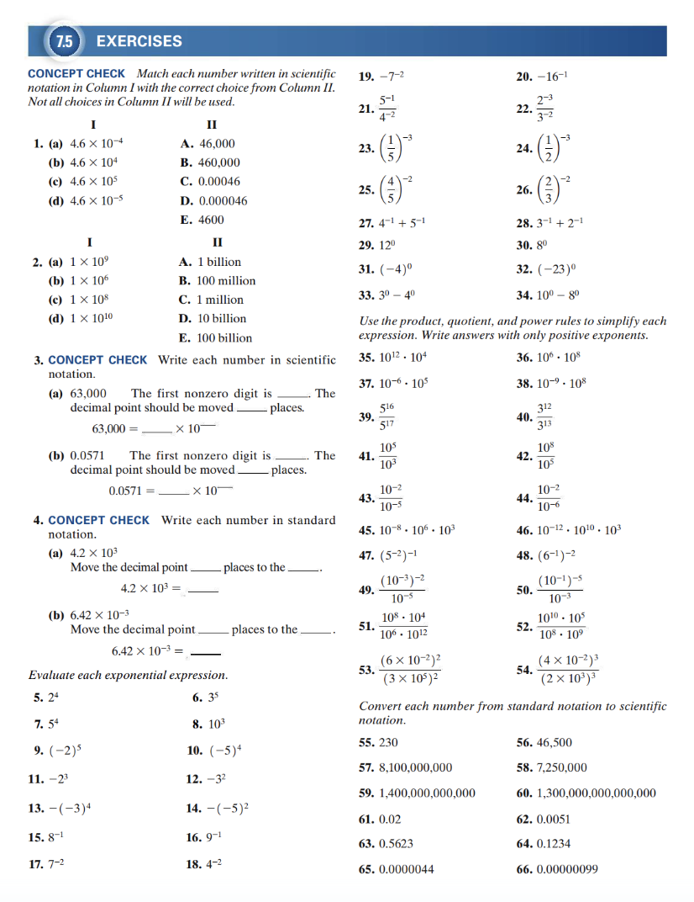
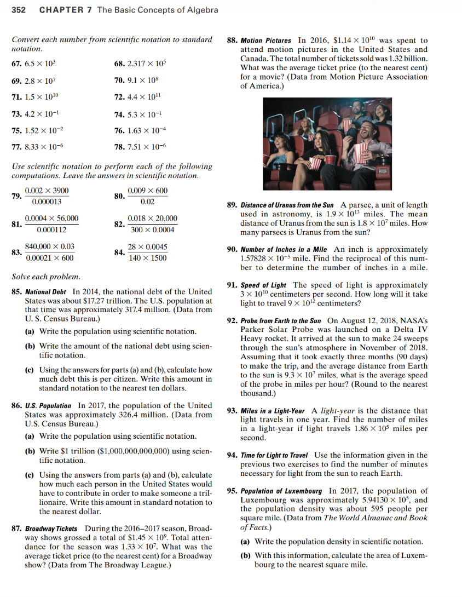

<!-- 

📋 This is the tech-news archives to help me keep track of what I am interested in!

- Reference tech news link: <https://thenextweb.com/news/blockchain-development-tech-career>
  

{{ notice-2 | markdownify }}
 -->

📋 This is my note-taking from what I learned in the class "Math175-002 Functions & Number Systems"
{: .notice--danger}

> ## Objectives
>
> 1. Identify the base and the exponent in an exponential expression, and evaluate exponential expressions with natural number exponents.
> 2. Use zero and negative integer exponents.
> 3. Apply the product, quotient, power, and special rules for exponents.
> 4. Convert a number in standard notation to scientific notation and a number in scientific notation to standard notation.
> 5. Compute with numbers in scientific notation.

 

## Properties of Exponents and Scientific Notation

1. Exponents and Exponential Expressions
2. The Product Rule
3. Zero and Negative Exponents
4. The Quotient Rule
5. The Power Rules
6. Summary of Rules for Exponents
7. Scientific Notation

 

## Exponents and Exponential Expressions

Exponents are used to write products of repeated factors.

The number 4 shows that 3 appears as a factor four times. The number 4 is the "exponent" and 3 is the "base". The quantity 34 is called an "exponential expression". Read 34 as “3 to the fourth power” or “3 to the fourth.”

Multiplying out the four 3s gives 81. &rarr; 34 = 3 \* 3 \* 3 \* 3 = 81

### <u>Exponential Expressions</u>

If "a is a real number" and "n is a natural number", then the exponential expression an is defined as follows.

an = a \* a \* a \* ... \* a [n factors of a]

The number a is the base and n is the exponent.

### <u>Example: Evaluating Exponential Expressions</u>

Evaluate each expression.

- a) 52 = 5 \* 5 = 25
- b) (-2)4 = (-2) \* (-2) \* (-2) \* (-2) = 16
- c) -24 = -(2 \* 2 \* 2 \* 2) = -16



- 102 &rarr; Read 102 as "10 squared"
- 103 &rarr; Read 103 as "10 cubed"
  

{{ notice-2 | markdownify }}

 

## The Product Rule

Consider the product 25 \* 23, which can be simplified as follows.

This result—products of exponential expressions with the same base are found by adding exponents—is generalized as the product rule for exponents.

### <u>Product Rule for Exponents</u>

If m and n are natural numbers and a is any real number, then

am \* an = am+n

### <u>Example: Applying the Product Rule</u>

Apply the product rule in each case.

- a) 52 \* 54 = 52+4 = 56
- b) x2 \* x3 \* x4 = x2+3+4 = x9
- c) (4m2n3)(-2m4n5) = -8m2+4n3+5 = -8m6n8

 

## Zero and Negative Exponents

We now consider 0 as an exponent. How can we define an expression such as 40 so that it is consistent with the product rule? By the product rule, we should have

42 \* 40 = 42+0 = 42

For the product rule to hold true, 40 must equal 1.
This leads to the definition of a0 for any nonzero real number a.

We now define a negative exponent. Using the product rule again, we have

82 \* 8-2 = 82+(-2) = 80 = 1

This indicates that 8-2 is the reciprocal of 82. But
$$ {1} \over {8^2} $$
is the reciprocal of 82, and a number can have only one reciprocal. Therefore, we conclude that 8-2 = 
$$ {1} \over {8^2} $$

### <u>Zero Exponent</u>

If a is any nonzero real number, then a0 = 1

The expression 00 is undefined. &rarr; In advanced studies, 00 is called an indeterminate form. {: .notice--info}

### <u>Example: Zero Exponent</u>

Evaluate each expression.

- a) 50 = 1
- b) -x0 (x is not equal 0) = -1
- c) 30 + 110 = 1 + 1 = 2

### <u>Negative Exponent</u>

For any natural number n and any nonzero real number a,

a-n =
$$ {1} \over {a^n} $$

With this definition and the ones given earlier, the expression an is meaningful for any integer exponent n and any nonzero real number a.

### <u>Example: Negative Exponents</u>

Write the following expressions with only positive exponents. Assume that all variables represent nonzero real numbers.

- a) 2-3 =
  $$ {1} \over {2^3} $$
  =
  $$ {1} \over {8} $$
- b) (5z2)-3 =
  $$ {1} \over {(5z^2)^3} $$
- c) 5z-3 =
  $$ {5} \over {z^3} $$

### <u>Special Rules for Negative Exponents</u>

If a ≠ 0 and b ≠ 0, then

- $$ {1} \over {a^{-n}} $$
  \= an
- $$ {a^{-n}} \over {b^{-m}} $$
  \=
  $$ {b^{m}} \over {a^{n}} $$

### <u>Example: Special Rules for Negative Exponents</u>

- a)
  $$ {1} \over {3^{-2}} $$
  = 32 = 9
- b)
  $$ {4^{-3}} \over {5^{-2}} $$
  =
  $$ {5^{2}} \over {4^{3}} $$
  = 
  $$ {25} \over {64} $$

 

## The Quotient Rule

A quotient, such as
$$ {a^{8}} \over {a^{3}} $$
, can be simplified in much the same way as a product. (Assume that the denominator is not 0.) Using the definition of an exponent,

$$ {a^{8}} \over {a^{3}} $$
\=
$$ {a × a × a × a × a × a × a × a} \over {a × a × a} $$
\= a × a × a × a × a = a5

Notice that 8-3=5. In the same way,

$$ {a^{3}} \over {a^{8}} $$
\=
$$ {a × a × a} \over {a × a × a × a × a × a × a × a} $$
\=
$$ {1} \over {a^{5}} $$
\= a-5

Here, 3 - 8 = -5. These examples suggest the "quotient rule for exponents".

### <u>The Quotient Rule for Exponents</u>

If a is any nonzero real number and m and n are integers, then

$$ {a^{m}} \over {a^{n}} $$
= am-n

### <u>Example: The Quotient Rule for Exponents</u>

Write the following expressions with "only positive exponents". Assume that all variables represent nonzero real numbers.

- a)
  $$ {3^{8}} \over {3^{2}} $$
  = 38-2 = 36
- b)
  $$ {x^{5}} \over {x^{8}} $$
  = x-3 =
  $$ {1} \over {x^{3}} $$
- c)
  $$ {z^{-3}} \over {z^{-7}} $$
  = z-3-(-7) = z4

 

## The Power Rules

The expression (34)2 can be simplified as

(34)2 = 34 \* 34 = 34+4 = 38, where 4 \* 2 = 8.

This example suggests the first of the "power rules for exponents". The other two parts can be demonstrated with similar examples.

### <u>Power Rules for Exponents</u>

If a and b are real numbers, and m and n are integers, then

- (am)n = amn
- (ab)m = ambm
- (
  $$ {a} \over {b} $$
  )m
  \=
  $$ {a^m} \over {b^m} $$
  (b ≠ 0)

In the statements of rules for exponents, we always assume that zero never appears to a negative power or to the power zero.

### <u>Example: Power Rules for Exponents</u>

Use one or more power rules in each case.

- a) (108)3 = 108\*3 = 1024
- b) (
  $$ {2} \over {3} $$
  )4 = 
  $$ {2^4} \over {3^4} $$
  =
  $$ {16} \over {81} $$
- c) (3 \* 10)4 = 34 \* 104 = 81 \* 10000 = 810000

### <u>Special Rules for Negative Exponents</u>

If a ≠ 0 and b ≠ 0 and n is an integer, then

- a-n = (
  $$ {1} \over {a} $$
  )n
- (
  $$ {a} \over {b} $$
  )-n = (
  $$ {b} \over {a} $$
  )n

### <u>Example: Special Rules for Negative Exponents</u>

Write the following expression with only positive exponents, and then evaluate.

(
$$ {3} \over {5} $$
)-3 = (
$$ {5} \over {3} $$
)3 =
$$ {125} \over {27} $$

 

## Summary of Rules for Exponents

For all integers m and n and all real numbers a and b,

### <u>Product Rule:</u>

am \* an = am+n

### <u>Quotient Rule:</u>

$$ {a^m} \over {a^n} $$
\= am-n (a ≠ 0)

### <u>Zero Exponent:</u>

a0 = 1 (a ≠ 0)

### <u>Negative Exponent:</u>

a-n =
$$ {1} \over {a^n} $$
(a ≠ 0)

### <u>Power Rules</u>

- (am)n = amn
- (ab)m = ambm
- (
  $$ {a} \over {b} $$
  )m
  \=
  $$ {a^m} \over {b^m} $$
  (b ≠ 0)

### <u>Special Rules for Negative Exponents</u>

- $$ {1} \over {a^{-n}} $$
  \= an
  (a ≠ 0)
- $$ {a^{-n}} \over {b^{-m}} $$
  \=
  $$ {b^{m}} \over {a^{n}} $$
  (a,b ≠ 0)
- a-n = (
  $$ {1} \over {a} $$
  )n
  (a ≠ 0)
- (
  $$ {a} \over {b} $$
  )-n = (
  $$ {b} \over {a} $$
  )n
  (a,b ≠ 0)

 

## Scientific Notation

Many of the numbers that occur in science are very large or very small. Writing these numbers is simplified by using scientific notation.

### <u>Scientific Notation</u>

A number is written in "scientific notation" when it is expressed in the form

a \* 10n,where 1 <= ∣a∣ < 10, and "n" is an integer.

Scientific notation requires that the number be written as a product of a number between 1 and 10 (or -1 and -10) and some integer power of 10. (1 and -1 are allowed as values of a, but 10 and -10 are not.) For example,

8000 = 8 \* 1000 = 8 \* 103

In scientific notation, it is customary to use "×" instead of a multiplication dot.

The steps involved in writing a number in scientific notation follow. (If the number is negative, ignore the negative sign, go through these steps, and then attach a negative sign to the result.)

### <u>Converting a Positive Number to Scientific Notation</u>

- Step 1: Position the decimal point.
  : Place a [caret](https://grammarist.com/punctuation/carety-symbol-how-to-use/), ∧, to the right of the first nonzero digit, where the decimal point will be placed.
- Step 2: Determine the numeral for the exponent.
  : Count the number of digits from the decimal point to the caret. This number gives the absolute value of the exponent on 10.
- Step 3: Determine the sign for the exponent.
  : Decide whether multiplying by 10n should make the result of Step 1 larger or smaller. The exponent should be positive to make the result larger. It should be negative to make the result smaller.

It is helpful to remember that for n >= 1, 10-n < 1, and 10n >= 10
{: .notice--info}

### <u>Example: Converting a Positive Number to Scientific Notation</u>

Convert each number from standard notation to scientific notation.

- a) 4,500,000 = 4∧500,000 = 4.5 \* 106
- b) .00003∧4 = 3.4 \* 10-5
- c) 4 = 4 \* 100

### <u>Converting from Scientific Notation to Standard Notation</u>

- Multiplying a positive number by a positive power of 10 makes the number larger, so "move the decimal point to the right if n is positive" in 10n. &rarr; Add zeros if digits to the right less than n.
- Multiplying a positive number by a negative power of 10 makes the number smaller, so "move the decimal point to the left if n is negative". &rarr; Add zeros if digits to the left less than n.
- If n is zero, do not move the decimal point.

### <u>Example: Converting from Scientific Notation to Standard Notation</u>

Convert each number from scientific notation to standard notation.

- a) 1.97 \* 105 = 197,000
- b) 3.8 \* 10-3 = .0038
- c) -4.5 \* 100 = –4.5

 

## Exercise

### <u>Section 7.5: 7-81(odds)</u>

 

---

 

    🖋️ This is my self-taught blog! Feel free to let me know
    if there are some errors or wrong parts 😆

[Back to Top](#){: .btn .btn--primary }{: .align-right}
